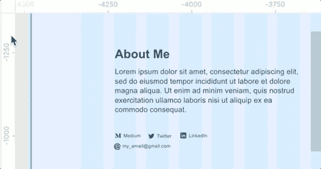
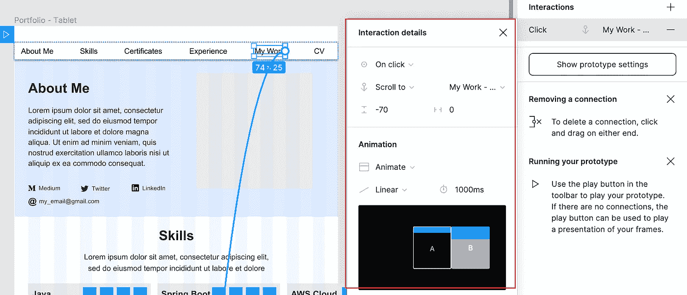

# figma——网站设计的 9 个基本技巧

> 原文：<https://blog.devgenius.io/figma-9-essential-techniques-to-website-design-37693c476369?source=collection_archive---------0----------------------->

## 精彩一致的网站设计权威指南

艾玛·马修斯数字内容制作在 [Unsplash](https://unsplash.com?utm_source=medium&utm_medium=referral) 拍摄的照片

UX/用户界面设计是网站创建的最重要的第一步。无论流行的技术有多棒，如果没有华丽的设计，任何有意义和有价值的东西都无法交付。

尽管许多软件工程师擅长将设计翻译成 HTML/CSS/JS 等标记语言和程序代码，但很少有人知道设计背后的基本原理。作为一名软件开发人员，理解设计原则并掌握 UX/UI 设计的技巧不仅对个人发展有很大的价值，而且在快速发展的跨职能团队文化中对团队也有好处。

掌握 UX/UI 设计的强大工具已经成为一项有价值的技能。随着对网站设计的需求不断增加，设计工具极大地提高了工作效率和设计艺术作品的质量。

继我之前分享 Figma 的应用程序线框和原型设计之后，本文将分享使用 Figma 进行网站设计的技术。

## Figma 是什么？

Figma 是一个强大的 UI/UX 设计工具。这是一个基于向量的绘图工具，这意味着它支持绘制各种形状和创建图标，而不管屏幕分辨率如何。

自从我开始探索 UI/UX 设计，我就一直在使用 Figma，它全面的特性极大地加快了布局设计的速度，并节省了大量琐碎的日常工作，如对齐。

此外，它向个人用户提供免费的层级方案，所以你所需要做的就是注册一个免费的账户，然后马上用它来做你自己的项目。这样的方案是市场上素描等其他工具无法比拟的优势。

## **设计系统——网页设计基础**

向目标受众传达信息并实现高转化率是大多数网站的首要目标，有些人可能认为精美的图形和丰富的内容在成功的门户网站设计中起着至关重要的作用。这是部分正确的，但是，如果内容以一种混乱和不一致的方式放置，访问者可能不会在你的网站停留很长时间。

原因简单明了，你需要让你的演示可读性强，易于理解，这是吸引人的数字体验的关键。通常情况下，人们会花很短的时间，也许几秒钟，来寻找任何有趣的东西，并决定是否继续他们的探索，因为他们第一次访问一个网站。否则，他们只会浏览其他网站。

一个好的展示意味着一个格式良好的布局、合理的间距和层次分明的内容。所有这些共同创造了愉快和谐的数字体验。

因此，在进行任何艺术工作之前，建立一个设计系统是最好的做法。设计系统基本上是一套布局结构、间距、字体风格、行高以及内容层次的规则和指南。许多网站创造了自己的设计系统，以适应他们的企业形象和产品。

## 关于使用 Figma 的技巧

为了帮助你为使用 Figma 进行网站设计做好准备，我将演练 9 个有用的技巧，涵盖以下几个方面:

*   Figma 入门套件的使用
*   格式化
*   距离测量
*   原型设置

# **1。初学者工具包— Figma Web Styles 和 FLEGO**

从零开始定义一个全新的设计系统是一项巨大的工作，它涉及到一个陡峭的学习曲线，以获取潜在的原则和彻底的设计工作。

幸运的是，有许多现成的设计系统可以在网上免费获得，这些系统来自许多公司的巨大贡献，如 Altassian、Shopify 和优步。从明确定义的东西开始，并根据我们自己的需要进行调整，这是一种明智的做法。

Figma 为每个人提供了一个初学者工具包，它是一个由 web 样式和 UI 组件组成的设计系统。初学者工具包对我很有吸引力，因为我可以直接在 Figma 中打开它，并将它们复制到我自己的设计中，而无需再次重新创建它们。

转到下面的链接打开初学者工具包，您的浏览器将在 Figma 的浏览器版本中加载它，或者在您的 Figma 桌面版本中打开它(如果您已经安装了一个)。

 [## figma.com 设计系统和风格指南。这个文件…

### Figma 设计系统和风格指南。该文件由 Figma 营销团队用于…

www.figma.com](https://www.figma.com/community/file/799433873230303935) 

## **网页风格指南**

打开文件后，您会看到两个页面——Web 样式和 FLEGOs。Web Styles 为不同的屏幕尺寸(桌面、平板和移动)定义了一组印刷样式和基本 UI 组件

Figma 风格——排版(来源:我的电脑截图)

Figma 风格——按钮、输入框、列表(来源:我的电脑截图)

## **FLEGO —可重用组件**

它是 Figma + LEGO，是一套网站设计的常用积木。有不同类型的组件，如标题和正文内容供您使用。如果有必要的话，把它们从图书馆中挑选出来，放入你的网站设计中并做一些修改是很方便的。

Figma 的标题组件(来源:从我的电脑上截取的截图)

图玛的身体部分(来源:截图来自我的电脑)

# **2。自动格式化**

不管你的网站内容是什么类型，在设计中加入导航菜单都有助于增强用户体验，方便用户访问网站的主要部分。为了创建均匀对齐的菜单栏，需要对项目的位置进行计算和调整。

让我们使用 Figma 来自动格式化。该功能称为“自动布局”，可以帮助您在给定指定参数(如边距)的情况下自动对齐对象。这是一个带有自动布局的顶部导航栏的例子。

Figma 自动布局(来源:截图来自我的电脑)

# **3。水平对齐—列**布局网格

如果你忽略了空白和一致布局的重要性，用户体验将是灾难性的。如果没有一致的布局格式，内容将被放置在随机的位置，或者由于缺乏空间而被塞在一起，导致网站混乱和不可读。

事实是，内容并不是一个成功网站的唯一因素，一个整洁一致的展示也起着至关重要的作用。定义你的网站的格式是一个重要的基础，它决定了所有组件在你的页面上的位置。

将屏幕区域分成固定数量的列的方法使得对齐更加容易。12 列是一种流行的选择，因为它可以实现项目数量的平衡视图— 6、4、3、2。

## **创建列网格布局**

您可以使用 Figma 中的“布局网格”来创建列。该功能可以让您灵活地指定列数、边距和颜色。在这个例子中，我有一个 12 列的网格布局，两边的边距为 150 px，列间距为 32 px。

网格布局— 12 列(来源:从我的电脑上截取的屏幕截图)

如果您有兴趣了解更多关于网格布局的信息，请参考这篇文章

 [## 响应式网格以及如何实际使用它们

### 为设计师详细解释了如何使用网格进行响应式设计，以及如何在两者之间扩展…

uxdesign.cc](https://uxdesign.cc/responsive-grids-and-how-to-actually-use-them-970de4c16e01) 

## **将组件与列网格布局对齐**

接下来，让我们看看网格布局在下面的例子中是如何工作的。使用列网格布局有利于设计，不仅因为它产生了整洁的外观，而且使对象放置更快。

12 列网格布局中的组件(来源:从我的电脑上截取的屏幕截图)

12 列网格布局中的组件(来源:从我的电脑上截取的屏幕截图)

# **4。垂直堆叠**

水平对齐只是一个维度，垂直间距是另一部分，以创建一个完整的空间系统。

在深入研究如何定义垂直间距之前，让我们首先定义一组基于 2 的幂的大小。这组空间尺寸是为了让我们在整个设计中始终如一地运用垂直空间。

空间大小(来源:[https://medium . com/eight shapes-LLC/space-in-design-systems-188 bcbae0d 62](https://medium.com/eightshapes-llc/space-in-design-systems-188bcbae0d62))

有两种方法可以应用垂直间距:

## **选项 1 —基于行的网格布局**

与列网格布局类似，是应用固定大小的行网格布局，例如在 8px 中，显示垂直放置的参考线。

基于行的网格布局(来源:从我的电脑上截取的屏幕截图)

## **选项 2 —间距占位符**

另一种方法是绘制矩形作为占位符。对齐对象的操作很简单，因为 Figma 会自动显示参考线，并在我们调整或移动它们时将目标组件与占位符对齐。不要担心，不要费心删除这些块，因为它们可以被标记为不可见，它们可能对设计的任何后续更改有用。

带间距框的垂直间距(来源:从我的电脑上截取的屏幕截图)

# 5.容器内容适配

除了水平和垂直间距，让我们看看容器的边距。类似地，我们可以使用网格布局来创建视觉引导线，但这次我们只需要设置 1 行 1 列。

容器边距的网格布局设置(来源:截图来自我的电脑)

这里是为了说明我们如何使用网格布局作为容器边距的参考线

Figma 集装箱边距的网格布局(来源:从我的电脑上截取的屏幕截图)

# 测量距离

将组件有序排列是屏幕设计的常规任务。这种任务是非常繁琐和耗时的，因为需要定期检查组件之间的协调和距离，以确保所有对象都被正确放置。

让我们探索一下 Figma 如何帮助高效完成这项工作。

# **6。电脑引导运动**

当我们移动一个对象时，Figma 检测到可能与其他组件对齐，并显示红色引导线。通过 Figma 的智能功能，我们可以用手将物体精确地移动到目标位置。

Figma 的引导运动(来源:截图来自我的电脑)

# **7。测量距离的快捷方式**

要查看与相邻物体的距离，只需按住快捷键(Mac OS: **选项**键；Windows: **Alt** 键)然后四处移动光标找出距离。尽管这是一个小功能，快捷键节省了我们大量的精力，因为它避免了大量的鼠标点击和按键

Figma 测量距离的快捷键(来源:从我的电脑上截取的截图)

# **8。尺子上的引导线**

另一个方便的工具是尺子上的引导线。您可以简单地从垂直或水平标尺拖动辅助线。如果在设计过程中需要在画布上标记某些位置或区域，这是一个非常有用的工具。

尺子上的 Figma 引导线(来源:从我的电脑上截取的截图)

# **9。原型设置**

将您的设计呈现为一个活动原型，可以让利益相关者体验设计并与之互动，从而促进对设计的审查和反馈。Figma 支持广泛的动态行为，以便创建 vivd 原型。让我给你看一些原型设置。

## 粘性导航栏

屏幕顶部的粘性导航条为用户提供了方便快捷的方式。为了确保当用户滚动屏幕时，它总是停留在顶部，你可以点击“滚动时固定位置”的复选框，并将组件放在“固定”部分下，这样当用户在原型上滚动时，导航条总是停留在相同的位置。

固定位置设置(来源:从我的电脑上截取的截图)

## 溢出滚动

一些 UI 组件有自己的滚动内容，如地图和转盘。为了模拟这种行为，有一个名为溢出行为的配置，它支持 prototype 中的滚动行为。

在下面的例子中，有一个包含 3 张卡片的转盘，但是页面不够大，无法显示所有卡片，溢出滚动允许用户水平滚动以查看所有内容。

溢出行为设置(来源:从我的电脑上截取的截图)

## 航行

为了导航到另一个页面或者滚动到同一个页面中的某个部分，Figma 提供了一个灵活的组件事件触发器配置。它支持许多事件，如点击、鼠标悬停、拖动等事件触发。

下面的示例将单击事件配置为菜单项，页面需要 1 秒钟的时间自动滚动到目标部分。

## 把所有的东西放在一起

这个简单的演示展示了粘性导航栏、溢出滚动和鼠标点击菜单项。

原型一览

# 结论

网站设计成功的关键取决于信息呈现的方式。一个好的演示意味着内容可读性高、一致且格式良好。然而，如果没有合适的工具，制作这样的设计是很费时间和困难的。

有一个快速启动网站设计的捷径，那就是利用 Figma 的初学者工具包，它提供了一套网页风格和可重复使用的组件。通过使用网格布局和距离测量的特性，我们可以毫不费力地创建一致的布局并将项目精确地移动到目标。最后，交互式原型的创建允许第三方或最终用户体验和评估设计，从而在实际开发之前进一步改进设计。

希望你发现这些技术有用，并开始喜欢设计网站。

*除了网站设计，Figma 还是移动应用 UI/UX 设计的工具。如果你有兴趣了解更多，这里有我分享的链接。*

 [## fig ma——技术开发人员如何掌握 UX/用户界面设计的技能

### Figma 功能和 UX/用户界面设计的简要介绍——线框、原型、颜色主题以及 CSS 代码…

medium.com](https://medium.com/dev-genius/figma-how-tech-developer-pick-up-the-skills-of-ux-ui-design-c516aa20c7eb)