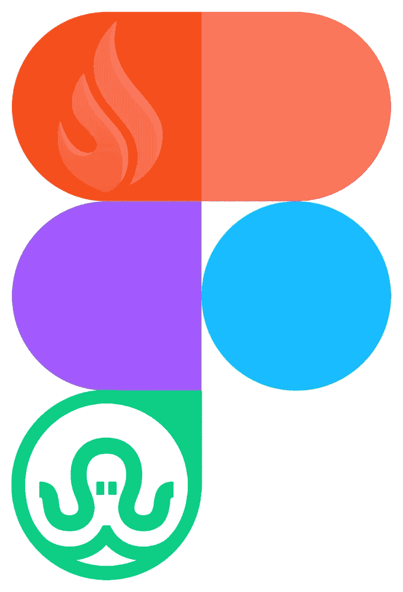
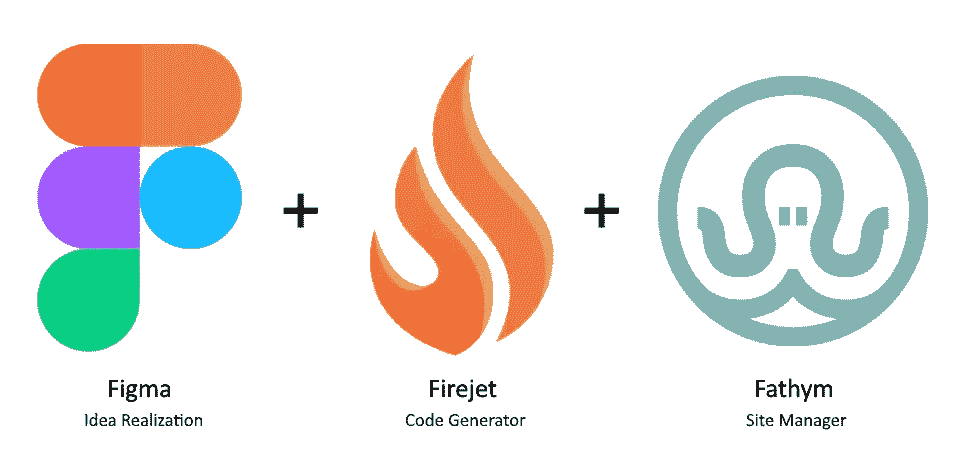
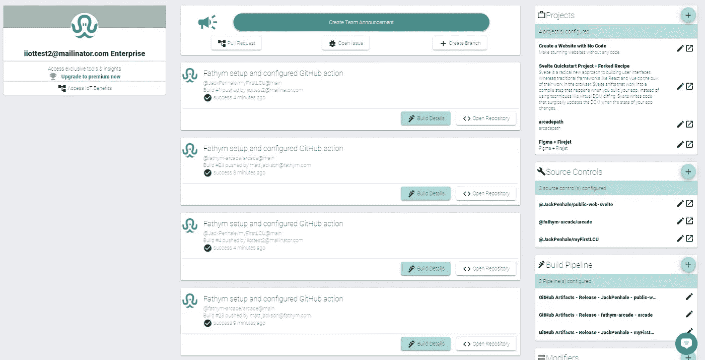

# Figma + FireJet + Fathym =神奇

> 原文：<https://blog.devgenius.io/figma-firejet-fathym-fantastic-ce5cd472988c?source=collection_archive---------9----------------------->

在过去的几年里，我们一直在努力工作，构建、完善和推出我们的 Fathym 平台，让自由、[包容性](https://www.fathym.com/blog/articles/2022/may/2022-05-02-core-values-inclusivity-introduction)和协作触手可及。

现在我们已经进入了[商业的全面发布](https://www.fathym.com/blog/articles/2022/april/2022-04-28-general-release-blog)阶段，我们很高兴向开发者展示我们的虚拟开发者如何让你的生活变得更加轻松。并帮助您更快地建立网站。

说到快速建立网站，今天我们专门讨论使用 Figma 和一个插件 FireJet，它似乎已经彻底改变了设计和开发世界，首先从设计开始。

# 菲格玛

Figma 是一个协作设计工具，它允许各种各样的专业人员在一个项目上一起工作。[正如他们网站](https://www.figma.com/blog/inside-figma-enterprise-explained/)上解释的，

> *“我们真诚地相信，倾听每个人的意见并表达他们的观点会产生设计更周到的产品，因此我们鼓励在开发过程的所有阶段进行合作。”*

比方说，一个项目可以包括一个网站的用户界面。开发者最关心的是什么。Figma 采取的方法本质上是包容性和协作性的，这是我们在 Fathym 的共同价值观的一部分。我们可以挖掘它。

因此，让我们深入了解 Figma、FireJet 和 Fathym 如何合作来支持您的网站。

## 易用性

Figma 的奇妙之处在于它的易用性和直观性。如果你曾经和一个团队一起使用过白板，画过笔记和图片；就那样。

除了更好。好多了。

因为都是线上，弥合了队友之间的身体差距。它鼓励团队合作，让团队有更好的结果。

“易用性非常好，”前端工程师杰克·佩尼亚勒(Jack Penhale)在谈到该平台时表示。“它对初学者非常友好。”

由于易于使用，组织中的任何人都可以开始协作工作，分享他们的见解和想法。

## 设计第一，开发第二

用户界面的最终目标是用户友好、令人兴奋和有趣！

那么，为什么不从那里开始，倒着做呢？Figma 就是这么做的。

现在，从设计师到营销人员，甚至是开发人员或首席执行官，每个人都可以参与其中，帮助展示他们的愿景。协作模式的好处在于，考虑到一些公司的专业化程度，人们可能会对最佳创意的来源感到惊讶。

可能是那个后端工程师害羞内向吧。或者可以想象，你的营销人员有一个总体设计的粗略想法，然后一群人帮助将它完善成最终产品。

在制造尽可能吸引最多人的东西的世界里，团队合作让梦想成真。

最重要的是，Figma 允许您测试新站点、设计流程，甚至在部署之前找到一些“痛点”。这样，开发者知道当他们在后端建立网站时要寻找什么。

而且在开发方面可以节省时间。因为所有的决策者都在一起，所以他们可以在将设计发送给工程师以在后端实现之前签署并达成一致。

例如，工程师 Jack Penhale 在一个项目的设计上花了几个小时，却被要求更改。“相反，团队可以在 20-30 分钟内在 Figma 中提出想法，并就一些令人敬畏的事情达成一致，”他解释道。

首先从设计开始本质上意味着应用程序的外观、感觉和功能是由决策者看到、参与和签署的。这也意味着将更加完善和精炼的产品用于客户反馈，这是一个更高的质量。

## 在您的浏览器中构建

Figma 的另一个优点是不需要下载。

开发者——内容创建者、首席技术官或人力资源人员——可以在浏览器中免费运行 Figma，而且运行起来非常流畅。

不必下载额外的程序也意味着不必同时运行另一个程序，它将所有的东西都放在浏览器的一个地方。

正如杰克解释的那样，他更喜欢它，而不是竞争对手的创意平台，因为它不需要下载，是免费的，而且把所有东西都链接到他的谷歌账户上，“方便得多。”

当然，团队越大，直接跳到网站上开始设计就变得越容易，大大节省了时间。

# FireJet

就像你在麦片盒子里得到的像詹姆斯·邦德一样的魔法戒指一样，Firejet 是 Figma 的资产解码器。

它把你在 UI 中漂亮的设计作品反*成*代码。这有点颠倒了这个过程，这就是它的特别之处。

FireJet 在他们的网站上解释说:“我们是一个定制 web 应用程序开发人员的团队，他们认为我们的流程可以简化。所以我们开始建立一个内部工具。因此，我们想出了 FireJet。”

他们专注于将 Figma 出色设计的用户体验转化为他们所谓的“人类可读代码”

他们的[网站解释道:“理解容易，对导出的代码进行修改也不会有任何麻烦。”。](https://www.firejet.io)

“有时，计算机把东西放进代码，但它是一团乱麻，”前端工程师杰克·佩尼亚勒解释典型的代码，而不是“人类可读的。”

他说的是一页又一页的代码，即使是最训练有素的开发人员也无法理解。至少，不会很快，也许根本不会。

FireJet 的代码很容易阅读，因此在需要时很容易更改/修复，它被转换成 React JavaScript。

这是个好消息！ReactJs 是目前最受欢迎的 JavaScript 框架(库)之一这意味着许多开发人员已经具备了使用它的知识和经验。

但是，一个人不一定要成为开发者才能建立一个网站。不再是了。使用 FireJet 为 Figma 创建了一个无代码的工作流。

正如 Figma 致力于让任何人都能接触到设计一样，我们 Fathym 也努力在网站开发方面做到同样的事情。

# Figma + FireJet + Fathym = F-yeah！

所以，你开始把 Figma 作为一个设计工具。你拖动，你放下，你添加所有你需要的图片和文字内容，让你的网站看起来很棒。

然后，你把你的用户界面转换成令人敬畏的、人类可读的代码。

但是接下来呢？

接下来，你需要一个主机。那是法西姆开始击球的地方，准备击出本垒打。

现在，你可以免费加入 Fathym，让这个令人惊叹的新 Figma+FireJet 网站立即启动。

您的生活可以进一步改善的方式之一是由于 Fathym 平台的开放性，它允许任何人使用各种 JavaScript 框架或静态网站构建器。

我们的[微前端方法](https://www.fathym.com/blog/articles/2022/march/2022-03-14-a-simple-micro-frontends-explainer)真正向开发者开放了他们想要如何建立一个网站/应用的选项。

所以，现在你可以设计一些鼓舞人心的东西，一个漂亮、有用和强大的网站。然后，将其转换为简单的 React，并最终在注册 Fathym 后的几分钟内将该网站建立起来。

在[注册了一个免费账户后，](https://www.fathym.com/dashboard)创作者将被引导进入[社交界面。从那里，很容易看到实时进度，很容易从 GitHub 查看 pull 请求，也很容易部署应用程序。Figma 是面向团队的工具，Fathym 也是！当您的团队处理项目时，每个人都可以跟上变化和更新。](https://www.fathym.com/blog/articles/2022/march/2022-03-02-introducing-fathyms-social-ui)

我们邀请人们今天免费注册，试用我们由 Microsoft Azure 支持的云托管，并享受七天免费托管您构建精美的 Figma 设计。

*最初发表于*[*【https://www.fathym.com】*](https://www.fathym.com/blog/articles/2022/may/2022-05-10-figma-firejet-fathym-fantastic)*。*