# fig ma——技术开发人员如何获得 UX/用户界面设计的技能

> 原文：<https://blog.devgenius.io/figma-how-tech-developer-pick-up-the-skills-of-ux-ui-design-c516aa20c7eb?source=collection_archive---------3----------------------->

## Figma 功能和 UX/用户界面设计的简要介绍——线框、原型、颜色主题以及 CSS 代码生成

凯利·西克玛在 [Unsplash](https://unsplash.com?utm_source=medium&utm_medium=referral) 上的照片

UI/UX 设计应该被视为全栈开发技能的一部分吗？这是有争议的，因为没有全栈技能的共同定义。然而，UI/UX 设计不可否认地是整个应用程序开发生命周期中的关键活动之一。幸运的是，UI/UX 设计工具的出现极大地提高了生产力，因为它加速了屏幕设计的开发，缩短了设计评审的时间。

作为一名技术开发人员，我渴望探索 UI/UX 设计的神奇领域，尝试各种不同的屏幕设计组合。在这篇文章中，我将分享我使用 Figma 的新应用程序的 UI/UX 设计。

## **UX/UI 设计工具包**

现在的屏幕设计软件拥有复杂的功能，同时也非常容易使用。所有这些软件都是矢量图形，这意味着我们可以使用支持分辨率的线条和曲线来设计和形成图形，而不会产生锯齿。

市场上有几种工具可供选择——Sketch、Adobe XD、InVision 和 Figma。它们的功能大体相似。Sketch 绝对是一个著名的工具，也是这个领域的领导者，但是对于个人项目来说太贵了，因为它的永久许可费是 99 美元。另一方面，Figma 吸引了我的注意，因为它是免费的个人帐户最多 3 个项目。Figma 是一个很棒的设计工具，它支持浏览器上的屏幕设计，也支持在线访问知识库的客户端程序。对于初学从事屏幕设计的人来说，绝对是一个不错的选择。

# 关于应用程序

我将基于一个应用程序开发屏幕设计——家居库存助手。这个想法是为了帮助我们有效地维护食品杂货和其他家居用品。

基于这个想法，我算出了主要函数列表:

*   **项目查找器** —通过关键字或类别轻松查找和定位项目
*   **提醒** —显示即将过期的商品清单和建议购物清单
*   **库存维护** —管理库存记录
*   **设置**——定义我们自己在家里的位置和库存物品类别

# 三维线框模型

线框设计是 UX/用户界面设计过程的第一步。结果通常是没有图像和文本内容的灰色、黑色和白色的屏幕设计展示。重点主要放在重要的元素上——屏幕布局、屏幕导航和功能，而外观设计和颜色主题将在后期确定。由于屏幕设计在初始阶段会迅速改变，因此改变设计花费的精力较少，从而加快了设计上的任何改变的周转时间。此外，这是一种有效的方法，可以帮助我们关注那些核心功能，而不是被外观和感觉以及其他不太重要的项目所牵制。

下面是家居库存 app 的线框一目了然。这个版本涵盖了 UI 组件的细节，是经过审核和微调的结果。

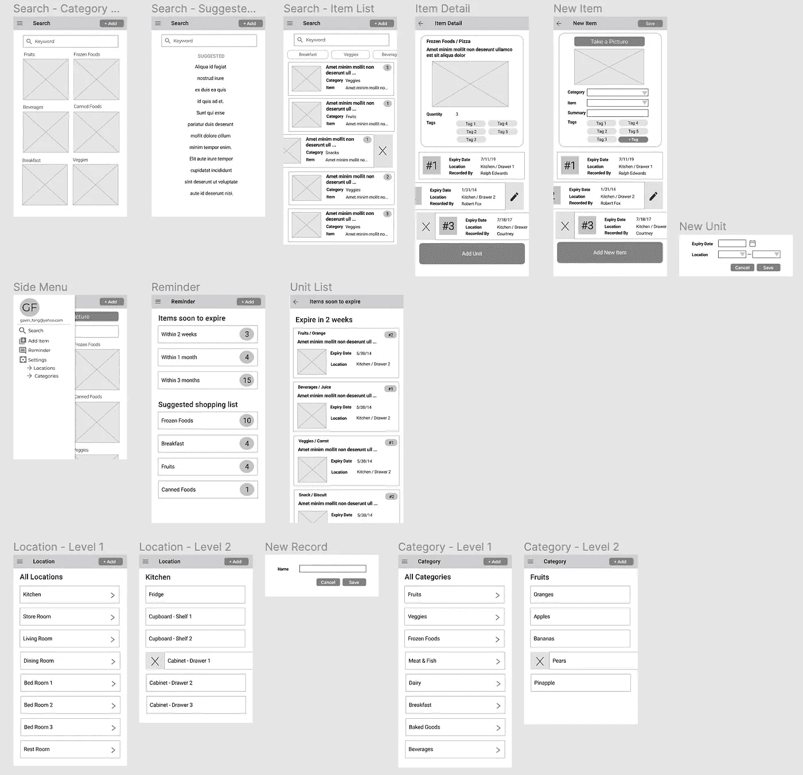

线框屏幕设计

# **逐步屏幕设计**

让我浏览一下 Figma 上的以下可用工具:

1.  基本框架
2.  矢量图形工具
3.  核标准情报中心
4.  可重用 UI 组件

## 基本框架

框架作为 UI 组件的容器，我们把它看作屏幕或弹出对话框，并在上面放置 UI 元素，所以框架的创建是屏幕设计的第一步。Figma 为各种设备提供了一套预定义的框架尺寸，便于我们为您的目标设备(如 iPhone、android、桌面、手表等)设置框架。如果在列表中找不到您的设备，您可以定义自己的帧大小。

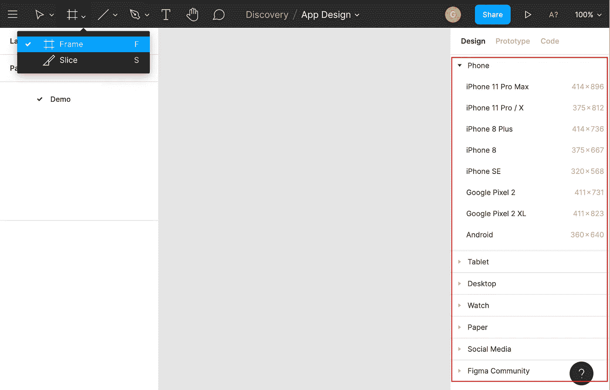

Figma —框架

## **强大的矢量图形工具**

一旦框架准备好了，让我们创建一个网页标题栏。你可以画一个灰色背景的矩形。正如你所看到的，Figma 提供了一个绘制矢量图形的工具列表，如矩形、直线、箭头、椭圆等。如果您以前使用 Microsoft Office 处理过形状，您可以很快熟悉这些工具。绘图工具看起来简单，但功能强大，我们可以通过使用工具自由地创建各种形状。

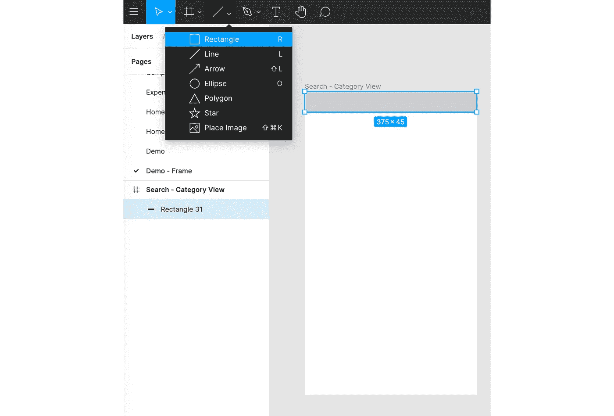

Figma —矢量绘图工具

此外，我发现辅助功能非常有用，因为 Figma 显示了对象大小、所有相关对象的间距信息以及对齐指导，可以帮助我快速将对象放置在正确的位置。

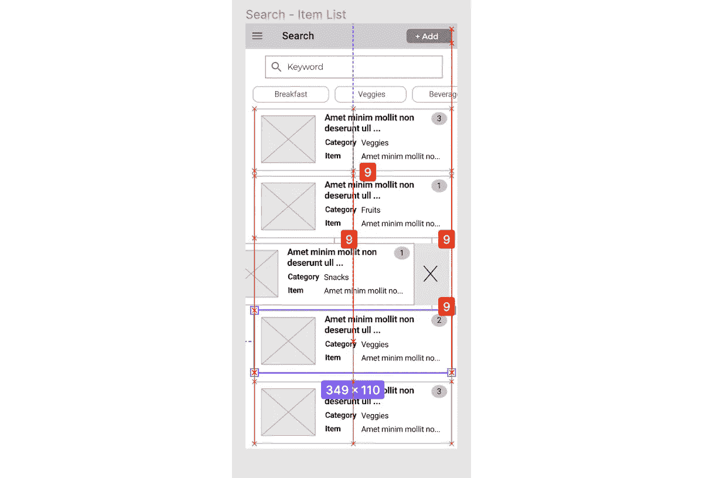

Figma —对齐和空间

## **图标**

图标是美妙的和必不可少的元素，丰富了屏幕设计，增强了用户体验。你可以在这里找到可用图标列表。如果您已经在浏览器上登录 Figma，图标集将自动复制到您的帐户草稿区。因此，您可以通过在“资产”下键入关键字来搜索图标。例如，我可以通过关键字“菜单”获得导航菜单图标。

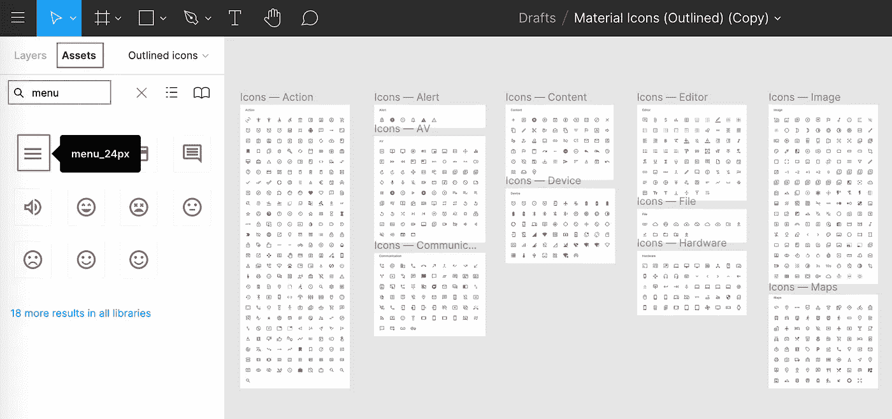

Figma —图标资源

太好了！我们在页面标题栏上有一个导航菜单图标。您可以在那里找到两个对象—左窗格中的矩形和图标。

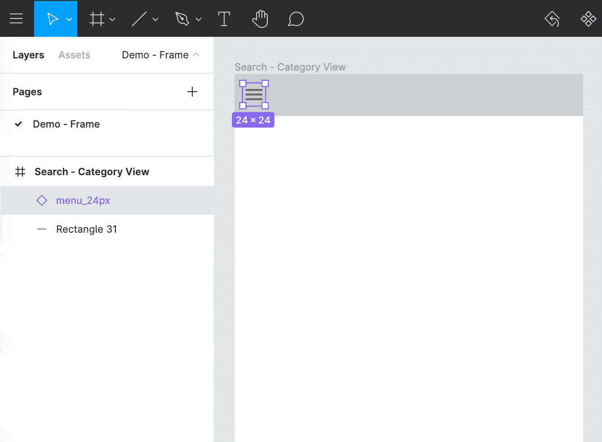

图 ma—菜单图标

## **文本标签**

添加文本标签是 Figma 的另一个基本特性。在右边的面板上有许多属性，如字体、大小、对齐和颜色。

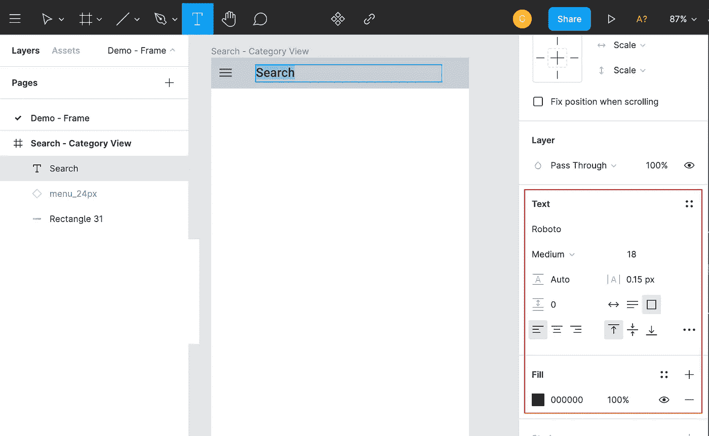

Figma —文本标签

## **可重用 UI 组件**

生产力和效率是 UX/UI 设计工具相对于 photoshop 等传统图形绘制软件的竞争优势。设计者可以定义他们自己的 UI 组件，并将它们放入库中，以便在多个框架和项目中重用。

**创建可重用 UI 组件的步骤**

以类别卡为例，我们可以对文本标签和框进行分组，然后创建 UI 组件。

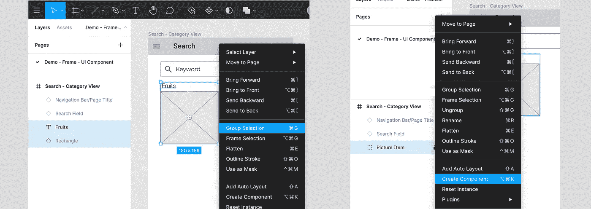

Figma — UI 组件创建

然后，我们可以自由地从资产中获取组件，以便在任何框架中重用。

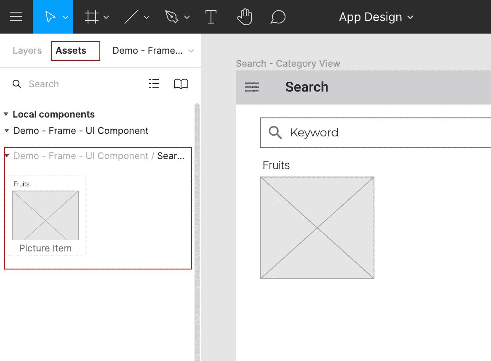

Figma —资产中的用户界面组件

**UI 组件的屏幕设计变化**

当我们从资产创建 UI 组件的实例时，该实例保持其与主组件的链接。假设我们下面有 3 个框架，以红色突出显示的页面标题栏是主组件，而其他页面中的标题栏是实例。

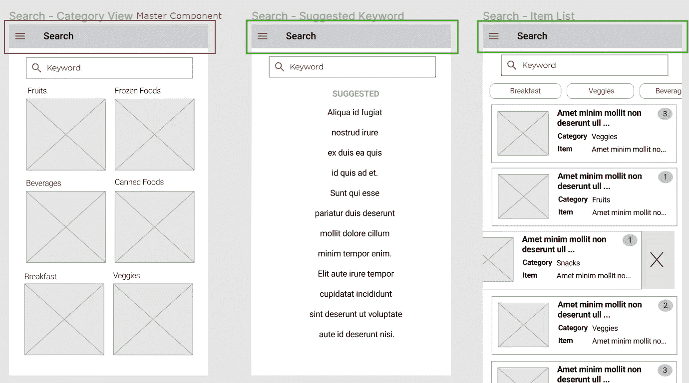

Figma —页面标题栏 UI 组件

如果需要修改屏幕设计，UI 组件的使用可以节省我们很多时间。如果用户想在页面标题栏上添加一个新的按钮，我们是否应该在每个框架上修改页面标题栏呢？Figma 提供了一个非常有用的特性，我们只需在主 UI 组件中添加新按钮(用红色突出显示)，新添加的按钮就会出现在所有实例中(用绿色突出显示)。

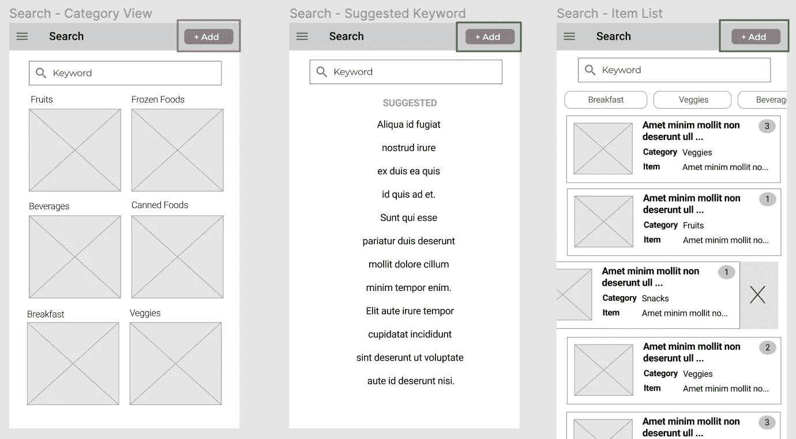

Figma —向 UI 组件添加新元素

# 原型

UX/UI 设计工具提供的支持原型的功能是一个游戏改变者，因为最终用户可以在开发的早期阶段使用屏幕流并评估用户体验。原型可以生动地呈现设计和交互，而不是单调的 2D 图形。最终用户越早对设计提出意见，用户需求就越确定。因此，最大限度地降低了因后期设计变更要求而导致返工或进度延迟的风险。原型的设置不需要代码，它只是 Figma 屏幕上的一个简单配置。

## 屏幕流

我挑选其中一个屏幕流作为例子来说明如何创建原型。这是一个典型的向库存中添加新项目的调用函数:

1.  点击菜单图标显示侧菜单
2.  选择菜单项，转到新项目创建屏幕
3.  单击“添加设备”按钮，显示弹出对话框

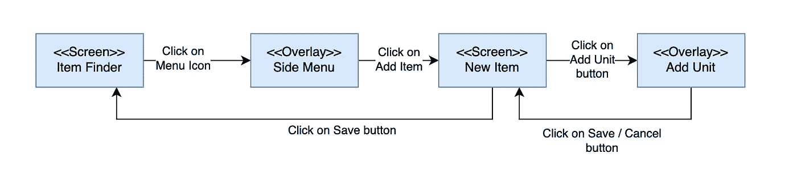

原型—屏幕流

## 交互设置

交互设置是告诉 Figma 在特定事件发生时做一些事情。例如，我们可以告诉 Figma 在单击菜单图标时显示侧菜单。下面的截图显示了**原型**选项卡下的配置，如果点击菜单图标，侧菜单将显示为覆盖在左上角。一旦我们配置了交互，将出现蓝色箭头指示屏幕流程。

原型-打开覆盖设置

可以用同样的方式导航到新项目屏幕，但这次我们在操作和目标“新项目”框架中选择“导航到”

原型—屏幕导航设置

## 原型交付

如果你想检查原型上的屏幕流，那么你可以通过点击右上角菜单上高亮显示的“播放”按钮来启动原型。

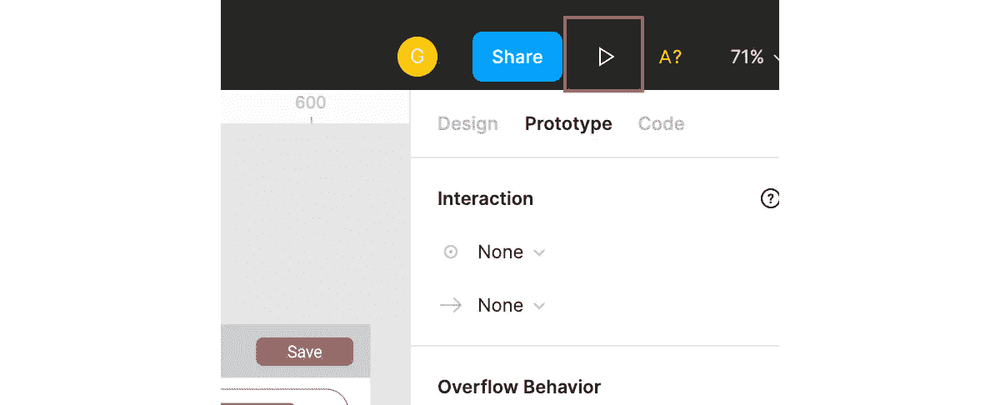

Figma 原型播放按钮

通过超链接将原型发送给最终用户和团队中的其他人很方便，原型可以在浏览器上正常工作，无需安装任何东西。外人得到了你的链接？不用担心安全问题，因为你可以控制访问权限，只有授权的人可以查看原型。你可以访问这个[链接](https://www.figma.com/proto/oISdRDRoQtm0IjncoRSAMB/App-Design?node-id=168%3A4059&viewport=295%2C366%2C0.5592471957206726&scaling=scale-down)，玩我的样品原型。原型与动画 gif 相同，如下图所示:

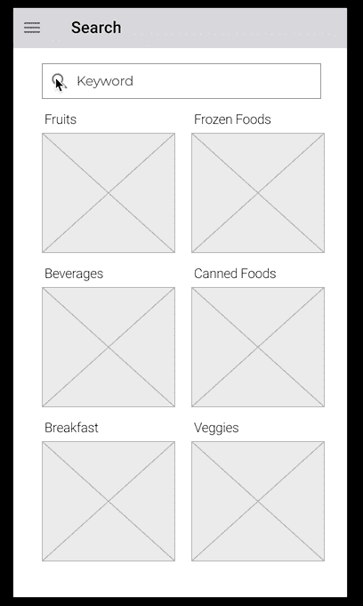

原型演示

# 颜色主题

没有令人惊叹的颜色主题，就不可能创建强大而充满活力的应用程序。颜色让你的应用程序更具表现力，从而传递强烈的信息并代表意义，如绿色代表自然，红色代表激情等。如果你是色彩主题的初学者，那么[材质设计](https://material.io/design/introduction)是一个很好的起点。谷歌创建这个系统的目的是建立高质量的数字体验。

 [## 材料设计

### 更快地构建美观、可用的产品。材料设计是一个适应性强的系统——由开源代码支持——有助于…

material.io](https://material.io/design/color/the-color-system.html) 

材料设计为我们提供了色彩工具，让我们尝试不同的色彩主题组合。这里我定义紫色为原色，浅蓝色为副色。

 [## 颜色工具—材料设计

### 为您的 UI 创建和共享调色板，并测量任何颜色组合的可访问性。

material.io](https://material.io/resources/color/#!/?view.left=0&view.right=0&primary.color=6002ee) 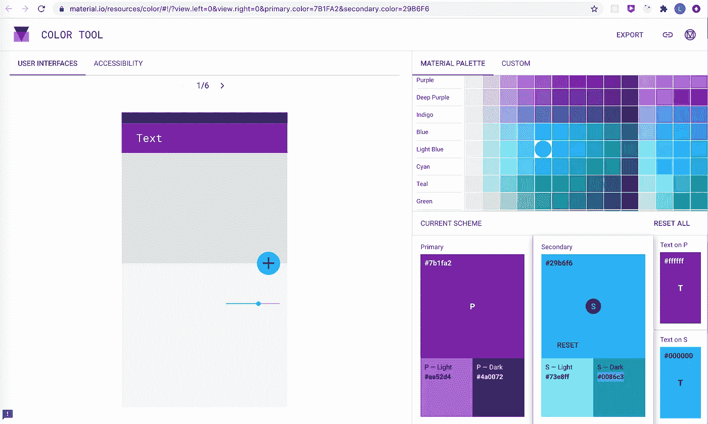

材料设计调色板

在线框上应用颜色主题后，屏幕设计现在看起来更好，不再是灰度。

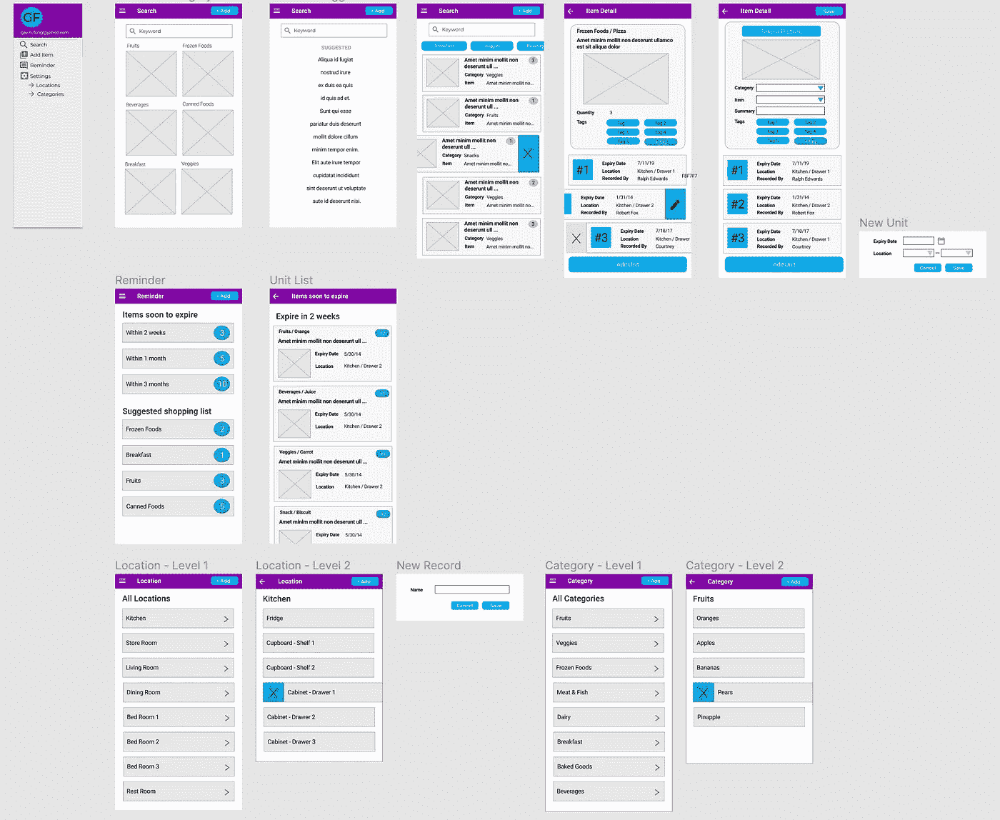

色彩主题的屏幕设计

# 代码开发

如何根据屏幕设计打造圆角按钮？如果您已经熟悉层叠样式表(CSS ),也许您可以使用 CSS 在 HTML 中快速创建按钮。Figma 提供了一个方便的函数来生成 CSS 代码，这样您就可以根据屏幕设计精确地创建 UI 元素。截图显示了分别选择按钮矩形和文本时 **Code** 选项卡中的 CSS 代码。除了 CSS 之外，你还可以在原生代码中获得 iOS 和 android 的 UI 样式定义。

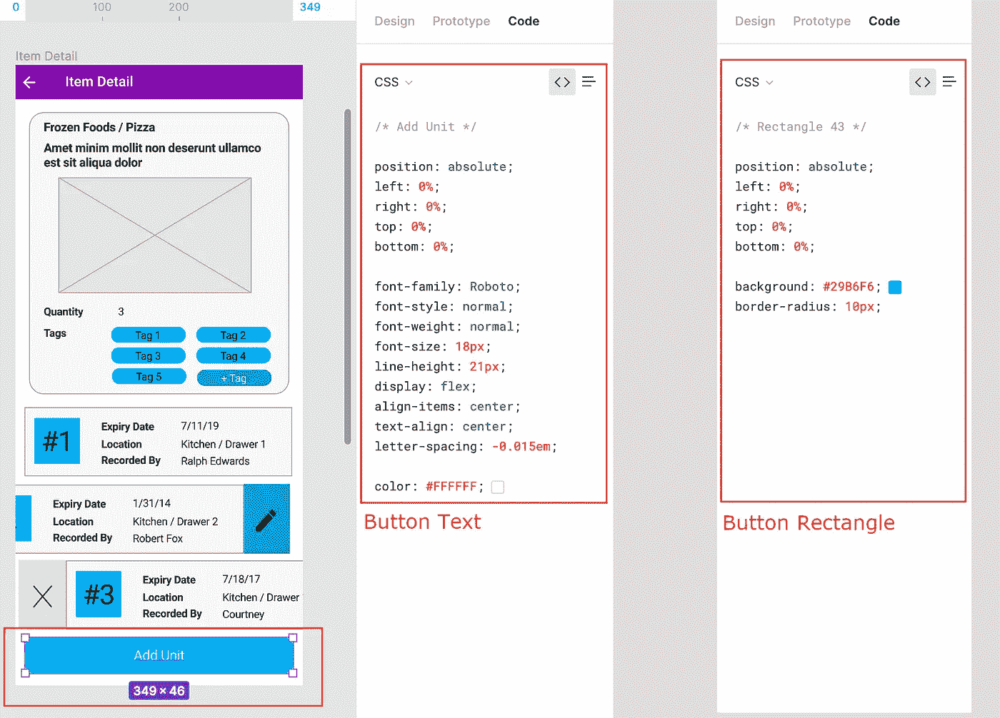

Figma — CSS 代码

# 最终想法

像 Figma 这样的 UX/UI 设计工具是如此的用户友好和易于使用。不管你是不是专业的 UX/用户界面设计师，它都允许我们试验屏幕设计。作为一名开发人员，我不仅可以将我们的视野扩大到屏幕设计领域，还可以端到端地享受整个 app 开发的满足感，而不是只关注程序代码。多才多艺和敏捷也许是在快节奏和高度竞争的环境中取得成功的重要因素，探索和获得不同领域的新技能肯定有利于职业发展。