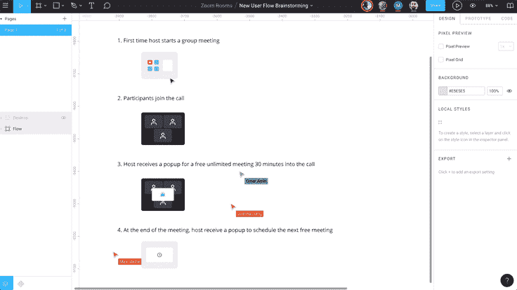

# Figma vs Adobe XD |设计工具哪个好

> 原文：<https://blog.devgenius.io/figma-vs-adobe-xd-which-ux-design-tool-is-better-c2af2bbccaef?source=collection_archive---------3----------------------->

# 什么是 UX 设计？

**用户体验**取决于与用户界面设计师创造的**用户界面元素**交互的难易程度。因此 **UX 的设计师**也关心应用程序的用户界面，这就是为什么人们对两者之间的区别感到困惑。但是 UI 设计师的任务是决定用户界面的外观，而 UX 设计师负责决定用户界面如何操作。

# 什么是 UX 设计工具？

UX 设计工具是一个在线软件或网络应用程序，允许 UX 设计师创建和设计数字产品，如网络或移动应用程序。这些设计工具也被称为线框工具，用于创建 MVP(最小可行产品)来测试移动应用程序的基本版本。一家顶级移动应用程序开发公司使用高级设计工具来创建用户友好的架构和产品设计，以提供引人入胜的移动体验。

设计工具示例

*   菲格玛
*   素描
*   Adobe XD
*   奇迹
*   视觉工作室

# Figma vs Adobe XD

# Figma 是什么？

Figma 是一个基于云的矢量图形和原型工具，用于一系列图形设计任务。自 2016 年发布以来，由于它直接在浏览器中工作，它已经成为 UI 设计师的一个受欢迎的选项。您可以从任何计算机和平台访问您的项目，而无需安装软件或购买多个许可证。

# 什么是 Adobe XD？

Adobe XD 是专门针对 UX 设计的基于矢量的设计工具？它于 2016 年发布，具有 UX 特有的功能，这些功能对于使用 Photoshop 或 Illustrator 的设计师来说是不可用的。你可以把它作为电脑上的桌面应用或者移动设备上的云应用。

# 比较

比较的标准如下:

# 费用

就定价而言，这两家公司都采用“免费增值”模式，这意味着它们有免费的“首发”计划和付费的附加计划。不同目的的包是不同的，这使得这一点更难与所提供的服务相平衡。

自由职业者和个人可以免费使用 Figma。如果按年计费，专业计划的费用为每位编辑每月 12 美元，如果按月计费，则为每位编辑每月 15 美元。组织计划的费用是每个编辑每月 45 美元。

XD 的定价从免费到 9.99 美元不等。对于商业计划，从免费到 22.99 美元不等。

# 表演

在性能和可访问性方面，Figma 是最顶尖的。尽管该程序是基于浏览器的，但它的性能非常好，而且这些工具在低端电脑和笔记本电脑上的运行速度要快得多。

固件也是跨平台的程序。这意味着你可以在任何平台上使用该软件，甚至可以从任何计算机上访问它。

Adobe XD 位居第二。它与 Windows 和 macOS 电脑都兼容。不过，你仍需要将该程序下载到你的电脑上，并创建一个 Adobe 帐户。

该草图仅在 Mac 电脑上可用。在某些方面，Sketch 比 Adobe XD 和 Figma 运行得更好。

# 合作

Figma 专为协作而打造。共享文件轻而易举，协作者有合适的环境提供正确的反馈。协作功能很难附加到现有产品上。

在 Adobe XD 中协作不同于在 Figma 中协作。在 Adobe XD 中，你在一个地方设计，但在另一个地方分享。评论在一个单独的体验中，来自不同共同编辑的修改需要手动合并。

# 移交

Figma 的协作能力使其在向设计师提供 Figma 记录时具有优势。设计师可以作为查看者来查看模型、发表评论和导出资源，所有这些都可以通过一个链接完成。

Adobe XD 提供了一个开发共享选项，您可以在该选项中标记要导出的配置记录和资源。开发者可以从一个链接为他们自己的电脑下载这些资源

# 基本功能

两者都具有大多数设计工具所具有的基本编辑功能。你可以制作形状、设置约束、添加阴影、编辑文本等等。如果我一个特征一个特征地去做，会花很长时间，所以这次你得相信我。

简单来说，Figma 比 Adobe XD 有更好、更多的功能。以它的矢量工具为例，可以如上图。你可以制作矩形、直线、箭头、多边形等。这也延伸到文本选项、图层效果(XD 没有的)、图像工具等。关于 Figma 拥有什么，XD 缺少什么，这个列表可以一直持续下去。

正如你可能从上一点猜到的，Adobe XD 缺少很多 Figma 所拥有的东西。然而，它将完成工作(至少对我来说)。你可以设计屏幕，制作按钮，制作表单元素等。

# 限制

响应式屏幕的首选功能。通过约束，您可以控制设计在不同屏幕尺寸和设备上的外观。无论你在哪里设置它们(左、右、上、下、中间)，你都让工具知道当改变时对象的哪一部分必须保持不动。

这两种工具在这方面都很出色:

*   Figma 允许您通过约束缩放对象。因此，您可以将对象的大小和位置固定为百分比。例如，如果一个元素占据了屏幕的 50%，当屏幕发生变化时，该元素将停留在 50%
*   [XD](https://blog.adobe.com/en/publish/2018/09/28/how-to-design-with-responsive-resize-xd.html#:~:text=Adobe%20XD%20now%20predicts%20which,group%2C%20and%20the%20layout%20information.) 可以预测您将要添加到对象的约束。它会自动将它们应用到您身上。这可以是一个实时节省。

# 网格和布局

让你在镖靶上覆盖网格。在 Adobe XD 中，您可以使用方形网格**或**列网格。

Figma 允许您添加任意多的每种类型——网格、列和行。Figma 中注意细节的另一个例子—当你设置装订线为 0 时，它自动从显示填充列切换到只显示线条。

Figma 通过允许框架(可以嵌套)和单个组件上的网格，进一步发展了布局网格。后者的一个有趣的可能性是，在处理可调整大小的组件时，您可以将它们用作填充的指导。

# 插件

## 图玛:

Figma 于 2019 年推出，现在提供了一个由 Figma 社区构建的[完整插件库](https://www.figma.com/community/explore/files)和文件。用户可以浏览成千上万的定制插件和文件，甚至可以构建或重新混合插件。

2021 年 8 月， [Figma 更进一步，邀请](https://www.figma.com/blog/bringing-the-power-of-our-open-platform-to-figjam/)所有开发者和构建者为 FIGJAM 创建第一批插件和小部件。

Adobe XD 提供本地和第三方插件。虽然 Adobe 提供插件集成的时间比 Figma 长，但它的选项库要小得多。如果有一个你离不开的插件，这可能会决定你对设计软件的选择。

# 样机研究

# 菲格玛

Figma 是使用最广泛的设计工具之一。他们有一个很大的社区，有很多 YouTube 内容和详细的文档。

Figma 通过移动应用程序内置了原型功能，可以在多种设备上测试原型。您可以在浏览器中工作，也可以下载 Figma 在桌面上脱机工作。

虽然 Figma 非常适合创建线框和模型，但这个工具和其他基于图像的原型制作应用程序一样，缺乏原型制作的功能和保真度。交互是有限的，你经常不得不在同一个屏幕上设计几个飞镖来执行 Unpin 点击几下就能完成的功能——比如创建一个下拉菜单。

Figma 的输入是不起作用的，所以 UX 的研究人员不能测试任何需要的动作

# Adobe XD

Adobe XD 是另一个流行的用户体验设计工具。与 Figma 和 UXPin 不同，Adobe XD 不提供浏览器版本；你必须把软件下载到你的桌面上。

与 Adobe UX 合作的主要好处之一是，在整个计划中，您可以使用 20 多种创意云产品，包括 Photoshop、Illustrator、After Effects 等。您也可以将项目直接上传到 Behance 来展示您的作品。

Adobe XD 提供在浏览器中运行的内置原型，以及一个用于移动设备的应用程序。不幸的是，XD 缺乏原型功能和保真度。

