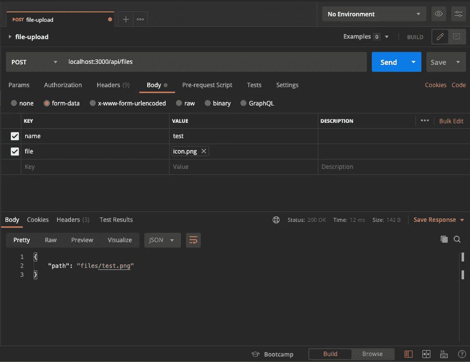

# 使用多部分/表单数据在 Go 中上传文件

> 原文：<https://blog.devgenius.io/file-upload-in-go-with-multipart-form-data-fa6ebe8569ae?source=collection_archive---------1----------------------->


莎伦·麦卡琴在 [Unsplash](https://unsplash.com?utm_source=medium&utm_medium=referral) 上的照片

在 **Go** 中，上传带有**多部分/表单数据**的文件非常简单。 **Go** 标准库拥有完成这项工作所需的所有工具。在这篇文章中，我将演示如何上传文件并保存到磁盘。

让我们检查应用程序的入口点。

这里是文件 **app.go** 的内容。

**App struct** 初始化路由器并在 3000 端口上运行 App。

让我们看看 **router.go** 文件

**路由器**初始化 **ServeMux** 和注册文件 url 模式的处理程序。

让我们检查一下**文件处理器**

最后是 **file_save.go** 文件

**FileSave** 函数从**表单数据**中检索文件名和文件。然后在根文件夹上创建一个名为 **files** 的目录。**用只写和创建标志调用 OpenFile** 函数。如果文件不存在，这将创建该文件。然后源文件被复制到目标文件。最后返回带有扩展名的文件名。

让我们运行应用程序

```
go run main.go
```

让我们测试我们的服务器应用程序。在**localhost:3000/API/files**上发出 **POST** 请求



图片由作者提供

应用程序正在保存文件，并按预期返回文件路径。

这个演示的完整源代码可以在这里找到:[https://github.com/tanveerprottoy/file-upload-go](https://github.com/tanveerprottoy/file-upload-go)

本帖到此结束。希望这将有所帮助。如果你喜欢这个帖子，请给一些掌声。