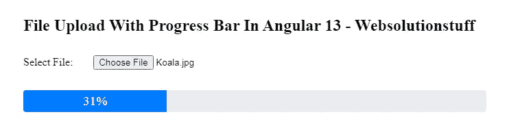

# Angular 13 中带进度条的文件上传

> 原文：<https://blog.devgenius.io/file-upload-with-progress-bar-in-angular-13-76adb3380f18?source=collection_archive---------2----------------------->

在本文中，我们将在 Angular 13 中看到带有进度条的文件上传。在这里，我们将学习如何在 Angular 13 中使用进度条上传图片。我们将创建一个简单的图片上传选项反应形式。此外，为图像上传创建一个 PHP API。在 API 服务中，我们将编写代码来显示进度条百分比代码。

**第一步:创建新应用**

在这一步中，我们将使用下面的命令创建一个新的应用程序:

```
ng new my-new-app
```

**读也:** [**自举情态于有角 13**](https://websolutionstuff.com/post/bootstrap-modal-in-angular-13)

**步骤 2:安装引导程序 5**

现在，我们将使用下面的命令安装引导核心包。

```
npm install bootstrap --save
```

现在，我们需要包含像**node _ modules/bootstrap/dist/CSS/bootstrap . min . CSS .**这样的引导 CSS，所以，将其添加到 **angular.json** 文件中。

**angular.json**

```
"styles": ["node_modules/bootstrap/dist/css/bootstrap.min.css","src/styles.css"],
```

**第三步:导入模块**

现在，我们将把 HttpClientModule、ReactiveFormsModule 和 ImageUploadService 导入到 app.module.ts 文件中。

**src/app/app.module.ts**

```
import { NgModule } from "@angular/core";
import { BrowserModule } from "@angular/platform-browser";
import { FormsModule } from "@angular/forms";
import { HttpClientModule } from "@angular/common/http";import { AppComponent } from "./app.component";@NgModule({
  imports: [
    BrowserModule,
    FormsModule,
    HttpClientModule
  ],
  declarations: [AppComponent],
  bootstrap: [AppComponent]
})
export class AppModule {}
```

**阅读也:** [**如何在棱角分明的 404 页设置 12**](https://websolutionstuff.com/post/how-to-setup-404-page-in-angular-12)

**步骤 4:更新视图文件**

在这一步中，我们将更新 HTML 文件。

**src/app/app . component . html**

```
<h2>File Upload With Progress Bar In Angular 13 - Websolutionstuff</h2>
<input type="file" (change)="upload($event.target.files[0])"><div class="progress" *ngIf="progress">
	<div class="progress-bar" [style.width]="progress + '%'">{{progress}}%</div>
</div>
```

**第五步:使用组件 ts 文件**

现在，我们需要更新 component.ts 文件。

**src/app/app . component . ts**

```
import { Component } from "@angular/core";import {
  HttpClient,
  HttpEventType,
  HttpErrorResponse
} from "@angular/common/http";import { map, catchError } from "rxjs/operators";import { throwError } from "rxjs";@Component({
  selector: "my-app",
  templateUrl: "./app.component.html",
  styleUrls: ["./app.component.css"]
})
export class AppComponent {
  progress: number; constructor(private http: HttpClient) {} upload(file) {
    this.progress = 1;
    const formData = new FormData();
    formData.append("file", file); this.http
      .post("your-url-here", formData, {
        reportProgress: true,
        observe: "events"
      })
      .pipe(
        map((event: any) => {
          if (event.type == HttpEventType.UploadProgress) {
            this.progress = Math.round((100 / event.total) * event.loaded);
          } else if (event.type == HttpEventType.Response) {
            this.progress = null;
          }
        }),
        catchError((err: any) => {
          this.progress = null;
          alert(err.message);
          return throwError(err.message);
        })
      )
      .toPromise();
  }
}
```

**阅读也:** [**如何使用 Python**](https://websolutionstuff.com/post/how-to-check-image-blur-or-not-using-python) 检查图像模糊与否

**第六步:运行服务器**

最后，我们需要使用下面的命令运行服务器。

```
ng serve
```

现在，转到您的 web 浏览器，键入给定的 URL 并查看应用程序输出。

[http://localhost:4200](http://localhost:4200)

**输出:**



**你可能也会喜欢:**

*   **阅读也:** [**如何使用 Node.js**](https://websolutionstuff.com/post/how-to-file-upload-using-node-js) 进行文件上传
*   **阅读还:** [**Laravel 9 创建 Zip 文件并下载**](https://websolutionstuff.com/post/laravel-9-create-zip-file-and-download)
*   **读还:** [**多行分组数据表 jQuery**](https://websolutionstuff.com/post/multiple-row-grouping-datatables-jquery)
*   **阅读另:** [**拖拽文件上传使用 Laravel 9**](https://websolutionstuff.com/post/drag-and-drop-file-upload-using-dropzone-js-in-laravel-9) 中的 Dropzone js