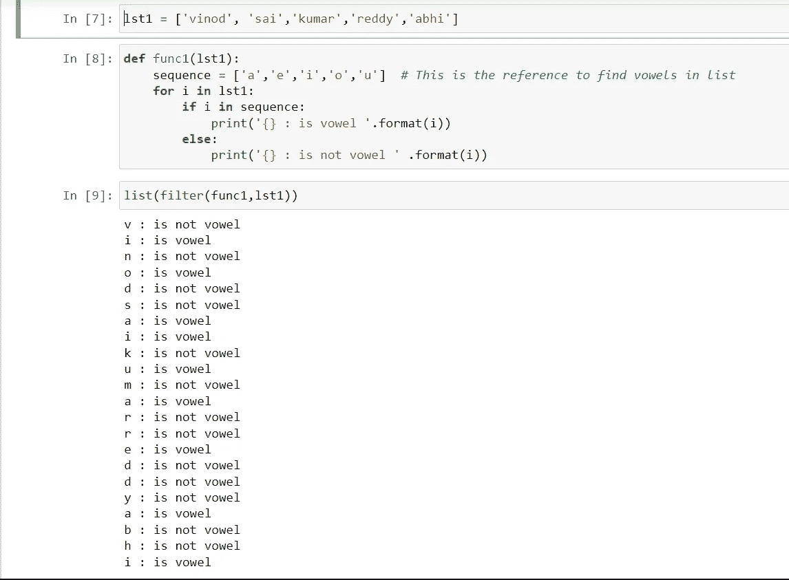

# PYTHON 中的过滤函数

> 原文：<https://blog.devgenius.io/filter-function-in-python-8cb51152a9b0?source=collection_archive---------13----------------------->

大家好，欢迎回到 python 系列。

伙计们，我们之前讨论过地图功能，关于这个概念的视频也上传到了我的 YouTube 频道，我已经解释得非常清楚和深入。检查一下，如果你是第一次接触频道，确保你订阅了。我计划完成这个 python 系列。

地图功能视频链接→

现在我们将进入下一个主题，PYTHON 中的过滤函数。

那么什么是过滤功能呢？

filter()函数**返回一个迭代器，其中条目通过一个函数过滤，以测试条目是否被接受**。

这个函数有两个参数，第一个是函数，第二个是 iterable。filter 函数从 iterable 中函数返回 True 的那些元素中返回一个序列。

所以使用 filter()函数**来生成一个输出值列表，当调用该函数时返回 true。**

下面是语法:

下面是正常的函数:打印列表中的元音。

这是正常的函数，现在我们将使用过滤函数，看看我们会得到什么。

在上面的例子中，我使用了相同的代码，因为操作是相同的，但我只是改变了我的单词列表(lst ),现在我可以使用过滤函数得到输出。

我忘记了一件事，总是试图将你的过滤函数输出存储在列表/元组中，因为过滤也和地图函数一样(如果你没有看到地图函数主题，请查看我的帐户或我的 YouTube 频道)。)

Filter 函数也遵循惰性加载技术，所以将过滤后的输出存储在一个列表/元组中。

这里我想用代码展示这个错误:

这里我做的是移除 for 循环，for 循环会把每个字母当作一个项目。当我删除 for 循环时，它会将整个单词作为一个项目，我可以得到这个错误。所以理解 for 循环为什么重要。

现在我将举另一个只打印偶数的例子:

现在我将在 filter()中使用 lambda()，然后我们将看到 filter 和 map 函数之间的区别:

这里你可以看到，当我使用 filter 时，它实际上给出了值(2，4，6，8)，当我使用 map 时，它给出了 true 和 false。

Filter →返回真值(满足条件的值)。

地图→返回真假。如果使用 print 而不是 return，它将给出值。

— — — — — — — — — — — —

你可能认为这很小，我已经解释了一个函数的基础，你可以举不同类型的例子来练习它们。

伙计们，今天的话题到此结束。我们将在 python 中遇到另一个主题，直到那时练习好。你是专家，你能做到。

爱你们所有人。

如果我在某个地方犯了拼写错误，对不起，请忽略，并尝试通过谷歌搜索自己，它会帮助你。

谢谢你。

*******************************************************************

*我希望你明白这个简单的概念。所以我打算用一种简单的方式写一个关于 python 的每一个概念的博客，在这里你可以轻松地学习。*

所以请继续支持我们，感谢所有读过这篇完整博客的人。

*请喜欢并关注本账号。*

***全爱无恨。***

我们有一个 YouTube 频道，我们在那里上传关于编程相关的话题，你可以通过订阅我们的频道来支持。

[***https://www.youtube.com/channel/UChiEiQ2E3_DUGYDG340si-A***](https://www.youtube.com/channel/UChiEiQ2E3_DUGYDG340si-A)

***这是我们的 YouTube 频道链接，请订阅。***

*本文概念及作者:*

***赛库马尔和维诺德库马尔。***

*******************************************************************