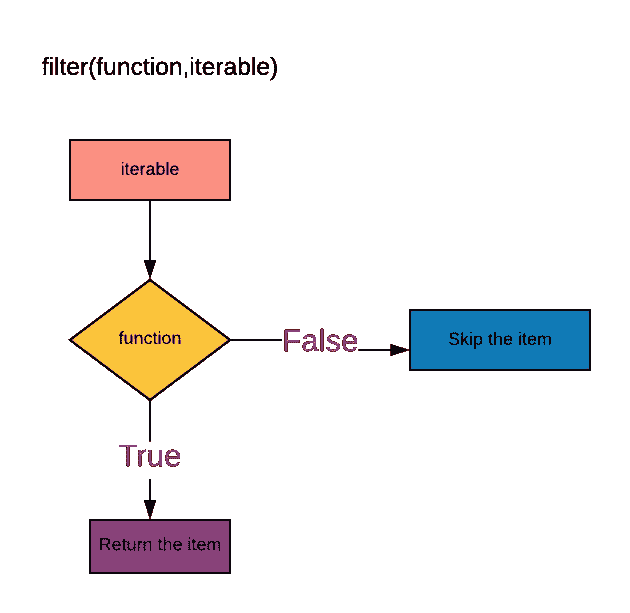
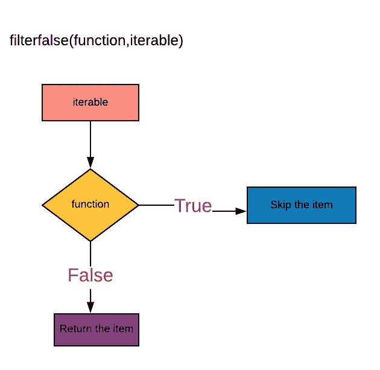

# Python 中的 Filter()与 Filterfalse()

> 原文：<https://blog.devgenius.io/filter-vs-itertools-filterfalse-in-python-d2e56ec54cae?source=collection_archive---------4----------------------->

## 让我们了解一下 python 中 filter()和 itertools.filterfalse()的区别。


照片由 [Pexels](https://www.pexels.com/photo/crop-unrecognizable-woman-with-kettle-preparing-fresh-coffee-in-kitchen-4126813/?utm_content=attributionCopyText&utm_medium=referral&utm_source=pexels) 的 [Ketut Subiyanto](https://www.pexels.com/@ketut-subiyanto?utm_content=attributionCopyText&utm_medium=referral&utm_source=pexels) 拍摄

## filter vs itertools.filterfalse

## 过滤器

> 从 *iterable* 的那些元素构造一个迭代器，其中*函数*返回 true。 *iterable* 可以是一个序列，一个支持迭代的容器，或者一个迭代器。如果*函数*为`None`，则采用恒等函数，即删除 *iterable* 中所有为假的元素。
> 
> 注意，如果函数不是`None`，则`filter(function, iterable)`等效于生成器表达式`(item for item in iterable if function(item))`，如果函数是`None`，则等效于`(item for item in iterable if item)`。 [-python 文档](https://docs.python.org/3/library/functions.html#filter)

`**filter**(*function*, *iterable*)`

**iterable** —可以是列表、元组、容器等序列，也可以是迭代器。

**返回类型**是一个过滤器对象，它是一个迭代器。

我们可以使用下面提到的方法访问过滤器对象，它是一个迭代器。

*   我们可以使用 **list()** 构造函数将过滤器**对象**转换为序列对象，使用 **tuple()** 构造函数转换为元组。
*   我们也可以使用循环的**遍历过滤器对象**
*   我们也可以使用 **next()** 函数访问****过滤器对象**中的元素。**

****

**图片来源:作者**

****例 1:在 filter()中使用自定义函数****

*   **列表 **num1** 作为一个可迭代对象给出。**
*   ****函数 even()** 定义寻找偶数。**
*   **filter()将返回一个**过滤器对象**，它是一个**迭代器**。**
*   **使用 **list()** 构造函数将过滤器对象转换为列表。**

```
**def** even(x):
    **if** x%2==0:
        **return True** num1=[1,2,3,4,5,6,7,8,9,10]
even=filter(even,num1)
print (even)*#Output:<filter object at 0x00E5E4D8>* print (type(even))*#Output:<class 'filter'>* print (list(even))*#Output:[2, 4, 6, 8, 10]*
```

****示例 2:在 filter()中使用 lambda 函数****

**从字典中过滤大于 10 的值。**

```
d={**'a'**:100,**'b'**:40,**'c'**:2}
d1=filter(**lambda** x:x>10,d.values())
print (d1)*#Output:<filter object at 0x00E5E4D8>* print (type(d1))*#Output:<class 'filter'>* print (list(d1))*#Output:[100, 40]*
```

****例 3:在 filter()** 中使用 `**None**`**

> ****如果*函数*为`*None*`，则采用恒等函数，即删除 *iterable* 中所有为假的元素。****

```
**num1=[1,0,2,3,{},**False**]
d1=filter(**None**,num1)
print (d1)*#Output:<filter object at 0x00E5E4D8>* print (type(d1))*#Output:<class 'filter'>* print (list(d1))*#Output:[1, 2, 3]***
```

******示例 4:使用 for 循环遍历过滤器对象******

*   ****过滤列表中以“r”开头的项目****
*   ****使用 for 循环遍历过滤器对象****

```
**num1=[**"red"**,**"rain"**,**"region"**,**'blue'**,**'purple'**]
d1=filter(**lambda** x:x.startswith(**"r"**),num1)
print (d1)*#Output:<filter object at 0x00E5E4D8>* print (type(d1))*#Output:<class 'filter'>* **for** i **in** d1:
    print (i)
**'''    
#Output:
red
rain
region
'''****
```

******示例 5:使用 next()函数遍历过滤器对象******

*   ****我们可以使用 **next()** 函数访问迭代器中的下一个元素。****

****参考我的故事[迭代器。](https://medium.com/analytics-vidhya/iterable-vs-iterator-in-python-eda1295a815e)****

```
****t1=(1,2,3,4,5)
d1=filter(lambda x:x%2!=0,t1)
print (d1)*#Output:<filter object at 0x00E5E4D8>* print (type(d1))*#Output:<class 'filter'>* print (next(d1))*#Output:1* print (next(d1))*#Output:3* print (next(d1))*#Output:5*****
```

## ****itertools.filterfalse****

****`itertools.**filterfalse**(*predicate*, *iterable*)`****

> ****创建一个迭代器，从 iterable 中过滤元素，只返回那些谓词为`False`的元素。如果*谓词*为`None`，则返回为假的项。- [python 文档](https://docs.python.org/3/library/itertools.html#itertools.filterfalse)****

********

****图片来源:作者****

******示例 1:在 filterfalse()中使用 lambda 函数******

*   ****导入 **itertools 模块******
*   ****定义****λ函数**来过滤大于 4 的元素。******
*   ****将 lambda 函数和 iterable ( **list l1** )传递给**ITER tools . filter false()**函数。****
*   ******filterfalse()** 将返回小于 4 的元素。它将从 iterable 中过滤元素，iterable 为给定的函数返回 **False** 。****
*   ****返回类型是一个**迭代器**。使用 **list()** 构造函数转换为列表。****

```
****import** itertools
*#iterator will filter the elements from the iterable which returns False for the given function* num1=itertools.filterfalse(**lambda** x:x>4,[1,2,3,4,5,6,7,8,9])
print (num1)*#Output:<itertools.filterfalse object at 0x0083E658>* print (list(num1))*#Output:[1, 2, 3,4]***
```

******示例 2:在 filterfalse()中使用用户定义的函数******

```
****import** itertools
**def** even(x):
    **if** x%2==0:
        **return** xnum1=[1,2,3,4,5,6,7,8,9,10]
num2=itertools.filterfalse(even,num1)

print (list(num2))
#Output:[1, 3, 5, 7, 9]**
```

******例 3:在 filterfalse()中使用 None。******

```
**#If predicate is None, returns the items that are False.
num5=itertools.filterfalse(None,[0,1,2,3,4,5])
print (list(num5))#Output:[0]**
```

******示例 4:使用 for 循环遍历 filterfalse 对象******

```
**from itertools import filterfalse
num1=["red","rain","region",'blue','purple']

d1=filterfalse(lambda x:x.startswith("r"),num1)
print (d1)#Output:<itertools.filterfalse object at 0x0148E4D8>

print (type(d1))#Output:<class 'itertools.filterfalse'>
for i in d1:
    print (i)
'''    
#Output:
blue
purple
'''**
```

******示例 5:使用 next()函数遍历 filterfalse 对象******

*   ****我们可以使用 **next()** 函数访问迭代器中的下一个元素。****

```
****import** itertools
t1=(1,2,3,4,5)
d1=itertools.filterfalse(**lambda** x:x%2!=0,t1)
print (d1)#Output:<itertools.filterfalse object at 0x0177E658>
print (type(d1))#Output:<class 'itertools.filterfalse'>
print (next(d1))#Output:2
print (next(d1))#Output:4**
```

## ****结论:****

*   ******filter():** 从函数返回 True 的 iterable 的元素中构造一个迭代器。****
*   ******filterfalse():** 从函数返回 false 的 iterable 元素中构造一个迭代器。****
*   ******滤镜()** —内置功能****
*   ******filter false()**-必须导入 itertools 模块。****

## ****我的其他博客链接****

****[地图()vs 星图()](https://medium.com/better-programming/exploring-map-vs-starmap-in-python-6bcf32f5fa4a)****

****[减少 vs 积累()](https://codeburst.io/reduce-vs-accumulate-in-python-3ecee4ee8094)****

## ****资源(Python 文档):****

****[过滤器-python 文档](https://docs.python.org/3/library/functions.html#filter)****

****[ITER tools . filter false-python 文档。](https://docs.python.org/3/library/itertools.html#itertools.filterfalse)****

*****关注此空间，了解更多关于 Python 和数据科学的文章。如果你喜欢多看我的教程，就关注我的* [***中***](https://medium.com/@IndhumathyChelliah)[***LinkedIn***](https://www.linkedin.com/in/indhumathy-chelliah/)*[***推特***](https://twitter.com/IndhuChelliah) ***。********

*****感谢阅读！*****