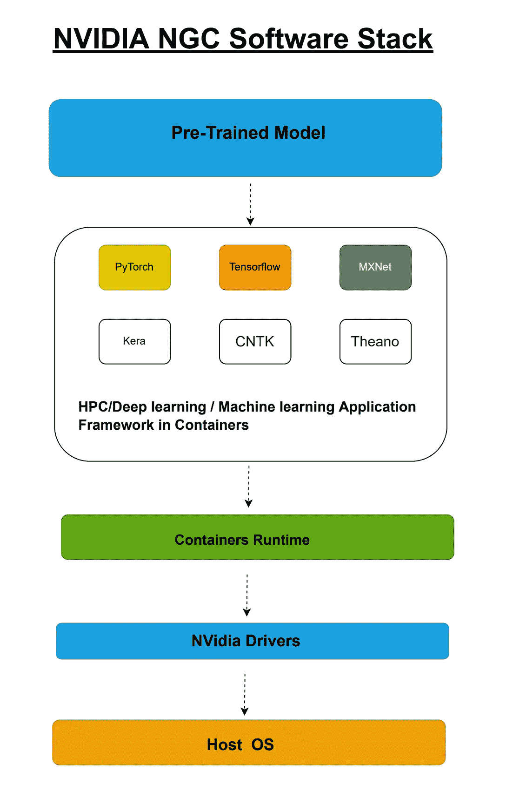
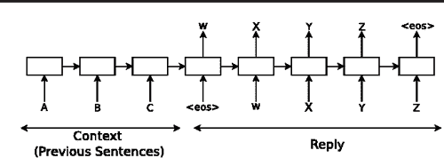
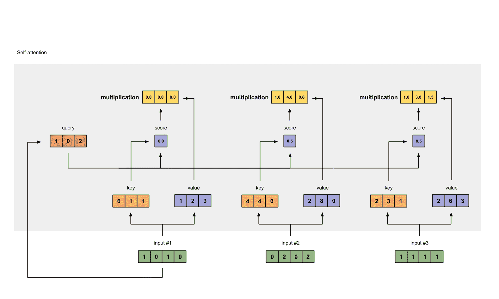
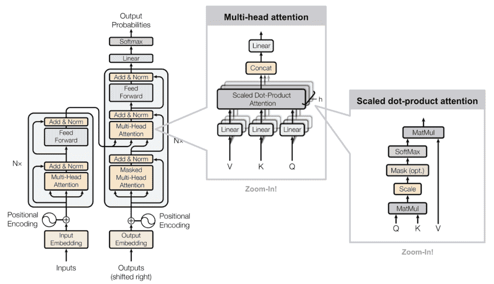

# “最后，机器可以回答你所有的问题”。

> 原文：<https://blog.devgenius.io/finally-machines-can-answers-all-your-questions-65d5d0747411?source=collection_archive---------11----------------------->

最近我一直在研究 Coveo 搜索 ML 模型，以增强我们电子商务网站的搜索体验。在探索 Coveo ML 模型的特性时，我开始了解 BERT(变压器的双向编码器表示)的功能，我对其功能和 BERT 预训练模型的性能感到非常惊讶。BERT 是一种基于转换器的机器学习技术，用于自然语言处理预训练，由 Google 开发。

在本文中，我试图展示任何人都可以通过在 GCP 云上使用英伟达 NGC 容器轻松使用 BERT 预训练模型，并使用您自己的问题/答案上下文进行训练。本教程有 3 个部分，将帮助您理解以下主题，以及您可以建立自己的 BERT 模型:

1.**英伟达 NGC 目录**

2.**自然语言处理的伯特模型**

3.**使用 GCP 的 BERT 问题/答案示例**

开始吧！

# 1.**英伟达 NGC 目录**

英伟达 NGC 目录是一款软件，由预训练模型、HPC 和 GPU 支持的各种机器学习和深度学习框架组成，如 Tensor flow、PyTorch、MXNet、NLTK 等。它还包括 docker 运行时，NVidia 驱动程序和舵图表，用于这些模型的生产部署。

简而言之，它部署了性能优化的 AI/HPC 软件容器、预训练的 AI 模型和 Jupyter 笔记本电脑，可在任何基于 GPU 的内部、云和边缘系统上加速 AI 开发和 HPC 工作负载。

**以下是英伟达 NGC 的软件堆栈:**



# **2。自然语言处理的 BERT 模型**

BERT 是 Transformers 双向编码器表示的缩写，是用于自然语言处理的机器学习(ML)模型。它是由谷歌人工智能语言的研究人员在 2018 年开发的，可作为最常见语言任务的角色模型解决方案，如情感分析和命名实体识别。它可以处理一些最常见的语言任务，如下所述:

**搜索、问题/答案、情感分析、文本分类、词性(POS)、识别命名实体(NER)、情感分类、文本生成、摘要和相似性匹配。**

伯特非常重要和关键原因有两个:

1.  **数据集大小**:语言杂乱、复杂，对计算机来说比识别图像要难学得多。他们需要更多的数据来更好地识别语言模式，识别单词和短语之间的关系。像最新的 GPT-3 这样的模型是在 45TB 的数据上训练的，包含 1750 亿个参数。这些是巨大的数字，所以很少有人甚至组织有资源来训练这些类型的模型。如果每个人都必须训练自己的 BERT，如果研究人员不利用这些模型的力量，我们将会看到很少的进展。进展将是缓慢的，并且仅限于几个大玩家。
2.  **微调:**预先训练的模型有双重好处，它们可以“现成”使用，即无需任何更改，企业只需将 BERT 插入他们的管道，并与聊天机器人或其他应用程序一起使用。但这也意味着这些模型可以针对具体任务进行微调，而无需太多数据或模型调整。对于 BERT 来说，你所需要的只是几千个例子，你可以根据你的数据进行微调。

让我们更多地了解 BERT，以及它为什么非常成功。

## 变压器架构:

为了对 Transformer 架构以及它与 BERT 等模型的关系有一个大致的了解，本文将让。

我们知道，最初的变压器纸叫做“ [**注意就是你所需要的**](https://arxiv.org/pdf/1706.03762.pdf) ”。名称本身很重要，因为它指出了它与以前的方法有什么不同。早期的 NLP 模型(如 ELMo)采用 RNNs 以类似循环的方式顺序处理文本，如下所述:



*具有序列对序列的 RNNs 按顺序接近处理过的文本，直到它们到达句子结束标记(< eos >)。在这个例子中，请求“ABC”被映射到回复“WXYZ”。当模型接收到< eos >令牌时，模型的隐藏状态存储了前面文本序列的整个上下文。来源:* [*一个神经对话模型*](https://arxiv.org/pdf/1506.05869.pdf)

现在想一个简单的句子，像“ ***狗在街上追猫的时候猫跑了*** ”。对于一个人来说，这是一个容易理解的句子，但是如果你想按顺序处理它，实际上有很多困难。一旦你到了“ *it* ”部分，你怎么知道它指的是什么？您可能需要存储一些状态来识别这个句子中的主角是“*猫*”。然后，当你继续阅读这个句子的时候，你必须找到一些方法把" *it* "和" *cat* "联系起来。

现在想象这个句子的长度可以是任意数量的单词，试着想想当你处理越来越多的文本时，你将如何跟踪被引用的内容。

这是序列模型遇到的问题，就像前伯特模型一样。

它们是有限的。他们只能对最近处理过的单词的重要性进行排序。随着他们继续沿着句子前进，前面单词的重要性或相关性开始减弱。

你可以把它想象成在处理每个新单词时向列表中添加信息。您处理的单词越多，就越难引用列表开头的单词。本质上，你需要一次一个元素，一个单词一个单词地往回移动，直到你找到更早的单词，然后看看那些实体是否相关。

“*它*是指“*猫*”吗？这就是所谓的“ [**消失梯度**](https://www.superdatascience.com/blogs/recurrent-neural-networks-rnn-the-vanishing-gradient-problem) ”问题，ELMo 使用了一种称为长短期记忆网络(LSTMs)的特殊网络来缓解这种现象的后果。LSTMs 确实解决了这个问题，但没有消除它。

最终，他们无法创造一种有效的方式来“聚焦”每个句子中的重要单词。**这是变压器网络通过使用我们已知的“注意”机制解决的问题。**



*这张 gif 来自一篇关于理解变形金刚中注意力的博文。底部的绿色向量代表编码输入，即编码成向量的输入文本。顶部的深绿色向量表示输入 1 的输出。对每个输入重复该过程，以生成输出向量，该输出向量具有输入中每个单词的“重要性”的注意力权重，该权重与正在处理的当前单词相关。它通过从输入中导出的键、值和查询矩阵之间的一系列乘法运算来实现这一点。来源:* [*图文并茂自我关注*](https://towardsdatascience.com/illustrated-self-attention-2d627e33b20a) *。*

“**注意力是你所需要的全部**”这篇论文利用注意力来提高机器翻译的性能。他们创建了一个包含两个主要部分的模型:

1.  **编码器**:这部分的“**注意力是你所需要的全部**”模型处理输入文本，寻找重要部分，并根据与句子中**其他单词的相关性为每个单词创建嵌入。**
2.  **解码器**:获取编码器的**输出，这是一个嵌入，然后将该嵌入转换回文本输出**，即输入文本的翻译版本**。**

然而，论文的关键部分不是编码器或解码器，而是用于创建它们的层。具体来说，编码器和解码器都不像传统的 RNNs 那样使用任何递归或循环。相反，他们使用了“T6”注意力“T7”的层次，信息通过这些层次线性传递。它没有多次循环输入，而是通过多个关注层传递输入。

你可以把每一个注意力层想象成“**学习**”更多关于输入的东西，也就是看着句子的不同部分，试图发现更多的语义或句法信息。这在我们之前提到的渐变消失问题中是很重要的。

随着句子长度的增加，rnn 处理它们和学习更多信息变得越来越困难。每一个新单词都意味着要存储更多的数据，并且更难检索这些数据来理解句子中的上下文。



*这看起来很可怕，事实上，一开始理解这是如何工作的有点让人不知所措。所以现在不要担心理解它。这里的主要要点是，Transformer 不是循环，而是多次并行使用缩放的点积注意机制，即它添加更多的注意机制，然后并行处理每个机制中的输入。这类似于在 RNN 中多次循环一个图层。来源:* [*又一个很棒的帖子关注*](https://lilianweng.github.io/lil-log/2018/06/24/attention-attention.html)

作为比较，最大的 BERT 模型由 24 个注意层组成。GPT 2 号有 12 个关注层，GPT 3 号有 96 个关注层。

# **3。使用 GCP 的 BERT 问题/答案示例**

BERT 代表来自 Transformer 的双向编码器表示，是一种方法/预训练模型，可以重新训练或用于各种自然语言处理任务或用例。在这种情况下，我们将使用 Nvidia NGC 目录在 GCP 顶点人工智能上运行 BERT 问题/答案。

**本笔记本演示:**

*   基于 BERT 大模型的问答任务推理
*   使用/下载经过微调的 NVIDIA BERT 型号
*   使用混合精度进行推理

**系统要求:**

*   *英伟达 NGC 目录预训练模型伯特*
*   *针对 BERT 的 NVidia docker 图像*
*   *用于 Tensorflow 应用框架 v.1.15.5 的 NVidia docker 图像*
*   *NVidia docker 运行时*
*   *谷歌顶点 AI 工作台*
*   *英伟达特斯拉 V100 GPU — 1*
*   英伟达
*   *250 GB 固态硬盘*
*   Ubuntu 20.x

要满足以上所有要求，最简单的方法就是在 https://catalog.ngc.nvidia.com/[英伟达 NGC](https://catalog.ngc.nvidia.com/)创建一个账户并注册。

登录后进入 BERT for tensor flow Jupyter Notebook，点击 deploy it to Vertex AI。只是为了确定你需要 tensorflow v1.15.5 来运行这个模型。其余的步骤如下所述，非常简单。

**BERT 型号配置:**

*   *型号:伯特大型*
*   *隐藏层:24 个编码器*
*   *隐藏单元尺寸:1024*
*   *注意头:16*
*   *前馈滤波器尺寸:4x1024*
*   *最大序列长度:512*
*   *参数:330 米*

在众多可用配置中，我们将下载以下两种之一:

*   **b**ert _ TF _ ckpt _ large _ QA _ SQuaD 2 _ amp _ 384 这些都是在 [SQuaD 2.0 数据集](https://rajpurkar.github.io/SQuAD-explorer/)上训练出来的。

**运行下面这段代码:**

use_mixed_precision_model = True

**#收集数据和模型目录:**

**# Bert _ TF _ ckpt _ large _ QA _ squad 2 _ amp _ 384**
DATA _ DIR _ FT = '/workspace/Bert/DATA/fine tuned _ large _ model _ squad 2.0 '
！mkdir -p $DATA_DIR_FT

！wget-content-disposition-O $ DATA _ DIR _ FT/Bert _ TF _ ckpt _ large _ QA _ squad 2 _ amp _ 384 _ 19 . 03 . 1 . zip \
[https://API . NGC . NVIDIA . com/v2/models/NVIDIA/Bert _ TF _ ckpt _ large _ QA _ squad 2 _ amp _ 384/versions/19 . 03 . 1/zip](https://api.ngc.nvidia.com/v2/models/nvidia/bert_tf_ckpt_large_qa_squad2_amp_384/versions/19.03.1/zip)\
&&unzip-n

**#下载 BERT 助手脚本**
！wget-NC—show-progress-O Bert _ scripts . zip \
[https://API . NGC . NVIDIA . com/v2/recipes/NVIDIA/Bert _ for _ tensor flow/versions/1/zip](https://api.ngc.nvidia.com/v2/recipes/nvidia/bert_for_tensorflow/versions/1/zip)
！mkdir -p /workspace/bert
！unzip-n-d/workspace/Bert Bert _ scripts . zip

**#BERT 配置**

**#下载 BERT vocab 文件**
！mkdir-p/workspace/Bert/config . QA
！wget-NC[https://S3 . Amazon AWS . com/models . hugging face . co/Bert/Bert-base-un cased-vocab . txt](https://s3.amazonaws.com/models.huggingface.co/bert/bert-base-uncased-vocab.txt)\
-O/workspace/Bert/config . QA/vocab . txt

```
**#Writing /workspace/bert/config.qa/bert_config.json**
```

% % writefile/workspace/Bert/config . QA/Bert _ config . JSON
{
" attention _ probs _ dropout _ prob ":0.1，
"hidden_act": "gelu "，
"hidden_dropout_prob": 0.1，
"hidden_size": 1024，
"initializer_range": 0.02，
"intermediate_size": 4096，
" max _ position _ embeddings ":512，

***#助手功能:***

**#根据用户输入创建动态 JSON 文件**
def write _ input _ file(context，qinputs，predict_file):

**#为有效的 JSON**
context = context . replace(“”，“”)删除文本中的引号和换行符。替换(' \n '，'')

**#创建 JSON dict 写**
JSON _ dict = {
" data ":[
{
" title ":" BERT QA "，
" paragraphs ":[
{
" context ":context，
" QAS ":Qin puts
}]]}

**#编写 JSON 到输入文件**
用 open(predict_file，' w ')作为 json_file:
导入 json
json.dump(json_dict，json_file，indent=2)

**#显示推理结果为 HTML 表**
def Display _ Results(predict _ file，output _ predict _ file):
从 IPython.display 导入 json
导入显示，HTML

**#这里我们只显示预测结果，nbest 预测在输出目录中也是可用的**

结果= ""
with open(predict_file，' r ')as query _ file:
queries = JSON . load(query _ file)
input_data = queries[" data "]
with open(output _ prediction _ file，' r ')as result _ file:
data = JSON . load(result _ file)
对于 input _ data 中的条目:
对于条目中的段落["段落"]:
对于段落["qas"]中的 QA:
格式(qa["id"]，qa["问题"]，数据[qa["id"]])

显示(HTML(" {}

| Id | 问题 | 回答 |

)。格式(结果)))

# 伯特推理:问题回答

我们可以在一个微调过的 BERT 模型上运行推理来完成像回答问题这样的任务。

在这里，我们使用了在 [SQuaD 2.0 数据集](https://rajpurkar.github.io/SQuAD-explorer/)上微调的 BERT 模型，该数据集包含 500 多篇文章的 100，000 多个问答对，以及超过 50，000 个新的、无法回答的问题。

# **创建包含(1)上下文和(2)根据上下文回答的问题的 BERT 输入文件——非常重要**

predict _ file = '/workspace/Bert/config . QA/input . JSON '

% % writefile $ predict _ file
{ " data ":
[
{ " title ":" Littelfuse QA "，
" paragraphs ":[
{ " context ":" Littelfuse 提供多种电路保护装置，保护乘用车上的电路。我们的汽车产品，包括我们的新型可复位设备，都是行业标准。我们的高质量产品可供广泛选择，使您能够寻找满足您特定需求的最佳解决方案。在下面浏览我们的产品。”、
" QAS ":[
{ " question ":" Littelfuse 是否提供乘用车产品？"、
" id ":" Q1 "
}
}]}]}

# 运行问题/答案推理

要运行 QA 推理，我们将使用以下参数启动脚本 run_squad.py:

导入操作系统

**#这指定了模型架构。**Bert _ config _ file = '/workspace/Bert/config . QA/Bert _ config . JSON '

**#训练 BERT 模型的词汇文件。**
vocab _ file = '/workspace/Bert/config . QA/vocab . txt '

**#向微调后的 BERT 大型模型发起检查点**
init _ check point = OS . path . join('/workspace/BERT/data/fine tuned _ Large _ model _ squad 2.0/model . ckpt ')

**#创建保存所有结果的输出目录。**
output _ dir = '/workspace/Bert/results '
output _ prediction _ file = OS . path . join(output _ dir，' predictions . JSON ')

**#是否对输入进行小写——对未装箱模型为 True，对装箱模型为 False。**
do _ lower _ case = True

**#预测总批量**
predict_batch_size = 8

**#是否在开发集上运行 eval。**
do_predict = True

**#当将一个长文档分割成多个块时，块之间的步幅是多少。**
doc_stride = 128

**#分词后最大总输入序列长度。
#长于此长度的序列将被截断，短于此长度的序列将被填充。**
max_seq_length = 384

# 运行推理

**#问伯特问题**
！python/workspace/Bert/run _ squad . py \
—Bert _ config _ file = $ Bert _ config _ file \
—vocab _ file = $ vocab _ file \
—init _ check point = $ init _ check point \
—output _ dir = $ output _ dir \
—do _ predict = $ do _ predict \
—predict _ file = $ predict _ file \
—predict _ batch _ size = $ predict _ batch _ size \
—doc

# 显示结果:

**问题:【Littelfuse 是否提供乘用车产品？**

**答:** Littelfuse 提供多种电路保护装置来保护客车上的电路

现在，您可以添加任何上下文和多个问题，并尝试将其写入 input.json 文件，然后运行推理命令，该命令将为您提供答案。到目前为止，我已经尝试了许多问答，它给出了非常快速和准确的结果。我也将很快在 github 上发布代码。