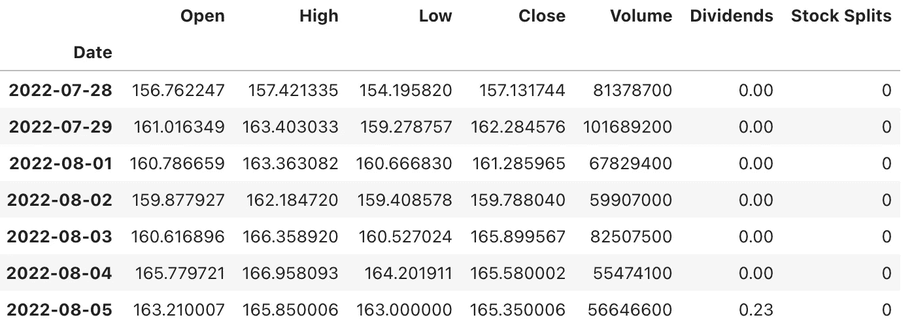
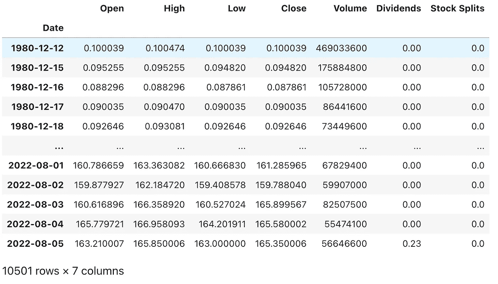
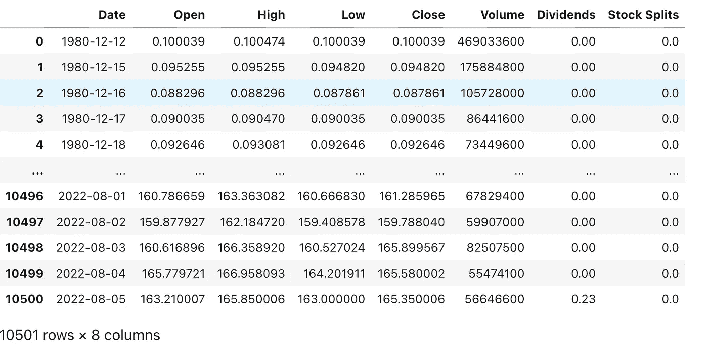
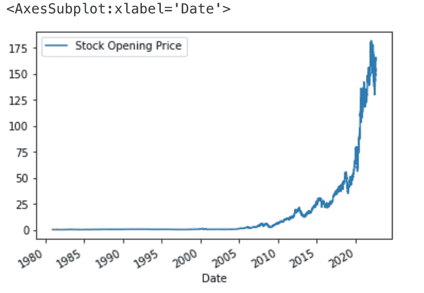
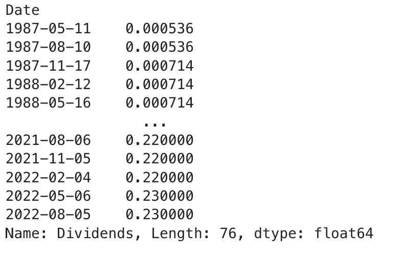
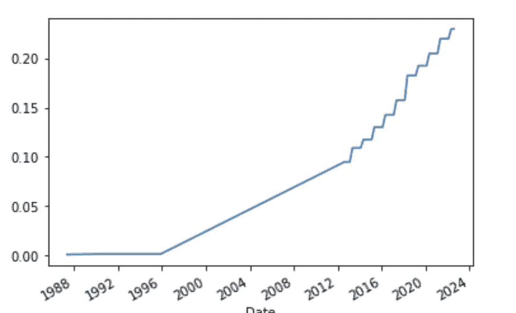
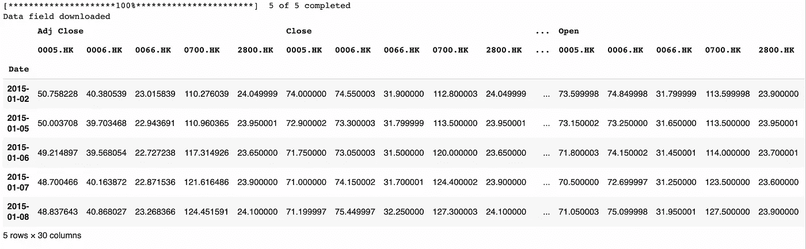
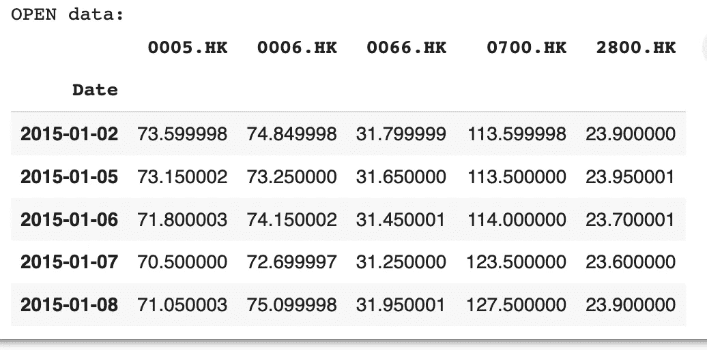
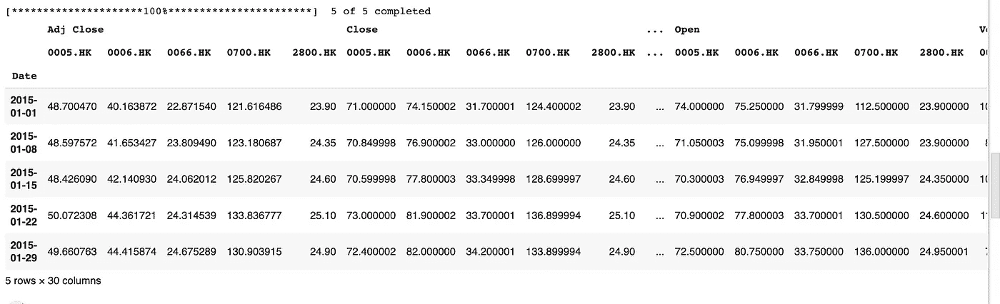

# 使用 Python 进行金融数据提取

> 原文：<https://blog.devgenius.io/financial-data-extraction-using-python-710fb03df71b?source=collection_archive---------7----------------------->

每天都有越来越多的金融信息被创造出来并在网上公开。在许多与经济如何运行相关的场景中，分析金融信息并将其纳入数据科学分析是一种典型的做法。

图片作者 [@seanpollock](https://unsplash.com/@seanpollock)

通过 python 提取金融数据还有其他几种方法，今天我们将探索 python 库 yfinance

# 方案

1-加载特定公司的历史股票价格，如苹果、AMD 等
2-以分钟、小时、周、月和年的形式下载更多基于时间的数据。

**安装:**

## Yfinance 库的股票数据提取方法

我们可以构建一个对象，让我们能够使用 Ticker 模块访问数据提取方法。为了实现这一点，我们必须提供股票的代码，在本例中，AAPL 代表苹果公司。因此，要了解更多信息，我们可以从雅虎下载市场统计数据！金融。

我们可以使用属性 info 创建股票信息的 Python 字典。

使用关键市值，我们可以获得“市值”。

## 获取股价

你可以购买的股票的最小单位是一股，这些股票的价格会随着时间而变化。我们可以使用 history()方法获得股票在特定时间段内的股价。period 参数允许我们选择要检索过去多长时间的数据。1 天(1d)、5 天、1 个月(1mo)、3 个月、6 个月、1 年(1y)、2 年、5 年、10 年、YTD 和 max 是该期间可用的可能性。

让我们来看看过去 7 天的股票

结果

熊猫数据帧是返回数据的格式。使用日期作为索引，提供每天的股票开盘、盘高、盘低、收盘、成交量和股票分割。重置索引功能允许我们重置数据帧的索引。此外，我们将就地参数设置为 True，以直接更新数据帧。

## 图形分析

图表是分析数据的一种非常好的方式

## 收回股息

公司向股东转移利润被称为股利。在这种情况下，它们被描述为投资者每持有一份股票所获得的金额。我们可以通过使用可变红利来获得数据的数据帧。“历史”功能中指定的时间段决定了数据的时间范围。

结果

# 加载过去的每日股票价格

获取特定列

## 下载额外的定期数据，如分钟、小时、周、月和年的数据

如果每日数据不是你要找的，yfinance 还提供 1 米、2 米、5 米、15 米、30 米、60 米、90 米、1 小时、1 天、5 天、1 周、1 个月和 3 个月的时间间隔(m 指分钟，h 指小时，d 指天，wk 指周，mo 指月)。

类似地，对于 1m，您每次只能获得最大长度为 7 天的数据。

虽然不可能使用上面的代码从过去 30 天中提取分钟数据，但是您可以单独加载过去 7 天中每一天的数据，或者更聪明地，您可以使用 for 循环来替换重复的代码，如下所示。

希望你喜欢这篇 python 金融入门教程，请继续关注更多与 python 和大数据相关的内容

一如既往，欢迎分享您的想法和反馈。

Syeda Marium Faheem。