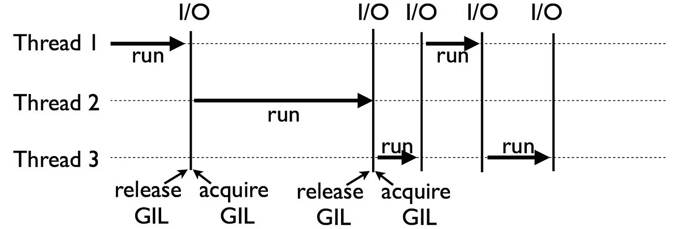

# 找到一种快速的方法来理解什么是 Python 中的 GIL

> 原文：<https://blog.devgenius.io/find-a-quick-way-to-understand-what-is-gil-in-python-aeb96ac2d4f4?source=collection_archive---------2----------------------->


**Python 全局解释器锁(GIL)，是一个互斥体(或锁)，它给了一个线程对 Python 解释器的控制权。**

这意味着单个线程可以在任何时间点处于执行状态。运行单线程程序的开发人员不会感受到 GIL 的影响，但那些使用 CPU 受限和多线程代码的开发人员可能仍然会面临生产力问题。

因为 GIL 允许您一次只运行一个线程，即使是在具有多个 CPU 内核的多线程架构中。GIL 为 Python 赢得了“臭名昭著”的名声。

在本文中，您将了解 GIL 如何影响您的 Python 程序的性能，以及如何减少它对您的代码的影响。

## 内容计划:

1.  [*GIL 是干什么的？*](#2ef7)
2.  为什么选择了 GIL？
3.  [*对多线程 Python 程序的影响*](#db8b)
4.  [*为什么 GIL 没有被除掉？*](#540b)
5.  [*为什么在 Python 3 中没有去掉？*](#ec3d)
6.  [*如何用 Python 管理 GIL？*](#ec3d) *6*. 1[*多处理 vs 多线程*](#4c5f)6.2[*替代 Python 解释器*](#dc37)6.3[*打住*](#e571)
7.  [*结论*](#2770)

# 1.GIL 是干什么的？

**Python 使用引用计数来管理内存**。这意味着在 Python 中创建的对象有几个引用变量，记录指向该对象的引用数量。当这个数字上升到 0 时，对象占用的内存被释放。

让我们用一个简短的代码示例来展示引用计数是如何工作的:\

**输出:**

```
3
```

在上面的例子中，空列表对象`[]`的参考号是 3。列表对象被`a`、`b`引用，参数传递给`sys.getrefcount()`。

回到 GIL:

**问题是这个引用计数变量需要防止两个线程同时增加或减少它们的值的运行条件**。如果发生这种情况，可能会导致永远不会释放的内存泄漏，或者更糟糕的是，当对该对象的引用仍然存在时，不正确地释放内存。这可能会导致 Python 程序崩溃或其他“奇怪”的错误。

通过将*锁*添加到线程间共享的所有数据结构中，可以安全地保存这个引用计数变量，以便它们不会被不一致地更改。

但是**给每个对象**或对象组添加一个锁意味着会有多个锁**可能会导致另一个问题——死锁**(死锁可能只发生在不止一个锁的情况下)。另一个副作用是由于重复扫描和解锁导致的性能下降。

**GIL 是解释器本身的一个独特的锁，它增加了一条规则，即任何 Python 字节码的执行都需要获取解释器锁**。这避免了死锁(因为只有一个锁),并且不会引入很多性能开销。但是它使得任何受 CPU 限制的 Python 程序都是单线程的。

GIL 虽然被 Ruby 等其他语言的解释器使用，但并不是这个问题的唯一解决方案。有些语言通过使用引用计数之外的方法(如垃圾收集)来避免线程安全内存管理所需的 GIL。

这意味着这些语言通常必须通过添加额外的性能增强功能(如 JIT 编译器)来弥补 GIL 单线程优势的损失。

# 2.为什么选择了 GIL？

那么为什么在 Python 中使用了这么麻烦的方法呢？这对 Python 开发者来说是个糟糕的选择吗？

用拉里·黑斯廷斯的话说，GIL 的设计决策是让 Python 像今天这样流行的原因之一。

**Python 从 OS 没有线程概念的时候就有了**。Python 被设计成易于使用，以使开发更快，越来越多的开发人员已经开始使用它。

许多扩展已经被写入现有的 C 库，其功能是 Python 所必需的。为了避免不一致，这些 C 扩展需要 GIL 提供的线程安全的内存管理。

GIL 很容易实现，并且很容易添加到 Python 中。它**提高了单线程**程序的性能，因为只需要管理一个锁。

集成非线程安全的 C 库变得更加容易。而这些 C 扩展也成为了 Python 被各种社区轻松采用的一个原因。

正如你所看到的，GIL 是一个务实的解决方案，解决了 CPython 开发人员在 Python 诞生之初所面临的一个难题。


# 3.对多线程 Python 程序的影响

当你看任何一个计算机程序时，在性能上受 CPU 限制的程序和受 I/O 限制的程序是有区别的。

**CPU 受限程序是那些将 CPU 推向极限的程序**。这包括进行数学计算的程序，如矩阵乘法、搜索、图像处理等。

**I/O 绑定程序是那些花费时间等待输入/输出**的程序，这些输入/输出可能来自用户、文件、数据库、网络等等。有时，I/O 程序需要很长时间才能在源代码中得到它们需要的东西。因为源可能需要在输入/输出准备好之前执行其处理。例如，用户考虑他或她应该在输入提示或正在运行的数据库查询中输入什么。

让我们看一个简单的 CPU 绑定的程序，它可以进行倒计时。我将在具有 4 个内核的系统上运行它:

**输出:**

```
Runtime - 4.010679006576538
```

我已经更新了代码，使用两个并行线程进行相同的倒计时:

**输出:**

```
Runtime - 6.666688680648804
```

您可以看到两个并行线程版本需要更多的时间来完成。在多线程版本中，GIL 阻止 CPU 绑定的线程并行运行。



**GIL 对 I/O 绑定** **多线程程序**的性能没有太大影响，因为 GIL 不会阻塞 I/O 绑定任务。

但是一个线程完全受限于 CPU 的**程序，不仅会因为锁而变成单线程。与完全单线程编写的脚本相比，它还将看到运行时间**的**增加，如上例所示。**

**这种增加是锁增加的获取和释放开销的结果。**


# 4.为什么 GIL 没有被除掉？

Python 的开发者收到了很多关于这方面的抱怨。但是像 Python 这样受欢迎的语言不可能做出像去掉 GIL 那样重大的改变而不引起向后不兼容的问题。

GIL 可以被移除，过去开发者和研究人员已经做过很多次了。此外，**所有这些尝试都打破了现有的 C 扩展**，这些扩展严重依赖于 GIL 提供的解决方案。

对于 GIL 正在解决的问题，肯定还有其他解决方案。此外，它们中的一些降低了单线程和多线程 I/O 绑定程序的性能，并且它们中的一些太难了。毕竟，您不希望现有的 Python 程序在新版本发布后运行得更慢，对吗？

> *“只有在*单线程程序(以及多线程但 I/O 受限的程序)*的性能不会降低的情况下，我才会欢迎在 Py3k* 中添加一组补丁”*”*
> 
> 吉多·范·罗苏姆

从那以后所做的尝试都不符合这个条件。

# 5.为什么在 Python 3 中没有删除它？

Python 3 有机会从零开始开发许多特性，在这个过程中，打破了一些现有的 C 扩展。但是，需要更新和执行所需的更改才能使用 Python 3。这就是为什么 Python 3 的早期版本被社区采用的速度较慢。

但是它不是被一起拿走了吗？

**移除 GIL 会让 Python 3 在单线程性能上比 Python 2 慢**，你可以想象这意味着什么。你无法与 GIL 的单线程性能优势相抗衡。这样，结果就是 Python 3 继续拥有 GIL。

**但是 Python 3 对现有的 GIL 做了重要的改进。**

我们讨论了 GIL 对“只受 CPU 限制”和“只受 I/O 限制”的多线程程序的影响，但是对于某些线程受 I/O 限制而某些线程受 CPU 限制的程序呢？

在像这样的程序中，Python 的 GIL 通过不给 I/O 绑定线程提供从 CPU 绑定线程获取 GIL 的机会来饿死 I/O 绑定线程。

这是因为 Python 内置的一种机制，它迫使线程在连续使用固定时间间隔后释放 GIL **。如果没有其他人获得 GIL，同一线程仍然可以使用它。**

**输出:**

```
100
```

这种机制的问题是，在大多数情况下，CPU 绑定的线程会在其他线程获得 GIL 之前重新获得它。

Antoine Pitrou 在 2009 年的 Python 3.2 中解决了这个问题。他添加了一种机制来检查通过其他线程获取 GIL 请求的数量，这些请求被丢弃，并且不允许当前线程在其他线程有机会运行之前重新获取 GIL。


# 6.如何用 Python 管理 GIL？

如果 GIL 对你来说是个问题，这里有一些方法你可以试试:

## 6.1.多处理与多线程

最流行的方法是使用多处理方法，即使用多个进程代替线程。**每个 Python 进程都接收自己的 Python 解释器和内存空间，所以 GIL 没有问题**。Python 有一个`[multiprocessing](https://docs.python.org/2/library/multiprocessing.html)`模块，允许我们轻松构建如下流程:

**输出:**

```
Runtime - 2.1056246757507324
```

与多线程版本相比，这是一个很酷的性能提升，不是吗？

时间没有减少到上面看到的一半，因为管理流程有其开销。请记住，多个进程比多个线程更重要。

## 6.2 替代 Python 解释器

Python 有几个解释器实现。分别用 C、Java、C#和 Python 编写的 CPython、Jython、IronPython 和 PyPy 是最常见的。 **GIL 仅存在于原始的 Python 实现 CPython** 中。如果您的程序及其库可用于任何其他实现，那么您也可以尝试一下。

## 6.3.继续

虽然许多 Python 用户喜欢单线程 GIL 在性能方面的优势。多线程程序员不需要担心，因为 Python 社区中一些最聪明的人正在努力将 GIL 从 CPython 中移除。

蟒蛇 GIL 通常被视为一个困难的主题。但是请记住，作为一个 Pythonista **，如果你编写 C 扩展或者在你的程序中使用 CPU 绑定的多线程，你通常只会受到它的影响**。


# 7.结论

让我们结束这一切。现在你知道了:

*   GIL 是干什么的
*   为什么选择了 GIL
*   为什么 GIL 没有被除掉
*   如何管理 GIL
*   在哪些情况下，您应该使用多处理和多线程

*附言:如果你喜欢这篇文章，* [*关注我*](https://medium.com/@vlad.bashtannyk) ，*点击“拍手”几下，* *留下反馈。祝你好运，高效编程！谢谢大家！*

关注我[*LinkedIn*](https://www.linkedin.com/in/vladyslav-bashtannyk/)*和*[*Twitter*](https://twitter.com/VladyslavBasht2)！**