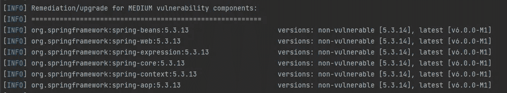

# 在 Maven 中查找并修复可传递的依赖关系版本升级/冲突

> 原文：<https://blog.devgenius.io/find-and-fix-transitive-dependency-version-upgrade-conflicts-in-maven-7ffb4ceae683?source=collection_archive---------3----------------------->

我们都知道，在处理 Maven 项目时， **pom.xml 文件**是主要包配置、依赖声明和构建配置中最重要的部分。

## 什么是传递依赖？

我们可以使用 **mvn dependency:tree** 命令来查看我们包含在项目中的依赖项的结构。传递依赖，简单来说就是子依赖所依赖的依赖。如果 A 依赖于 B and B 依赖于 C，则 C 是 A 的传递依赖

有时，如果已知包 C 易受攻击，无论是逻辑还是安全，包 B 的开发人员可能不会更新来升级 C 的版本。包 A 的开发人员则需要手动执行 C 的漏洞修复。在本文中，我总结了我在修复可传递依赖项版本升级方面的经验。

## 我如何发现我应该升级我的依赖关系？

学长让我用一个扫码工具——[**黑鸭**](https://www.blackducksoftware.com/) 。它基本上做了与命令 **mvn dependency:tree** 相同的工作，但是它更全面，帮助您确定可以做什么来解决问题。官方文件可以在[这里](https://testing.blackduck.synopsys.com/doc/pdfs/user_guide.pdf)找到。

以下是 blackduck 代码扫描插件的样本结果截图。执行漏洞扫描的实际步骤可以在上面的链接中找到。

它帮助你列出所有潜在的弱点，所有直接的/可传递的依赖。此外，它还提供补救/升级建议。

了解了这些之后，我们就可以开始修改项目 pom.xml 文件来修复漏洞了。

## 如何修复我的依赖冲突/版本升级？

## 步骤 1)找到导致漏洞的父依赖项

我的依赖之一是我的工件 **spring-boot-starter-web 依赖的 **logback-core** 。它已被报告为中等漏洞，我想删除它。**

## 步骤 2.1)如果您的项目不依赖于该漏洞，请排除该漏洞

经过检查，我没有使用任何来自 **logback-core** 的功能，所以我能做的就是从我的**spring-boot-starter-web**中排除那个包。这是我为自己的项目编写的 pom.xml 代码片段。

将 logback-core 从其父依赖关系中排除

## 步骤 2.2)如果您的项目依赖于漏洞，请修改依赖性管理

在其他情况下，我的代码使用传递依赖。例如， **spring-webmvc** 是我的可传递依赖项之一，我需要将这个包用于我代码的某些部分。据报告，该漏洞存在中等漏洞，因为已发布了更好的版本(5.3.14)。在 **pom.xml** 中，我需要做的就是添加**dependency manager**部分来指定我想要的版本，这样我就可以告诉 maven 下载这个版本的 **spring-webmvc** 。此外， **dependencyManagement** 不仅管理当前模块，还管理从当前模块扩展的子模块。如果一个项目中有多个模块共享同一个依赖项，则只需在项目根文件夹中声明一次该依赖项。

DependencyManagement 允许下载特定版本的包

## 步骤 3)再次运行代码扫描

作为双重检查，运行代码扫描以确保所有漏洞都得到处理。

我希望这篇文章对你有所帮助。如果你像我一样渴望学习一些与技术相关的东西或定期反思工作和生活，请关注我的频道，了解我日常工作和生活中的最新灵感。