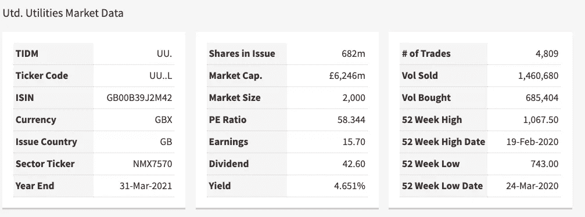
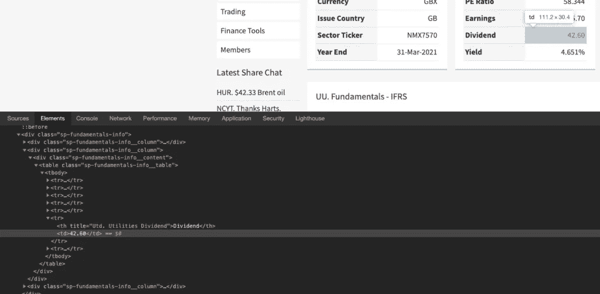

# 用 Python 查找支付股息的股票

> 原文：<https://blog.devgenius.io/find-dividend-paying-stocks-with-python-6c7565d620f7?source=collection_archive---------10----------------------->


用 python 查找支付股息的股票

在本教程中，我们将介绍如何用 python 寻找支付股息的股票。

我创建这个教程和这个脚本的原因是因为我想快速获得关于股票分红的数据，而我找不到任何好的免费 API 可以使用。所以我选择的解决方案是使用网络抓取。

幸运的是，有一个很棒的 python 抓取模块，叫做 Beautiful Soup。

我们要刮的网站是:

https://www.lse.co.uk/share-fundamentals.asp?shareprice=

例如，在这个 url 的末尾，我们可以放置股票代码

【https://www.lse.co.uk/share-fundamentals.asp?shareprice=UU. 

在网站上，我们可以看到第二个市场数据表中的股息率和股息率:



所以我们想得到这些数据，但是对于任何在伦敦证交所网站上上市的股票。

要改变公司，我们所要做的就是把 URL 末尾的股票代码换掉。现在，你可能有自己感兴趣的股票代码列表，但如果你没有，在这个网页的底部有一个下载表格，你可以下载一个 CSV 文件，其中包含来自富时 250 指数的股票代码列表。

因为它不是关于本教程的，但是我不想错过任何次要的信息，我们将快速创建我们脚本的起点，我将在内联注释中简要解释:

```
# These are our imports, external modules which 
# will help us. 
from bs4 import BeautifulSoup as bs # Used for scraping data
import csv # Used to get and write to CSV
import requests # Used to access the external URL (the webpage)

'''
 All this function is doing is reading from our 
 tickers.csv file (which should be saved in the 
 same location as your python script) and returning
 them in a list.
'''
def get_tickers():
    tickers = []
    with open('tickers.csv') as ticker_file:
        for ticker in ticker_file:
            tickers.append(ticker.strip())
    return tickers

 '''
 This method takes a list of dictionaries 
 and uses it to write a CSV file called 
 dividends.csv. We will use this last.
 '''
def to_csv(stocks):
    with open('dividends.csv', 'w') as output:
        writer = csv.writer(output)
        writer.writerow(stocks[0].keys())
        for stock in stocks:
            writer.writerow(stock.values())

'''
This method gets the webpage we want and returns
the html as a beautifulsoup object which we 
can easily scrape for data. 
'''
def get_soup(url):
    return bs(requests.get(url).text, 'html.parser')
'''
This is our entry point.
'''
if __name__ == '__main__':
    dividends = [] # Create an empty list
    for ticker in get_tickers(): # Iterate over the tickers
      # Add the dividend data to the dividends list
        dividends.append(get_data(ticker))
    # Write the dividends data to CSV.
    to_csv(dividends)
```

现在我们需要找到 HTML 和表中有关股息和收益单元格的信息。

现在我们需要找到 HTML 和表中有关股息和收益单元格的信息。

为此，右键单击其中一个单元格，然后单击“检查元素”



在这里，我们可以看到该表有一个“sp-fundamentals-info__table”类，该表行包含一个元素和一个元素，其中包含股息率。

值得注意的是，在这个页面上有三个带有类“sp-fundamentals-info__table”的表格。我们想得到第二个，在代码中是[1]，因为列表从 0 开始。

还要注意，股息率在表格的第 6 行，股息率在第 7 行。所以当我们从一个列表中得到这个数据时，我们将得到元素 5 和 6。

所以现在我们有了所有需要的信息。让我们开始编写 get_data 方法。

首先，让我们获得由我们感兴趣的股票的网页构成的 soup 对象:

```
def get_data(ticker):
    url = '[https://www.lse.co.uk/share-fundamentals.asp?shareprice='](https://www.lse.co.uk/share-fundamentals.asp?shareprice=')
    soup = get_soup(url + ticker)
```

接下来，我们应该打开一个例外尝试块。

为什么？

这里有很多可能出错的地方，为所有可能出错的情况编写代码既无聊又容易出错。因此，我们将只做一个全面的异常。这样，如果没有红利，或者网页没有我们想要的信息，或者请求失败，我们仍然可以继续使用脚本。

请注意，这种方法是懒惰的，不应该在生产中使用，因为您希望为所有可能出错的情况编写案例，并以不同的方式处理它们。但是对于本教程来说，这完全没有必要。

我们在 try 块中要做的第一件事是找到我们感兴趣的表。为了做到这一点，我们将使用漂亮的 Soup 方法 find_all 来查找所有带有类的表元素:“sp-fundamentals-info__table”，然后我们将使用[1]选择第二个元素。

```
try: 
        table = soup.find_all('table', attrs={'class', 'sp-fundamentals-info__table'})[1]
```

接下来我们需要得到股息和股息收益率信息。为此，我们将查找表中的所有元素，分别选择 5 和 6 个元素，然后使用 BeautifulSoup find 方法查找包含我们感兴趣的信息的元素。最后，我们调用。text 方法，如您所料，它会返回元素中包含的文本。

```
dividend = table.find_all('tr')[5].find('td').text
div_yield = table.find_all('tr')[6].find('td').text
```

接下来，我们可以将信息打印到控制台，这样我们可以看到脚本运行时发生了什么，然后我们可以返回一个包含股票代码、股息和股息收益率的字典对象。这将在稍后形成我们的股息 CSV 文件的列。

```
print(f'Dividend for {ticker} : {dividend}')return {
                'ticker': ticker, 
                'dividend': dividend, 
                'yield': div_yield
               }
```

最后，我们需要将 except 块添加到 try 块中。在其中，我们只是简单地登录到控制台，我们找不到该特定股票的股息信息。

```
except: 
        print('No information available for ', ticker)
```

仅此而已。现在，您可以运行代码，它将输出一个名为股息. csv 的文件。该文件将包含一个支付股息的股票及其收益率的表格。

这个帖子最初发布在这里:[https://codeyogi . co . uk/2020/06/02/find-股息支付-股票-与-python/](https://codeyogi.co.uk/2020/06/02/find-dividend-paying-stocks-with-python/) 在这里你还可以找到一个链接，下载我们在本教程中使用的 tickers 文件。

我也有这个教程的视频版本，如果能让你开心的话，你可以跟着看:

【https://www.youtube.com/watch?v=b94LKGlkntM 

以下是本教程的完整代码:

```
from bs4 import BeautifulSoup as bs
import csv 
import requestsdef get_tickers():
    tickers = []
    with open('tickers.csv') as ticker_file:
        for ticker in ticker_file:
            tickers.append(ticker.strip())
    return tickersdef to_csv(stocks):
    with open('dividends.csv', 'w') as output:
        writer = csv.writer(output)
        writer.writerow(stocks[0].keys())
        for stock in stocks:
            writer.writerow(stock.values())def get_soup(url):
    return bs(requests.get(url).text, 'html.parser')def get_data(ticker):
    url = '[https://www.lse.co.uk/share-fundamentals.asp?shareprice='](https://www.lse.co.uk/share-fundamentals.asp?shareprice=')
    soup = get_soup(url + ticker)
    try: 
        table = soup.find_all('table', attrs={'class', 'sp-fundamentals-info__table'})[1]
        dividend = table.find_all('tr')[5].find('td').text
        div_yield = table.find_all('tr')[6].find('td').textprint(f'Dividend for {ticker} : {dividend}')return {
                'ticker': ticker, 
                'dividend': dividend, 
                'yield': div_yield
               }
    except: 
        print('No information available for ', ticker)if __name__ == '__main__':
    dividends = []
    for ticker in get_tickers():
        dividends.append(get_data(ticker))
    to_csv(dividends)
```