# 寻找免费字体:27 个最佳移动应用程序设计网站

> 原文：<https://blog.devgenius.io/find-free-fonts-27-best-websites-for-mobile-app-design-b85169916586?source=collection_archive---------46----------------------->

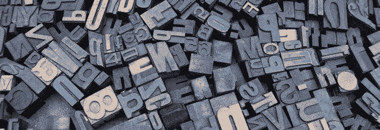

无论你是在设计一个移动应用还是一个视频游戏，排版在设计过程中都扮演着重要的角色。

因此，找到合适的网站，为你的项目提供最合适的字体类型，是至关重要的。

有很多网站可以下载字体，但是如果你预算紧张，投资字体可能不是一个选择。

为了帮助您在保持高 UI 质量的同时节省开发成本，我们收集了 **27 个最佳网站**，您可以从这些网站下载免费字体用于您的移动应用或游戏排版。

如果您有更具体的想法，您也可以创建自己的自定义字体。你也可以用最简单的方法学习如何使用**字体和**[**【fel go】**](https://felgo.com/)。

# 27 个为移动应用下载免费字体的最佳网站

如上所述，我们已经收集了 27 个最好的网站来为你的移动应用、游戏或任何其他项目下载免费字体。

# 1.1001 字体

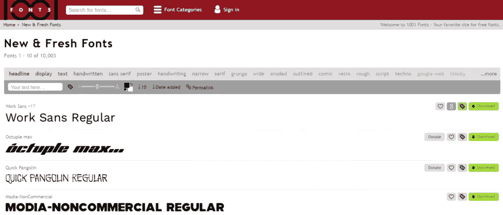

[1001 字体](https://www.1001fonts.com/)在我们的榜单上赢得了第一名，因为它为商业和个人使用提供了大量的字体选择。该网站提供了来自 9991 个家庭的近 19000 种免费字体。在提供如此大的选择的同时，该网站也由于其定义明确的类别列表而使浏览变得容易。

# 2.谷歌字体

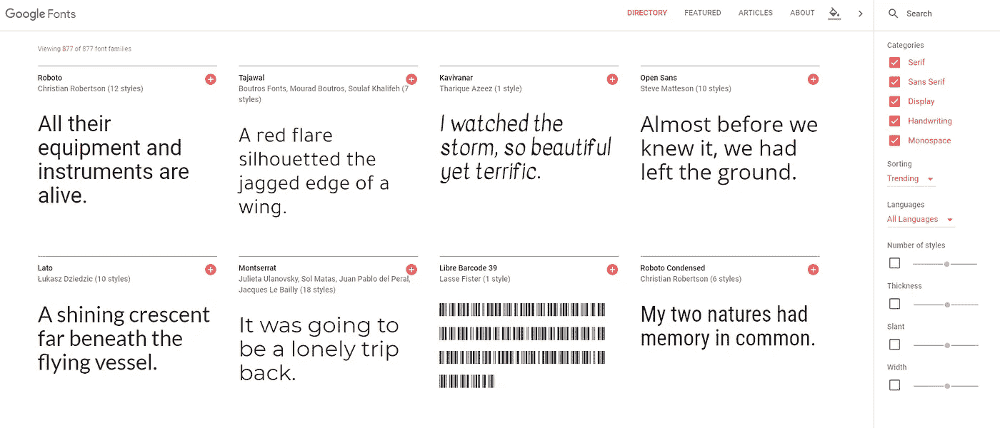

与我们的首选相比，[谷歌字体](https://fonts.google.com/)在类别和粗细或样式设置方面提供了稍微有限的选择。另一方面，它也是完全开源的，没有许可限制。谷歌字体允许你自定义字符集，这可以消除加载时间。通过其清晰的界面，很容易看到所选字体的使用。

# 3.字体松鼠

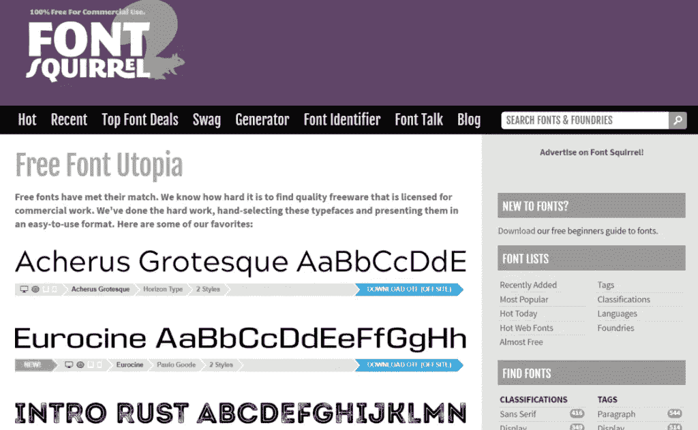

[FontSquirrel](http://www.fontsquirrel.com/) 是一个寻找免费商业字体的好地方。这个网站选择高质量的，并以易于浏览的方式列出。

尽管他们声称他们所有的字体都是免版税的，但为了安全起见，他们也强烈建议在下载他们列出的任何产品之前阅读许可信息。一旦你承认所有的条款和条件，随时下载他们的字体和使用它。

# **4。达丰**

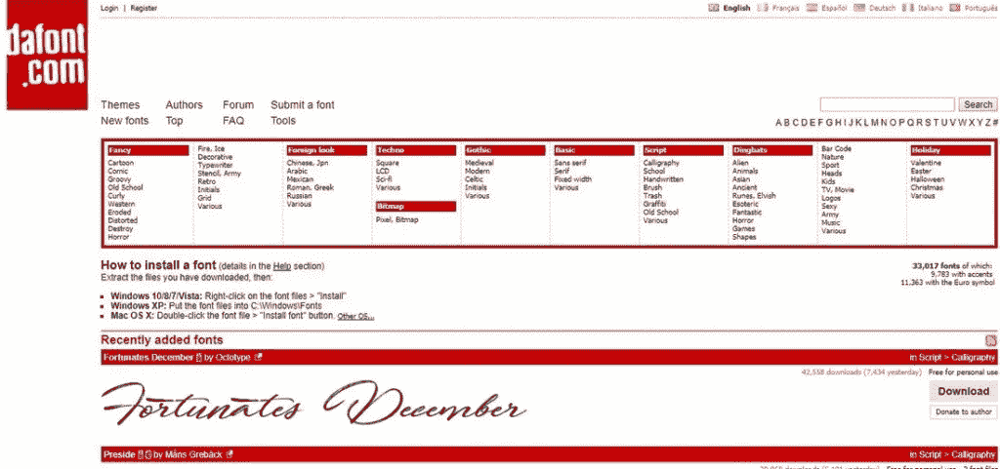

与谷歌字体中的大多数字体不同， [DaFont](http://www.dafont.com/) 上提供的大多数字体都是真正独一无二的，因为每种字体都是由不同风格的设计师创作的。如果你正在寻找一些独家的东西，这是一个可以考虑的网站。

与谷歌字体中的大多数字体不同， [DaFont](http://www.dafont.com/) 上提供的大多数字体都是真正独一无二的，因为每种字体都是由不同风格的设计师创作的。如果你正在寻找一些独家的东西，这是一个可以考虑的网站。

此外，该网站设计得很好，可以快速过滤。浏览所有选项时，您可以根据许可、字体、名称、受欢迎程度或添加日期等因素缩小列表。

一旦你找到了你喜欢的字体，也很容易看到你的选择在使用。

这个网站最大的特色之一是活跃的论坛，在这里你可以为特定的项目寻求与排版相关的建议。你也可以参与一般设计相关的论坛讨论。

# 5.1001 种免费字体

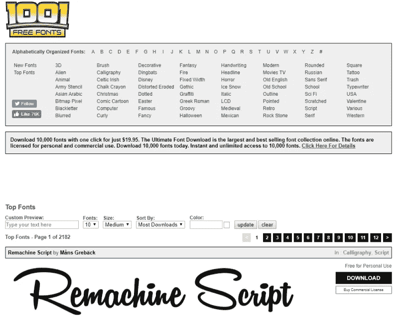

[1001 free fonts](http://www.1001freefonts.com/)’字体和丁字笔免费分发。就其网站的设计和可用性而言，它不在我们列表中其他页面的水平上，因为广告使浏览相当令人不安。积极的一面是，他们提供了大量的产品，可以根据名称或类别进行搜索。他们提供了一个设计师数据库，如果你想雇佣一个设计师来定制你自己的信件，或者只是联系他们以获取更多信息，这可能会很有用。

# 6.城市字体

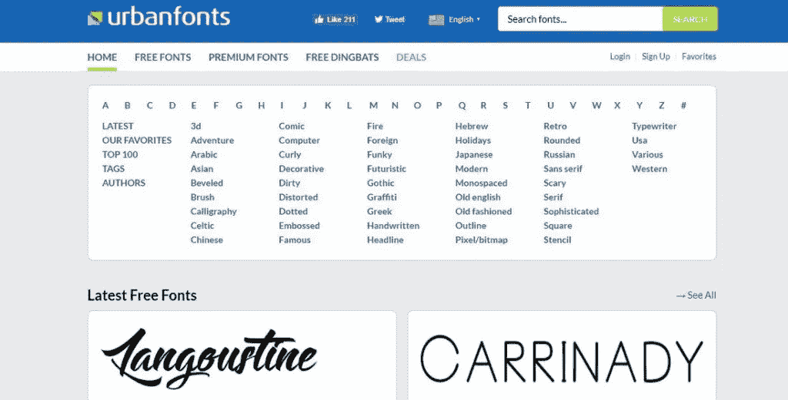

城市字体服务包括大量的高级和免费字体以及免费字体。然而，请记住，尽管它的选择超过 8000 个项目，而且还在增加，但有些产品只适用于共享软件或链接软件。网站上的一些字体只有试用版或有限的字符集，除非购买了商业许可证。因此，UrbanFonts 强烈建议其用户在下载前仔细查看字体的细节。

# 7.字体空间

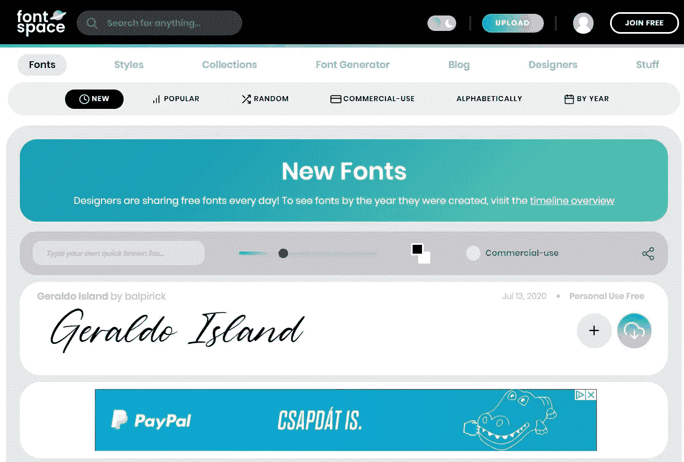

FontSpace 也是一个独立的网站，列出了超过 38，000 种可下载的字体。成千上万的创意设计师将他们的产品上传到这个网站，并明确描述了他们的许可限制。他们给自己贴上面向设计师、家庭友好、合法、有组织的标签，为任何项目寻找高质量的字体。就其网站结构而言，通过其界面浏览、过滤和导航相当容易。你也可以在他们的网站上注册一个免费账户，保存他们的字体集。

# 8.抽象字体

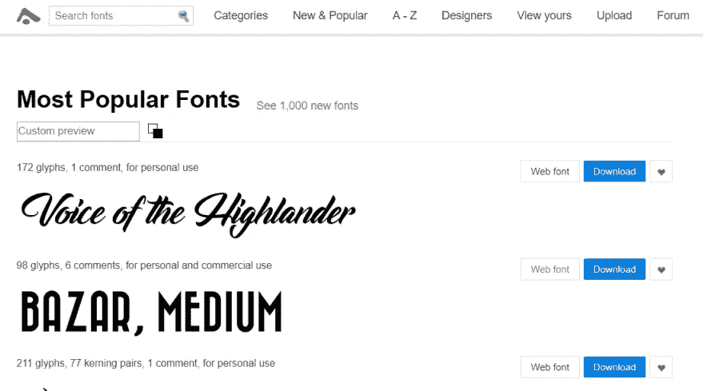

[抽象字体](http://www.abstractfonts.com/)也有大量用于商业和个人用途的字体。他们的选择分为几类，如 3D、成人、动物、卡通和许多其他类别。强烈建议在下载前仔细检查许可信息，因为该网站不仅提供免费字体，还出售字体类型。

# 9.FontStruct

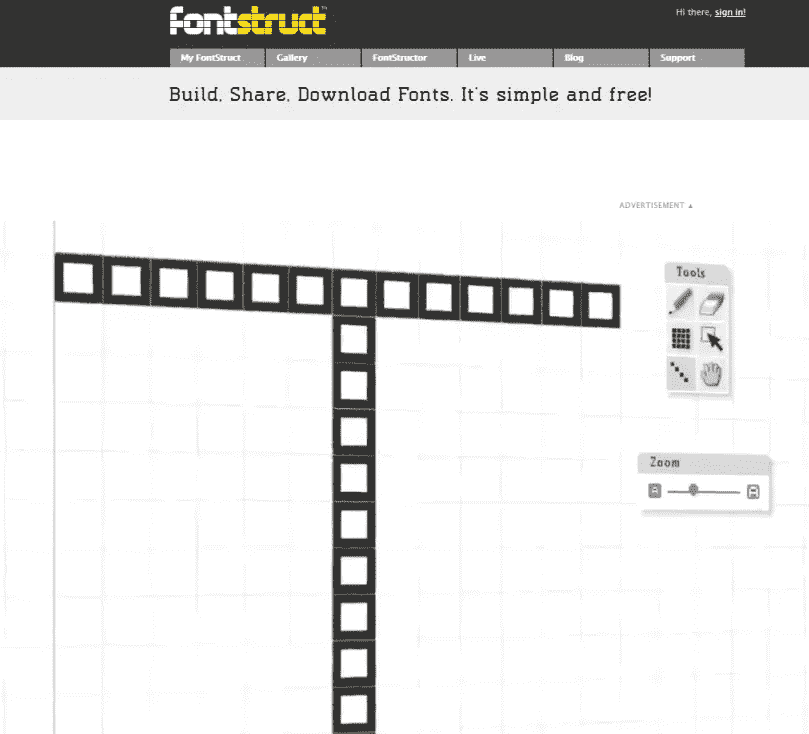

[FontStruct](https://fontstruct.com/) 是一个字体构建工具。它允许你定制几何形状的字体。该网站还为有创意的用户提供了介绍视频和快速入门指南，这些用户希望尝试他们的服务。

如果它的用户不能从头开始创建自己的风格，他们也可以通过浏览图库来直接下载信函风格或将其作为灵感。无论你创建自己的风格还是使用共享的风格，这些定制的字体在你的应用程序、博客、网站或任何其他项目中都将非常好看。

# 10.酷文

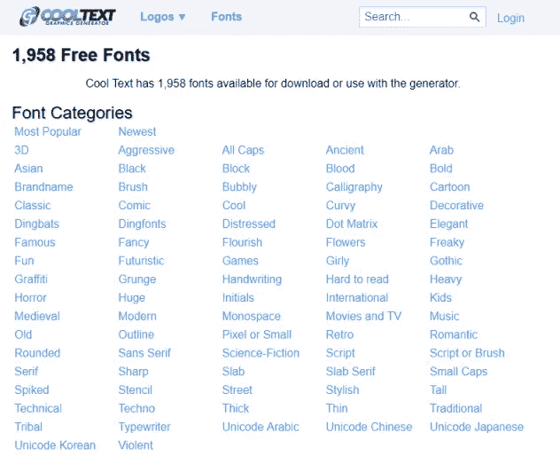

COOLTEXT 有点复古，但取决于你的项目，它可能是你正在寻找的。它被称为标志生成工具。

整个过程相当快速和直接。用户可以自由地为他们的项目创建自己的图形、项目符号和按钮，而不用担心版权限制。不利的一面是，该网站只允许其用户创建基于文本的标志。

# 11.丰塔斯

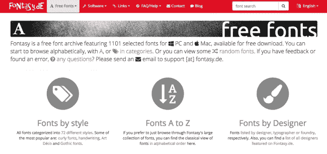

Fontasy 是一个免费的字体档案，包含 1100 多种精选字体，适用于 PC 和 MAC。在 72 个类别中，字体可以由设计师或按字母顺序过滤。他们列出的字体主要是个人使用；因此，如果你正在寻找一个仅用于商业用途的类型器，确保你联系设计者以获得同意，从而避免将来的任何法律问题。

# 12.自由字体项目

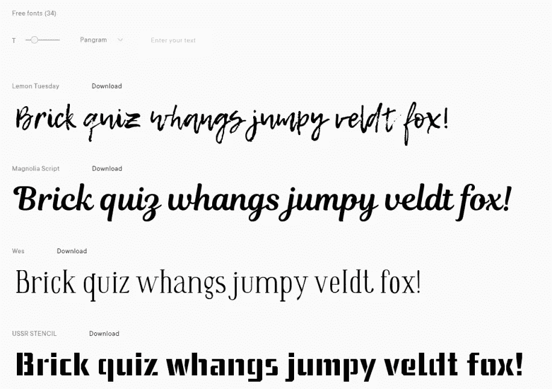

Ivan Gladkikh 是免费字体项目 T1 的创始人，他的目标是让印刷术更受欢迎，更广泛的用户可以使用。

在他的网站上，他提供 34 种字体供免费下载。

您可以在任何项目中使用这些字体，包括 Android 和 iOS 应用程序。如果你正在寻找手机应用的创意，你可以从[这里](https://v-play.net/cross-platform-app-development/mobile-app-ideas)获得。

# 13.冯特里弗

[Font River](http://www.fontriver.com/) 为其访问者提供免费的 Windows 和 Mac 字体和标签。

尽管大部分字体是免费的，但他们的网站上仍有一些付费字体。因此，建议在下载前检查许可限制。

他们还有一个博客，主题是如何设计自己的字体。

# 14.方字体

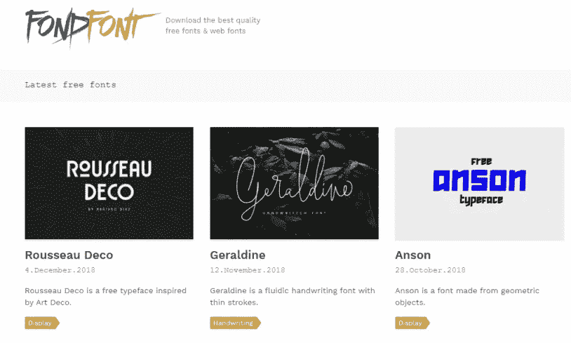

FondFont 标榜自己拥有质量最好的免费字体。虽然你必须自己调查这个声明，但是他们确实有一个很棒的免版税的可下载字体集。要为您的移动应用程序、视频游戏、网页或其他项目找到最合适的免费字体，您可以浏览它们的主题列表。如果你找不到你要找的字体，他们也会提供更多的资源来做进一步的研究。

# 15.字体结构

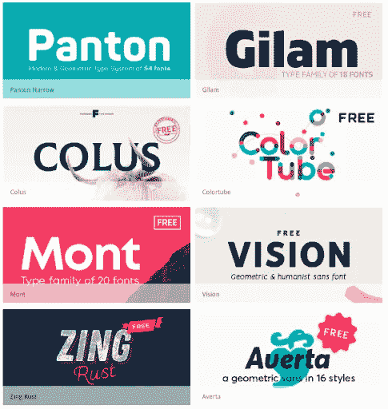

虽然 [Fontfabric](http://www.fontfabric.com/) 没有最大的免费使用字体集合，但列出的字体肯定是设计良好的。

你可以滚动浏览他们的[自由选择](https://www.fontfabric.com/category/free/)，找到最适合你手机或游戏应用项目的字体。

# 16.丰斯普林

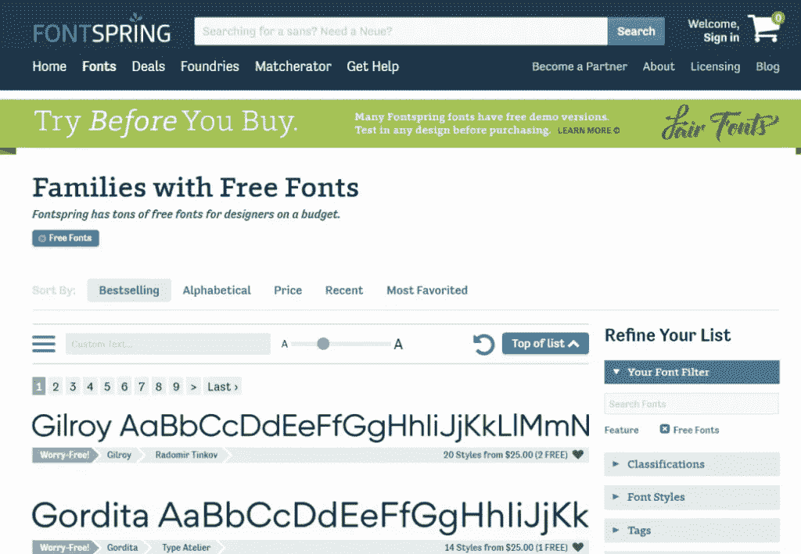

[FontSpring](https://www.fontspring.com/free?sort=price) 是一个高级字体市场，你也可以在那里找到一些高级[免费字体](https://www.fontspring.com/free?sort=price)。您可以在每个字体页面中找到有关字体许可的详细信息。

# 17.类型仓库

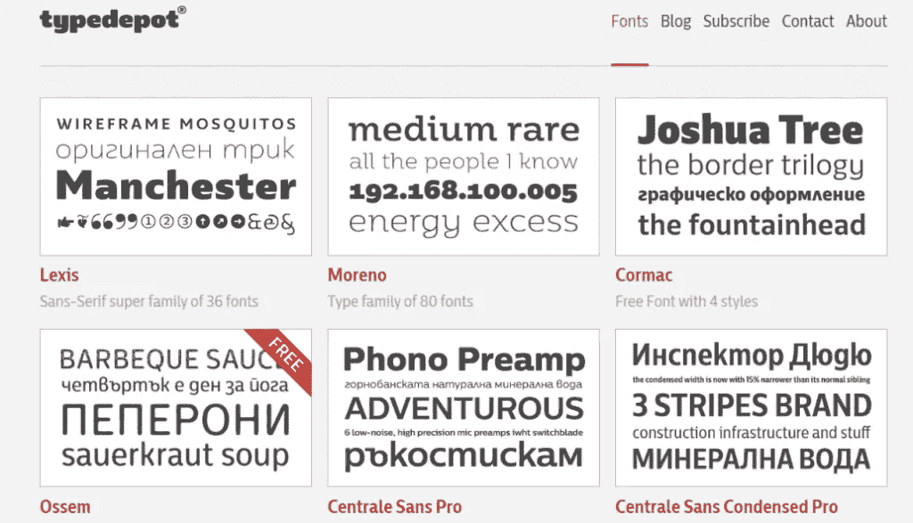

[Typedepot](http://www.typedepot.com/fonts/) 是一家在线字体设计工作室，由 Alexander Nedelev 和 Veronika Slavova 所有。虽然他们的全包只能购买，但游客可以免费下载部分包。

# 18.逆向供应公司。

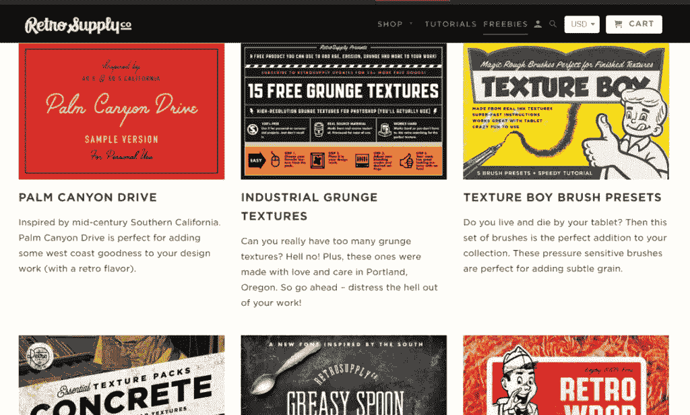

在 [RetroSupply Co.](https://www.retrosupply.co/pages/free-retrosupply-products) 上，用户可以从画笔、束、剪贴画、字体、illustrator、photoshop、纹理等标签中进行选择。根据他们的网站，他们的产品可以用于商业和个人项目，商品，或用于教学。但是，如果你想购买他们的某个产品用于商业用途，建议你先检查他们的许可限制。

他们也有令人印象深刻的退款政策。如果你买了他们的一个产品，并在 60 天内决定，它不是你想要的，你可以给他们发一封电子邮件，他们会毫不犹豫地把钱退回来。很公平，不是吗？

请访问这个网站，看看如何将他们的产品应用到您自己的手机或游戏应用中。

# 19.字体立方体

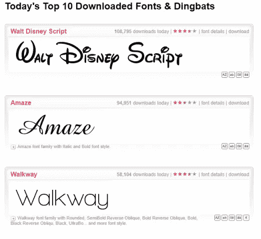

[Fontcubes](http://www.fontcubes.com/) 是寻找 8800 多种可免费下载的 Mac、Android 和 Windows 字体的最佳网站之一。T.

但是， [Fontcubes](http://www.fontcubes.com/) 要求用户向字体作者核实许可。因此，如果您想找到一种字体并立即在项目中使用它，这可能不是首选。

# 20.自由排版

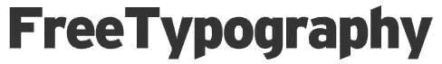

免费字体设计是一个字体设计博客，它拥有大量的免费字体。他们采访字体设计师很棒。此外，他们给出设计建议，帮助你做出明智的选择。一定要看看他们的**必须有字体**，这对任何字体收藏都是一个很好的补充。

# 21.喜剧新

漫画新元素是克雷格·罗辛斯基的创意。他的目标是改进臭名昭著的无字体漫画。

Comic Neue 旨在成为“每个人的休闲剧本选择，包括印刷精明的人”。它有很多种。

它也是开源的，所以你今天就可以开始使用它。

# 22.十乘二十

[Ten by Twenty](http://tenbytwenty.com/) 拥有一个很小的好看的可下载移动字体集合。其中有些是免费的，有些只需很少的费用。

这个网站不仅字体独特，支付方式也是独一无二的。你可以捐赠/支付所购买字体的价值。很有趣，不是吗？

# 23.点冒号

与榜单上的其他一些网站相比，Dotcolon 更“精致”。它拥有一个免费使用字体的小集合。

该网站是日本字体设计师黑脸田鸡·佐野的作品。这些字体非常干净和精致，在任何专业应用程序中无疑看起来都是正确的。

# 24.活字印刷联盟

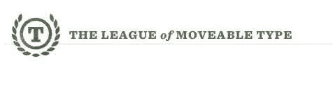

可移动字体联盟是一个致力于开源字体的库。

他们有大量免费的商业用字体，你可以为你的任何项目下载。这个页面最大的好处是，你可以在几秒钟内浏览网站，并很快找到你的字体。

# 25.免费设计资源

如果你想看看现代视频游戏字体的小集合，[免费设计资源](http://freedesignresources.net/)是一个值得访问的网站。

他们的服务不仅包括补充字体，还包括模型、附加组件和 [UI 套件](https://freedesignresources.net/category/free-ui-kits/)。后者对于设计你当前的移动应用程序或者提出下一个移动应用程序的想法肯定是有用的。

# 26.冶炼厂

冶炼厂由法国字体设计师 Jack Usine 于 2002 年创立。Usine 已经开发了一些免费使用的字体，以及一些高质量的付费字体。

你可以开始在你的任何项目中免费使用 Usine 的字体。

SMeltrey 还有一个时事通讯，你可以在那里注册，随时了解字体库的最新动态。

# 27.设计师的免费礼物

设计师的免费好东西是一个由一群设计师和艺术总监运营的小博客。旨在为各类设计师提供绝佳素材。他们有几个类别，有一个专门的字体部分，里面有免费使用的选项。这些字体在游戏和应用中都很棒，所以一定要看看。

**尝试字体识别工具**

如果你看到了你想使用的字体，但不知道它叫什么，字体标识符可以帮你。在线字体识别器通常需要你想要的字体的截图，然后，他们在几秒钟内返回你想要的字样的名称。

这里有一些免费试用的工具:

*   [字体匹配符](http://www.fontspring.com/matcherator)
*   [什么玩意儿！](https://www.myfonts.com/WhatTheFont/)
*   [识别字体工具](http://www.identifont.com/tools.html)

请注意，这些工具可以很好地识别字体，但不能保证准确性。如果你对自己想要的东西有一个大致的概念，或者你愿意接受建议，它们是一个很好的解决方案。

# 使用谷歌查找应用字体

如果你正在寻找一种众所周知的字体，这种方法简单而有效。许多字体存在于在线目录和索引中，所以如果你知道如何查找，你可以在一分钟内找到它们。您可以使用以下搜索词在 Google 上进行特定的字体搜索。

您需要以[**intitle:" index . of "(TTF | OTF)font name-html-PHP-APS-cf-JSP]开始搜索。在上面的例子中，我们在寻找《我的世界》字体。要搜索另一种字体，请在(tff|otf)后插入名称，然后按 enter 键。**

这种方法有一个缺点。使用字体时，确保您有适当的权限是很重要的。由于许可信息并不总是包含在字体描述中，因此建议在您的应用程序或视频游戏中使用这些字体之前，联系网站管理员以获得适当的权限。

# 不知道用什么字体？

如果你的技能中缺少识别某种字体的能力，那也没关系。现在，有几种方法可以找到你喜欢的字体。

在这些情况下，我们建议访问名为[的网站。他们有一些工具可以帮助你为你的项目选择字体。您可以按类型浏览各种类别，如高字体或宽字体。你也可以将它们相互比较，看看每一个的优点。你甚至可以找到主字体的配套字体。所以你项目中的一切看起来都是互补的。](http://www.identifont.com/)

[Identifont](http://www.identifont.com/) 的另一个功能是让你进行调查，然后为你推荐合适的选项。这项调查很容易进行，你可以在几分钟内找到适合你口味的字体。你有两个或更多不同风格的角色，你必须选择你最喜欢的一个。几个问题之后，它会为你推荐几种字体。

# 创建您自己的字体免费用于商业用途

对于有创造力的移动开发者来说，有一些工具可以帮助你设计自己的字体。一个有趣的选择是把你自己的笔迹变成一种字体。

你可以使用像[书法家](https://www.calligraphr.com/)这样的网站。你需要打印并填写一个你自己风格的模板，扫描它，网站就会创建你自己的免费字体。

另一个选择是 [FontStruct](http://www.fontstruct.com/) ，一个可以让你画出自己字体的在线工具。这是一个有趣的方式来创建商业用途的免费字体，你可以完全控制你的字体。有一点学习曲线，但 FontStruct 可以产生很好的结果。

# 如何在使用 Felgo 的手机 App 或游戏中使用免费字体

现在您已经有了一个不错的选择，您可以使用这个简单的过程将它们包含在您的 [Felgo](https://felgo.com/) 项目中。

你可以使用[字体加载器](https://felgo.com/doc/qt/qml-qtquick-fontloader.html)元素给你的应用添加字体。这个元素可以通过名称或 URL 来加载字体。

一旦你找到了你喜欢的字体，并把它转移到正确的目录，你所要做的就是复制下面的代码:

[**现在在你的 iOS 或 Android 设备上运行这段代码**](https://felgo.com/web-editor?snippet=d90faffa) **，并实时重新加载代码**

这看起来像这样:

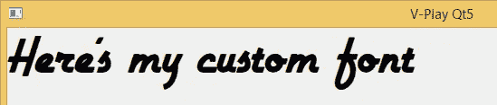

Felgo 两者都支持。ttf 和。otf 字体。如果您想要使用不同格式的字体，您可以使用[在线字体转换器](https://onlinefontconverter.com/)将其转换为支持的格式。

# 更多这样的帖子

[为开发者提供免费游戏图片的 16 大网站](https://felgo.com/2015/07/16-sites-featuring-free-game-graphics/)

[QML 13 个最佳 Qt&Felgo 初学者教程和资源](https://felgo.com/2016/01/qt-tutorials-resources-for-beginners/)

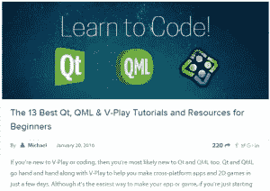

[21 个有助于改善用户获取策略的技巧](https://felgo.com/2015/09/21-tips-that-will-improve-your-user-acquisition-strategy-2/)

*原载于【https://blog.felgo.com】**。***