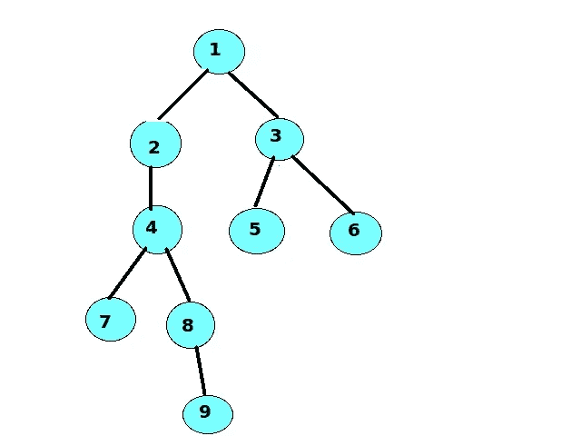
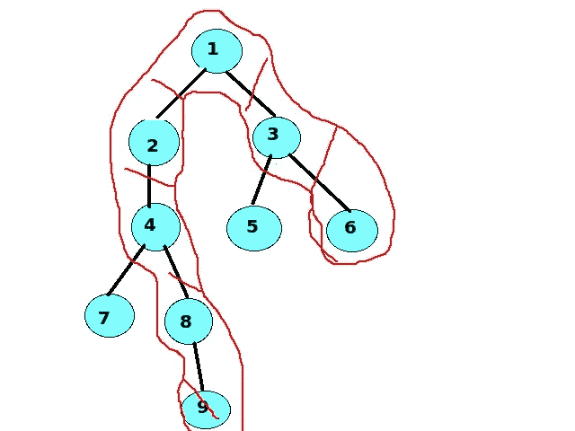

# 找出树中两个节点之间的最大距离(也就是树的直径)

> 原文：<https://blog.devgenius.io/find-the-largest-distance-between-two-nodes-in-a-tree-a-k-a-diameter-of-the-tree-620e33d7b0d8?source=collection_archive---------6----------------------->

大家好…..今天我们将讨论一个关于树的有趣问题，这个问题在各种形式的技术访谈中经常被问到。首先让我们看看问题陈述。

**问题陈述:-**
*有一棵未加权的树，由 N 个节点组成。我们需要找到树中两个节点之间的最大距离。两个节点之间的距离将是节点之间路径上的边数。
路径将是唯一的，因为它是一棵树。*



有 9 个节点的无向树



上述树的最大路径

## 输入:

第一行包含每个测试用例的测试用例数量
:第一行包含树中节点的数量，即 N 和边的数量，即 M。
接下来的 N 行包含两个整数 U 和 V，它们表示节点 U 和节点 V 之间的一条边

**输出:** 为每个测试用例打印一个新行中树的最大距离。

# 强力解决方案:-

在看了问题陈述并思考了一会儿后，我意识到我需要找到两个节点之间的最大距离，例如，在上面的例子中，最大距离是六个单元/边的节点 9 和节点 6 之间的距离。我们怎样才能找到它呢？？？
我首先想到的是做一个 [BFS(广度优先搜索)](https://www.geeksforgeeks.org/breadth-first-search-or-bfs-for-a-graph/)从每个节点开始寻找树中每隔一个节点的距离。
节点 2、3、4、5…9 到节点 1 的距离
节点 1、3、4、5…9 到节点 2 的距离，依此类推………
跟踪每个节点遍历的最大距离将会给我们很好的答案…

下面是蛮力方法的 C++实现

```
#include <bits/stdc++.h>
using namespace std;int ans = INT_MIN;void bfs(int start, vector<vector<int> > &adjList)
{
    int n = adjList.size();
    int res = 0; //to get the maximum distance of the current particular node under investigationvector<int> distance(n+1, -1); //to store distance of nodes from the start node
    distance[start] = 0; //distance of start node from itself will be 0//queue to do breadth first search from the start node
    queue<int> q;
    q.push(start);while(!q.empty())
    {
        int curr = q.front();
        q.pop();//try to explore the childs of the current node under investigation
        for(int i = 0; i < (int)adjList[curr].size(); i++)
        {
            //distance of this node from start is -1 i.e this node 
            //hasn't been explored yet so add it to the queue to get explored
            if(distance[adjList[curr][i]] == -1)
            {
                distance[adjList[curr][i]] = distance[curr]+1;
                q.push(adjList[curr][i]);
                res = max(res, distance[adjList[curr][i]]);
            }
        }
    }//find the global maximum answer
    ans = max(ans, res);
}int DiameterofTree(int n, vector<vector<int > >& edgelist)
{
    //convert edgeList representation to adjacency list representation
    vector<vector<int> > adjList(n+1);
    for(int i = 0; i < (int)edgelist.size(); i++)
    {
        adjList[edgelist[i][0]].push_back(edgelist[i][1]);
        adjList[edgelist[i][1]].push_back(edgelist[i][0]);
    }//do a bfs on each node of the graph
    for(int i = 1; i <= n; i++)
        bfs(i, adjList);return ans;
}int main()
{
    int tests;
    cin>>tests;
    while(tests--)
    {
        //refresh the answer for each case
        ans  = INT_MIN;
        //number of nodes and edges in the graph
        int nodes, edges;
        cin >> nodes >> edges;

        //originally edgelist is given to represent the graph
        int vertex1, vertex2;
        vector<vector<int > > edgelist;
        for(int i = 0; i < edges; i++)
        {
            cin >> vertex1 >> vertex2;
            vector<int > temp = {vertex1, vertex2};
            edgelist.push_back(temp);
        }

        int result = DiameterofTree(nodes, edgelist);
        cout << result << "\n";
    }
    return 0;
}
```

但是让我们看看它的时间复杂度，它是 O( V * ( V+E ) )
因为我们在每个节点上做一个 BFS 需要 O( V+E)时间，也就是 BFS 做了 V 次，因此时间复杂度是 O(V)，这不是一个好的锁定协议。我们能做得更好吗……..让我看看……

# 优化的解决方案:-

是的，我们可以改进我们的蛮力实现
,只是我们需要更聪明地应用 BFS 遍历。

我们从任意一个节点 X 开始一个 BFS，寻找距离 X 最远的节点 Y。这个节点 Y 将是树中最长路径的末端节点。然后在这个节点 Y 上应用一个 BFS，找到实际最长路径的另一端，得到想要的结果。

在上面的例子中，假设我们从节点 1 开始一个 BFS，距离节点 1 最远的节点是节点 9。然后我们在节点 9 上应用 BFS，得到离它最远的节点，这里是节点 6(也是节点 5)。更多细节请参考[该堆栈溢出帖子](https://stackoverflow.com/questions/20010472/proof-of-correctness-algorithm-for-diameter-of-a-tree-in-graph-theory)

唯一需要修改的块是:-

```
int DiameterofTree(int n, vector<vector<int > >& edgelist){vector<vector<int> > adjList(n+1);for(int i = 0; i < (int)edgelist.size(); i++){adjList[edgelist[i][0]].push_back(edgelist[i][1]);adjList[edgelist[i][1]].push_back(edgelist[i][0]);}//first bfs from an arbitrary node to find the farthest node from itint x = bfs(1, adjList);//use that farthest node to find the other end of the longest path in the treeint z = bfs(x, adjList);return ans; //it is a global variable}
```

由于涉及两次 BFS 遍历，因此时间复杂度为 O(V+E ),其中 V 是图中顶点的数量，E 是图中边的数量。这是一个很好的协议。不是吗..？你觉得怎么样…？？？

让我知道我的解释是否有助于你理解这个问题。我期待着你的建议，以改善我的文章。你可以把你对 jainlokesh318@gmail.com 的回应寄给我。

# 快乐编码…！！！