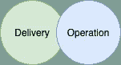
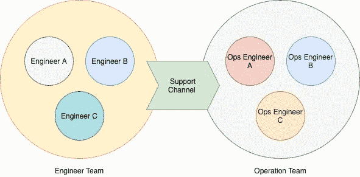

# 在构建和运行之间找到完美的平衡。

> 原文：<https://blog.devgenius.io/find-the-perfect-balance-between-build-and-run-55ab7fcd219d?source=collection_archive---------1----------------------->

适用于所有规模的公司

***免责声明:*** *我在媒体上写的文章仅相对于我个人的学习和观点。不代表或相对于我以前或现在的任何职位和公司。*

本周，在几个周末的编码之后，我们将关注一些 IT 领导和管理主题；正如我之前提到的，我们需要平衡我们的文章类别范围。

[疾控中心](https://unsplash.com/@cdc?utm_source=medium&utm_medium=referral)在 [Unsplash](https://unsplash.com?utm_source=medium&utm_medium=referral) 上拍照

在领导岗位上呆了几年后，这给了我一个不同的视角，除了只关注纯技术和编程。

 [## 优化学习时间的五个技巧。

### 周末写写学学。

medium.com。](https://medium.com/dev-genius/five-tips-for-optimizing-learning-time-11519c3d3a82)  [## 从工程师到领导者，你应该知道的五件事

### 最近写了很多技术导向的文章。如果你感兴趣，请点击下面的链接。

jayhuang75.medium.com](https://jayhuang75.medium.com/five-things-you-should-know-from-engineer-to-leadership-31a05938f0df)  [## 公司转向大数据，从哪里开始？

### 大数据，这样一个市场上的热门关键词，最近在 digitaljourna.com 有一篇关于大数据的新闻稿…

jayhuang75.medium.com。](https://jayhuang75.medium.com/company-switch-to-big-data-where-to-start-3f799906012d) 

今天我想谈谈如何为你的公司或团队在构建和运行之间找到完美的平衡。

B UILD，意思是新的用例，新的商业机会，首先在市场或战场上赢得或领导商业市场的位置。

R UN，意思是保持正常运行(K.L.O .)，确保您的应用运行时安全，满足业务定义的服务水平协议(S.L.A .)，支持您的业务线或利益相关方，主要是操作化。

这两个是完全不同的游戏；然而，它们之间的关系也非常糟糕，直接影响着彼此，对您的业务或团队同样重要。

> 谁建造它，谁修理它。

这是形容两人关系最通俗的说法；不过，这侧重于技术角度。在现实世界中，你会发现这是行不通的。**为什么？**

> **业务背景、优先级和现实不同。**

大多数中型或大型公司。最流行的交付和运营模式是:

通过让交付团队(也称为项目团队)向市场或涉众交付特性，然后将它转移到运营团队来运行；然而，主要的挑战是:

1.  知识转移的过程滞后，特别是当项目规划阶段，由于时间表或运营团队总是在行动，有时不能将运营团队放在首位。
2.  项目团队对运营现实和复杂性的认识滞后。

当生产事故发生时，运营团队有时除了查看日志之外，还会丢失文档，丢失应用程序上下文，这会导致违反 SLA，并影响业务。

作者截图

初创企业似乎更容易、更好地处理这个问题；它有一个非常精简的结构设置，很容易找到公司需要的任何工程师，并有一个快速的参与过程。然而，这种影响主要是针对可交付的特性。成像工程师正专注于可交付成果，突然切换到操作调试，或多或少会影响当前的可交付成果。

# 平衡在哪里？

那么，我们如何克服上述挑战呢？尤其是付出了什么代价。有时，说“让我们增加人员或增加资源占用量以增加更多容量”会简单得多；增加更多的监控、警报等功能如何？当然可以。但我们仍然需要工程师，这将回到先有鸡还是先有蛋的局面。

> 关键是根据当前的人员配备和团队设置优化我们的参与流程。

这是什么意思呢？让我们把它带到视觉层面。

作者截图

正如您在本视频中所看到的，关键是从工程团队到运营团队的桥梁，这为 cadence 的运营团队分配了一名轮岗工程师，其优势如下:

1.  最小化对交付团队的影响，交付团队已经考虑到了这一点，这在他们早期的计划阶段有更现实的期望。
2.  最大化交付团队和运营团队之间的能力和知识共享(KT)。
3.  cadence 分配的工程师甚至可以在分配的时间范围内对一些操作增强 JIRA 票证进行结对编程。
4.  交付工程师在操作方面获得了更多的第一手经验，这触发了构建更好的、可支持的和可维护的产品或增强功能的思考和动机。
5.  加强整个组织的整体工程和运营文化。

就是这样，在不影响效率和成本的情况下，对结构和参与模式做了一点小小的改动。

正如我以前在一些文章中提到的，无论你是一家大公司还是一家中小型公司，要实现你的下一个目标状态，这不是关于新的技术或市场上最好的工程师。

基于你目前的情况，这一切都是关于背景，建立/确立清晰，优化流程，并保持前进。

这星期就这些了。下周末，我将回到一些编码和学习。

如果你想了解更多我以前的文章，请点击下面的链接。

 [## 魏黄-中号

### 有很多教程是关于为不同的市场建立一个交易机器人的，比如加密货币，股票交易所…

jayhuang75.medium.com。](https://jayhuang75.medium.com/)