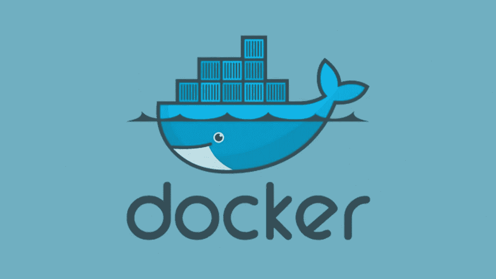

# 编写 X86–64 汇编语言程序

> 原文：<https://blog.devgenius.io/finding-an-efficient-development-cycle-for-writing-assembly-language-be2092e6db6a?source=collection_archive---------4----------------------->



使用 Docker 简化汇编开发

## 第二部分:寻找编写汇编语言的有效开发周期

## 本指南是系列的第二部分

*   第一部分:[开始编写汇编语言](https://medium.com/@tony.oreglia/getting-started-writing-assembly-language-8ecc116f3627)

## 本指南后面是

*   第三部分:[打印命令行参数](https://medium.com/@tony.oreglia/writing-an-x86-64-assembly-language-program-648b6005e8e)
*   第四部分:[发送函数参数并接收返回值](https://medium.com/@tony.oreglia/writing-an-x86-64-assembly-language-program-function-arguments-and-result-dfff25970dee)
*   第五部分:[条件句，跳转，循环](https://tony-oreglia.medium.com/writing-an-x86-64-assembly-language-program-1aade03f3b9b)
*   第六部分:[如何确定字符串长度](https://tony-oreglia.medium.com/writing-an-x86-64-assembly-language-program-84e2432cf16b)
*   第七部分:[快速参考](https://tony-oreglia.medium.com/writing-an-x86-64-assembly-language-program-f847d4edf577)

现在，GDB 与 Docker 合作得很好，下一步是找到一个开发周期，使您能够快速运行代码，并在需要时进行调试。

我更喜欢在 [VS 代码](https://code.visualstudio.com/)中开发，而不是用`vim`直接在 Docker 容器上开发。问题是如何在 VS 代码上开发，然后在现在设置好的 docker 容器上快速编译、链接、运行、调试代码？


用 VS 代码开发汇编语言

答案来自这篇有帮助的[博客文章](https://medium.com/travis-on-docker/why-and-how-to-use-docker-for-development-a156c1de3b24)。这篇博文提供了一个有用的起点，介绍了如何利用映像来构建可执行文件，然后运行另一个容器来运行该可执行文件。虽然它没有涵盖汇编语言，但它正是我们需要使用的那种工作流。

这篇博文建议使用这样的命令来处理构建或编译步骤。

```
docker run --rm -v "$(pwd)":/app -w /app iron/node:dev sh -c 'npm install'
```

但是这篇文章并没有描述这些选项的作用，所以让我们为那些不熟悉 Docker 的用户分解一下。注意，这只是一个示例命令，演示如何使用 Docker 来运行构建步骤。

# Docker 命令行参数的分解

## 打扫

```
--rm
```

这只是一个构建步骤。一旦容器用于准备可执行文件，它就不需要启动和运行。这个标志告诉码头工人一旦完成就拆掉集装箱。参见 Docker 的文档[这里](https://docs.docker.com/engine/reference/run/#clean-up---rm)。

## 卷(共享文件系统)

```
-v “$(pwd)”:/app
```

构建步骤中的工件应该被保存。该选项创建一个 Docker 卷，该卷在 Docker 容器被拆除后保留在本地目录中。看 Docker 的文档[这里](https://docs.docker.com/engine/reference/run/#volume-shared-filesystems)。

## 工作方向

```
-w /app
```

覆盖在基本映像中定义的工作目录。见 Docker 的文档[这里](https://docs.docker.com/engine/reference/run/#workdir)。

## 基本 Docker 图像

```
iron/node:dev 
```

用于生成的基本 Docker 图像。在这里找到铁/节点图像[。这个映像是由](https://hub.docker.com/r/iron/node) [iron.io](https://www.iron.io/) 创建的，本质上是一个安装了 node 的小映像。

## 在 Docker 中运行的命令

```
sh -c ‘npm install’ 
```

覆盖来自 Docker 映像的命令。这是我们想要运行的构建步骤。

# 在 Docker 上编译、链接和调试

现在我们理解了这些部分，让我们把它应用到我们的汇编语言程序中。在从包含 [Dockerfile](https://github.com/tonyOreglia/unique-word-counter/blob/master/Dockerfile) 的目录中运行以下命令构建名为`linux-assembly`的映像后:

```
docker build -t linux-assembly .
```

汇编代码可以用下面的命令进行编译和链接，使用上面列出的相同参数。

```
docker run --rm -v "$(pwd)":/app -w /app linux-assembly sh -c "nasm -f elf64 -F dwarf -g hellow.asm && ld -m elf_x86_64 -o hw hellow.o"
```

这将在本地目录中生成一个可执行文件(`hw`)。注意，这个可执行文件是 elf64 格式的，不能在 Mac 操作系统上运行。但是，可以使用以下命令在同一个 Docker 映像上运行它:

```
docker run --rm -v "$(pwd)":/app -w /app linux-assembly sh -c "./hw"
```

最后，可以使用以下命令直接在 Docker 容器上进行调试:

```
docker run --rm -it --cap-add=SYS_PTRACE -v "$(pwd)":/app -w /app linux-assembly sh -c "gdb hw"
```


现在，您可以使用 VSCode 进行本地开发，并在 Docker 容器上快速运行程序，或者在需要时使用 Docker 上的 GDB 进行调试。

感谢阅读！点击这里查看下一篇帖子，获取设置此工作流程的指导。