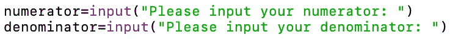
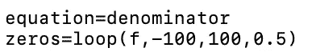

# 用 Python 寻找垂直渐近线

> 原文：<https://blog.devgenius.io/finding-vertical-asymptotes-with-python-aec002f73da?source=collection_archive---------4----------------------->


只是提醒一下，这个教程很大程度上依赖于我之前写的关于寻找函数根的教程，可以在这里找到。(强烈建议您在此之前阅读)

垂直渐近线是一个函数永远不会触及但会永远逼近但永远不会触及的垂直线。如果你想阅读垂直渐近线的简要描述，我写了一篇关于它的博文，可以在这里找到。

首先，我们将接受用户输入，在这个特定的教程中，我们将只使用有理函数，所以我们将把分子和分母作为单独的输入。



现在我们要修改我们在上一节课中一起写的关于寻找函数根的程序，这个函数根可以在[这里](https://medium.com/swlh/finding-a-functions-roots-with-python-590eca0d22a5)找到。我们将用 return 语句替换*循环*函数中的两个 print 语句，如下所示:


我们还将复制粘贴上一教程中编写的其余代码。

现在，我们将通过调用我们在上一教程中编写的函数来找到我们的函数分母的零点。



*zeros* 是所有 x 值的数组，它将使我们的分母等于零。现在我们将创建一个名为*渐近线*的新数组来保存我们尚未计算的解，然后遍历所有的零。


在 for 循环中，我们将使用坐标根来计算分子的 y 坐标。


请注意我们在这里如何使用 *eval* ，这是一个内置函数，它将用户输入的字符串作为代码运行，使用我们在上面的行中为它设置的 x 值来有效地评估它。

如果*数字*不接近零，那么我们知道它是一条垂直渐近线，并将它附加到我们的*渐近线*列表中。(如果它非常接近零，那么我们可能会在函数中发现一个空洞，这将导致代数运算)


剩下要做的就是打印我们的解决方案，最终代码应该如下所示:


我们现在可以测试一下:


由于 sin(x)/cos(x)=tan(x)，我们有效地找到了有限域上 tan(x)的所有垂直渐近线。


请注意(x-3)是如何从我们的等式中被分解/抵消的，从而产生一个洞，导致我们只有一条垂直渐近线。

完整的代码，包括我以前写的关于寻找函数根的代码，可以在这里找到附在下面:

```
import math
def derivative(f, x):
    h=1e-8
    return (f(x+h)-f(x))/hdef solver(f, x0, epsilon, max_iter):
    xn=x0
    for n in range(0,max_iter):
        y=f(xn)
        if abs(y)<epsilon:
            return xn
        slope=derivative(f,xn)
        if(slope==0):
            return None
        xn=xn-y/slope
    return Nonedef loop(f, L_bound, R_bound, increment):
    solutions=[]
    while L_bound<=R_bound:
        solution=solver(f, L_bound, 1e-10, 1000)
        if solution is not None:
            solution=round(solution,4)
            if solution not in solutions:
                solutions.append(solution)
        L_bound+=increment
    return sorted(solutions)equation=""
def f(x):
    try:
        y=eval(equation)
    except ZeroDivisionError:
        y= 1e-10
    return ynumerator=input("Please input your numerator: ")
denominator=input("Please input your denominator: ")
equation=denominator
zeros=loop(f,-100,100,0.5)
asymptotes=[]
for root in zeros:
    x=root
    numeratorY=eval(numerator)
    if not (abs(numeratorY) < 1e-10):
        asymptotes.append(x)
print(asymptotes)
```

非常感谢您的阅读，如果您有任何问题/反馈，我会 100%回复您的留言！