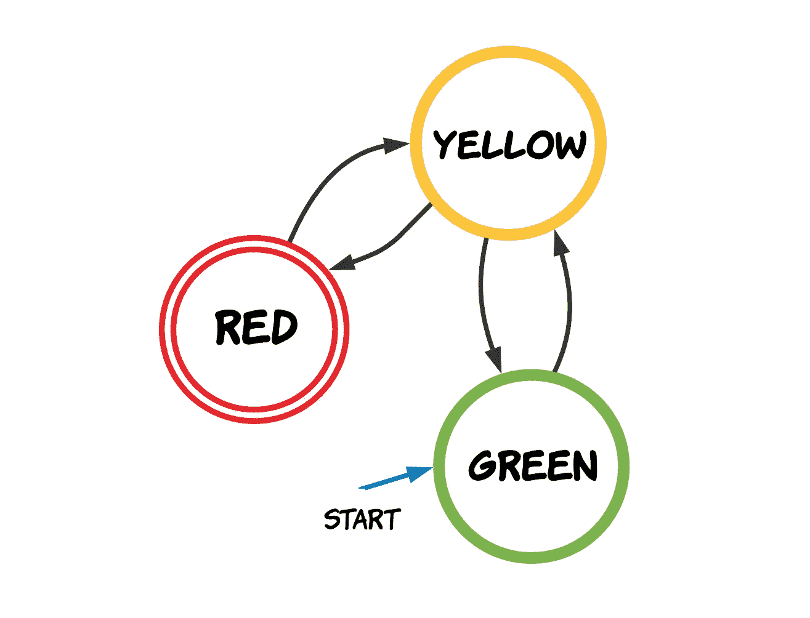
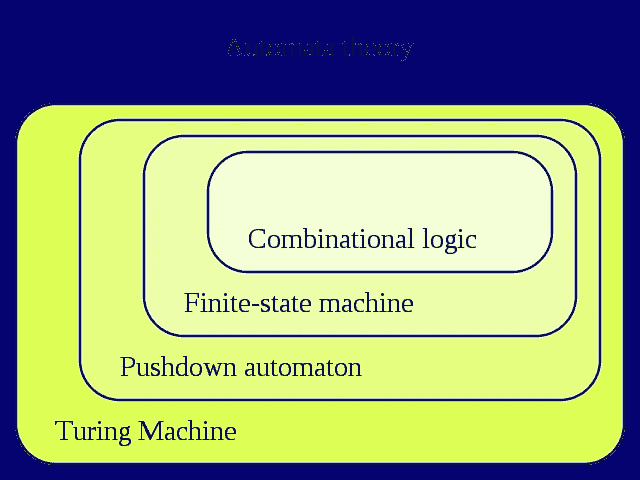
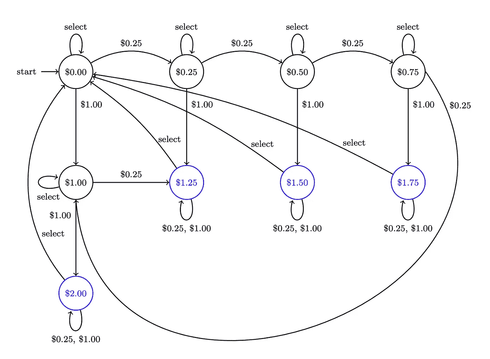
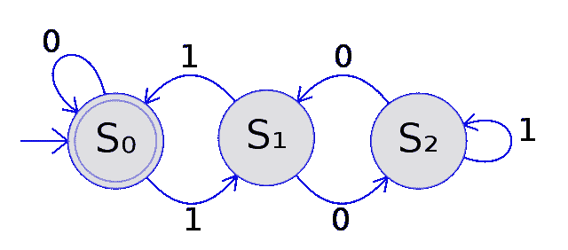
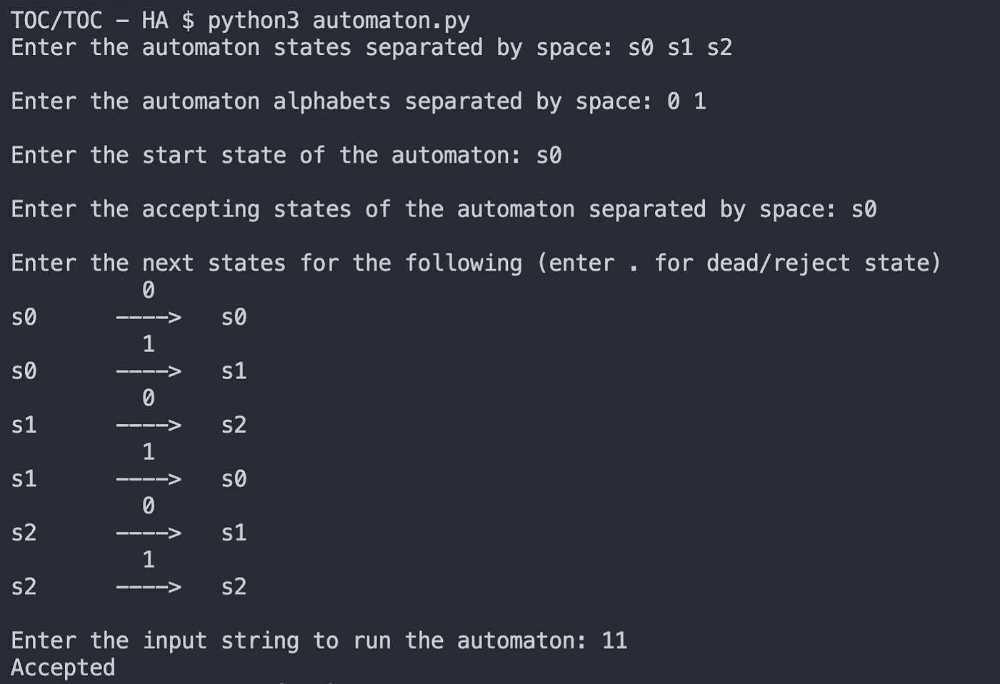
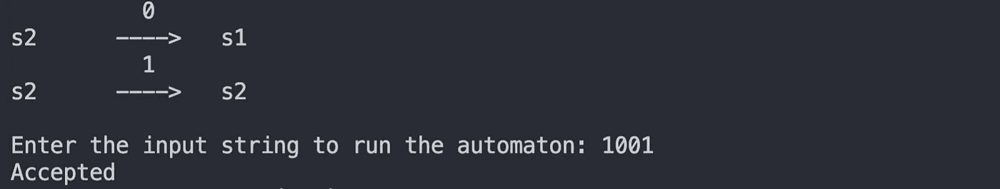

# 有限自动机:用 Python 模拟一个 DFA🐍

> 原文：<https://blog.devgenius.io/finite-automata-implement-a-dfa-in-python-64dc3d7005d9?source=collection_archive---------3----------------------->

## 有限自动机及其类型、模拟和应用。

在我们的日常生活中，我们会遇到各种基于状态的系统。这些系统根据给它们的一系列输入产生一个输出。



交通灯的一个可能的状态图

一些实例包括交通灯、电梯、自动售货机。这样，系统在逻辑上可以表示为 ***有限自动机*** 。

# **目录**

> -什么是有限自动机？
> 
> -有限自动机的类型。
> 
> - DFA 实现。
> 
> -有限自动机的应用。

# 什么是有限自动机？

有限自动机(也叫有限状态自动机)是一种抽象机器，由有限个状态组成。他们一次只能处于其中一种状态。当给定输入时，状态发生变化。并且，根据当前状态和输入，机器转换到新状态。

有限自动机是**形式上定义**为 5 元组( *Q* ，σ， *δ* ， *q* 0， *F* )，其中，

*   *Q* 是**状态**的有限集
*   σ是输入符号的有限集合(称为**字母**
*   *δ* 是一个**过渡**函数
*   *q0* 是**开始状态**
*   *F* 是**接受状态**的有限集



自动机的类型(来源:[维基百科](https://en.wikipedia.org/wiki/Finite-state_machine))

## 有限自动机的类型

1.  确定性有限自动机
2.  非确定性有限自动机(NDFA 或 NFA)

## 作为 DFA 的自动售货机



自动售货机 DFA ( [来源](https://www.cs.ucdavis.edu/~rogaway/classes/120/spring13/eric-dfa.pdf))

自动售货机的功能可以表示为 DFA。这里，状态指的是进入自动售货机的钱数，即**。**

*增加更多的钱更新状态。一旦有足够的余额，就可以购买物品。这也伴随着一种状态变化，即从余额中减去项目的价格。*

# *DFA 实现*

*我们将创建一个简单的 DFA 实现，这样我们就可以构造 DFA 并根据输入字符串测试它们。*

## *声明和定义变量*

*由于 DFA 是使用五元组( *Q* ，σ， *δ* ， *q* 0， *F* )定义的，我们需要将它们作为变量存储在我们的程序中。*

*状态( *Q)* 、字母(*σ)*和接受状态( *F)* 的集合被存储为字符串列表。*

*转换函数( *δ* )是一个映射的字典*

```
*(current_state, current_input) ➔ **next_state**e.g.
    (q0, 0) ➔ q1
    (q1, 1) ➔ q2*
```

*获取前四个变量的输入很简单，需要进行一些字符串拆分。但是对于转移函数，我们需要生成*Q*×σ的所有可能组合。然后，获取每个人的输入。*

*为此，我们保留了两个嵌套的`for`循环，一个用于状态 *Q* ，另一个用于字母σ。如果用户输入“.”*(句点)*作为输入，过渡将被存储为`None`。这表明 DFA 已经达到失效或被拒绝的状态。*

## *完成和运行 DFA*

*我们的 DFA 现在几乎完成了！剩下的最后一部分是获取输入字符串。*

*为了运行 DFA，我们将`**current state**`初始化为*开始状态*。然后，我们根据输入字符更新`**current state**`,直到*

*   *输入字符串终止，DFA 结束接受状态(DFA **接受**字符串)*
*   *DFA 达到死状态或结束于不接受状态(DFA **拒绝**字符串)*

## *输出*

*我们将使用我们的程序测试以下 DFA*

**

*接受 3 的倍数的二进制数的 DFA(来源:[维基百科](https://en.wikipedia.org/wiki/Deterministic_finite_automaton)*

**

*DFA 接受的字符串“11”*

**

*DFA 接受的字符串“1001”*

# *应用程序*

## *正则表达式*

*被有限自动机接受的语言称为**正则语言**。正则表达式是用来描述正则语言的模式。*

*正则表达式定义了正则语言的结构。因此，它可以用来识别/验证给定的字符串是否遵循正式语言的规则。正则表达式**转换成有限自动机**进行验证和识别。*

> ***邮件的正则表达式** : *^[a-zA-Z0-9+_.-]+@[a-zA-Z0-9。-]+$**

*今天，几乎每种编程语言都提供了对正则表达式的本地支持。此外，许多**验证系统**使用正则表达式。*

## *编译器的词法分析*

*编译过程的第一阶段是词法分析。这里，源程序被标记化了。源程序可以有不同类型的标记，如标识符、运算符等。*

```
*def square(n):              -> *keywords: def, return*
    return n*n              -> *identifiers: n*
                            -> *operators: **
                            -> *separators: :**
```

*设计了每种标记类型的正则表达式。然后将它们合并在一起，创建一个语言解析器。解析器然后被用来构建 DFA。生成的 DFA 被称为**词法分析器**。在词法分析中使用 DFAs 使得它变得简单而有效。*

# *结论*

*有限自动机是灵活的系统，允许我们解析各种不同的语言。但是，由于 ***缺乏无限记忆*** ，他们无法识别像[戴克语](https://en.wikipedia.org/wiki/Dyck_language)这样的语言。所以，像**下推自动机**、线性有界自动机、**图灵** **机器**这样更强大的自动机是必要的。*

*但是，有限自动机仍然有自己的优势。它们具有较低的处理开销，并且操作简单。因为这些原因，它们是 ***仍然被广泛使用的*** 。今天，它们的应用范围从网络协议、人工智能到视频游戏。*

## *参考*

1.  *[https://www . cs . UC Davis . edu/~ rogaway/classes/120/spring 13/Eric-DFA . pdf](https://www.cs.ucdavis.edu/~rogaway/classes/120/spring13/eric-dfa.pdf)*
2.  *[https://www . cl . cam . AC . uk/teaching/1011/RLFA/lecture notes . pdf](https://www.cl.cam.ac.uk/teaching/1011/RLFA/LectureNotes.pdf)*
3.  *https://www . tutorialspoint . com/checking-for-valid-email-address-using-regular-expressions-in-Java*