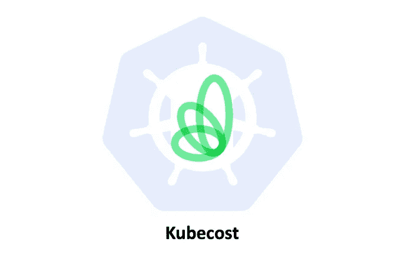
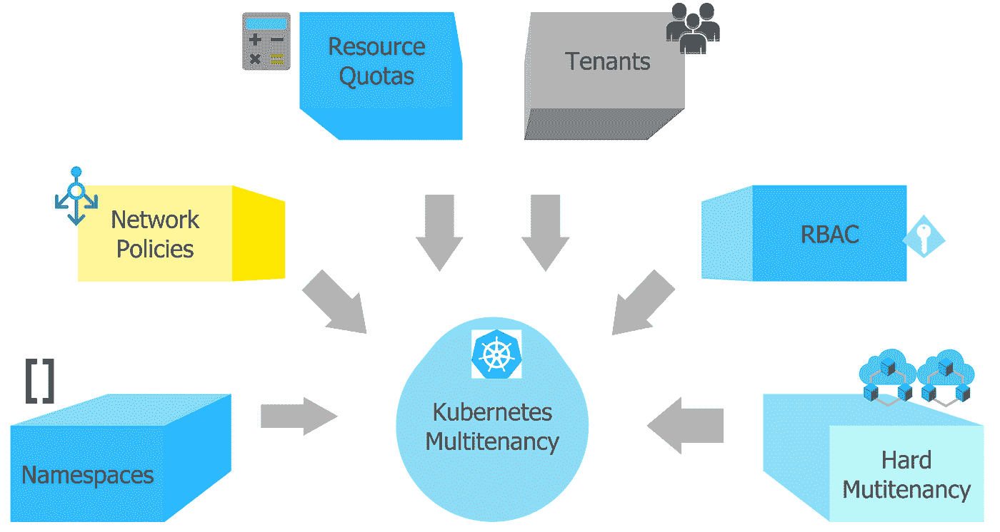
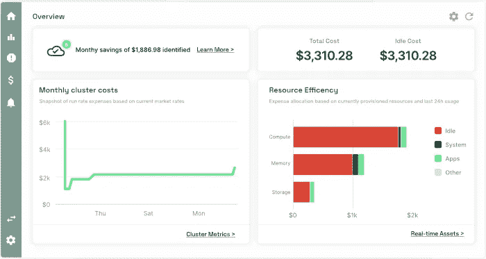
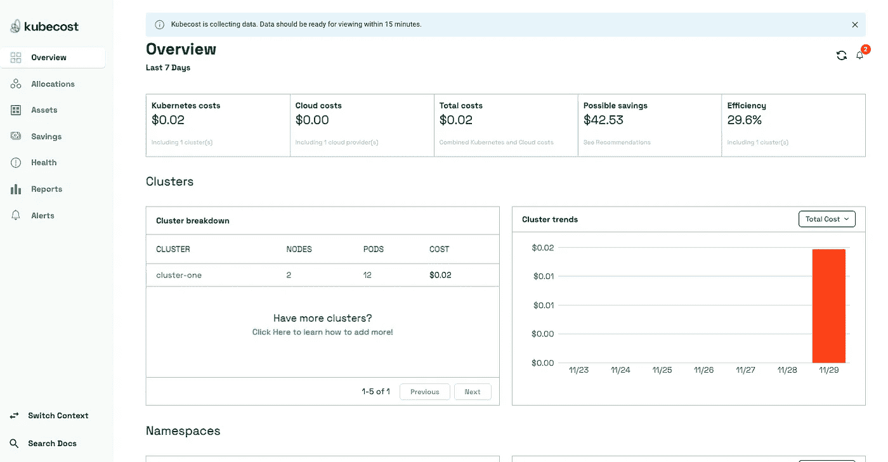
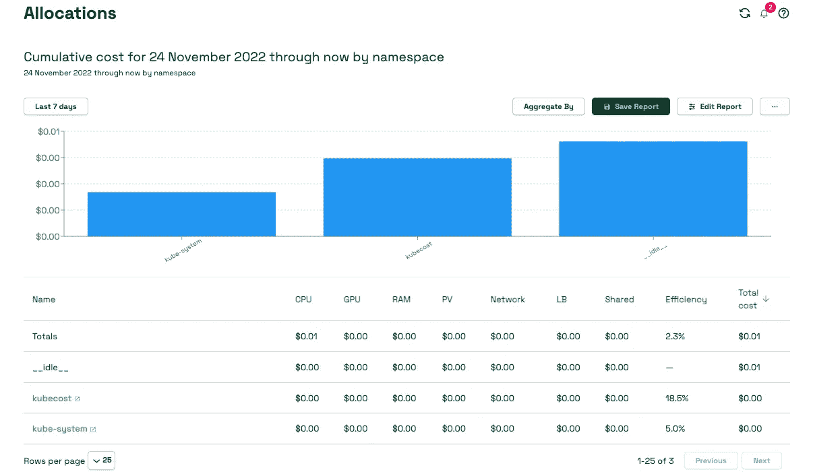
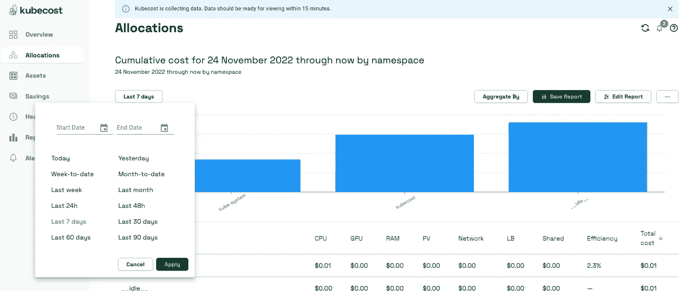
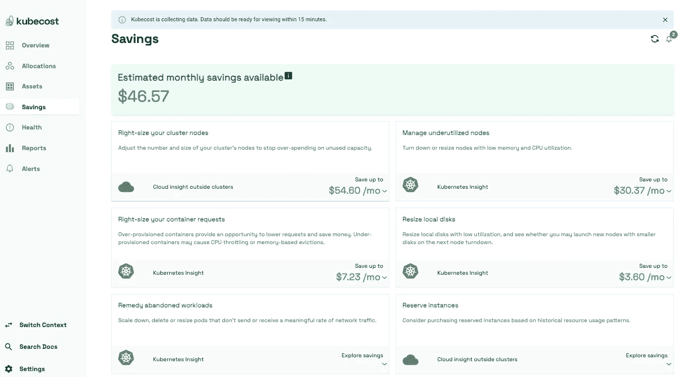
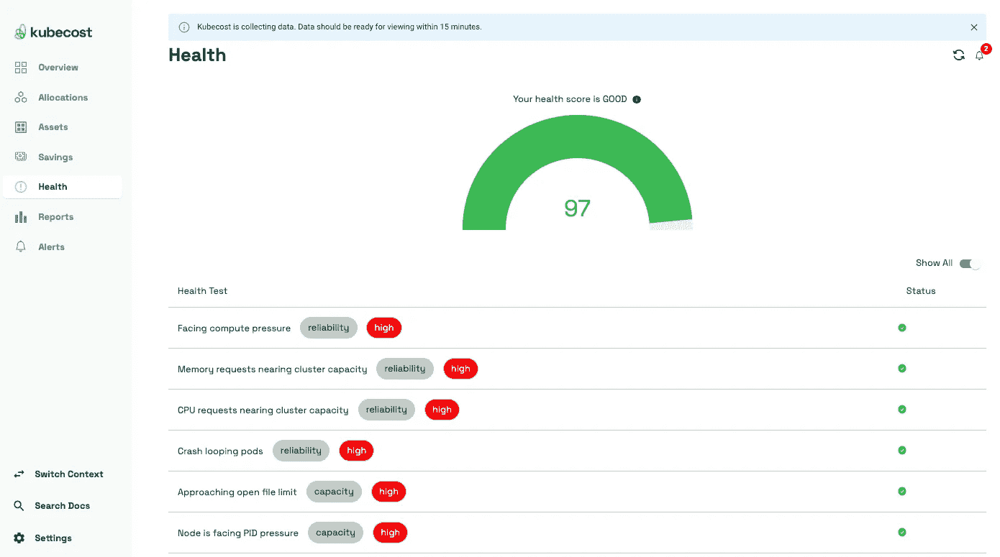

# FinOps —使用 Kubecost 量化 K8S 使用成本

> 原文：<https://blog.devgenius.io/finops-use-kubecost-to-quantify-k8s-usage-cost-919699d12c4d?source=collection_archive---------5----------------------->

## 监控和管理 K8s 集群成本



在云时代，我们已经看到 K8s 被广泛用作容器编排平台。随之而来的是操作 K8s 集群的不同方式。

一些企业更喜欢有一个租户的集群(硬多租户)，而另一些企业更喜欢有多个租户的集群(软多租户)模型。

许多企业采用了多租户模式，因为它节省了大量运营工作。对于软多租户模型，明智地提供对成本分配租户的可见性非常重要，以便组织可以相应地收费。



图片来自 vamsitalkstech.com

# Kubecost

[Kubecost](https://www.kubecost.com/) 帮助您监控和管理 K8s 环境中的成本和容量。它为使用 Kubernetes 的团队提供实时成本可见性和洞察力，帮助您不断降低云成本。

Kubecost 既有开源产品，也有商业产品。这个商业产品有少量附加功能，如用户身份验证、报告保存、企业支持和更长的指标保留期。



# Kubecost 功能

Kubecost 标准版为使用 K8s 的团队提供实时成本可见性和洞察力，帮助您持续降低云成本。

*   **成本分配:**灵活、可定制的成本细分和资源分配，可实现准确的反馈、退款和持续监控
*   **统一成本监控:**通过全面的云服务计费集成，在一个地方查看您所有的 k8 和集群外支出
*   **优化洞察:**根据您自己的环境和行为模式获得定制建议
*   **警报&治理:**通过可定制的警报、可配置的可用性层和实时更新，实现最高的应用性能并提高可靠性
*   **专门为运行 K8s 的团队构建:**在 Kubernetes 上运行容器需要一种可视化和优化花费的新方法。Kubecost 完全是为 Kubernetes 和云原生生态系统而设计的
*   **拥有&控制您自己的所有数据:** Kubecost 完全部署在您的基础设施中，我们不要求您将任何数据输出到远程服务。对我们来说，用户能够保留和控制对自己私人信息的访问非常重要，例如敏感的云支出数据。

# 支持的云提供商

## 自动警报系统

*   支持所有地区，如[open cost/pkg/cloud/AWS provider . go](https://github.com/opencost/opencost/blob/0c2f063052723a65ca62a4c75be23392806b6fac/pkg/cloud/awsprovider.go#L111)所示
*   x86，ARM

## GCP

*   支持所有地区，如[open cost/pkg/cloud/GCP provider . go](https://github.com/opencost/opencost/blob/0c2f063052723a65ca62a4c75be23392806b6fac/pkg/cloud/gcpprovider.go#L41)所示
*   x86

## 蔚蓝的

*   支持所有地区，如[open cost/pkg/cloud/azure provider . go](https://github.com/opencost/opencost/blob/0c2f063052723a65ca62a4c75be23392806b6fac/pkg/cloud/azureprovider.go#L82)所示
*   x86

# Kubecost 装置

## 先决条件

*   K8s v1.22 及以上版本(官方支持 1.22 版本)
*   Helm3

您可以使用 HELM3 安装`kubecost`:

```
$ helm repo add kubecost https://kubecost.github.io/cost-analyzer/
$ helm upgrade --install kubecost kubecost/cost-analyzer --namespace kubecost --create-namespace
```

注意，如果您使用的是`k8sv1.22+`，您可能需要从清单文件中安装它:

```
$ kubectl create namespace kubecost
$ curl -O https://raw.githubusercontent.com/kubecost/cost-analyzer-helm-chart/master/kubecost.yaml
# Update the YAML file accordingly, then
$ kubectl apply -f kubecost.yaml --namespace kubecost --address 0.0.0.0
```

确保所有 pod 都在`kubecost`名称空间中运行:

```
$ kubectl get pods -n kubecost
NAME                                           READY   STATUS    RESTARTS   AGE
kubecost-cost-analyzer-6598596b75-blq98        2/2     Running   0          39m
kubecost-grafana-6f95f79d95-b7jhc              2/2     Running   0          39m
kubecost-kube-state-metrics-75df9fd84f-5q5dn   1/1     Running   0          39m
kubecost-prometheus-node-exporter-bm5t7        1/1     Running   0          21m
kubecost-prometheus-node-exporter-sbxv5        1/1     Running   0          39m
kubecost-prometheus-server-7f745bf6f4-cwzvw    2/2     Running   0          39m

$ kubectl port-forward -n kubecost svc/kubecost-cost-analyzer 9090:9090
```

你现在可以打开你的浏览器，指向`http://<ip_address>:9090`来打开`Kubecost`界面。在`Kubecost`界面，选择一个集群查看成本分配信息。



您还可以选择左侧的“分配”来深入查看资源的名称空间开销。分配显示了 CPU、内存、持久卷和网络的成本。`Kubecost`从 Azure pricing 获取数据，但您也可以为资源设置自定义成本。



您可以使用“日期范围”按日期过滤显示数据:



选择左侧的“节约”，深入了解未充分利用的资源的成本节约情况。Savings 提供关于未充分利用的节点、单元和放弃的资源的信息，并识别群集中过度调配的资源请求。下面的屏幕截图显示了一个示例节省概述:



选择左侧的“Health”查看集群运行状况:



# 结论

Kubecost 中还有许多其他功能尚未使用，我认为一篇文章无法涵盖所有功能。一些值得研究的特性，比如 Slack 上的通知和电子邮件。

您可以为名称空间设置成本阈值，并在任何名称空间超出预算时得到提醒。如果您使用 Spot 实例，您可以集成 Spot 配置文件以获得正确的定价详细信息。有关 Kubecost 的更多详细信息，请访问[https://www.kubecost.com/](https://www.kubecost.com/)