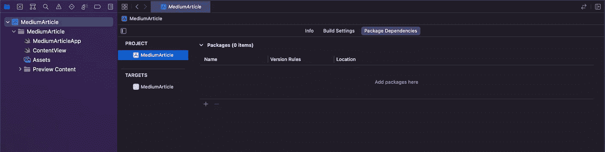
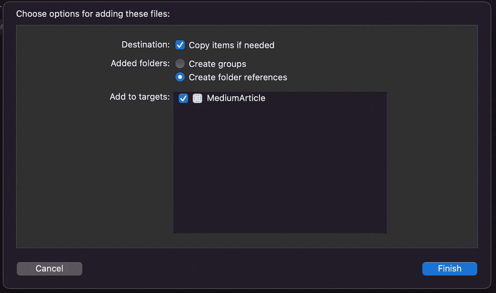

# Swift 的 Firebase 认证

> 原文：<https://blog.devgenius.io/firebase-authentication-swift-part-1-6504cb029737?source=collection_archive---------8----------------------->

## 谁知道呢！

*这将是一个关于将 Firebase 身份认证集成到 Swift 项目中的多部分系列。第 1 部分可能是最长的，因为集成非常重要。下面几节会短很多，甜很多！*

## 什么是 Firebase？

这取决于你问的是谁…对于一些人来说，这是一个很棒的平台，可以轻松集成身份验证、实时数据库，甚至是云数据库风格的存储。其他人则支持《T2》中茶水男孩 T3 的妈妈布沙尔，认为这是魔鬼。

茶水男孩电影中鲍比·鲍彻的母亲。

> *Firebase 是谷歌的移动应用开发平台，帮助你构建、改进和发展你的应用。—根据谷歌*

作为一名有一年多经验的独立开发者，深入参与了一个非常大的项目，Firebase 是一个非常棒的、易于使用的平台，让我可以使用他们的认证和 Firestore 产品。话虽如此，我也经历过不少障碍、打嗝和新手失误。本系列旨在为他人和我自己记录其中的一些。

为了更深入地了解 Firebase 及其用例，我强烈推荐您访问 [Firebase](https://firebase.google.com/) 网站。当你四处搜寻时，你应该会找到一些有用的信息。

## Firebase 身份验证入门

注册并登录后，您将进入控制台并添加一个项目。入门相当简单，您将按照说明继续操作，直到您到达项目控制台——我不会用那些东西烦死您，因为我相信您足够聪明，能够理解这些部分。

一旦你完成了，我们将跳转到 Xcode 并开始在你的项目中实现 Firebase 认证。

## 导入和初始 Xcode 项目设置

打开 Xcode 并创建项目后，就可以将 Firebase 和它的朋友导入到项目中了。这是一件好事也是一件坏事……这相当容易，但是随着构建时间变得越来越长，Xcode 将开始发飙，乐趣也将开始，你将很快成为一名真正的开发人员。

Xcode 软件包相关性窗口

正如您将在上面看到的，我们需要导航到我们的项目包依赖关系窗口，并单击+添加一个包。从这里开始，我们将专注于使用 Swift Package Manager (SPM)将 Firebase 添加到我们的项目中。

要做到这一点，请访问 [Firebase Github](https://github.com/firebase/firebase-ios-sdk#swift-package-manager) 从谷歌获取信息，但是如果你遇到问题，请随时在 [Twitter](https://twitter.com/halluxdev) 上联系我，我会帮你的。

你会看到一个长长的复选框列表来选择你想要添加的内容，对于我们的项目，你将添加 ***FirebaseAuth、FirebaseFirestore 和 FirebaseFirestore-Swift*** 。一旦你将 Firebase 添加到你的项目中，去喝杯咖啡，喝点水…它将被导入并构建。这需要时间…不幸的是，建筑通常比我们喜欢的花费更多的时间。一旦星星排成一行，我们就准备在 Firebase 控制台上启动身份验证，我们在那里见。

## Firebase 控制台—身份验证和 Firestore 初始设置

在您的控制台上，您会看到左侧的***Firebase authentic ation***选择它，然后单击 ***Get Started*** ，完成后选择***Email/Password***并启用它，因为这是我们将重点介绍的方法。

我们还将添加***Firebase Firestore***，这将允许我们保存更多信息，如姓名、地址或除电子邮件和密码之外的任何其他信息。一旦你选择了 Firebase Firestore，按照提示，你已经得到了这个。

项目概述的齿轮图标

我们快到了！在左侧，点击上面看到的小齿轮图标，然后导航到您的 ***项目设置*** ，向下滚动并添加您的 iOS 应用程序。按照提示，下载他们提供给你的 ***plist*** 文件，然后我们会将其添加到我们的项目中。

> **重要事项—如果需要，请务必检查副本项目。**

将 Google-Info.plist 添加到我们的项目。

我们想要检查*复制项目(如果需要的话)*的原因是因为当我们点击并拖动 Google-Info.plist 添加到我们的项目时，Xcode 会创建一个对该文件的引用。如果该文件被删除，并且没有创建副本——Xcode 将会比一个蹒跚学步的孩子在可怕的两岁时没有得到他们想要的东西更糟糕。

如果你是家长…我们一直在这里。

让我们初始化，我们……导航到我们的应用程序主应用程序文件，这通常是我们的应用程序的名称—在我的例子中，它被称为***MediumArticleApp***。一旦到了那里，我们将为 Firebase 添加一个初始化器，这样每次我们的项目启动时，Firebase 都会启动并准备好工作。

## 包扎

就像我们在 Firebase 上创建了一个项目一样，我们使用 Swift Package Manager (SPM)将它集成到我们的 Xcode 项目中，并且在我们的项目中初始化了 Firebase。在第 2 部分中，我们将研究如何编写我们的认证服务，这样我们就可以开始注册用户了。