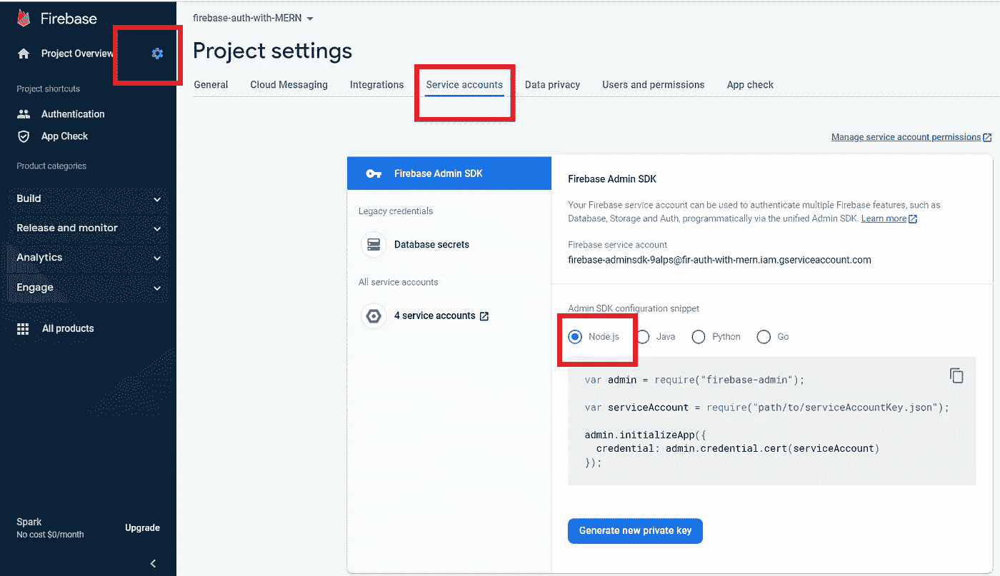

# 使用自定义 Node.js+Express 后端进行 Firebase 身份验证

> 原文：<https://blog.devgenius.io/firebase-authentication-with-custom-node-js-express-backend-2ae9c04571b5?source=collection_archive---------0----------------------->


使用自定义 Node.js+Express 后端进行 Firebase 身份验证

在本文中，我将解释如何将 **Firebase 认证**集成到 **React** 、 **Node.js** 和 **Express** 应用程序中。我们在使用 firebase 认证的时候，一般会使用云 Firestore 作为数据库，不需要后端。另一方面，您应该对 firebase 安全规则有一个正确的认识，以保护您的数据。但是在本文中，我使用 node express 后端。因此，如果您试图将 firebase 身份验证与自定义后端集成，我敢肯定这篇文章会对您有很大帮助。你可以在这里使用[的全部源代码。](https://github.com/Wanuja97/firebase-authentication-with-react-node-express-article)

主要我们可以把我们的过程分成三个步骤，

**步骤 01:**react 应用程序中的 Firebase 验证。身份验证后，firebase 将向您发送一个用户对象，扣留 JWT 令牌。

步骤 02: 然后我们可以使用 JWT 令牌向我们后端发送 API 请求。

**步骤 03:** 然后后端可以使用 JWT 令牌从 firebase 验证用户，如果用户通过验证，我们可以向前端发送数据，否则我们可以忽略从前端接收的请求。

所以，让我们深入内容。

01)创建 ReactJS 应用程序。

02)在 Firebase 控制台中创建一个 firebase 项目并激活身份验证。

03)在 react app 中添加并初始化认证 SDK。

04)前端的 Google 认证。

05)创建后端(节点+快速)应用程序。

06)从前端检索数据。

07)后端的 Firebase Admin SDK 配置。

08)创建中间件来验证访问令牌。

# 01)创建 ReactJS 应用程序

众所周知，我从"**npx create-react-app your _ app _ name "**命令开始。然后通过运行“ **npm run start** ”命令，您可以看到我们的 react 应用程序正在 localhost:3000 上运行。

# 02)在 Firebase 控制台中创建一个 Firebase 项目并激活身份验证

1.  现在去[https://firebase.google.com/](https://firebase.google.com/)和去火基地**控制台**。如果您没有 firebase 帐户，请确保在进入下一步之前创建一个帐户。


开始使用 firebase

2.现在创建一个新项目，并给它起一个你想要的名字。


在 firebase 中创建新项目


通过给定项目名称来创建新项目

3.接下来，他们会要求在你的 firebase 项目中启用 google analytics，在这里你可以**选择你想要的选项**。之后，创建项目。


在 firebase 项目中启用谷歌分析

4.然后，您将被重定向到项目仪表板，现在我们需要创建一个应用程序。在这里，您可以创建一个 IOS、Android 或 Web 应用程序，因为我们将使用 ReactJS 应用程序，我选择了一个 **web** 应用程序。


选择应用程序类型

5.之后，通过命名来注册你的应用程序。


注册 firebase 应用程序

6.之后你会收到一个 firebase SDK 的详细信息如下。


Firebase SDK

7.现在我们需要安装 firebase npm 包来反应应用程序。打开您的终端并运行下面的命令。

```
npm install firebase
```

8.之后，从上面的步骤中复制 SDK firebase 配置细节，然后继续到控制台。

9.然后，您将再次重定向到控制面板，然后选择“Authentication”选项卡。


证明

10.现在，我们需要选择并启用需要集成到应用程序中的登录方法。在这里，我选择**谷歌签名方法**进行演示。**(您可以根据需要选择任意数量的签到方式。)**


选择 Google 登录方式

11.在下一步中，通过给出适当的“**项目公开名称**”和“**项目支持电子邮件**”来启用该登录方法。


Google 登录配置

酷，现在我们已经在 firebase 中设置好了一切，现在我们需要将 firebase auth 添加到 react 应用程序中。

# 03)在 react app 中添加并初始化认证 SDK

1.在 **"src"** 文件夹下创建一个名为" **config** 的文件夹，并在该 config 文件夹中创建一个 **firebase-config.js** 文件来添加 firebase SDK 配置。下图显示了我到目前为止的文件夹结构。


文件夹结构— 1

2.然后将 firebase 配置复制并粘贴到 **firebase-config.js** 文件中。

如果您在上一步中忘记复制上面的代码段，您可以通过下面的步骤获得它。

**选择项目设置- >选择常规选项卡- >然后向下滚动，直到获得 SDK 设置和配置。**

3.现在将那个 **firebase-config.js** 文件导入到 **index.js** 中。

4.从现在开始，我们需要一步一步地遵循 firebase 文档。我总是建议您遵循这些有用教程的官方文档。[https://firebase.google.com/docs/auth/web/google-signin](https://firebase.google.com/docs/auth/web/google-signin)

在 app.js 文件中删除不必要的东西，并添加一个简单的按钮，如下图所示。


app.js 中的第一步

# 04)前端谷歌认证

现在按照下面的步骤，对 app.js 进行必要的修改

**步骤 01:创建 Google provider 对象的实例:**

```
import {GoogleAuthProvider} from ‘firebase/auth’const provider = new GoogleAuthProvider();
```

**步骤 02:指定您希望从身份验证提供者请求的附加 OAuth 2.0 范围。**

```
provider.addScope(‘https://www.googleapis.com/auth/contacts.readonly');
```

**步骤 03:创建一个 auth 实例**

```
import { getAuth } from "firebase/auth";
const auth = getAuth();
```

**步骤 04:现在将下面的代码复制到 app.js 中**

```
**signInWithPopup(auth, provider)
   .then((result) => {
     // This gives you a Google Access Token. You can use it to access the Google API.
     const credential = GoogleAuthProvider.credentialFromResult(result);
     const token = credential.accessToken;
     // The signed-in user info.
     const user = result.user;
     // ...
   }).catch((error) => {
     // Handle Errors here.
     const errorCode = error.code;
     const errorMessage = error.message;
     // The email of the user's account used.
     const email = error.customData.email;
     // The AuthCredential type that was used.
     const credential = GoogleAuthProvider.credentialFromError(error);
     // ...
   });**
```

按照上面的步骤操作后，app.js 文件会是这样的。

**注意:**我已经创建了一个名为**signingwithggoogle**的独立方法，当我单击登录按钮时调用这个方法。

现在，在浏览器中单击登录按钮，检查您是否可以登录。如果您无法登录，请检查 [**源代码**](https://github.com/Wanuja97/firebase-authentication-with-react-node-express-article) 并检查您的错误。

**步骤 04:现在将访问令牌存储在会话存储器中。**

用户登录后，提取访问令牌，并将其设置在会话存储中。这里我还使用了一个 useState 来跟踪用户的身份验证状态。

```
const [authorizedUser,setAuthorizedUser] = useState(false || sessionStorage.getItem("accessToken"));
```

在**登录谷歌**的方法里面

```
if(user){user.getIdToken().then((*tkn*)=>{*// set access token in session storage*sessionStorage.setItem("accessToken", *tkn*);setAuthorizedUser(true);})}
```

现在我要做的是，在授权用户之后，我要显示一个字符串(“授权用户”)。该字符串仅在用户登录时可见。

在 render 方法内部，

```
<div *className*="App">{authorizedUser ? (<><p>Authorized user</p></>): (<><button *onClick*={signInwithGoogle}>SignWithGoogle</button></>)}</div>
```

按照上面的步骤，创建注销函数后，我们的 app.js 会是这样的。

现在让我们转到后端。

# 05)创建后端(节点+快速)应用程序。

在根文件夹中，我创建了一个名为“backend”的新文件夹，在该文件夹中，使用以下命令创建 package.json 文件。

```
npm init
```

之后，安装**通过使用以下命令表达**、 **cors** 、 **nodemon、**和 **firebase-admin** 依赖项。

```
npm i express firebase-admin cors nodemon
```

然后，在根目录中，我创建了一个 index.js 文件，在该文件中，我创建了我们的基本 express 应用程序。

之后，将下面两个脚本命令添加到 package.json 文件中。

```
"scripts": {"dev": "nodemon index.js","start": "node index.js"},
```

现在，您可以使用下面的命令检查该应用程序是否正在运行，并且服务器将在端口 5000 上运行。

```
npm run dev
```


本地主机:5000

在 index.js 中，我创建了一个新的端点 **'/api/tasks'** 来发送一组任务(JSON 对象的数组)。

# 06)从前端检索数据。

现在让我们回到 react 应用程序并检索那些数据(任务)。

要向后端端点发送请求，我们需要安装 Axios npm 包。通过使用以下命令，在 react 应用程序中安装 Axios。

```
npm install axios
```

为了提高可读性，我创建了一个单独的组件(Tasks.jsx)来显示这些任务，在 Tasks 组件中，我做了以下事情来从后端检索数据。

01)首先导入 Axios。

02)通过 props 将访问令牌传递给任务组件。

03)创建一个方法，通过发送授权头从后端获取数据。

04)从 useEffect 钩子内部调用声明的方法。

05)将检索到的任务存储在使用状态中。

06)最后使用地图功能，我们将显示任务。

完成上述步骤后，我们的任务组件将如下所示。

然后将这个组件导入到 app.js 文件中，并将传递的访问令牌作为道具。

如果你回到 localhost:3000，你可能会看到我们从后端取回的任务。

现在我们需要做的是，我们**需要保护我们的后端路由**。如您所见，在最后一步中，我们能够直接访问 **'/api/tasks'** 路径。因此，我们需要在将数据发送到前端之前对用户进行授权。为此**我们需要创建一个中间件**。正如我前面提到的，当客户端发送带有访问令牌的请求时，我们通过与 firebase 通信从后端授权令牌。

# 07)后端的 Firebase Admin SDK 配置。

转到 firebase 控制台，单击项目设置。然后选择**服务账户**选项卡。然后您将看到 **Admin SDK 配置**片段。从那个**中选择 node.js** 和**复制片段**。

注意:在下一步中，我们必须生成一个新的私钥，所以不要关闭选项卡。



后端的 Firebase Admin SDK 配置

在我们的 express 应用程序(后端)中，我正在创建一个 **firebase-config.js** 文件，如下所示。


后端文件夹结构— 1

然后在那个**firebase-config . js fil**e 里面，粘贴上一步复制的代码片段。然后像我们通常做那样导出该模块。

现在再次返回到 firebase 控制台并**生成一个新的私钥。然后将 JSON 文件下载到您后端。我已经把它下载到了 **Backend/src/config** 目录下，并重新命名为 **ServiceAccount.json.****


后端文件夹结构— 2

**注意:**这个 ServiceAccount.json 文件包含关于 firebase 项目的机密细节。所以，当你在部署或者推送 GitHub 的时候，别忘了把它添加到 ***里。gitignore*** 。

# 08)创建中间件来验证访问令牌。

在后端的 **src** 文件夹中创建一个名为 middleware 的文件夹。在该文件夹中创建另一个名为 **index.js** 的文件。

将下面的代码复制并粘贴到该文件中。

**第 4 行的解释:**如果我们观察我们从前端发送的授权头，它看起来像这样。

**授权:“无记名 eyjhbgcioijsuzi 1 niissimtpzci 6…………”**

因此，我们需要从这个字符串中提取访问令牌。为了做到这一点，我们首先从空格(“”)中分离字符串，然后我们将收到一个类似这样的数组。

**['来人'，' eyjhbgcioijsuzi 1 niissimtpzci 6……….. ']**

由此，我们需要获得第二个元素来获得令牌。

**第 4 行的解释:**通过使用 firebase admin 验证令牌

**第 7–10 行解释:**如果解码值有效，将允许下一个过程。

**第 12 行解释**:如果解码值无效，将终止下一个进程，并抛出错误。

最后一步，我们需要在 index.js 文件中**调用这个中间件。在这里我把这个中间件称为全局中间件，这意味着当我们试图攻击任何端点时，这个中间件都会被触发，并检查前端发送的访问令牌是否有效。如果有效，将允许相关请求。**

```
const middleware = require('./src/middleware/index');
app.use(middleware.decodeToken);
```

Booom！！我们做到了。从后端接收数据后，您可以看到我们的 react 应用程序，如下所示。


授权用户视图

# 结论

这就是如何将 firebase 身份验证集成到 react node express 应用程序中。希望它值得一读，如果是这样，请考虑在社交媒体上分享这篇文章，如果你有任何建议，请留下评论。我喜欢收到你的来信。

感谢你阅读❤️.

如果你喜欢这篇文章，你可以通过[给我买杯咖啡](https://www.buymeacoffee.com/wanuja18)来支持我。

[](https://www.buymeacoffee.com/wanuja18)

给我买杯咖啡

# 源代码

[https://github . com/wan uja 97/firebase-authentic ation-with-react-node-express-article](https://github.com/Wanuja97/firebase-authentication-with-react-node-express-article)

# 参考

01)官方 Firebase 文档—[https://firebase.google.com/docs/auth/web/google-signin](https://firebase.google.com/docs/auth/web/google-signin)