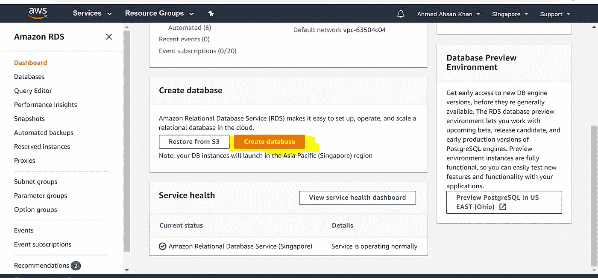
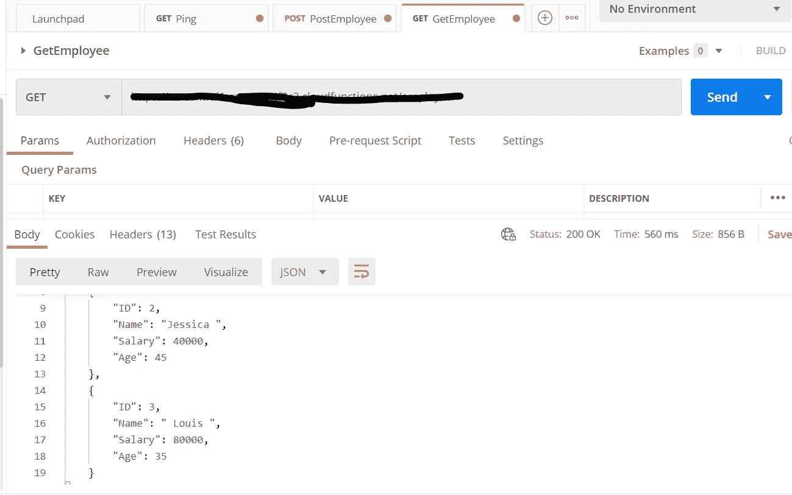

# Firebase 云功能与 AWS RDS 数据库集成

> 原文：<https://blog.devgenius.io/firebase-cloud-functions-integration-with-aws-rds-database-947a383e2e0c?source=collection_archive---------0----------------------->


在本教程中，我将解释如何创建一个 AWS RDS 数据库，并将其与 Firebase 云功能集成。这是我在发现随着您的应用程序规模扩大，您将需要从 Firebase 实时数据库或 Firestore 数据库中迁移出来后学到的东西，因为随着数据呈指数级增长，尤其是交易数据，成本会增加。在我早期的一篇文章中，我写了哪种 Firebase 数据库更好，以及何时使用哪篇文章。但是当您的应用程序扩展时，这两种方法都不够好，因为它们的相关成本很高。

查看更多:[Firebase 数据库选项选择指南(Firebase 实时数据库与 Firebase 云 Firestore)](https://medium.com/dev-genius/guide-to-chose-between-firebase-database-options-firebase-realtime-database-vs-firebase-cloud-632fda2e4838)

因此，为了解决这个问题，我得到了这个解决方案，我在 AWS RDS 上创建了我的数据库，并使用 Firebase Cloud 函数来访问它，以进行我需要的所有 CRUD 操作。

这是本教程的外观:

1.  在 AWS 上创建数据库
2.  使用 MySQL workbench 测试 AWS 数据库
3.  设置 Firebase 云功能项目。
4.  使用 Postman 和测试数据测试云函数 API。

# 步骤 1:在 AWS 上创建一个数据库:

这一步将包括在 AWS 中创建数据库，并使用 MySQL Workbench 确保连接正确。

**答:前往**[**【https://aws.amazon.com/console/】**](https://aws.amazon.com/console/)**创建您的 AWS 帐户。**

**b .在您的控制台中，在服务下选择 RDS inside Database 部分，如下所示。**


**c .进入仪表板后，点击创建数据库。**



**d .一旦进入创建数据库向导，选择以下配置:**

一、**数据库创建方法**:标准创建

二。**引擎选项** : MySQL。


三。**版本** : MySQL 社区(默认)

四。**版本** : MySQL 8.0.17(默认)

动词 （verb 的缩写）**模板**:自由层(这是为了教程确保你的数据库不会花费你的钱)。


不及物动词在设置中，设置数据库标识符的名称，并设置用户名和密码。我已经将“database-2”设置为标识符名称。

七。**数据库实例大小**:可用的最小值选项(db.t2.micro)。

八。**存储**:默认存储设置。


九。所有剩余的设置为默认设置，并在最后单击“创建数据库”。

**e .等待几分钟，AWS 将创建数据库并显示在数据库下。准备好后，在 databases 下选择您新创建的 database-2。**


确保您的数据库可用，如图所示，然后点击修改。

**g .在“修改”下，转到下面，如图所示将“公共可访问性”选择为“是”，然后单击底部的“继续”。**


到这一步，您的 RDS 数据库已经建立并可供公众访问。

# 步骤 2:使用 MySQL workbench 测试 AWS 数据库

在这一步中，我们将使用 MySQL workbench 测试我们的 AWS 数据库。

**答:打开 AWS 控制台，进入数据库，打开数据库主页。**确保您的数据库可用，并且可以公开访问，如图所示。记下端点 URL 和端口号。


b.打开 MySQL Workbench 并测试 MySQL 连接。

I .单击(+)将打开向导

二。如图所示，输入您的主机名、端口、用户名和密码，然后单击测试连接。

三。如果您的连接数据是正确的，它会给你一个成功的消息，表明连接已完成。在对话框中单击确定，然后在向导中单击确定。


四。打开连接。


c.接下来，我们将创建一个模式和数据库表。

I .执行如下所示的命令。这将创建模式，我们将在该模式的基础上创建数据库表。

```
create schema Tutorial_Schema;
```


二。通过执行以下命令创建新的雇员表，如下所示。

```
CREATE TABLE `Tutorial_Schema`.`Employee` (
 `idEmployee` INT NOT NULL AUTO_INCREMENT,
 `employeeName` VARCHAR(45) NOT NULL,
 `employeeSalary` INT NOT NULL,
 `employeeAge` VARCHAR(45) NOT NULL,
 PRIMARY KEY (`idEmployee`));
```


不要忘记执行“提交”语句。这将确保保存事务(换句话说就是“提交”)。直到这一步，我们有我们的数据库设置和连接测试。

# 步骤 3:设置 Firebase 云函数应用程序。

注意:Firebase 默认使用 Node JS 作为其后端语言。在继续之前，请确保在您的系统中安装并配置了节点 JS。要确认是否安装了 Node，请打开命令提示符并运行“node -v”命令。

```
node -v
```

a.转到[https://console.firebase.google.com/](https://console.firebase.google.com/?pli=1)并创建 Firebase 项目。

b.如图所示，输入您的项目名称


c.禁用项目的分析(我们的应用程序不需要它),然后单击 create project。

d.一旦你的项目准备好了，点击“继续”。


e.从左侧菜单中，单击功能，然后单击“开始”按钮。


f.向导将会打开。安装 Firebase 工具。


在您想要保存项目的文件目录中创建一个文件夹。然后在 cmd 中运行以下命令。确保以管理员身份运行 cmd:

```
npm install -g firebase-tools
```

这个命令安装 Firebase SDK，我们将使用它来部署我们的 Firebase 代码。


g.接下来，运行如下所示的命令:

```
Firebase login
```


h.下次执行:

```
Firebase init
```

这将创建一个样板项目文件夹，并连接到我们从“a”到“e”创建的 Firebase 项目。


接下来我们需要在我们的项目中安装 express JS 和 MySQL。遍历新构建的文件夹“functions ”,运行以下命令:

```
npm install express — save
```


您还需要安装 cors 来允许您的项目的 cors 请求。

```
npm install cors — save
```

j.要在项目中安装 MySQL，请执行:

```
npm install mysql — save
```


k.到这一步，您已经安装了 Firebase 函数，为 REST API 安装了 Express JS，为 AWS 集成安装了 MySQL。您的 package.json 应该是这样的:

```
{
 “name”: “functions”,
 “description”: “Cloud Functions for Firebase”,
 “scripts”: {
 “lint”: “eslint .”,
 “serve”: “firebase emulators:start — only functions”,
 “shell”: “firebase functions:shell”,
 “start”: “npm run shell”,
 “deploy”: “firebase deploy — only functions”,
 “logs”: “firebase functions:log”
 },
 “engines”: {
 “node”: “10”
 },
 “main”: “index.js”,
 “dependencies”: {
 “cors”: "^2.8.5",
 “express”: “⁴.17.1”,
 “firebase-admin”: “⁸.10.0”,
 “firebase-functions”: “³.6.1”,
 “mysql”: “².18.1”
 },
 “devDependencies”: {
 “eslint”: “⁵.12.0”,
 “eslint-plugin-promise”: “⁴.0.1”,
 “firebase-functions-test”: “⁰.2.0”
 },
 “private”: true
}
```

# 第 4 步:云函数代码

在这一步中，我们将编写如下三个函数:

1.  Ping(检查我们的 Firebase 云函数是否返回任何东西)
2.  GetEmployee(从 AWS RDS 数据库返回员工列表)。
3.  PostEmployee(发布新员工数据)

## 项目文件结构:

到目前为止，您的项目结构应该是这样的。


## mysql.js:

```
const mysql = require(‘mysql’);const connection = mysql.createConnection({
 host: ‘REPLACE IT WITH YOUR HOST NAME FROM AWS DATABASE DASHBOARD’,
 user: ‘REPLACE IT WITH YOUR USERNAME’,
 password: ‘REPLACE IT WITH YOUR PASSWORD’,
 database: ‘REPLACE IT WITH YOUR SCHEMA NAME’
 });

 connection.connect((err) => {
 if (err) throw err;
 console.log(‘Connected!’);
 });

module.exports = connection;
```

该文件创建了一个通用的集中式连接对象，可以在整个项目中使用。export 语句可以帮助项目中的其他文件访问它。

## 雇员. js:

```
const express = require(‘express’);
const cors = require(‘cors’);
const connection = require(‘./mysql’);
const employee = express();// Automatically allow cross-origin requests
employee.use(cors({ origin: true }));employee.get(‘/’, (req, res) => {
 res.header(“Access-Control-Allow-Origin”, “*”); // update to match the domain you will make the request from
 res.header(“Access-Control-Allow-Headers”, “Origin, X-Requested-With, Content-Type, Accept”);
 res.header(“Access-Control-Allow-Methods”,”GET, POST”);res.header(“Access-Control-Allow-Origin”, “*”); // update to match the domain you will make the request from
 res.header(“Access-Control-Allow-Headers”, “Origin, X-Requested-With, Content-Type, Accept”);
 res.header(“Access-Control-Allow-Methods”,”GET, POST”);

 var sqlStr = “select * from Tutorial_Schema.Employee;”;

 connection.query( sqlStr , (err, result, fields) => {
 if (err) throw err;
 var finalResult = [];
 for (var item of result) {
 finalResult.push({
 “ID”: item.idEmployee,
 “Name”: item.employeeName,
 “Salary”: item.employeeSalary,
 “Age”: item.employeeAge
 });
 }
 console.log(finalResult);
 res.json(finalResult);
 });
});employee.post(‘/’, (req, res) => {
 res.header(“Access-Control-Allow-Origin”, “*”); // update to match the domain you will make the request from
 res.header(“Access-Control-Allow-Headers”, “Origin, X-Requested-With, Content-Type, Accept”);
 res.header(“Access-Control-Allow-Methods”,”GET, POST”);var dataRecieved = req.body;
 console.log(dataRecieved);
 var employeeName = dataRecieved.employeeName;
 var employeeSalary = dataRecieved.employeeSalary;
 var employeeAge = dataRecieved.employeeAge;
 var sql = “INSERT INTO Tutorial_Schema.Employee( employeeName, employeeSalary, employeeAge ) “ +
 “ VALUES (‘ “ + employeeName + “ ‘, “ + employeeSalary + “, “ + employeeAge + “ );”;

 console.log(“Employee SQL: “ + sql );
 connection.query(sql, (err, result) => {
 if (err) res.json({ “Message”: “Error”, “Message Description”: “SQL Error” });
 console.log(“1 Employee record inserted”);
 res.json({ “Message”:”Record Inserted”, “Values” : { “Name”: employeeName, “Salary”:employeeSalary, “Age”:employeeAge }});
 });
});module.exports = employee;
```

js 文件包含 AWS 中雇员数据库的 POST 和 GET 方法。app 对象被导出以在 index.js 文件中公开。检查数据库查询的连接对象的使用。这种文件结构将有助于在创建更多数据库表时进行伸缩，并且您希望拥有多个文件来分离业务逻辑。

## index.js:

最后，我们有我们的 index.js 文件，这也是我们的应用程序的起点。

```
const functions = require(‘firebase-functions’);
const employee = require(‘./employee’);exports.employee = functions.https.onRequest(employee);exports.ping = functions.https.onRequest(async (req, res) => {
 res.header(“Access-Control-Allow-Origin”, “*”); // update to match the domain you will make the request from
 res.header(“Access-Control-Allow-Headers”, “Origin, X-Requested-With, Content-Type, Accept”);
 res.header(“Access-Control-Allow-Methods”,”GET, POST”);res.json({“SUCCESS”: “200”});
});
```

现在我们已经准备好了文件结构，在您的 cmd 中的 functions 文件夹中运行以下命令:

```
firebase deploy
```

现在转到 Firebase 函数仪表板，您将看到这两个函数已部署。


现在让我们使用 postman 来测试我们的应用程序:


测试 Ping


岗位员工测试



获取员工的测试

# Github 项目链接:

[](https://github.com/ahmedkhan1991/firebaseFunctionsAwsRdsIntegration) [## Ahmed Khan 1991/firebasefunctionsawsrds integration

### Firebase 云功能 AWS RDS 集成。对 ahmedkhan 1991/firebasefunctionsawsrdsdintegration 做出贡献…

github.com](https://github.com/ahmedkhan1991/firebaseFunctionsAwsRdsIntegration) 

# 结论:

在本教程中，我们将 AWS RDS 用于 MySQL 数据库，Firebase Cloud 函数用于在云上部署我们的 Node JS 项目，Express JS (Node JS)用于 REST APIs，MySQL node JS 用于连接 AWS RDS 和 MySQL Workbench 以及 Postman 进行测试。

快乐学习！！！！！！