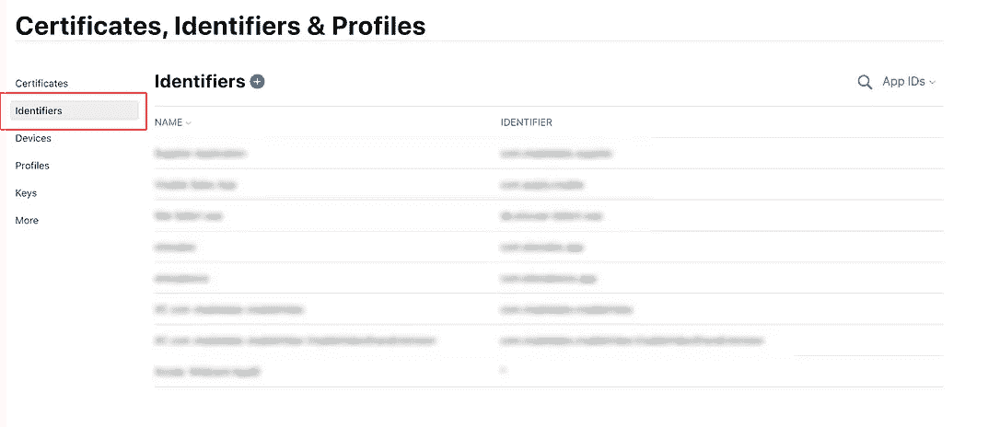

# Firebase + Flutter —动态链接—逐步指南

> 原文：<https://blog.devgenius.io/firebase-flutter-dynamic-links-step-by-step-guide-630402ee729b?source=collection_archive---------0----------------------->


# 结构

1.  什么是动态链接
2.  在苹果开发者控制台内激活相关域
3.  设置 Firebase
4.  设置你的 Flutter 应用
5.  (选项 1)在 Firebase 控制台中创建动态链接
6.  (选项 2)以编程方式创建动态链接
7.  处理应用程序内部的动态链接
8.  通过动态链接传递数据

为了让这个指南发挥作用，你的 Flutter 项目已经必须与 Firebase 连接起来。如果不是，看看我的另一个关于如何连接你的 Flutter 应用程序和 Firebase 的指南:

[颤振+燃烧基—连接/整合—分步指南](https://medium.com/@dominik.keller/flutter-firebase-connecting-intergrating-step-by-step-guide-5e557cb6f23d)

# 1.什么是动态链接

> 动态链接是智能网址，允许您将现有和潜在用户发送到 iOS 或 Android 应用程序中的任何位置。
> 
> 当用户打开您的一个动态链接时，如果您的应用程序尚未安装，用户将被发送到 Play Store 或 App Store 安装您的应用程序(除非您另行指定)，然后您的应用程序将会打开。然后，您可以检索传递到您的应用程序的链接，并根据您的应用程序处理深层链接。

如果已经安装了应用程序，链接会将用户发送到应用程序内部。

# 2.在苹果开发者控制台内激活相关域

对于动态链接的工作，你必须激活你的应用程序标识符内的相关领域。

进入你的苹果开发者账户，点击“标识符”下的应用标识符。然后激活相关的域。



# 3.设置 Firebase

**第一步:开始**

在 firebase 项目仪表板的侧边栏中选择“增长”部分下的动态链接，然后按“开始”。


**第二步:选择域名**

在打开的模式中，输入您想要使用的域。你可以使用谷歌提供的域名或者输入你自己的域名。对于这个设置，我将使用 Google 提供的域。在这种情况下:keco.page.link


完成后，您将被定向到动态链接页面。

**第三步:设置 Firebase iOS 项目**

为了让动态链接在 iOS 上工作，下一步，你必须进入 Firebase 中的 iOS 项目设置。


在这里，您必须填写应用商店 ID 字段和团队 ID 字段。

**应用商店 ID:**

如果您已经将应用程序发布到 Appstore 或 Testflight，您可以在 Appstore Connect 中找到您的应用程序商店 ID。奇怪地命名为“苹果 ID”


如果您尚未将您的应用程序发布到 Appstore，您将没有 App Store ID。在这种情况下，你可以只取 **123456789** 作为 App Store ID。请记住，一旦你的应用程序发布，就要改变这一点。

**团队 ID:**

您可以在左侧栏的“成员资格”部分中的[开发人员门户](http://under developer.apple.com/)找到您的团队 ID。


团队 ID

有了这些，Firebase 的设置现在就完成了。

# 4.设置您的 window 应用程序

为了让动态链接在 iOS 上发挥作用，我们接下来必须进行一些配置。

**第一步:添加 URL 类型**

首先，在 Xcode 中打开项目。可以通过在 Android studio 终端内部执行以下命令来实现这一点:

```
open ios/Runner.xcodeproj
```

接下来，转到“信息”选项卡，然后向下转到“URL 类型”。在这里你必须创建一个新的网址类型。将标识符设置为 **$(PRODUCT_BUNDLE_IDENTIFIER)(基本上是您的 Bundle ID)** 。将 URL 方案设置为您的捆绑包标识符，您可以在“签名&功能”标签下找到该标识符。


**第 2 步:增加关联域能力**

完成后，转至“签名和功能”选项卡并添加新的功能。


在打开的菜单中选择“Associated Domains”。之后，你应该有一个新的部分。

**第三步:增加关联域**

现在，您必须添加一个新的关联域。

该域应由“**applinks:**和我们之前在 Firebase 中创建的域组成，不包含“https://”。本项目: **keco.page.link.**

```
applinks:keco.page.link
```


之后，我们就完成了设置动态链接的扑动项目。

# 5.(选项 1)在 Firebase 控制台内部创建动态链接

现在，我们有两个选项来说明如何创建动态链接。首先，我将解释如何创建与 Firebase 控制台的动态链接。

**第 1 步:短 URL 链接设置**

转到 Firebase 内部的“动态链接”部分。在这里，您必须通过按“新建动态链接”按钮来添加新的动态链接。


在第一步中，您可以自定义短链接。输入您喜欢的任何 URL 前缀。我建议按照它的用途来命名它，比如 openApp 或 goToPage。

**第 2 步:输入 Deeplink URL**

在下一步中，我们必须输入 Deep 链接 URL。

> 深层链接，你的应用程序就会打开。此链接必须是有效的 URL，并使用 HTTP 或 HTTPS 方案。

您可以使用我们之前创建的具有“”的域。com”结尾。

示例:[https://keco.page.link.com](https://keco.page.link.com)

对于“动态链接”名称，可以选择喜欢的任何名称。


**第三步:建立 iOS 行为**

在下一步中，我们可以更改行为，即如果有人单击 iOS 上的动态链接会发生什么。

如果希望深层链接转到您的应用程序，请选择“打开 iOS 应用程序中的深层链接”，然后从下拉列表中选择 iOS 应用程序。

如果应用程序尚未安装，您可以将用户发送到 AppStore 或设置自定义 URL，用户单击链接时将被重定向到该 URL。

如果你不需要，剩下的就不要检查了。


**步骤 4:设置 Android 行为**

接下来，我们必须为您的 Android 应用程序做同样的事情。和以前一样的决定。


跳过“活动跟踪，社交标签和高级选项”，这样，我们就创建了一个与 firebase 控制台的动态链接。

**你可以通过在物理移动设备或模拟器的浏览器中输入链接来测试链接，你应该会被重定向到你的应用程序或应用商店。此外，您可以将该链接复制到一个 notes 应用程序，然后单击那里的链接。**


进入浏览器或 notes 应用程序的链接

# 6.(选项 2)以编程方式创建动态链接

要以编程方式创建动态链接，我们首先必须添加 firebase 动态链接依赖项。

**第一步:添加依赖关系**

将以下依赖项添加到您的 pubspec.yaml 文件中。

```
firebase_dynamic_links: ^0.5.0+11
```

**第二步:创建动态链接方法**

接下来，我们将创建创建动态链接的方法。在我的项目中，我总是引入一个带有 DynamicLinkService 类的 dynamic_links_service.dart 文件来处理所有的动态链接内容。现在，我们将只向该类添加 createDynamicLink()方法。

这个方法将为我们创建一个动态链接，并用。buildShortLink()。

```
class DynamicLinkService *{* Future*<*Uri*>* createDynamicLink*()* async *{* final DynamicLinkParameters parameters = DynamicLinkParameters*(* uriPrefix: 'https://your.page.link',
        link: Uri.*parse(*'https://your.url.com'*)*,
        androidParameters: AndroidParameters*(* packageName: 'your_android_package_name',
          minimumVersion: 1,
        *)*,
        iosParameters: IosParameters*(* bundleId: 'your_ios_bundle_identifier',
          minimumVersion: '1',
          appStoreId: 'your_app_store_id',
        *)*,
      *)*; var dynamicUrl = await parameters.buildShortLink*()*; final Uri shortUrl = shortDynamicLink.shortUrl; return shortUrl;
  *}

}*
```

**第三步:替换变量**

**UriPrefix:**

用您创建的域替换 uriPrefix。


uri 前缀

**链接:**

用您选择的自定义链接替换 Uri.parse 中的链接。您可以使用我们之前创建的带有'的域。末尾的“com”。

例子:[https://keco.page.link.com](https://keco.page.link.com)

**安卓参数:**

在 Android 参数中，用您的包名替换包名。

**iOS 参数:**

用项目的包 ID 替换 bundleID。

最后，将 appStoreID 替换为您的 app store ID(在“设置 Firebase”部分向您展示了它的位置)。如果没有，请用 123456789 替换)。

基本上，我们在 Firebase 控制台中做同样的事情，但是在代码内部。

这个函数将为我们创建一个 URI，我们可以与他人共享。

**第四步:测试链接**

我们现在可以与[共享包](https://pub.dev/packages/share)共享链接。分享插件是一个 Flutter 插件，通过平台的分享对话框分享你的 Flutter 应用程序的内容。

我构建了一个小应用程序来演示这是如何工作的。

首先，将共享依赖项添加到您的应用程序中。

```
share: ^0.6.4+3
```

然后将下面的代码复制到您的 main 中，并导入我们之前创建的 dynamic_link_service:

```
import 'package:flutter/material.dart';
import 'package:share/share.dart';

void main*() {* runApp*(*MyApp*())*;
*}* class MyApp extends StatelessWidget *{* // This widget is the root of your application.
  @override
  Widget build*(*BuildContext context*) {* return MaterialApp*(* title: 'Flutter Demo',
      home: HomePage*()*,
    *)*;
  *}
}* class HomePage extends StatelessWidget *{* final DynamicLinkService _dynamicLinkService = DynamicLinkService*()*;

  @override
  Widget build*(*BuildContext context*) {* return Scaffold*(* body: Center*(* child: Container*(* height: 50,
          width: 100,
          child: FutureBuilder*<*Uri*>(* future: _dynamicLinkService.createDynamicLink*()*,
            builder: *(*context, snapshot*) {* if*(*snapshot.hasData*) {* Uri uri = snapshot.data;
                return FlatButton*(* color: Colors.*amber*,
                  onPressed: *()* => Share.*share(*uri.toString*())*,
                  child: Text*(*'Share'*)*,
                *)*;
              *}* else *{* return Container*()*;
              *}

            }
          )*,
        *)*,
      *)*,
    *)*;
  *}
}*
```

这只是一个带有按钮的小脚手架，点击后会触发共享包的共享功能，生成的动态链接作为共享文本。
如果您现在运行应用程序并按下分享按钮，您可以复制或分享链接，并在浏览器中打开链接进行测试。您的应用程序应通过点击链接打开。

至此，我们已经设法建立了一个以编程方式创建的动态链接。

# 7.处理应用程序内部的动态链接

现在，在我们可以使用我们创建的动态链接重定向到我们的应用程序后，我们可以进入下一步。决定如果应用程序被动态链接打开会发生什么。

**第一步:修改 main.dart**

现在，在我们可以使用我们创建的动态链接重定向到我们的应用程序后，我们可以进入下一步。决定如果应用程序被动态链接打开会发生什么。

我们可以先检查应用程序是否被动态链接打开。为此，我们必须在 main.dart 文件中添加一些代码。为此，我们需要检查应用周期。如果一个 Flutter 应用程序被关闭，它的 AppLifeCycle 状态会改变。所以当它被重新打开时，它又变了。

我们可以通过在我们的类中实现“WidgetBindingObserver”Mixin 来观察这种变化。

下一步，我们在 init 状态中添加一个观察者。然后，我们在 didChangeAppLifecycleState 方法中检查状态是否改变，如果状态等于恢复(应用程序打开)，我们等待 1 秒钟以确保我们收到了动态链接，然后调用名为 retrieveDynamicLink 的方法。

最后，我们将在 dispose 方法中再次删除观察者，并取消一秒钟时间

```
class HomePage extends StatefulWidget *{* @override
  _HomePageState createState*()* => _HomePageState*()*;
*}* class _HomePageState extends State*<*HomePage*>* **with WidgetsBindingObserver** *{* f**inal DynamicLinkService _dynamicLinkService = DynamicLinkService*()*;
  Timer _timerLink;

  @override
  void initState*() {* super.initState*()*;
    WidgetsBinding.*instance*.addObserver*(*this*)*;
  *}* @override
  void didChangeAppLifecycleState*(*AppLifecycleState state*) {* if *(*state == AppLifecycleState.resumed*) {* _timerLink = new Timer*(* const Duration*(*milliseconds: 1000*)*,
        *() {* _dynamicLinkService.retrieveDynamicLink*(*context*)*;
        *}*,
      *)*;
    *}
  }* @override
  void dispose*() {* WidgetsBinding.*instance*.removeObserver*(*this*)*;
    if *(*_timerLink != null*) {* _timerLink.cancel*()*;
    *}* super.dispose*()*;
  *}***@override
  Widget build*(*BuildContext context*) {* return Scaffold*(* body: Center*(* child: Container*(* height: 50,
          width: 100,
          child: FutureBuilder*<*Uri*>(* future: _dynamicLinkService.createDynamicLink*()*,
              builder: *(*context, snapshot*) {* if *(*snapshot.hasData*) {* Uri uri = snapshot.data;
                  return FlatButton*(* color: Colors.*amber*,
                    onPressed: *()* => Share.*share(*uri.toString*())*,
                    child: Text*(*'Share'*)*,
                  *)*;
                *}* else *{* return Container*()*;
                *}
              })*,
        *)*,
      *)*,
    *)*;
  *}
}*
```

**步骤 2:创建 retrieveDynamicLink 方法**

现在，我们将在 dynamic_link_service.dart 文件中创建方法，一旦 AppLifeCycle 恢复，我们将调用该方法来检索动态链接。

Firebase 动态链接包有两种获取动态链接的方法。

当应用程序在后台但没有关闭时，我们通过点击动态链接打开应用程序，onLink()将被调用。

如果应用程序未打开，则调用 getInitialLink()。

因此，我们必须实现这两种方法，以确保我们总是捕捉动态链接。

首先，如果应用程序关闭，我们调用 getInitialLink 来获取动态链接。如果是，我们从深层链接中提取 URI，并检查 URI 是否不为空。如果是这样，就推一条新路线，我称之为 TestScreen。

onLink()也是如此。首先，我们检查是否成功接收到了链接，如果是，我们将推送到 TestScreen()。

```
class DynamicLinkService *{* **Future*<*void*>* retrieveDynamicLink*(BuildContext context)* async *{* try *{* final PendingDynamicLinkData data = await FirebaseDynamicLinks.instance.getInitialLink*()*;
    final Uri deepLink = data?.link;

    if *(*deepLink != null*) {
      Navigator.of(context).push(MaterialPageRoute(builder: (context) => TestScreen()));*
    *}* FirebaseDynamicLinks.instance.onLink*(*onSuccess: *(*PendingDynamicLinkData dynamicLink*)* async *{
      Navigator.of(context).push(MaterialPageRoute(builder: (context) => TestScreen()));*
    *})*;

  *}* catch *(*e*) {* print*(*e.toString*())*;
  *}
}*** *//*/createDynamicLink()
}
```

这样，一旦应用程序通过动态链接打开，用户将被重定向到测试屏幕。

您可以通过复制共享功能中的链接并在浏览器中输入来再次测试。如果一切正常，您应该会被重定向到一个新的屏幕。

# 8.通过动态链接传递数据

如果您共享一个链接，在某些情况下，您会希望通过该链接传递一个参数，这样当该链接被单击时，您就可以打开一个包含特定内容的特定屏幕。有了我们现在的设置，这非常简单。

**第一步:添加参数**

我们必须向 URI 添加一个参数，如下所示:

```
Future*<*Uri*>* createDynamicLink*(****String id****)* async *{* final DynamicLinkParameters parameters = DynamicLinkParameters*(* uriPrefix: 'https://your.page.link',
        link: Uri.*parse(*'https://{your URL}.com/**?id=$id**'*)*,
        androidParameters: AndroidParameters*(* packageName: 'your_android_package_name',
          minimumVersion: 1,
        *)*,
        iosParameters: IosParameters*(* bundleId: 'your_ios_bundle_identifier',
          minimumVersion: '1',
          appStoreId: 'your_app_store_id',
        *)*,
      *)*;
      var dynamicUrl = await parameters.buildUrl*()*;

      return dynamicUrl;
  *}*
```

在本例中，我们向 createDynamicLink 方法添加了一个 id 参数，并将其添加到要解析的 URI 中。

**？id=$id**

**第二步:取参数**

为了获取 id，我们必须稍微修改一下 retrieveDynamicLink 函数。

```
final PendingDynamicLinkData data = await FirebaseDynamicLinks.*instance*.getInitialLink*()*;
Uri deepLink = data?.link;

if *(*deepLink != null*) {
***if *(*deepLink.queryParameters.containsKey*(*'id'*)) {*** ***String id = deepLink.queryParameters['id'];***** *Navigator.of(context).push(MaterialPageRoute(builder: (context) => TestScreen(id: id);*** ***}*** *}***Whole function**
```

通过“deeplink.queryParameters ”,我们可以获得附加到 URI 的所有参数。在这种情况下，只有“id”参数。

在我们得到价值之后，我们可以用它做任何我们想做的事情。将其传递到另一个屏幕或获取一些数据。

# 结论

动态链接是一个非常强大的工具。但是在你的 Flutter 应用中实现起来可能会非常复杂。我试图尽可能的详细，我希望这篇文章能帮助你设置好一切，让你的动态链接工作。

(如果您遇到任何问题或意外错误，或者需要澄清什么，请在下面给我留言，以便我可以帮助您。)