# Firebase ML 工具包:在 iOS 中构建面部姿态检测应用程序(第一部分)

> 原文：<https://blog.devgenius.io/firebase-ml-kit-building-a-facial-gesture-detecting-app-in-ios-part-one-7ded4529b42c?source=collection_archive---------15----------------------->

本文展示了如何借助 [Firebase ML Kit 人脸检测](https://firebase.google.com/docs/ml-kit/detect-faces) API 检测不同的面部表情(点头、眨眼、微笑等)。在这里，我们将主要关注 Firebase 和 iOS 项目的初始设置。如果你已经知道了，那么你可以跳过这一步，转到该系列的第二部分 。

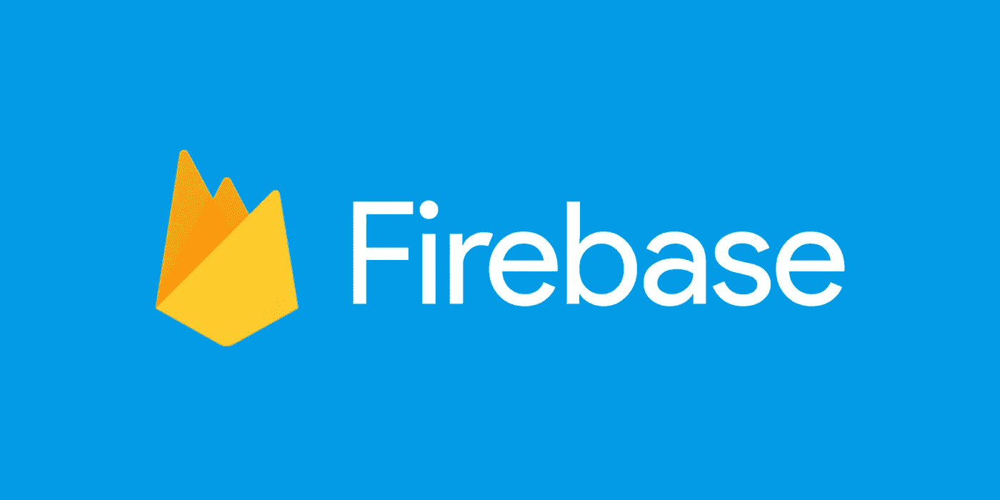

图片来源:[https://firebase.google.com/](https://firebase.google.com/)

# ML fire base 套件

ML Kit 是一个移动 SDK，它将谷歌的机器学习专业知识引入到 Android 和 iOS 应用程序中，提供了一个强大而易用的软件包。无论您是机器学习的新手还是老手，您都可以在短短几行代码中实现所需的功能。开始时不需要深入了解神经网络或模型优化。另一方面，如果您是一名经验丰富的 ML 开发人员，ML Kit 提供了方便的 API，可以帮助您在移动应用程序中使用自定义 TensorFlow Lite 模型。

点击此处 链接 [**可以了解更多关于 Firebase ML 套件的信息。**](https://firebase.google.com/docs/ml-kit)

让我们不要再浪费时间了，开始吧。

# 辅导的

在我们开始开发应用程序之前，首先我们需要创建一个 firebase 项目。

> **创建 Firebase 项目**

1.  点击 [**此处**](https://firebase.google.com/) 导航至 firebase 网站。完成后，我们需要登录。我们可以使用任何一个 gmail 帐户登录。
2.  然后点击页面右上角的*“转到控制台”*，如下图所示。


3.点击*“添加项目”*选项，如下图所示。

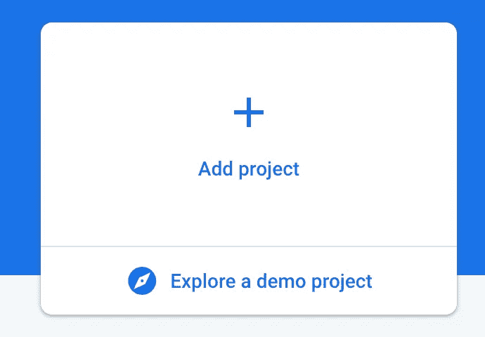

4.然后创建一个名为*“FaceGestureDemo”*的新项目。您可以给项目取任何名称。

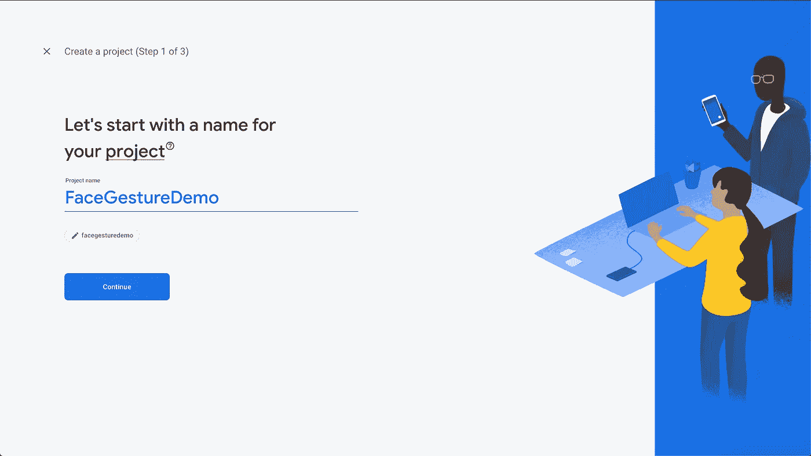

5.完成后，取消选中“*为该项目启用谷歌分析*”选项，因为我们的项目不需要它。

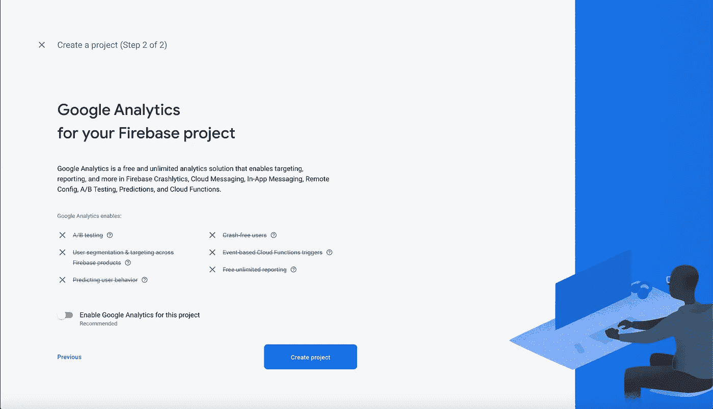

6.然后点击“*创建项目*按钮。完成后，您的屏幕将如下所示。

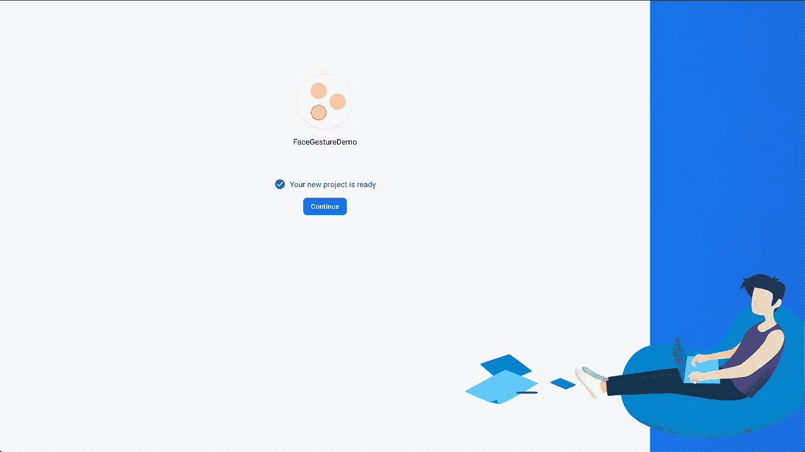

7.点击“*继续*，您将被导航至如下所示的主页。

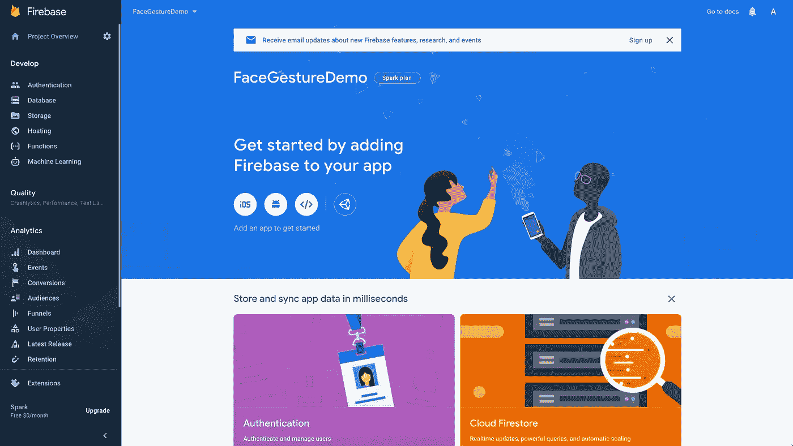

8.点击 iOS 选项开始。然后提供您的应用捆绑包 Id，该 Id 应与您的项目捆绑包 Id 相同，然后点击“*注册应用*”选项，如下所示。

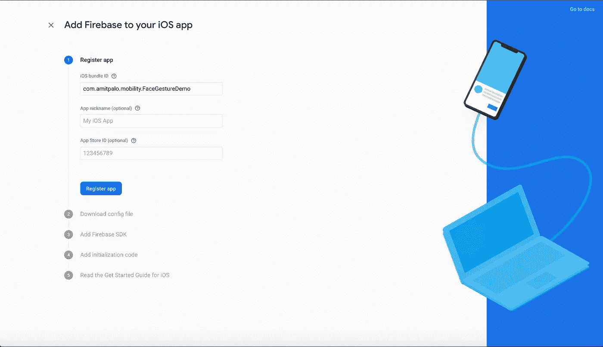

9.下载" *GoogleService-Info.plist* "文件并将其保存在您的计算机中，因为您的应用程序将使用该配置文件。

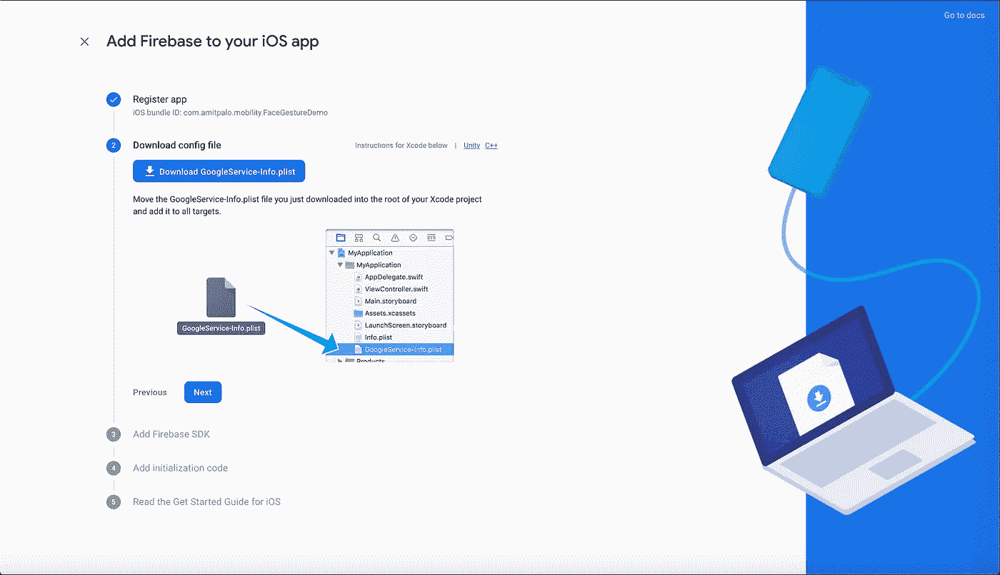

10.然后继续点击*下一个*，直到我们到达设置的最后。

我们完成了 Firebase 的设置。现在，让我们开始创建我们的应用程序。

> **创建一个 iOS 项目**

1.  创建一个名为"*facesgeturedemo*的 iOS 项目，其包 Id 与 Firebase 项目设置中提到的相同。
2.  完成后，将“ *GoogleService-Info.plist* ”文件拖到项目的根目录。

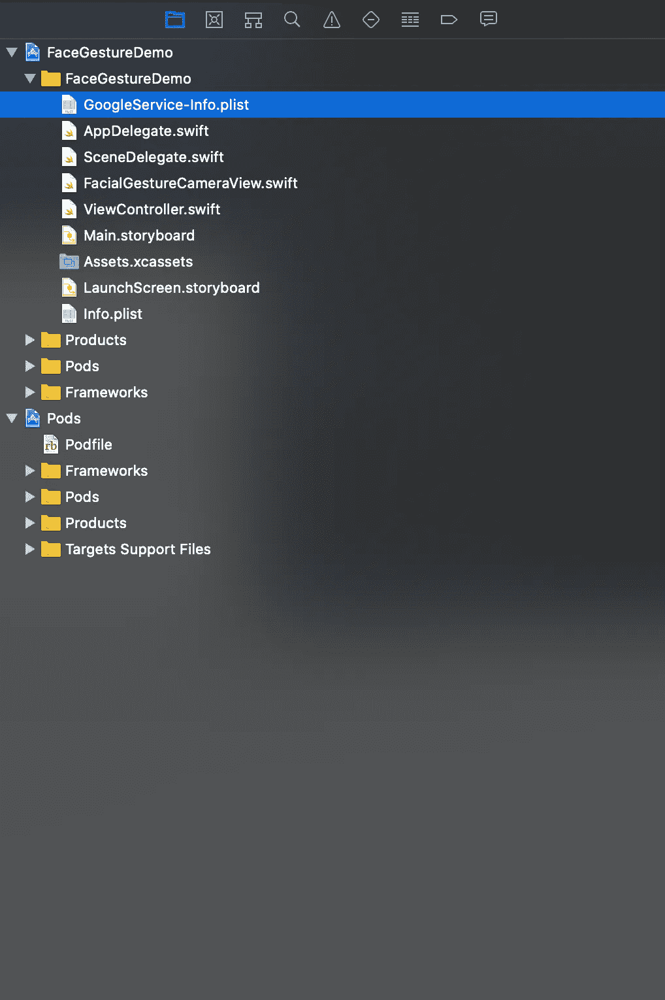

3.我们将使用 [**CocoaPods**](https://cocoapods.org/) 作为依赖项来安装 Firebase ML Kit API。打开终端，导航到项目的根目录并键入

```
pod init
```

4.这将在项目的根目录下创建一个 Pod 文件。完成后，打开 pod 文件并包含 Firebase MLVision 和 MLVisionFaceModel API，如下所示。

```
# Uncomment the next line to define a global platform for your project
# platform :ios, '9.0'target 'FaceGestureDemo' **do** # Comment the next line if you don't want to use dynamic frameworks
use_frameworks!# Pods for FaceGestureDemopod 'Firebase/MLVision'
pod 'Firebase/MLVisionFaceModel'**end**
```

5.关闭您的项目，并通过键入以下命令从终端安装这些依赖项

```
pod install
```

6.一旦安装完成，您将看到如下所示的内容。

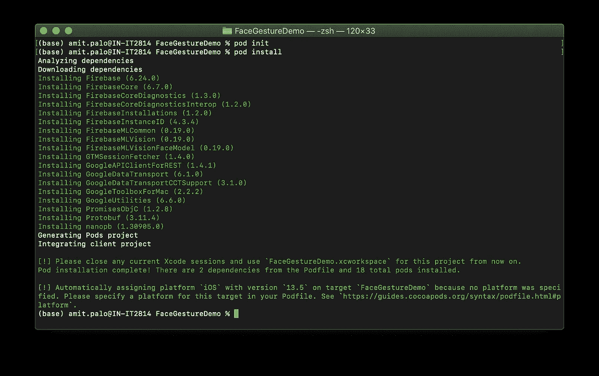

7.现在，打开您的"*facegesturedemo . xc workspace*"项目，在 AppDelegate.swift 文件中尝试导入 Firebase SDK，如下所示，并尝试编译它。

```
**import** Firebase
```

8.现在，在 AppDelegate.swift 文件的“application:difinishlaunchingwithoptions”方法中包含以下代码行。

```
**func** application(**_** application: UIApplication, didFinishLaunchingWithOptions launchOptions: [UIApplication.LaunchOptionsKey: **Any**]?) -> Bool {// Override point for customization after application launch.FirebaseApp.configure()**return** **true**}
```

9.转到您的项目的“ *Info.plist* ”文件，并包含“*Privacy-Camera Usage Description*”，将该值保留为空白或任何其他方便的描述。这是我们在应用程序中使用相机时所必需的，否则应用程序会在启动时崩溃。

# 结论

在这篇文章中，我们学习了如何为面部姿态检测应用程序进行初始 Firebase 和 iOS 项目设置。在本系列的 [**第二部分**](https://medium.com/p/2f5322906d1d/edit) 中，我们将学习如何利用 Firebase 人脸检测 API 来检测不同的人脸手势。

如果你觉得这些有用，请随意分享。感谢阅读！

到那时为止

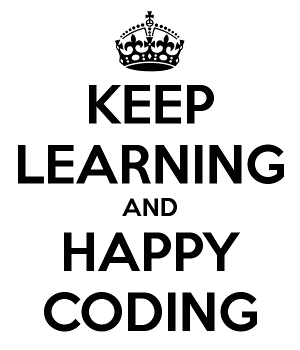

图片来源:[https://keepcalms.com/p/keep-learning-and-happy-coding/](https://keepcalms.com/p/keep-learning-and-happy-coding/)