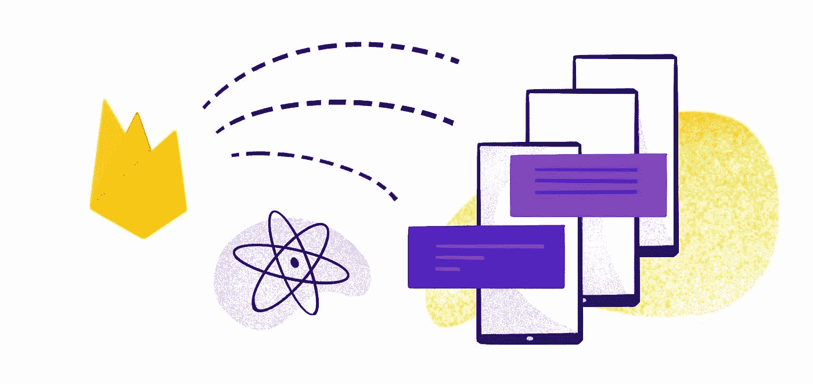

# Firebase 推送通知和应用内消息

> 原文：<https://blog.devgenius.io/firebase-push-notification-in-app-messaging-2782e0c19504?source=collection_archive---------3----------------------->

Android | Kotlin | Firebase



# 介绍

Firebase 云消息传递(FCM)是一个跨平台的消息传递解决方案，让您能够可靠地发送消息。使用 FCM，您可以通知客户端应用程序有新的电子邮件或其他数据可供同步。您可以发送通知消息来推动用户的再次参与和保留。

现在让我们看看如何设置 Firebase 云消息传递！..

## 1.设置 FCM

**a .创建 firebase 帐户-** 要设置 firebase，我们需要首先在 firebase 控制台中创建一个帐户，创建 Firebase 帐户的链接在这里给出【https://firebase.google.com/。在重定向到给定的链接时，您会发现一个名为“创建项目”的按钮，单击该按钮并输入项目名称。


Firebase 项目创建

输入项目名称后，我们需要单击继续按钮。稍后将出现一个配置屏幕，只需接受条款和条件，然后单击继续。


配置屏幕

**b .添加一个 android 项目-** 项目成功创建后，你会看到一个页面，询问你想为 Android、iOS 或 web 添加哪个应用。在我的例子中，我正在为推送通知创建一个 android 应用程序，所以我在这里选择 android。选择后，您需要添加您的应用捆绑 id 和 SHA-1 密钥，以便在 firebase 中注册您的应用。


选择 android 来注册应用程序

成功创建 android 项目后，您会发现一个 google-services.json 文件。下一步是下载 json 文件，并将其粘贴到 android studio 项目的以下文件夹中。


Firebase json 下载路径


粘贴 google-service.json 的路径

## 2.在 Android Studio 中实现 FCM

在 android studio 中打开 build.gradle 文件，并添加以下依赖项，这将添加 Firebase 云消息(FCM)和应用内消息。

```
implementation platform('com.google.firebase:firebase-bom:30.3.1')

implementation 'com.google.firebase:firebase-core'
implementation 'com.google.firebase:firebase-database'
// In-App Messaging
implementation 'com.google.firebase:firebase-inappmessaging-display'
implementation 'com.google.firebase:firebase-analytics'implementation 'com.google.guava:guava:27.0.1-android'implementation 'com.google.firebase:firebase-messaging'
```

现在，创建一个名为 MessagingServices 的 kotlin 文件，并在其中实现 FirebaseMessagingService()。现在，您必须导入两个名为 onMessageReceived 和 onNewToken 的函数。

让我解释一下这两个函数的功能。

**On message received-**On message received 函数传递一个名为 RemoteMessage 的参数，该参数保存了关于通知的所有信息。当通知发送到设备时，将调用此方法。当这个方法被触发时，我们需要使用 NotificationCompat 创建一个通知，并在设备上向用户显示通知。

```
val builder = NotificationCompat.Builder(this, channelId)
    .setSmallIcon(R.mipmap.*ic_launcher*)
    .setContentTitle(remoteMessage.*data*["title"])
    .setContentText(remoteMessage.*data*["body"])
    .setLargeIcon(bmp)
    .setStyle(NotificationCompat.BigPictureStyle().bigPicture(bmp))
    .setAutoCancel(true)
    .setContentIntent(pendingIntent)
```

我正在自定义数据，并在名为标题和正文的自定义参数中发送它，这些参数将在数据对象中发送，数据将出现在 remoteMessage 对象中。下面是如何从 remoteMessage 获取数据对象

```
remoteMessage.*data*["title"]
remoteMessage.*data*["body"]
```

**onNewToken-** 当设备中的令牌被刷新时，该方法传递新令牌。大多数情况下，在第一次安装应用程序时，会有一个新的令牌。令牌将通过此功能发送给用户，因此我们可以使用令牌向用户发送推送通知。

这是 MessagingService 类的完整代码。

```
class MessagingServices : FirebaseMessagingService() {
    var intent: Intent? = null

    override fun onMessageReceived(remoteMessage: RemoteMessage) {
        super.onMessageReceived(remoteMessage)
            intent = Intent(*applicationContext*, MainActivity::class.*java*)
            intent!!.addFlags(Intent.*FLAG_ACTIVITY_CLEAR_TOP*)

            var bmp: Bitmap? = null
            try {
                val `in` =
                    URL("https://selectra.in/sites/selectra.in/files/2021-04/mobile-recharge-plans.png").openStream()
                bmp = BitmapFactory.decodeStream(`in`)
            } catch (e: Exception) {
                e.printStackTrace()
            }
            val pendingIntent: PendingIntent
            pendingIntent = if (Build.VERSION.*SDK_INT* >= Build.VERSION_CODES.*S*) {
                PendingIntent.getActivity(this, 0, intent, PendingIntent.*FLAG_MUTABLE*)
            } else {
                PendingIntent.getActivity(this, 0, intent, PendingIntent.*FLAG_UPDATE_CURRENT*)
            }
            val channelId = "Default"
            val builder = NotificationCompat.Builder(this, channelId)
                .setSmallIcon(R.mipmap.*ic_launcher*)
                .setContentTitle(remoteMessage.*data*["title"])
                .setContentText(remoteMessage.*data*["body"])
                .setLargeIcon(bmp)
                .setStyle(NotificationCompat.BigPictureStyle().bigPicture(bmp))
                .setAutoCancel(true)
                .setContentIntent(pendingIntent)
            val manager = getSystemService(*NOTIFICATION_SERVICE*) as NotificationManager
            if (Build.VERSION.*SDK_INT* >= Build.VERSION_CODES.*O*) {
                val channel = NotificationChannel(
                    channelId,
                    "Default channel",
                    NotificationManager.*IMPORTANCE_DEFAULT* )
                manager?.createNotificationChannel(channel)
            }
            manager?.notify(0, builder.build())
    }

    override fun onNewToken(token: String) {
        sendRegistrationToServer(token)
    }

    fun sendRegistrationToServer(token: String?) {Log.e("FCM TOKEN", token!!);
    }
}
```

**在清单文件中声明 MessagingService 类服务-**

```
<service
    android:name=".fcm.MessagingServices"
    android:enabled="true"
    android:exported="true">
    <intent-filter>
        <action android:name="com.google.firebase.MESSAGING_EVENT"/>

    </intent-filter>
</service><receiver
    android:name="com.google.firebase.iid.FirebaseInstanceIdReceiver"
    android:enabled="true"
    android:exported="true"
    android:permission="com.google.android.c2dm.permission.SEND" >
    <intent-filter>
        <action android:name="com.google.android.c2dm.intent.RECEIVE" />
    </intent-filter>
</receiver>
```

现在，您可以从 Firebase messaging 或通过任何其他来源发送推送通知，您将在设备中接收通知。我已经使用 PendingIntent 将通知重定向到 MainActivity。您可以将通知重定向到任何所需的活动，也可以选择不重定向。

## 3.应用内消息

Firebase 还提供了一个称为应用内消息的功能，可以帮助用户与应用进行交互。当用户使用应用时，会向他们发送一个定制的对话框，它会显示在应用中任何屏幕的顶部。该通知将从 Firebase 控制台或任何其他方式发送，它可以包含图像，标题和描述，并可以按照用户的要求定制。

集成应用内消息传递非常简单，我们只需要在 app.gradle 文件中添加依赖项，其他工作将由 FCM 负责。

```
implementation 'com.google.firebase:firebase-inappmessaging-display'
```

**在 firebase 控制台上发送应用内通知-**->云消息屏幕。点击新的活动，你可能会发现两个选项命名为通知和应用内消息。选择应用内消息，它将被重定向到如下所示的屏幕。


填写适当的细节，如选择你想在应用程序上显示的模型或布局，标题，描述，图像链接，按钮文本和颜色。您也可以只显示图像或只显示标题和描述。这完全取决于你想如何让你的客户保持活跃。

稍后，选择目标设备，这基本上是选择您的目标应用捆绑包，并安排您希望显示通知的时间，可以是特定的日期和时间，也可以现在安排。现在通知已准备好发布，当应用程序打开时，您将在应用程序上找到通知，因为它是前台通知。

这就是推送通知和应用内消息的全部内容。

编码快乐！..