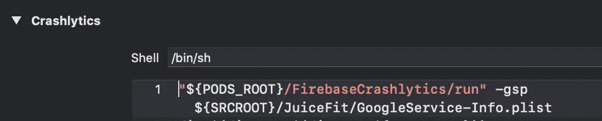

# Firebase + SPM + Xcode 12

> 原文：<https://blog.devgenius.io/firebase-spm-xcode-12-bcefcef2bd6b?source=collection_archive---------1----------------------->

我们已经等了很久了。我们还没到那一步。

截至 2020 年 9 月 18 日，如果我们希望我们的应用程序中包含 Firebase iOS SDK，并且我们希望它作为 swift 包，我们应该怎么做？

新版 Swift package manager 允许我们创建包含资源的包和包含二进制文件的包。Firebase 团队为此做了一些努力，并在他们的存储库中准备了一个单独的分支。因此，让我们尝试摆脱 Firebase pods，将其连接到我们的应用程序。

首先，您需要从 Podfile 中删除它并运行`pod install`。

然后，您需要添加具有这些设置的包:

然后，您需要打开您的项目配置并执行 4 个步骤:

1.  选择您的项目和目标
2.  单击“构建设置”
3.  开始在范围中输入“其他链接”
4.  如果你想使用分析框架，在列表末尾添加"-ObjC "(如果你不添加它，你会在启动时崩溃`NSInvalidArgumentException', reason: '-[__NSCFString fira_UTF32Length]: unrecognized selector sent to instance`)

应该足够你运作你的项目了。

# 还有一件事！

在您的构建阶段，您可能有一个支持 Crashlytics 的。不会再有用了。你会有这样的东西:

但是现在你应该把它改成这样:

今天就到这里吧！