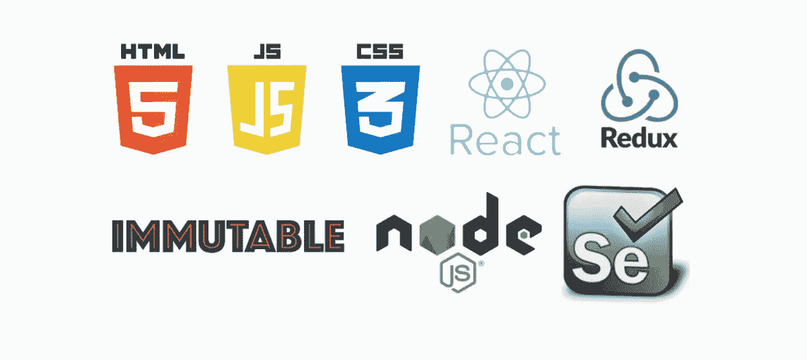
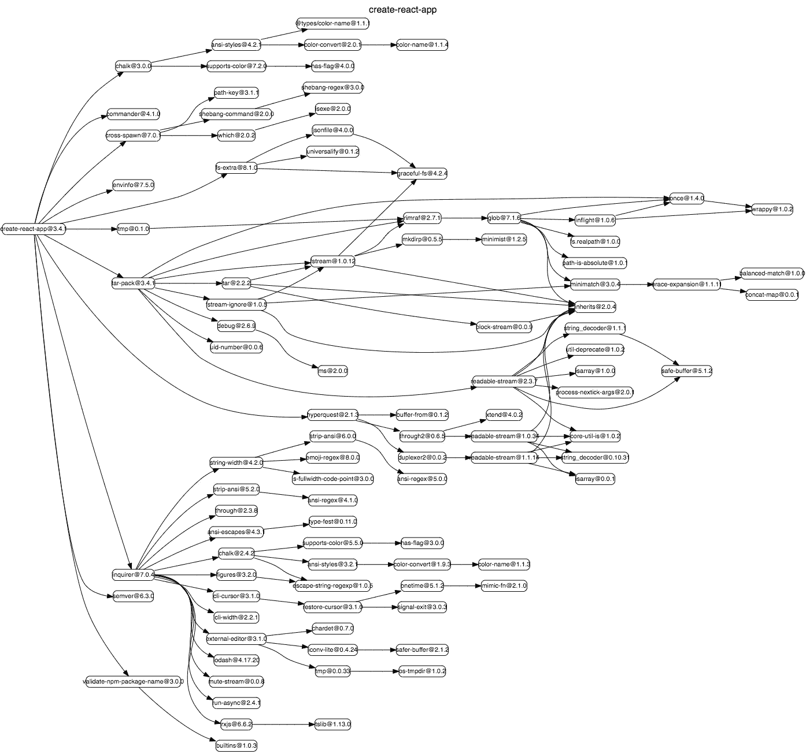

# 我对 React.js 的第一印象

> 原文：<https://blog.devgenius.io/first-impressions-of-react-js-from-a-c-programmer-23986cfefe29?source=collection_archive---------3----------------------->

React.js 很棒，但也有点复杂…

[Med Badr Chemmaoui](https://unsplash.com/@medbadrc?utm_source=medium&utm_medium=referral) 在 [Unsplash](https://unsplash.com?utm_source=medium&utm_medium=referral) 上拍摄的照片

几个月前，我开始学习 React.js，这是我在业余时间慢慢做的一个兼职项目。在这篇文章中，我将分享我最初的想法和印象。

希望这能给那些考虑将 React 作为一个框架的人一个概念。

# 学习路径

因为我已经有 15 年以上的编程经验，所以我决定尝试在最短的时间内学习 React。

我第一次看[学习 React JS 只用了 5 分钟](https://www.youtube.com/watch?v=MRIMT0xPXFI&t=234s)就对这个话题有了一个大致的了解。

然后我参加了 Traversy Media 的两个速成班:

*   [JavaScript 速成班](https://www.youtube.com/watch?v=hdI2bqOjy3c)(刷新和更新我的 JS 知识)
*   [React 速成班](https://www.youtube.com/watch?v=sBws8MSXN7A&t=4s)

我用官方 React JS 文档[和文卡特·苏布拉马年的](https://reactjs.org)[重新发现 JavaScript](https://pragprog.com/titles/ves6/rediscovering-javascript/) 补充了这些。

有许多[更长、更深入的课程](https://reactjs.org/community/courses.html)可用，但我发现在 Traversy 速成课程中，在“学习模式”中度过几天后，我能够开始实际编写自己的 React 代码。

# 第一印象

## 1.技术堆栈

React 开发人员可能需要了解的一些技术

我对 React 的第一印象是，web 开发人员需要了解很多技术！

在我的主要工作中，我通常只使用一种语言(C++或 Python)，可能还有一些支持库和框架。

相比之下，在 web 上，即使是前端专家也需要知道至少 HTML、CSS、JavaScript 和一个框架。这是在我们开始需要 API、JSON、测试框架、构建框架、浏览器兼容性等工作知识之前。

一个全栈开发者需要知道更多:数据库、服务、查询语言、后端框架等等。

如果您打算学习 React，您至少需要了解以下基本知识:

*   现代(ES6 和更高版本)JavaScript
*   HTML5
*   现代 CSS

如果你没有这些，那就有必要先在里面涂一层底漆。

## 2.属国

来自 [NPMGraph](http://npm.broofa.com/?q=create-react-app) 的 create-react-app 的依赖图

React 项目中涉及的依赖项数量之多让我大吃一惊。上图显示了使用 [Create React App](https://create-react-app.dev) 创建的*空*项目的依赖图，相当于超过 200M 的 Node.js 模块。

我一直在建设的实际项目处于非常早期的阶段，但已经有超过 7 亿的开发依赖。这是一个电子应用程序，这使得它比典型的 React web 应用程序更大，尽管如此，分布式应用程序的大小仍然超过 350 万。

从积极的一面来看，一旦你融入了它的精神，拥有大量的依赖，会成为一种额外的收获！

这意味着应用程序开发的过程不再是从头开始编写所有的东西，而是寻找和集成正确的依赖关系网络来完成工作。

即使在我项目的早期阶段，我发现我的应用程序的大部分核心工作都可以通过利用现有模块来完成，这节省了大量的时间。我印象深刻的模块包括:

*   Menubar :用电子创建 Menubar 桌面应用程序的高级方法
*   [React 漂亮的 DnD](https://github.com/atlassian/react-beautiful-dnd) :用 React 对列表进行漂亮且可访问的拖放

## 3.学习资源和文档

[金伯利农民](https://unsplash.com/@kimberlyfarmer?utm_source=medium&utm_medium=referral)在 [Unsplash](https://unsplash.com?utm_source=medium&utm_medium=referral) 拍摄的照片

可供学习 React 的文档的数量和质量令人难以置信。对于几乎每一个可以想象的主题，似乎都至少有一个教程、博客、视频，甚至是完整的课程。到目前为止，我还没有遇到一个问题，我无法通过快速的谷歌搜索和通读一篇写得很好的博客帖子来解决。

由于使用 React 的开发人员相对较多，因此有大量的在线支持，许多问题已经得到解决。

当然，像 C++这样的语言也有很多可用的文档，但是在如何有效地使用框架和构建一个工作应用程序方面，资源却少得多。

## 4.工具作业

VS 代码……支持 React 开发的众多伟大工具之一

我的大部分日常工作都是在 Xcode 和 Visual Studio 这样的重度 ide 中完成的。我对 vim 也很有信心。

对于我的 React.js 之旅，我决定尝试一下 VS 代码。我只能说…我印象深刻！VS 代码为 web 开发提供了强大开箱即用的支持，安装了一些扩展后，它就成为了一个超快的工具。

我目前安装的扩展有:

*   ES7 React/Redux/graph QL/React-本机代码片段
*   实时服务器
*   在浏览器中打开
*   更漂亮—代码格式化程序
*   vs code-styled-组件

在浏览器端，我安装了 [Chrome React DevTools](https://chrome.google.com/webstore/detail/react-developer-tools/fmkadmapgofadopljbjfkapdkoienihi?hl=en) ，这有助于调试。

除了编写代码的直接任务，React 在周围的生态系统中拥有令人难以置信的工具。从某种意义上说，这是拥有大量依赖项的好处。

我印象深刻的工具包括:

*   [守望者](https://facebook.github.io/watchman/):文件观看服务
*   [纱](https://yarnpkg.com):包装经理

## 5.急剧变化

Marc Sendra Martorell 在 [Unsplash](https://unsplash.com?utm_source=medium&utm_medium=referral) 上拍摄的照片

我的主要编程背景是 C/C++(在某种程度上也是 Python ),其中一些常见的框架包含 15 年或更久以前编写的代码。即使使用最新的工具和操作系统，很多旧的 C++项目仍然可以编译和运行。

来到 React 的世界，事情就完全不同了。由于 React 或支持工具中引入的新变化，18 个月前制作的代码和资源可能已经过时。

这种变化率反映了网络社区的不断发展和创新，我感觉工具、框架和方法都在不断改进。然而，所有这些变化都有可能给新手带来困惑和非常陡峭的学习曲线，并给有经验的开发人员带来跟上最新趋势的巨大开销。

# 结论:开发速度胜！

尽管有陡峭的学习曲线和复杂的依赖图，但我发现 React 相对容易掌握。

拥有丰富的开发经验肯定有助于这一点，但我认为即使对于初学者来说，只要你有 HTML、CSS 和 JavaScript 的基础知识，你就不会与 React 斗争。这归功于大量优秀的在线文档、课程和教程。如果你对现代的 HTML、CSS 和 JS 没有信心，那么你首先需要这些方面的入门知识。

就开发速度而言，与 C++或任何原生框架相比，真的没有什么可竞争的。即使在我使用它的有限时间里，凭借我的“初学者”知识，我已经能够用 React 比我使用过的任何本机框架快一个数量级。

我只能看到，随着我对这个生态系统越来越熟悉，开发会变得更快，我肯定会坚持下去！