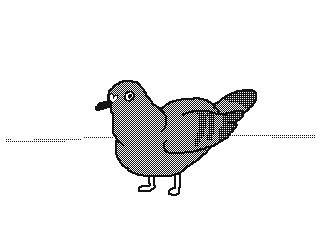

# 作为 Flutter 开发者的第一次实习

> 原文：<https://blog.devgenius.io/first-internship-as-flutter-developer-5fbd93086c28?source=collection_archive---------8----------------------->

所以，我希望你已经读过我之前写的关于我如何获得第一份实习的文章…

 [## 我是如何得到第一份实习工作的？

### 冷启动。没有计划，但我明白了

blog.devgenius.io](/how-i-got-my-first-internship-672e62840c4f) 

所以，这是一个为期 3 个月的远程实习，在一家位于法里达巴德的初创公司，为各种企业制作软件产品。

# 第一天

我被另一个团队成员分配到一个已经在开发的项目中，我那天的任务是从规格表中理解项目的想法，并阅读现有的代码，以了解应用程序是如何工作的。

我阅读了项目规格表，并继续阅读现有的代码库。值得庆幸的是，到目前为止编写代码的团队成员是一个技术高超的家伙，他遵循该语言的风格指南并编写出高质量的代码。我能够在一个小时左右的时间里轻松地浏览代码，并很好地掌握了代码的工作原理。然后，我花了一整天的时间与团队成员和项目负责人讨论项目的某些方面。

我满怀信心，兴奋地期待着第二天开始为这个项目做贡献。

# 第二天

我获得了库的推送访问权限，并被分配了一项任务来修复屏幕上的一个现有 bug。这是一个看起来不完全像设计的表单，并且在提交时没有向数据库发送任何表单数据。

问题是，我能在几分钟内修好它，这让我觉得我不是在接受一项具有挑战性的任务。好像这个 bug 是故意制造来评估我的 flutter 技能的。无论如何，我解决了这个问题，并创建了一个公关，它被合并，并负责处理另一对似乎也是故意的错误。

# 接下来的几天

最后，我接受了一个新功能实现的任务。我兴奋极了，开始着手工作，并在一天结束时完成了。我为自己的任务感到自豪。

日子过去了。

我在尝试实现一个特性时遇到了一个问题。因此，其功能是创建一个服务，持续监听加速度计事件和活动识别事件，并将其写入本地文件，午夜时，记录仪数据将被发送到云存储以供进一步处理。

**问题 1:为什么没有成功？为什么有效？**

来源:[https://k-eke . Tumblr . com/post/190861786446/when-your-program-is-a-complete-mess-but-it-does](https://k-eke.tumblr.com/post/190861786446/when-your-program-is-a-complet-mess-but-it-does)

问题是我无法在本地写入该文件。在我过去的颤振经历中，我从来没有遇到过这种问题，所以我寻求帮助，我们正在调查它几天，但我们无法找出问题是什么。因此，我将数据转移到 hive DB 来存储，在午夜时分，我从 hive 获取数据并将其放入云存储中。

几周后，问题得到了解决。我仍然不知道是什么导致了这个问题，以及它是如何解决的，我们恢复到将数据直接存储在本地存储中，然后再放到云中。

> 我很困惑但很开心

**第 2 期:**

现在已经完成了，又过了几天，我们面临着另一个问题。这真的很蠢…像 toooo 一样蠢。

因此，我们的想法是创建一个带有进度条的恐慌屏幕，显示 30 秒。在这 30 秒钟内，该应用程序将从设备中收集一些信息，并将其发送到数据库。

问题是屏幕在 10 秒钟内就从视图中移除了。我不知道这样的事情怎么会发生，因为我从头开始多次阅读代码，一切都在适当的位置，我感到很失落。我的队友告诉我，我正在屏幕上显示进度条的计时器出现了内存泄漏。

经过一天的自杀念头，我合上了笔记本电脑，收工了。第二天早上，我打开 VSCode，有两个已经打开的文件。*主镖*和*活动 _ 表彰.镖*。该文件包含一段代码，负责切换一个布尔变量，该变量表示是否应该显示紧急屏幕。

这个 activity_recognition.dart 包含一个单例类。现在，我愚蠢的大脑直接使用这个变量进行决策，而不是将其复制到局部变量。因此，每当活动从任何活动变为静止时，服务将切换布尔变量。当这个变量被切换时，屏幕从视图中弹出。

> 我们通过忽略对象的状态变化修复了此问题，并保留了紧急屏幕。😵🥴

**问题 3:长期运行问题**

照片由 [Jacky Watt](https://unsplash.com/@jackywatt?utm_source=medium&utm_medium=referral) 在 [Unsplash](https://unsplash.com?utm_source=medium&utm_medium=referral) 上拍摄

我们的目标是在后台运行一项服务，即使该应用程序被关闭。问题是，当应用程序被终止时，flutter 访问活动识别要么始终报告静止值，要么什么也不报告，最坏的情况是，它抛出一个错误: *MissingPluginException* 。但本机代码能够正确检测活动，但由于 flutter 应用程序被杀，我无法获得数据。

我们试图做很多事情来实现这个目标，但我们无法实现它，或者至少我没有足够的知识来实现它。我们尝试了 workmanager，flutter_background，还有一个我不记得的包。

最后，我修改了 activity recognition 包，以便每当活动从本地代码改变时显示通知，这将在触摸通知时打开应用程序。对于截止日期来说，这真的是一个混乱的攻击，但是，我没有足够的知识来干净地实现这个特性。

项目结束了。我被分配了一个新项目。在这个项目中，我可以选择团队的规模。所以，到那天为止，我已经有了独自做项目的良好经验，我很好奇与团队合作的经历，但当我看到项目规格表时，项目似乎很容易，所以我说我将独自完成它。

> 我没有意识到这是一个错误，因为一个月后，我的大学在新冠肺炎会议后要求开设离线课程。🙃

在前半个月，我能够加速运行 UI 部分和前端逻辑。在接下来的半个月里，我平均每天工作大约 10 个小时，将应用程序连接到后端，并为 firebase 云功能编写一些代码。

在这个项目中，一个主要的问题是这个项目由两个应用程序组成(web *(供管理员使用)* &移动)。我负责移动应用程序，另一个团队负责 web 实现。我和 web 团队知道还有另一个应用程序正在开发中，但我们从未交流过。所以我们没有就数据库的命名约定达成一致。

这是一个非常令人头疼的问题，因为我对数据库使用 camel case，而 web 团队使用 pascal case。每当每个应用程序与数据库交互时都会破坏这两个应用程序。当然，我们尽可能地使用 toLower 方法，但是从应用程序中选择集合名称或文档 id 不能区分大小写。

因此，在我们注意到这个问题后，web 团队的一个人开始沟通并就某些约定达成一致，并讨论了每个应用程序的工作方式，我们又回到了正轨。

我面临的最大问题是，我应该在应用程序中实现一个聊天功能。

问题不在于功能本身。是我。我从来没有做过聊天应用程序，而且我已经很累了，因为我正在做一个 sprint，因为我也在做大学的事情，所以我只有 2 个小时的实习时间。我确信我不能及时完成这个项目。第二天和接下来的三天是某个印度节日的假期，所以我没有回家，而是独自在宿舍里开始做这个项目。

我试图在 Youtube 和其他文章上研究 flutter 的聊天功能，但我没有心思花时间阅读所有这些内容。所以，我只是坐在那里，试着自己去实现。

> 结果是我能够在睡觉前 2 小时实现基本的聊天功能😂。

快乐的我去睡觉了，第二天，当有人发信息时，我想显示通知。我意识到 [Firebase Messaging](https://firebase.google.com/products/cloud-messaging) 是一个完美的选择，因为我已经在使用 Firebase 服务。因此，由于他们出色的文档，为与 Nodejs 和 [firebase 函数](https://firebase.google.com/products/functions)的聊天设置 Firebase 消息传递再次变得轻而易举。

所以，我太高兴了，我刚刚完成了一件我认为我永远也做不到的事情。由于这是项目中要完成的最后一项任务，我们开始全职测试应用程序。所以我一直在修复 UI 元素和小错误。

## iOS:真是让人头疼

虽然 flutter 对 Android 和 iOS 都有支持，但我们仍然需要单独配置它才能工作。问题是我没有 mac 设备或 iOS 设备来测试应用程序。

我设法在虚拟机上安装了 macOS，并使用模拟器运行 iOS 应用程序。

这是向我展示使用版本控制有多重要的项目之一。因为构建这个应用程序的所有这些痛苦的日子突然不起作用了，我不得不在每次提交时返回来找到导致问题的提交。我们发现这是一个 Podfile 和 XCode 之间版本号不一致的错误。就我所知，XCode 中的变化也应该反映在 Podfile 上，但出于某种原因，它没有反映出来，我花了 2 天半的时间遍历到目前为止所做的所有提交并修复它，创建一个新的分支并合并所有后来的提交，并验证它不会再次爆炸。

完成后，我在 Play Store 和 App Store 上发布了应用程序，并在一个月内完成了几个发布周期，我的实习结束了。

图片来自 [Giphy](https://media.giphy.com/media/xTk2YPSN9jJtwuwf0A/giphy.gif)

## **6 个月。**

## **整整 6 个月。**

## 这 6 个月来，我从未如此活跃过。

## 紧张、有趣、痛苦交织在一起。😅

我从没想过我能做成这样的事，但是是的。我做到了。我知道和其他做更有趣的事情的人相比，这不是什么了不起的事情，但我为此感到骄傲。

你可能已经理解了版本控制是如何拯救了我。如果你想了解它，这些将是一个很好的阅读…

 [## 初级 Git 命令

### 为什么使用 git 以及如何入门

hiruthicsha.medium.com](https://hiruthicsha.medium.com/my-journey-with-git-in-a-professional-project-beginner-mode-72c4406e8f94)  [## 初级 Git 命令第 2 部分

### 回顾版本和分支基础

hiruthicsha.medium.com](https://hiruthicsha.medium.com/my-journey-with-git-in-a-professional-project-beginner-mode-part-2-9d9e12a7721)  [## 用 Git 修复错误

### 鲍勃是我的叔叔…相信我

hiruthicsha.medium.com](https://hiruthicsha.medium.com/fixing-mistakes-with-git-97d396bd5e00) 

在那之前，再见👋

Gif from [Giphy](https://giphy.com/gifs/netflix-pizza-lucy-liu-42D3CxaINsAFemFuId)