# 首先看看 Salesforce 代码生成器

> 原文：<https://blog.devgenius.io/first-look-at-salesforce-code-builder-945fe233b0b0?source=collection_archive---------6----------------------->

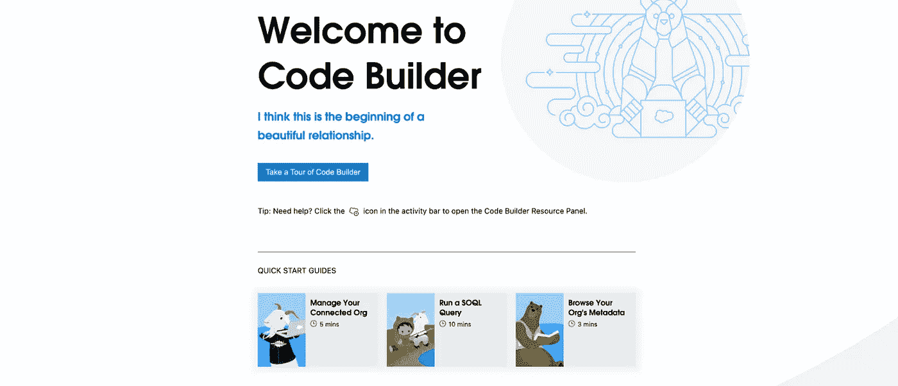

Salesforce 代码构建器

## 内容

1.  什么是 Salesforce 代码生成器？
2.  代码生成器限制
3.  如何安装和配置 Salesforce Code Builder
4.  参考

## 1.什么是 Salesforce 代码生成器？

Code Builder 是预装了 Salesforce 扩展和 Salesforce CLI 的 VS 代码的 web 版本。

基本上，您可以停止使用 [Salesforce 开发人员控制台](https://help.salesforce.com/s/articleView?id=sf.code_dev_console.htm&type=5)，它已经有一段时间没有发展了，并且缺少对 Lightning Web 组件开发等功能的支持。

## 2.代码生成器限制

这里有一个他们的列表[(可通过链接获得)](https://developer.salesforce.com/tools/vscode/en/codebuilder/cb-diffs)，但主要的有:

*   与 VS 代码的本地版本相比，你不能添加任何新的扩展。
*   开发时间限制为 20 小时(测试版)最长为 30 天。这意味着

## 3.如何安装和配置 Salesforce Code Builder

1.  安装 AppExchange 包:[代码生成器(测试版)](https://appexchange.salesforce.com/appxListingDetail?listingId=a0N3u00000Qsdi5EAB)

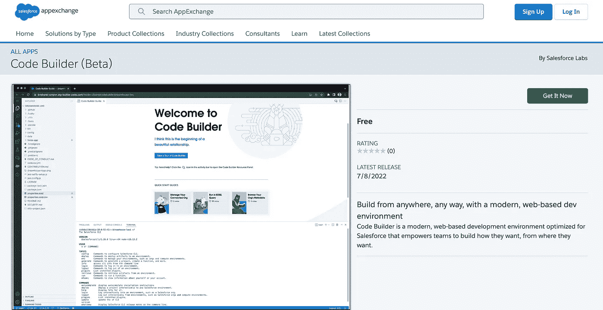

安装后，Code Builder 应用程序将出现在应用程序启动器中:

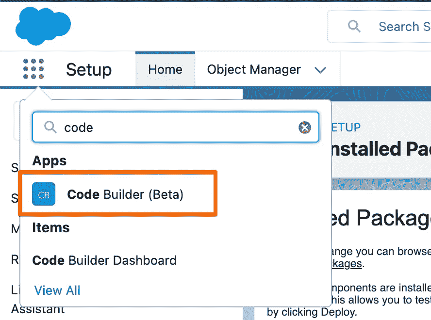

2.按开始键

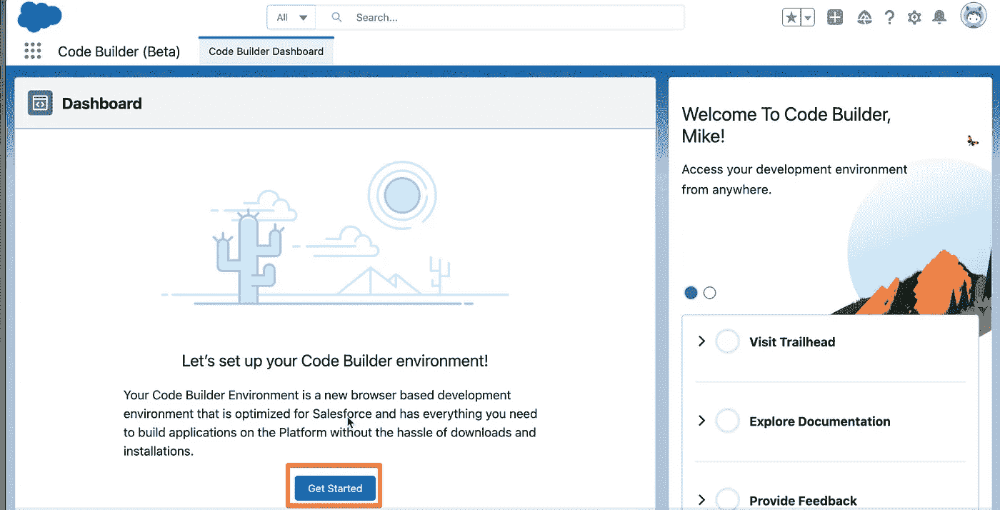

3.然后你会看到创建新项目或从 GitHub 导入的选项。让我们创建一个新项目:

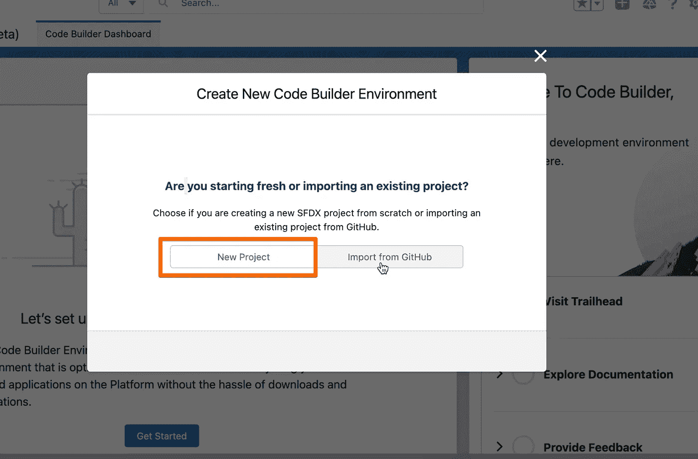

4.设置项目名称和类型。这个过程类似于在 VS 代码中建立一个新项目:

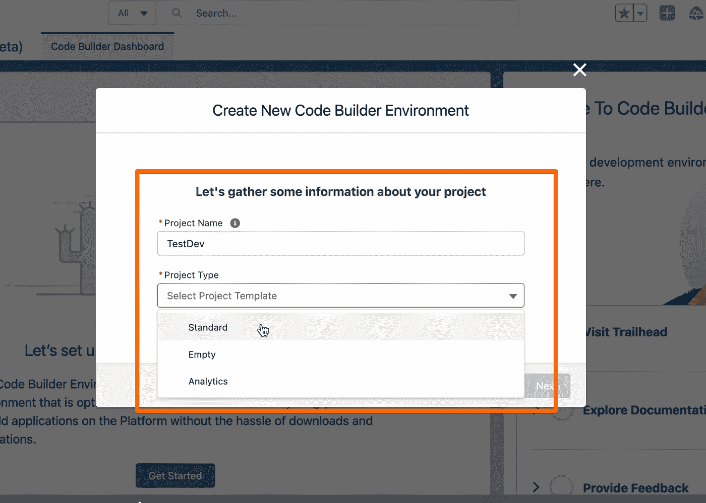

5.连接到组织。我正在一个开发组织上测试它，并可以连接到它:

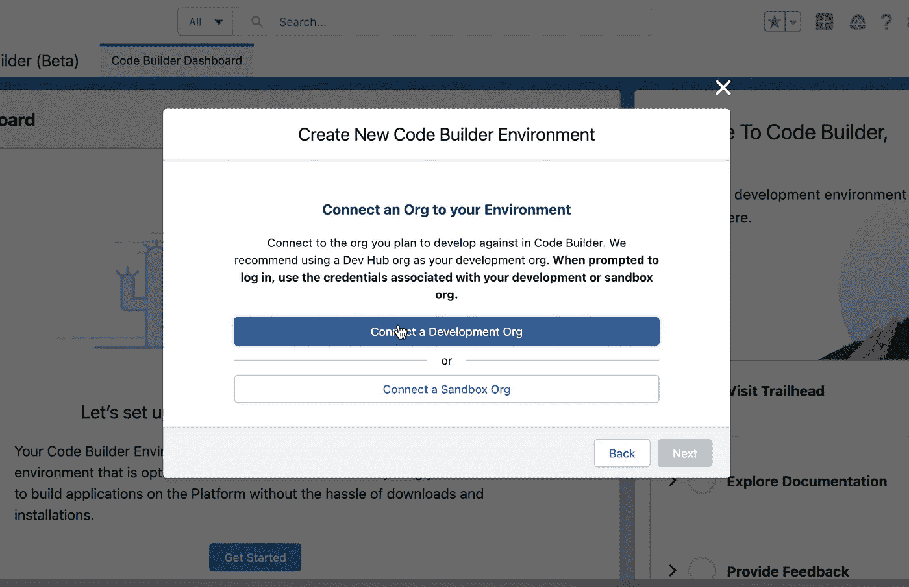

6.一旦连接，您将看到消息。单击下一步按钮

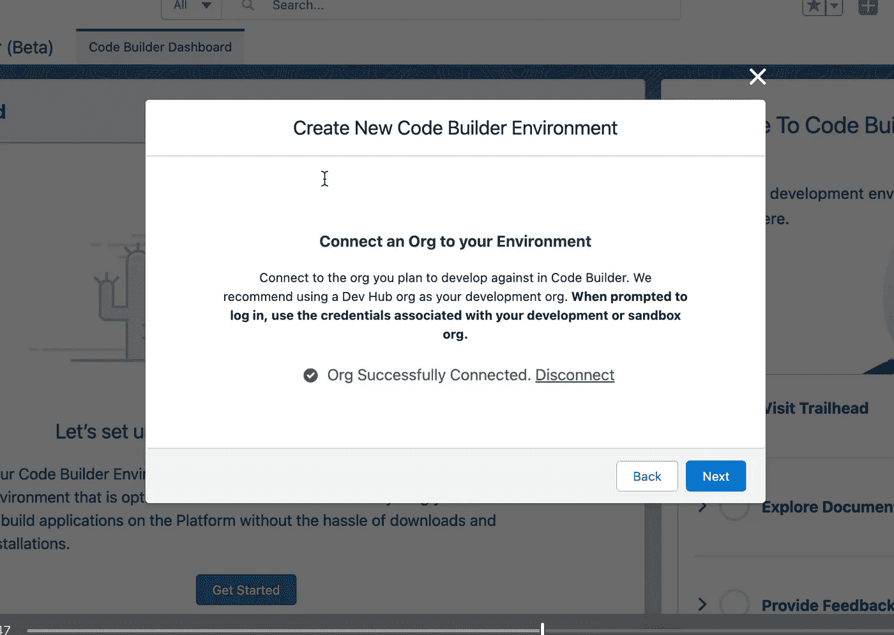

7.设置组织别名:

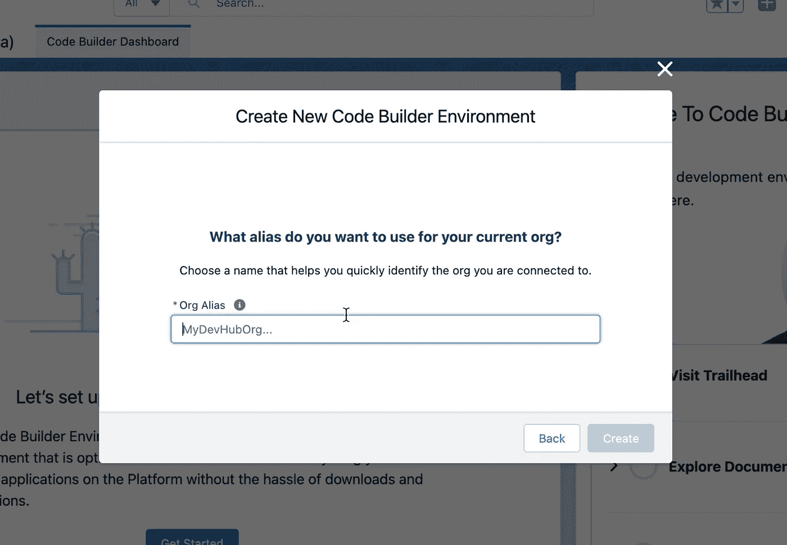

8.创建完成后，您会看到它正在构建一个新的代码环境来托管 VS Code web 应用程序。

剩余时间(20 小时)是打开带有代码的页面时应用程序运行的限制。

*注意:不要忘记用代码生成器关闭标签来停止计数器*

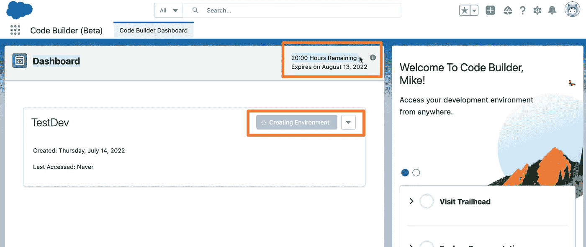

9.一旦环境准备就绪，您将看到启动按钮

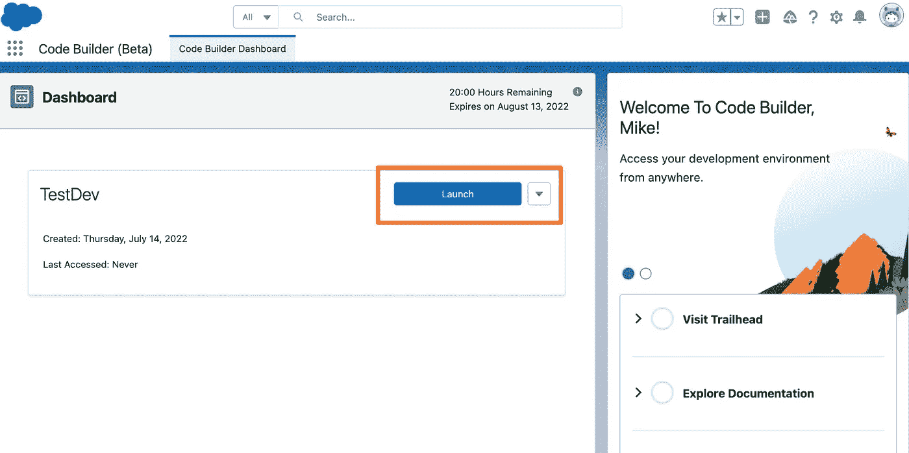

10.按下发射按钮。

您将看到通常的 VS 代码环境，但是是在浏览器中。酷！

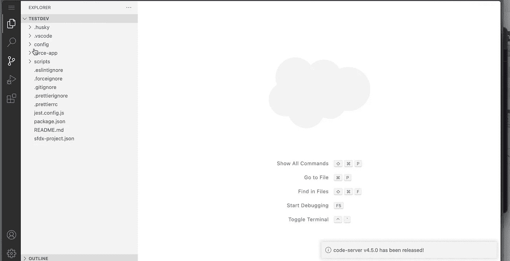

在这个视频[中，您将看到我如何创建一个新的 Lightning Web 组件，并在代码生成器中运行 SOQL 查询。](https://youtu.be/39fLPiBdKjg)

还可以看到 app 中预装和可用的扩展。

## **4。参考文献**

YouTube 视频:

*   [代码生成器(测试版)入门|开发人员快速入门](https://www.youtube.com/watch?v=DJw-6wslhoE)
*   [TDX 第 22 届开发者大会:使用代码生成器从浏览器进行开发](https://www.youtube.com/watch?v=TzC9S1PyzhI)
*   [代码生成器 AppExchange App](https://appexchange.salesforce.com/appxListingDetail?listingId=a0N3u00000Qsdi5EAB)
*   [演示](https://youtu.be/39fLPiBdKjg)