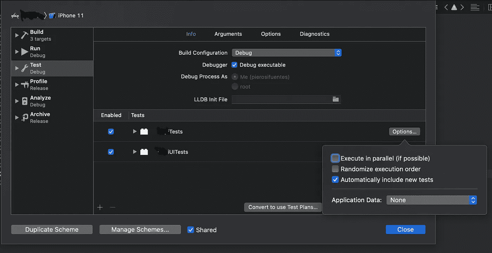

# F.单元测试的原则

> 原文：<https://blog.devgenius.io/first-principles-of-unit-testing-5b6c452ccb7d?source=collection_archive---------10----------------------->

## 首先在 Swift 中提升您的测试

## 改进单元测试的原则和技术

在 [Unsplash](https://unsplash.com?utm_source=medium&utm_medium=referral) 上由 [Austin Distel](https://unsplash.com/@austindistel?utm_source=medium&utm_medium=referral) 拍摄的照片

创建单元测试是开发生命周期和我日常编码工作的重要部分。编写好的单元测试将会改变你编写产品代码的方式。

编写好的测试用例有很多好处，但是，以我个人处理不同类型的项目和实现的经验，我们通常会为生产代码而不是单元测试阅读和实现很多好的约束和原则，你最不希望的事情就是在单元测试中出现问题，我们有足够多的 bug 要解决。

今天我将谈论 F.I.R.S.T 原则。第一个缩写代表:[F]fast，[I]solated，[R]epeatable，[S]self-validating，[T]imely。让我来解释和介绍这些伟大的概念。我将努力使这些概念适应 Swift，因此我将添加一些工具来实现我们的目标。

最后，我们真的需要尽可能地让我们的测试更快，否则它们会减慢我们的 CI 工具，因此我们的开发和部署时间会受到影响。关键是以实现代码的同样精神来实现小单元测试。你可以用 ***单责*** 从*的概念来达到这个目的。*

*我们必须知道集成测试和单元测试的区别。单元测试不通过网络进行通信，通常也不会进行像查询数据库这样的长时间操作，单元测试是特定的任务，每个任务只负责一项工作。我们可以将依赖留在注入模仿之后( ***依赖注入***——这就是为什么我们应该使用 ***固体*** 原则来编写代码)，用于文件、API 响应、数据库和任何种类的依赖。*

*其他补充技术是让***UITests******不选中*** 以使单元测试运行得更快，并评估禁用 ***主机应用程序*** 对业务和演示逻辑测试的单元测试项目设置，但对逻辑测试保留该设置。*

*您还应该考虑为测试 (在 Xcode 10 和更高版本中可用)激活 ***并行特性。这个特性让我们可以在同一个模拟器的多个克隆中执行多个测试。这个特性只对小的测试用例类有效，否则你的类不会被并行化。同样，为了实现这一点，我们将利用 ***SOLID*** 使用 ***接口隔离原则*** ，从大的 XCTestCase 转移到较小的 XCTestCase。****

*最后但同样重要的是，你应该总是考虑使用 ***静态分派*** ，即使是在单元测试类中。这可能是一个关键因素，不仅使我们的测试更快，而且使我们的开发时间更短，改进我们的应用程序，使整个开发周期更快。*

*如果你需要对我们的 API 调用注入一些响应，我真的推荐[ohhttpsubs](https://github.com/AliSoftware/OHHTTPStubs)，这个库可以让你伪造从 JSON 文件中删除的 API 调用响应。*

* [## AliSoftware/ohhttpsubs

### OHHTTPStubs 是一个设计用来非常容易地处理网络请求的库。它可以帮助你:用假的测试你的应用…

github.com](https://github.com/AliSoftware/OHHTTPStubs) 

记住这个原则和单元测试的真正价值是获得关于我们应用的快速反馈。

独立或隔离意味着我们所有的单元测试必须是相互独立的。在测试之间创建依赖关系可能会导致误报或试图找出某些测试用例失败原因的问题。

在 Xcode 中，我们可以通过打开我们方案的测试设置并点击*选项*按钮来激活 ***随机化*** 执行顺序(在 Xcode 10 及更高版本中可用)。通过这样做，Xcode 将总是随机执行我们的测试。

随机化和平行特征

以随机的顺序运行测试也意味着我们的被测系统(***【SUT】***)也应该从它的依赖关系中**分离出来，我们可以遵循前面描述的技术原理。**

**另一方面，每次我们创建一个 ***单元*** 测试(高亮显示单元)时我们应该遵循 3A 的规则， ***排列*** ， ***，*** 和 ***断言*** (常见的方式还是用于 TDD)或者其他规则 ***给出*** ， ***时*****

*****安排*** 的意思是为你的测试用例建立必要的状态，这里是所有的数据和依赖，模拟或假人应该被提供给测试的地方。这些变量应该独立于任何环境。**

*****Act*** 是您必须调用被测方法/属性的地方。我们必须为单元测试调用这个方法/属性，不要与 ***集成测试*** 混淆。**

*****断言*** 逻辑结果/期望。在任何时候，一个单元测试应该只断言一个逻辑结果，多个物理断言可以是这个物理断言的一部分，只要它们都作用于同一个对象的状态。**

**记住，这个原则的真正价值是能够在任何时间以任何顺序运行任何测试。**

**你可以考虑给 BDD(行为驱动开发)一个机会。这个主题不是本文的一部分，我将在以后的文章中讨论 BDD。看看这些用 Swift 实现 BDD 的伟大框架。**

** [## 快速/敏捷

### 使用 Nimble 来表达 Swift 或 Objective-C 表达式的预期结果。灵感来自雪松。目录…

github.com](https://github.com/Quick/Nimble)  [## 快/快

### Quick 是一个用于 Swift 和 Objective-C 的行为驱动的开发框架。

github.com](https://github.com/Quick/Quick)  [## 艾哈迈德·阿里/库库伯里什

### Cucumberish 是一个用于行为驱动开发(BDD)的测试自动化框架。它的灵感来自于令人惊奇的…

github.com](https://github.com/Ahmed-Ali/Cucumberish) 

可重复的，我们所有的单元测试应该是可重复的和确定的，这意味着如果我们多次运行一个测试用例，即使我们改变环境条件，如模拟器、操作系统版本、API 环境和其他类型的外部依赖，它也应该产生相同的结果。正如您所注意到的，这条原则与前面的原则相辅相成，引导我们实现更快、更独立的技术，比如让 SUT 要求的所有输入参数都预定义和硬编码。

一个很好的例子是当我们输入一个来自 keychain 或用户默认值的值时。为了实现我们的隔离和可重复原则，我们可以使用内存键值存储服务，代替键值提供者作为输入。如你所见，依赖注入永远是我们最好的朋友。

记住，让我重复一遍，这个原则的真正价值是获得真实的反馈，不管外部环境如何，也不管你在哪里运行测试用例。

elf 验证意味着，我们的测试应该是自我验证的，在运行之前，不能有人工解释结果或人工安排步骤。

T 代表**彻底**但是**实行测试驱动开发的开发人员也将其拼写为适时**适时**。**

**彻底的**意味着当我们实现一个单元测试时，我们应该考虑愉快的路径和负面或边缘场景。我们必须为使用有效输入的快乐路径创建一个单元测试，为使用无效输入的失败情况创建另一个单元测试(这个例子只考虑一个快乐路径和一个失败路径，您必须尽可能地考虑每条路径)。我们还应该考虑为有最小值和最大值这样范围的情况创建额外的单元测试。

**彻底原则**的真正价值是试图覆盖每一个用例场景，涵盖安全性、大值、范围值、非法输入和行为等。不要用测试覆盖率的值来指导你的单元测试，100%的覆盖率并不意味着你的测试覆盖了可能的边缘场景和未来的问题。

**适时**意味着你可以在任何时候编写单元测试，甚至是在发布特性之后，但是最好是在开发特性的时候创建单元测试。如果你练习 TDD，这是你编码程序的一部分。

当你在特性中工作时，编写测试将会给你一个侧面路径的概念，它将会让你映射和准备需要被注入的依赖项。在发布特性之前编写测试还会让您更加确信该特性会按预期工作，并减少在生产中引入 bug 的机会。

您可以考虑在评审过程中使用规则或指导方针，或者使用自动化工具(CI)来拒绝没有足够测试的代码。我不建议围绕单元测试创建一个严格的规则，比如要求特定的覆盖率，但是我也不会让开发过程没有单元测试。

# 结论

这些原则帮助您将测试提升到下一个水平。需要 TDD、BDD、SOLID 和其他伟大原则和技术来改进你的单元测试和所有代码，做出改变，继续阅读和学习。

希望你喜欢这篇文章，并找到它的帮助。感谢你的阅读，如果你想改变，这里有我的文章。

 [## 稳固和单一责任原则

### 坚固的雨燕

medium.com](https://medium.com/better-programming/solid-swift-by-examples-part-one-35018d53d3e6) 

# 参考

 [## 3A -安排、行动、断言

### 一些单元测试是集中的，其他的就像一个连续的句子。我们如何创建集中的和交流的测试…

xp123.com](https://xp123.com/articles/3a-arrange-act-assert/)  [## 面向团队的 BDD 测试和协作工具| Cucumber

### 很简单。无论是开源还是商用，我们的协作工具都将提升您的工程团队的绩效…

cucumber.io](https://cucumber.io)  [## BDD 简介

### 历史:这篇文章最早出现在 2006 年 3 月的 Better Software 杂志上。翻译链接在…的末尾

dannorth.net](https://dannorth.net/introducing-bdd/)  [## 布利基:给我什么

### Given-When-Then 是一种表示测试的风格——或者如它的拥护者所说——使用…

martinfowler.com](https://martinfowler.com/bliki/GivenWhenThen.html)  [## 移动电话/XCTest-小黄瓜

### 在 net-a-porter，我们传统上使用 Cucumber 和 Appium 进行 UI 测试，这两个工具工作得很好，并且…

github.com](https://github.com/net-a-porter-mobile/XCTest-Gherkin)  [## 可测性工程- WWDC 2017 -视频-苹果开发者

### 单元测试是持续验证您的代码工作正常的必要工具。探索设计技巧…

developer.apple.com](https://developer.apple.com/videos/play/wwdc2017/414/)  [## 测试未经测试的应用程序

### 在这个 CMD+U 会议现场编码演示中，Michael May 展示了开始测试没有现有代码的技术…

学院.领域. io](https://academy.realm.io/posts/cmdu-michael-may-testing-untested-app/)***