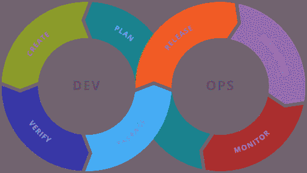
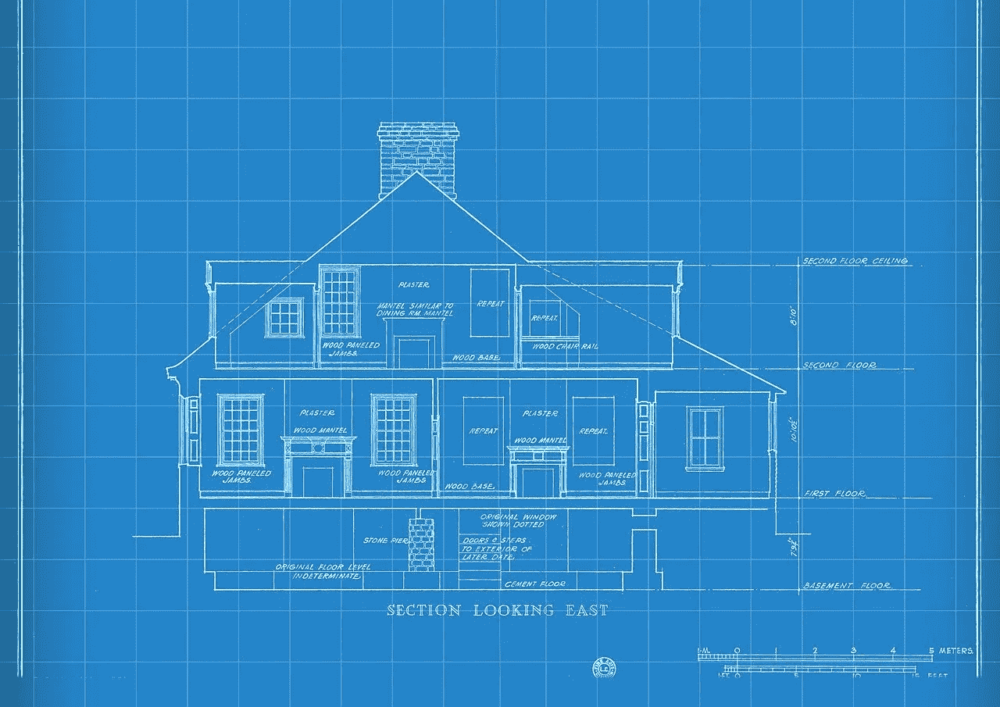

# 你应该知道的五种软件工作

> 原文：<https://blog.devgenius.io/five-jobs-in-software-jobs-you-may-not-know-9712b26623b0?source=collection_archive---------14----------------------->

## 职业

## 软件工程并不是你唯一可以从事的软件职业

最著名的软件或技术相关工作是软件开发或软件工程。这些工作有些相似，但有细微的差别，我们在[软件工程与软件开发](https://medium.com/plain-simple-software/software-engineering-vs-software-development-2f2450bbc4d4)中讨论过。

然而，这并不是软件行业唯一的工作类别。软件业有大量不同的工作机会。在这篇文章中，我们将讨论软件行业中你可以做的其他五个角色，以及每个角色所涉及的内容。

## DevOps 工程师

[图片来自维基媒体](https://commons.wikimedia.org/wiki/File:Devops-toolchain.svg)

DevOps 工程师是一个相对较新的角色。DevOps 代表“开发者运营”。DevOps 工程师在开发人员运营方面有各种各样的职责。

开发者运营会因公司而异，有时甚至因团队而异。它指的是开发人员必须做的一系列不直接有助于软件开发的事情。例如，DevOps 工程师可能维护持续集成/持续部署管道。

DevOps 工程师可能负责的其他事情包括管理打包、管理基础设施和管理版本。

DevOps 工程师通常必须精通底层操作技术。例如，像 AWS 或 DigitalOcean 这样的云计算资源、数据库以及日志或维护工具。

## 数据工程师

[Flickr 上 Epic Top 10 的图片](https://live.staticflickr.com/65535/49054996101_bf69d1bb16_b.jpg)

数据工程师负责收集、保存和使用数据的方式。他们将工程学原理应用于数据以及如何在组织内使用数据。与任何其他类型的公司相比，数据工程师在涉及机器学习的公司中更常见。

然而，这并不意味着数据工程师仅限于机器学习公司。21 世纪 20 年代，数据量[尤其是文本数据的增长](/are-the-2020s-the-decade-of-natural-language-processing-6304d6d6b9c4)将使数据工程师成为一个更广泛的角色。

数据工程师可以负责数据从接收到存储再到使用的整个过程。数据工程师应该熟悉像 Python、R 或 Julia 这样的数据分析语言。他们通常也熟悉数据库，包括 NoSQL 和 SQL 数据库。

数据工程师也应该熟悉数据管道。他们应该能够构建提取、转换、加载(或提取、加载、转换)管道。最后，他们应该熟悉数据仓库和数据湖以及如何使用它们。

## 开发商代言人

[图片来自维基媒体](https://commons.wikimedia.org/wiki/File:Digital_single_market_conference_on_the_free_movement_of_data_Alex_%E2%80%98Sandy%E2%80%99_Pentland,_Professor,_MIT,_Speaker_(35976805035).jpg)

开发者宣传、开发者关系和技术福音都是非常相似的术语，但并不完全相同。在很大程度上，他们在责任和目标方面的待遇非常相似。在这种情况下，我们将讨论这三个过程的总体目标。

开发人员倡导者是为开发人员辩护的人。开发者拥护者介于营销、工程和销售之间。这个角色在 Stripe 和 Twilio 崛起后开始流行。这些公司使用开发者倡议来减少在采用他们的软件时的摩擦。

开发者倡导者负责从面向外部的文档到教程再到集成的内容创建，以促进销售。开发者倡导者大多创建博客、视频和播客等内容。这是一个非常有创造性的角色，需要相当多的外向性。

除了内容创建，开发者倡导者可能还负责拓展。例如，黑客马拉松、大学拓展或会议。最后，开发者倡导者可能还负责社区管理。例如，在松弛或不协调的渠道中响应求助请求。

## 软件架构师

[图片来自 Pixabay](https://cdn.pixabay.com/photo/2018/03/11/13/16/technology-3216744_1280.jpg)

软件架构师是软件的架构师。这些人通常是专门的软件工程师。软件架构师通常负责创建架构图。他们可能负责创建软件创建中涉及的[高层图](https://pythonalgos.com/how-to-create-a-high-level-design-document/)。很少，他们也可能负责创建[低层图](https://pythonalgos.com/how-to-create-a-low-level-design-document/)。

软件架构师负责处理创建软件的高层抽象。这一般是一个会议重的角色。他们经常与从工程经理到最终用户的利益相关者交谈。他们必须能够将用户需要的东西与工程组织能够处理的东西结合起来。

通常，软件架构师与各种各样的团队一起工作，因为他们处理软件的大规模架构。一个软件团队通常只处理软件的封装部分。软件架构师对于大型项目至关重要。这个角色更有可能出现在大型组织中，而不是小型软件公司中。

## 现场可靠性工程师

[图片来自维基媒体](https://commons.wikimedia.org/wiki/File:Wikimedia_Foundation_Servers-8055_24.jpg)

现场可靠性工程师负责确保项目的基础设施和操作是可靠的。在这方面，他们类似于 DevOps 工程师，但通常专门处理现场服务器。

这个角色起源于 Google，是为了确保他们的服务器得到正确的配置和维护。从那时起，它就在整个科技行业传播开来。站点可靠性工程师负责系统可用性、性能和容量规划等多种工作。

大多数 sre 来自软件工程或系统工程背景。然而，工程背景并不总是必需的。正如你可能猜到的，站点可靠性工程师的关注点围绕着可靠性。

他们倾向于从事系统设计、自动化和保持正常运行。现场可靠性工程师也参与大规模的安全和基础设施规划。

## 五个你可能不知道的软件行业工作总结

在这篇文章中，我们了解了软件公司中的一些面向软件的角色，但不是软件工程或开发角色。首先，我们了解了专注于基础设施开发的 DevOps 工程师。其次，我们了解了专注于数据摄取、访问和使用的数据工程师。

第三，我们了解了开发者拥护者，他们专注于减少采用技术的摩擦。接下来，我们学习了设计大型软件系统的软件架构师。最后，我们了解了站点可靠性工程师，他们关注系统的安全性、可靠性和容量。

如果你喜欢这篇文章，请在 Twitter 上分享！为了无限制地访问媒体文章，今天就注册成为[媒体会员](https://www.medium.com/@ytang07/membership)！别忘了关注我，[唐](https://www.medium.com/@ytang07)，获取更多关于技术、[自然语言处理](https://pythonalgos.com/2021/11/23/what-is-natural-language-processing-nlp/)，以及成长的文章！

## 进一步阅读

*   [快速跟踪初级到高级软件工程师的晋升](https://medium.com/plain-simple-software/fast-track-your-junior-to-senior-software-engineer-promotions-ff3be6d7a86d)
*   [每个蟒蛇都需要知道的 5 个分支](https://python.plainenglish.io/5-subreddits-every-pythonista-needs-to-know-a58117949856)
*   [你的投资组合中需要的三个 NLP 项目](/three-nlp-projects-you-need-in-your-portfolio-2a1a124f2570)
*   [敏捷开发环境到底是什么？](https://medium.com/plain-simple-software/what-the-hell-is-an-agile-development-environment-d42f8d0b74b7)
*   一个优秀高级工程师的素质