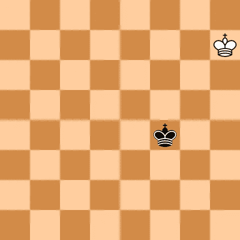
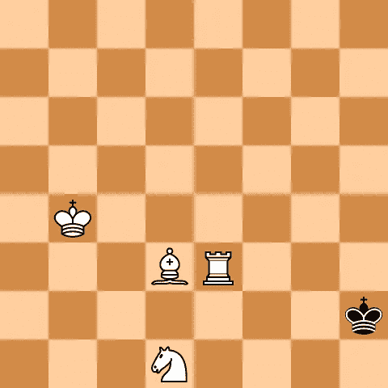
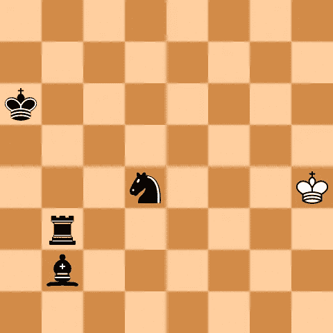
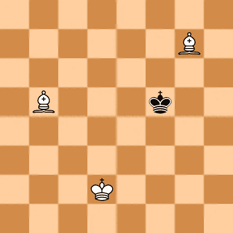
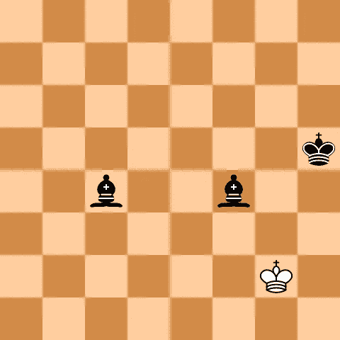

# 用两个相同颜色的象固定将死位置

> 原文：<https://blog.devgenius.io/fixing-checkmate-positions-with-two-same-color-bishops-c5f84b68e010?source=collection_archive---------18----------------------->

## 通过扩展现有的类

照片由 [Michael Dziedzic](https://unsplash.com/@lazycreekimages?utm_source=unsplash&utm_medium=referral&utm_content=creditCopyText) 在 [Unsplash](https://unsplash.com/s/photos/programming?utm_source=unsplash&utm_medium=referral&utm_content=creditCopyText) 拍摄

嗨，网络开发者们，你们还好吗？希望如此！这是“让我们开门见山”系列的第二篇文章，我试图用几句话解释如何解决 GitHub 上的 ChesslaBlab 问题。

 [## 用几句话解决 GitHub 上的问题

### 让我们开门见山吧

programarivm.medium.com](https://programarivm.medium.com/solving-issues-on-github-in-few-words-e63a115a3260) 

在这种情况下，以下问题已得到解决，仅涉及后端编程。

 [## 修正了用两个相同颜色的主教创建将死位置的问题

### 如果试图单独和两个主教将死，不可能的将死位置会被创造出来。图一。培训…

github.com](https://github.com/chesslablab/php-chess/issues/219) 

一个小的重构已经完成。到目前为止,`Chess\Randomizer`类在一些将军中工作良好——国王和王后对国王，国王和车对国王，国王和主教以及骑士对国王——同时保持相当基本，如下面的代码所示。

正如您在构造函数中看到的，创建随机位置时考虑了一个因素:两个国王都不能被选中。下面的测试有望帮助理解到目前为止`Chess\Randomizer`类是如何工作的。

**图 1** 。国王创造的随机位置()

**图二**。由 w_N_B_R()创建的随机位置

**图 3** 。由 b_N_B_R()创建的随机位置

很公平，但是，随机将死两个主教的位置(国王和两个主教对国王)不能这样创建，因为这些位置需要遵守一个新的附加条件:主教必须是不同的颜色；或者说，两个棋子所在的方格必须是不同的颜色。

因此，`Chess\Randomizer`类被移动到了`Chess\Randomizer`命名空间中，产生了`Chess\Randomizer\Randomizer`——一个名为`src/Randomizer`的新文件夹也相应地为此目的而创建。这样，它可以扩展，以支持具有附加功能的位置。

另外，`src/Randomizer/Checkmate`文件夹已经创建好了。

结果，下面是`Chess\Randomizer\Checkmate\TwoBishopsRandomizer`类的样子。

`TwoBishopsRandomizer`通过调用其父构造函数，满足两个国王都不能被检查的基本条件。然后，它检查出两个主教是不同的颜色，为此必须在`Chess\PGN\AN\Square`中编写一个名为`color()`的新方法。

`color()`方法找出正方形是哪种颜色。

`TwoBishopsRandomizer`已经按照下面的测试中的描述进行了添加。

最后，下面是两个随机的将军位置，有两个象。

**图 4** 。由 w_get_board()创建的随机位置

**图 5** 。b_get_board()创建的随机位置