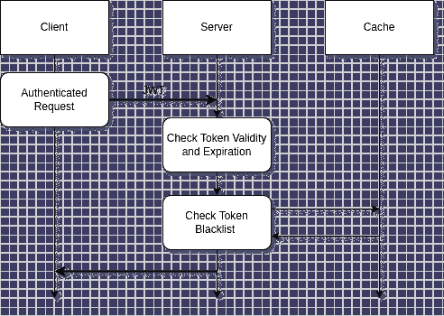

# 通过将令牌列入黑名单来修复 JWT 不安全的会话终止

> 原文：<https://blog.devgenius.io/fixing-jwt-insecure-session-termination-by-blacklisting-tokens-36d783adfd67?source=collection_archive---------1----------------------->

## 我们改变了解决方案，使其不那么无状态。

# 1-简介

上周，我们收到了一份 WAPT (Web 应用渗透测试)报告，其中有一个高漏洞警告:**不安全的会话终止。**

**用于认证的 JWT 令牌，在用户注销后仍然有效。**

哈维·卡夫雷拉在 [Unsplash](https://unsplash.com?utm_source=medium&utm_medium=referral) 上的照片

让我们提供一个如何利用这个漏洞的例子。用户可以从共享计算机(例如在图书馆、网吧或开放的工作环境)访问网站，从平台注销，然后离开。如果 web 客户端不删除令牌，攻击者可以简单地使用浏览器的后退按钮来访问 web 应用程序。

此外，在极少数情况下，攻击者通过嗅探或拦截获得 JWT 令牌，注销也无法阻止他的攻击。只有通过更改签名密钥，才能使所有客户端令牌失效。

# 2-最先进的

在我们的应用程序中，请求使用 JWT 令牌进行保护，这些令牌是在登录时通过提供用户名和密码创建的。我们注销时所做的只是从客户端删除 JWT。我们错过的是 JWT 应该作废。

JWT 无状态解决方案的纯粹主义者会争辩说，使 JWT 令牌无效是违反规则的。"**这意味着将 JWT 解决方案转变为有状态的解决方案——JWT 不是生来就做这种事情的！**”。因此，那些纯粹主义者的解决方案将是使用会话，而不是 JWT。

[乔·格林](https://unsplash.com/@jg?utm_source=medium&utm_medium=referral)在 [Unsplash](https://unsplash.com?utm_source=medium&utm_medium=referral) 上的照片

会话和 JWT 令牌有不同的优点，这超出了本文的讨论范围。这么说吧，我们继续和 JWT 合作。首先是因为一系列易于使用的图书馆准备摇滚。其次，**同一个 JWT 可以用于在不同框架中运行的几个不同服务器上的认证，**这就是我们的情况。

# 3-我们做了什么

我们改变了 JWT 的解决方案，让它变得不那么无状态。关于用户的信息总是保存在令牌上，因此不需要为此访问数据库。但是为了能够使令牌无效，我们需要使用保存在服务器上的一些内存结构，并在每次发出请求时检查这个结构。

在我们的案例中，使用数据库来存储这些信息是一种过度的破坏。我们使用了内存缓存。

TTL，可以说是实现缓存时[最难确定的](https://www.quora.com/Why-is-cache-invalidation-considered-difficult)之一，在这种情况下，被简单地设置为令牌的 exp 时间。缓存中要维护的对象是字符串。缓存项目不需要排序。

此外，无需担心缓存的大小失控。我们对注销行为进行了分析:用户不经常注销，TTL 非常短。我们每天收到 500/600 次注销。此外，JWT 令牌是压缩的，不包含大量信息。

下面是一个简单的认证流程扩展图。

非常简单的图表——用 [draw.io](https://draw.io/) 制作

# 5-我们是如何做到的

我们用了弹簧靴和 Redis。每次请求必须被认证时，我们需要检查**黑名单缓存**以及 JWT 签名和令牌到期时间:

JWTInterceptor 处理除“/login”之外的所有 HTTP 请求。

每次用户注销时，我们都会将 JWT 令牌写入缓存:

LogoutController 使 JWT 令牌失效。

黑名单服务非常简单。它依赖于注释" *CachePut"* 和" *Cacheable"* "，分别从 Redis 缓存中写入和读取。

黑名单服务用于将 JWT 列入黑名单，并检查 JWT 是否已被列入黑名单。

我们很难配置 Redis 缓存和 TTL，因为文档是错误的。

正如您在下面的代码片段中看到的，TTL 被设置为与 JWT 持续时间相同的值:

高速缓存配置和与 Redis 组件的连接。

# 6-结论

通过这种非标准的简单黑名单实现，我们修复了 JWT 无状态身份验证解决方案的一个众所周知的漏洞。

完整的代码可以在 GitHub: >> [这里](https://github.com/GaetanoPiazzolla/blacklisting-jwt) < <

一如既往，非常感谢您的阅读。