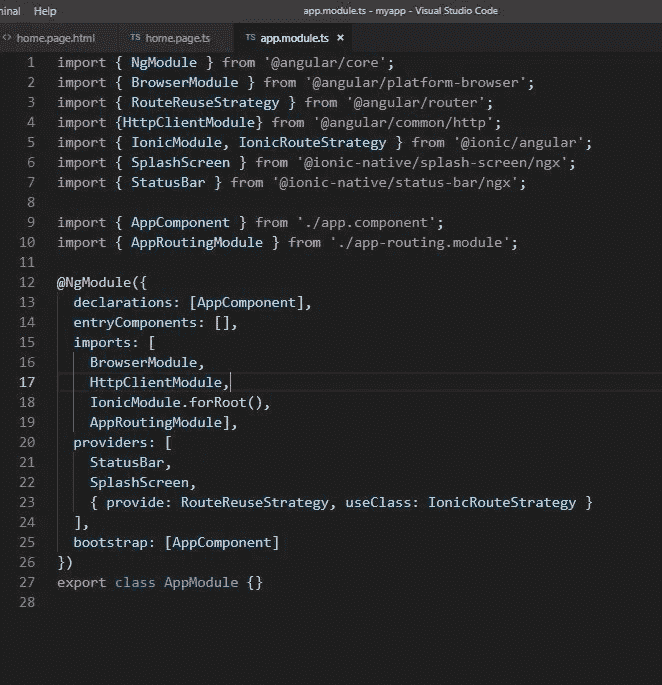

# 用玩耍框架和离子框架避免 CORS 错误

> 原文：<https://blog.devgenius.io/fixing-the-cors-error-with-play-framework-and-ionic-framework-3467512e3cf5?source=collection_archive---------2----------------------->

嗨！！！我带回来一个教程，教你如何用 Play Framework 避免 **CORS 错误**。好的，首先什么是 **CORS** ？**跨源资源共享**是一个标准，它允许你接受一些连接请求，同时阻止一些请求。

简单地说，假设你正在开发一个 web 应用程序。所以你的前端应用程序和后端应用程序运行在不同的服务器上。在我们的例子中，**后端应用程序是 Play framework(localhost:9000)**而**前端应用程序是 Ionic framework(localhost:8100)。**为了在您的前端应用程序和后端应用程序之间发送数据，您必须使用 **http 请求**进行通信。但是如果您没有正确处理 **CORS 问题**，您可能会得到这样的错误。

CORS 误差

# 什么是游戏框架？

如果你没有听说过 Play Framework，Play Framework 是一个基于 MVC 架构的开源 web 应用框架。它使得使用 Java 和 Scala 构建 web 应用程序变得容易。基于 Akka 和 Gradle 的构建将被用作构建工具。Play framework 可以用最少的资源进行部署，并且具有高度的可扩展性。

如果您有兴趣了解更多关于 Play Framework 的信息，请访问。[https://www.playframework.com/documentation/2.7.x/Home](https://www.playframework.com/documentation/2.7.x/Home)

# 什么是离子框架？

之前听说过**跨平台 app 开发**吗？你的猜测是对的。Ionic 框架是一个跨平台的开发框架。您可以使用相同的代码库来生成高质量的移动应用程序以及桌面 web 应用程序。Ionic framework 使用 HTML、CSS、JavaScript 等 web 技术)。此外，Ionic framework 还可以与其他库或框架集成，如 **Angular** 、 **Vue** 和 **React。你可以构建能够在多个平台上运行的应用程序，如本地 iOS、Android、桌面和网络应用程序 PWA(渐进式网络应用程序)。**

如果你有兴趣了解更多关于离子框架的信息，请访问。[https://ionicframework.com/docs/v3/](https://ionicframework.com/docs/v3/)。

好了，现在你知道了 **CORS 错误，Play 框架和 Ionic 框架**。让我们现在解决 **CORS 问题**。

首先你需要下载或者克隆我上传的 **Play Framework GitHub 模板**。在使用 play 框架之前。请安装 SBT，并按照必要的指示，以设置开发环境。您可以参考 Play Framework 文档作为设置 Play Framework 环境的指南。

https://www.playframework.com/documentation/2.7.x/Home

然后，如果你使用 Intellij Idea IDE，请将 **Scala 插件**添加到 IDE 中。然后，您就可以下载并运行这个项目了。从终端使用 **SBT 运行命令(CMD，您应该在项目目录中)**来运行服务器。

导航到项目的 **CONF 目录**，然后您会发现一个 **application.conf** 文件。这是你要解决 CORS 错误的地方。

让我浏览一下代码片段。这里我们已经允许了 **localhost:8100** 作为 Ionic 服务器。您可以使用您的服务器使用的任何端口号，并根据您的意愿与后端进行交互。

在模板中，我实现了一个简单的方法，它从用户那里获取一个字符串名称，并返回一个响应。

然后，您必须为后端定义一个路由(API 端点)。为此，您需要编辑 **CONF** 目录中的**路线**文件。

当配置路由文件时，首先我们必须定义 CRUD 操作类型，即 GET / POST / DELETE。然后是 **API 端点名。**在这里发送。然后是方法实现的位置。(它位于 HomeController 中，方法名为 sendName)。然后我们就完成了后端配置。

现在让我们浏览一下前端代码。

这里我们创建了一个简单的表单。我们使用了 **[(ngModel)]** 来命名表单字段。然后我们分配了 **send()** 方法，该方法将在 **TypeScript 文件中实现。**我们来过一遍 **home.page.ts** 文件。

首先您必须**将 HttpClient 模块**导入到组件中。(确保**已经将 HttpClientModule 导入到 app.module.ts** 中，并且包含在**导入部分**中。

应用程序模块

然后回到 home.page.ts，必须将 HttpClient 注入到构造函数中。然后定义在 send 方法中使用的变量。使用与您使用的名称相同的名称，这将很容易识别。然后用 post http 请求实现该方法，并添加带有 api 端点名称的后端服务器地址。( [http://localhost:9000/send '，sendName](http://localhost:9000/send',sendName) )。确保在处理前端时记录响应，因为调试应用程序很容易。您可以使用控制台轻松查看日志语句。

现在，您已经准备好运行前端应用程序了。使用 i **onic serve** 命令。从下面链接下载两个模板，

播放模板:[https://github . com/supunsandeptha/PlayMediumRepositorySample](https://github.com/supunsandeeptha/PlayMediumRepositorySample)

Ionic 模板:[https://github . com/supunsandeptha/IonicMediumRepositorySample](https://github.com/supunsandeeptha/IonicMediumRepositorySample)

谢谢大家！！！让我们从另一个教程❤再次见面