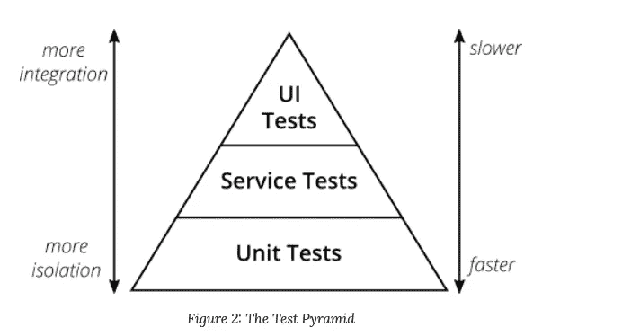

# 测试中的片状剥落

> 原文：<https://blog.devgenius.io/flakiness-in-tests-b586c056e0a8?source=collection_archive---------10----------------------->

易变测试是指在没有任何代码更改的情况下，定期通过和失败的测试。

讨论编写测试背后的原因很有趣。我们编写测试来确保我们的代码正在做我们期望的事情，但是为什么不手动做呢？。这个问题的答案很简单，任何类型的自动测试(单元、集成、e2e 等)都比人工测试快几倍。此外，人类不善于多次重复相同的测试，我们很容易失去注意力。
这两个特征允许我们对每一个小的变化一直运行我们的自动测试，我们已经创建了一个短的反馈循环来确保我们的变化是安全的。

由人类运行的测试通常是非常不可靠的，我们不擅长多次重复任务，我们会感到厌烦，并且我们会在没有注意到的情况下开始犯错误。

在软件中，自动化意味着快速和安全(否则自动化就没有意义)。诚然，我们无法实现所有事情的自动化，但同样真实的是，我们可以比现在做的事情自动化得多。
这就是为什么在软件中，片状的自动测试应该是一个**矛盾体**。我不相信的测试没有价值。

## 片状测试有什么影响？

当我们有古怪的测试时，团队中会发生一些模式:

*   由于我们不相信测试，我们一次又一次地运行它们，直到它们变绿。这是一个问题，因为测试不再快速。我们不希望自动化测试速度太慢。
*   我们将缓慢的测试移动到管道中最新的步骤，使管道在最后失败，并一次又一次地重复这个过程。漫长的反馈循环。
*   更糟糕的是，我们开始考虑将脆弱的测试从管道中移出，并手动执行它们。同样，反对自动反馈的观点。

这不是古怪测试的问题，而是团队中糟糕的工程实践的问题。让我们用这个原则，然后:

> "如果疼，那就更频繁地做，把疼痛提前."
> 
> ――Jez Humble，[连续交付:通过构建、测试和部署自动化进行可靠的软件发布](https://www.goodreads.com/work/quotes/13558958)

那么，让我们让痛苦发生之前，让我们把那些片状 e2e 测试转移到其他较低的水平。我们知道 e2e 测试比集成测试更不可靠，集成测试通常比单元测试更不可靠。因此，我们可以用这种方法来问我们自己，我们是否必须将测试重写为一个或多个单元或集成测试。

## 单元测试中的剥落

如果你有一个古怪的单元测试，你的设计很糟糕。重新设计那部分代码，以消除测试的不完整性。

或者更糟糕的是，你的单元测试没有遵循 [FIRST](https://dzone.com/articles/writing-your-first-unit-tests) 方法中的“I”。
**:测试不应该依赖于之前测试的状态，无论是对象的状态还是被嘲笑的方法。这允许您在需要时单独运行每个测试，如果一个测试中断，这是很可能发生的，因为您将希望调试到该方法中，而不必在看到哪里出错之前运行其他测试。如果您有一个测试在寻找一些数据的存在，那么应该在测试的设置中创建这些数据，并且最好在之后删除它们，以免影响后面的测试。**

## **集成测试中的片状剥落**

**如果一个集成测试不可靠，可能是因为试图覆盖太多你在测试中无法控制的方面。[也许这不是最好的测试，试着编写更小的单元测试，只覆盖业务逻辑，只使用集成测试来测试你的副作用](https://medium.com/r?url=https%3A%2F%2Fblog.devgenius.io%2Funit-tests-c70618dc1e25%3Fsk%3Dde16c7a7bec6fa068728441e55365c97)。**

## **E2E 或旅程测试**

**古怪的 e2e 测试应该被降级(让我们用那个表达)为多单元、集成或者契约测试。自动化测试应该是开发的工具，允许重构。让我们平静地生活，知道什么事情不能失败，减少不确定性。但是测试本身没有价值，它们有成本，我们必须维护测试，它们是代码。因此，重要的是要有足够多的测试来覆盖我们所有的功能和场景，但是要尽量减少重复测试。如果是这样的话，去掉较高的测试。
这也是测试金字塔的一部分:**

****

**[https://Martin fowler . com/articles/practical-test-pyramid . html](https://martinfowler.com/articles/practical-test-pyramid.html)**

**有更多的单元测试，因为它们是最快的测试，很容易理解什么是失败的，但我们不能用它们覆盖所有的东西。我们不能涵盖与库、框架或第三方系统的集成。尽管这很困难，我们必须在金字塔中走得更高，但是我们的努力应该总是在尽可能低的测试中测试事物。
E2E 测试对于我们无法在其他测试级别测试的零件非常有用。
你在测试金字塔中的位置越高，就越难创建短时间的现场环境来通过测试。**

**这就是为什么我们通常在与生产环境相似的环境中运行 e2e 测试的原因。片状剥落与系统的自由度等级密切相关，如果我们的系统很复杂，我们对它进行自动测试，我们将不能确定为什么事情会失败，这将是不清楚的。因此，让我们尽量减少 e2e 测试，让我们只将它们用于最少需要的事情，为了做到这一点，团队中的所有角色都需要了解我们是如何覆盖功能的。**

## **信任**

**更高级别的测试的另一个问题是不同的人看它们的目的不同:**

*   **开发人员使用 e2e 测试作为检查系统所有部分集成良好的一种方式，他们相信他们的其他测试水平，因为他们编写了它们。**
*   **QA 希望他们报告特性工作正常，符合所有的验收标准，所以他们希望 e2e 测试中有很多细节。**
*   **PO 或利益相关者或远离技术的人更了解他们，所以他们更喜欢他们。**

**事实上，这些差异只显示了团队中不同角色之间缺乏信任，以我的经验，这是因为 QA 和 dev 将彼此视为不同的步骤，首先我们部署，然后我们测试。我认为这是一个非常糟糕的想法，测试是开发的一部分，是质量的要求。
这种缺乏信任的另一个信号是在我们的生产过程中存在的[长期环境](/long-lived-environments-93f097786aa6?sk=84eba6ba390918a6a9a89fff6454e3b4)的数量。**

**对我来说，这是一个 QA 应该支持的，[向左转移质量](https://www.testim.io/blog/shift-left-testing-guide/)，推动开发人员写出更好的测试，更好的代码。**

## **QA 是一个倍增器，而不是守门员**

**我不喜欢 QA 的想法，因为他们负责系统的质量，并能够证明事情正在运行，这种工作方式往往会产生官僚主义。对我来说，QA 应该是一个能够推动团队提高质量的人，而不是手工测试人员，也不是唯一编写自动测试的人。不是来签署故事的人。QA 应该是一个倍增器，而不是守门人，QA 的主要焦点应该是向左移动自动测试和向右移动手动测试。我们不擅长做重复性的任务，但我们比做探索性测试的机器强得多。探索性测试应该是唯一由人类完成的测试，理想情况下应该在生产中完成。**

**对我来说，QA 是一个需要为此推动团队的人，推动创建一个能够在生产中手动测试的架构，但是一个可以在任何时候部署到生产中的可靠系统，因为我们有一个自动快速的方法来知道事情正在工作。**

**因此，如果我们使用片状化来转移那些测试，我们就把质量推到了开发的时刻。这通常意味着开发人员和质量保证人员之间的合作更加紧密。为什么我们需要等到故事或任务完成后才显示结果，为什么不连续做呢？。**

## **我们需要什么来获得持续的反馈？**

**一种方法是通过 CI/CD，如果我们持续地将我们的变更部署到一个受控的环境中，我们可以持续地显示部分结果并更早地收到反馈。对团队中的任何人来说，做探索性测试更容易。我知道有很多关于什么是持续的讨论，对我来说，它意味着每天至少一次。**

**不可靠的自动测试违背了“自动”的概念，使用反馈来解决你在设计、团队或组织中的问题。我们不应该永远生活在古怪的测试中。**