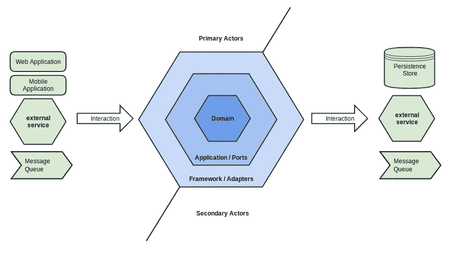

# 六边形架构的 Flask 博客教程(第二部分)

> 原文：<https://blog.devgenius.io/flask-blog-tutorial-with-hexagonal-architecture-part-2-8930ca009c27?source=collection_archive---------4----------------------->

图片来自:
[http://thinkmicroservices . com/blog/2019/hexagon-architecture . html](http://thinkmicroservices.com/blog/2019/hexagonal-architecture.html)

[该项目的 GitHub 回购](https://github.com/ShahriyarR/hexagonal-flask-blog-tutorial)

在本系列的[第一部分](https://rzayev-sehriyar.medium.com/flask-blog-tutorial-with-hexagonal-architecture-part-1-6446e7e9aaaa)中，我们已经推出了使用六角形架构重写原始 [Flask 博客教程](https://flask.palletsprojects.com/en/2.2.x/tutorial/)的想法和初始代码库。

这个版本的教程充满了依赖倒置和依赖注入的主题，所以请继续关注，直到你学到新的东西。

我们已经总结了端口和适配器模式的端口部分(即六边形架构)，现在是实现适配器端的时候了。请参考项目文件夹结构的[第一部分](https://rzayev-sehriyar.medium.com/flask-blog-tutorial-with-hexagonal-architecture-part-1-6446e7e9aaaa)。

我们在本系列的最后[第三部分](https://rzayev-sehriyar.medium.com/flask-blog-tutorial-with-hexagonal-architecture-part-3-9a265f0c4b95)中深入讨论了依赖注入。

# 存储库模式实现

我们将有两个独立的存储库，`PostRepository`和`UserRepository`，它们都实现了来自端口部分的`RepositoryInterface`。

路径:`src/adapters/db/post_repository.py`:

还有`src/adapters/db/user_repository.py`:

请注意，这两个存储库都接受数据库连接作为一个依赖项，这将在稍后通过依赖项注入来注入。

再回忆一下[第一部分](https://rzayev-sehriyar.medium.com/flask-blog-tutorial-with-hexagonal-architecture-part-1-6446e7e9aaaa)我们的`PostService`和`UserService`端口有一个`RepositoryInterface`的依赖，在依赖注入过程中会注入具体的实现`PostRepository`和`UserRepository`。

这就是 SOLID in action 所谓的依赖反转原理。

实际的高层代码(`PostService`和`UserService`)并不依赖于低层代码(`PostRepository`和`UserRepository`)，都依赖于抽象(接口)。

# 烧瓶应用

到目前为止，我们已经有了端口部分和适配器部分，现在是时候初始化我们的 Web 应用程序了。

考虑一下 Flask 应用程序，想象一下 Flask 是我们项目的触发器或发起者。它在六边形的左外侧，它触发了一些动作。

特别是，端点将通过服务— `UserService`和`PostService`与我们的系统交互。

例如，`/auth/register`应该使用用户服务来创建功能等。

是的，服务依赖于我们的端点，因此它们将被依赖注入器注入。

# 烧瓶 app 结构

我们的整体 web 应用程序结构是:

所有的静态和模板都是从 [Flask 博客教程代码库](https://github.com/pallets/flask/tree/main/examples/tutorial/flaskr)中抓取的。

让我们一起探索`application.py`:

现在，只需忽略`Container()`部分，这将在最后一部分解释。

这个注册蓝图也应该是大家熟悉的，但是这个`init_app()`是什么呢？基本上就是初始化数据库的 flask CLI 命令，位于`main.config`。

这将我们引向项目的主要配置部分。

# 配置

在`src/main/config.py`中，我们放置了所有的配置，这是集中我们设置的一种非常天真和恰当的方式。

`init_app()`将`init-db`命令(见`@click.command`装饰器)注册为 Flask CLI 命令。

在`src/adapters/app/schema.sql`中有一个`schema.sql`文件，将在`init_db()`中使用，用于创建数据库表。由于`init-db`命令是 flask app 命令的一部分，因此`schema.sql`也位于附近。

> 我们在这里没有使用 ORM，因为最初的 Flask 博客教程忽略了这个主题。

另一个有趣的部分是`get_db()`函数，如果你注意到我们从这个函数返回可调用的，调用者应该调用返回值来获得实际的数据库连接。

这是[依赖注入器](https://github.com/ets-labs/python-dependency-injector)的一个变通方法，因为连接对象本身不能被酸洗。

# 烧瓶设计图

现在我们越来越接近实际的 web 应用程序。

让我们在`src/adapters/app/blueprints`中定义我们的蓝图。基本上，我们有两个文件`auth.py`用于认证端点，还有`blog.py`用于博客:

`auth.py`:

logout 函数和 login_required 装饰器很简单，不需要注意。

剩下的还挺有意思的。这个`register`的签名是:

注意，`user_service`是这个函数的依赖项，而实际的`user_service`对象是由依赖注入器容器(`Provide[Container.user_package.user_service]`)提供的。

`@inject`装饰器表明`user_service`将被注入，只要。

> 我们将在第三部分探讨依赖注入主题，所以请不要惊慌。

让我们解释一下下面的代码部分:

`register_user_factory`接受用户名和密码并返回`RegisterUserInputDto`,正如我们在本系列文章的第一部分中所解释的。

请注意，密码散列和所有其他验证工作都将在工厂内部进行。我们已经将这一职责从端点和服务委托给 Dto 端。

在取回`RegisterUserInputDto`对象后，我们将它直接发送给`user_service.create()`方法，该方法具有以下签名:

它接受`RegisterUserInputDto`，然后使用 user_factory 创建一个实际的用户模型。

注意`uuid4`代也隐藏在用户工厂中，因为它不是所创建的服务的责任。

剩下的很简单，将用户插入用户数据库表并返回。

同样的原则和思想也适用于博客蓝图。

下面我们来详细探究一下，`blog.py`:

创建、更新和删除端点接受`PostService`作为来自依赖注入容器的依赖。再次值得注意的是，我们已经将`create_post_factory`、`update_post_factory`和`delete_post_factory`分开，用于创建 dto:`CreatePostInputDto`、`UpdatePostInputDto`和`DeletePostInputDto`。

这些 d to 然后被传递给实际的相应服务动作。

在第二部分中，我们探索了:

*   存储库模式实现
*   Flask app 启动代码，数据库初始化
*   简要介绍了依赖注入容器的思想
*   使用 Flask 蓝图实施 web 端点