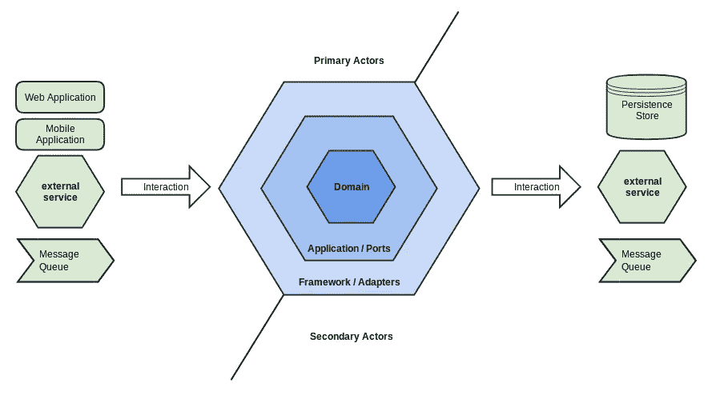

# 六边形架构的 Flask 博客教程(第 3 部分)

> 原文：<https://blog.devgenius.io/flask-blog-tutorial-with-hexagonal-architecture-part-3-9a265f0c4b95?source=collection_archive---------8----------------------->



图片来自:[http://thinkmicroservices . com/blog/2019/hexagon-architecture . html](http://thinkmicroservices.com/blog/2019/hexagonal-architecture.html)

[该项目的 GitHub 回购](https://github.com/ShahriyarR/hexagonal-flask-blog-tutorial)

在本系列的[第一部分](https://rzayev-sehriyar.medium.com/flask-blog-tutorial-with-hexagonal-architecture-part-1-6446e7e9aaaa)中，我们已经推出了使用六角形架构重写原始 [Flask 博客教程](https://flask.palletsprojects.com/en/2.2.x/tutorial/)的想法和初始代码库。构建了端口和域模型

在[第二部分](/flask-blog-tutorial-with-hexagonal-architecture-part-2-8930ca009c27)中，我们已经实现了适配器，Flask app 端点已经准备就绪。

在第三部分，也是最后一部分，我们将使用依赖注入容器将每个部分连接在一起，启动我们的应用程序。

# 用户容器

我们将有一个 post 和用户容器，分别命名为`src/main/user_containers.py`和`src/main/post_containers.py`。

让我们看看`src/main/user_containers.py`有什么:

我们引入了`db_conn`作为一个“虚拟”依赖，它将被主容器中的实际实现所取代。

> `*src/main/containers.py*`T27 这是主容器

我们记得`UserRepostory`接受实际的数据库连接作为依赖关系:

在`UserContainer`中，我们正在初始化`UserRepository`，将`db_conn`作为“虚拟”依赖注入:

接下来，我们需要创建带有用户存储库的`UserService`实例，因为这是我们服务的依赖项:

再次注意，用户服务不依赖于具体的`UserRepository`，而是依赖于`RepositoryInterface`，这是一个明显的依赖倒置原则。

在我们的`UserContainer`中，由于我们已经创建了`user_repository`作为`UserRepository`(它是一个`RepositoryInterface`)的提供者，这意味着，我们可以将它注入到`UserService`:

# 后集装箱

现在我们来看看`src/main/post_containers.py`:

思路同上，我们首先创建`db_conn`“虚拟”依赖，然后用这个`db_conn`初始化`PostRepository`。

最后，从`PostService`创建`post_service`提供者，并将`post_repository`作为依赖项传递给`PostService`。

# 主容器

主依赖注入器容器位于`src/main/containers.py`:

第一行`containers.WiringConfiguration`请看这里:[布线配置](https://python-dependency-injector.ets-labs.org/wiring.html#wiring-configuration)

> 我们一会儿将探讨它，现在请阅读文档。

请注意`db_connection = get_db()`，如果您还记得在`UserContainer`和`PostContainer`中，我们将`db_conn`定义为一个“虚拟”依赖。但是现在，我们有了具体的、真正的 DB 连接，我们已经将它注入到容器中。

结果，我们有了`user_package`和`blog_package`，它们存储了各自初始化的真实依赖关系。

# 烧瓶中的 PoC 终点:

回到`register`终点(`src/adapters/app/blueprints/auth.py`):

注意它是如何从主容器中注入的:`Container.user_package.user_service`。这个实际的注射发生了。

# Flask create_app 工厂中的 PoC

在我们已经初始化 Flask 应用程序的`src/adapters/app/application.py`中，有一个代码部分:

这是初始化的主容器，它会自动将我们的烧瓶蓝图与 DI 容器连接在一起。

我们已经提供了蓝图的路径。

# 运行应用程序

剩余步骤:

*   初始化数据库

`flask --app src.adapters.app.application init-db`

已初始化数据库。

*   启动开发服务:

`flask --app src.adapters.app.application --debug run`

```
* Serving Flask app 'src.adapters.app.application'
 * Debug mode: on
WARNING: This is a development server. Do not use it in a production deployment. Use a production WSGI server instead.
 * Running on http://127.0.0.1:5000
Press CTRL+C to quit
```

这对我们来说是一次真正的旅程，让我们总结一下迄今为止我们所取得的成就:

*   我们已经实现了简单的六角形架构的博客 web 应用程序。
*   我们已经分离了应用程序的几乎每一部分。
*   从现在起，您可以自由地将 Flask 更改为瓶子或金字塔:只需更改 DI 容器连接并创建端点。
*   从现在开始，很容易从 SQLite 切换到 PG 或 MySQL:只需实现 MySQL 或 PG 存储库，并在相关的地方注入它们。