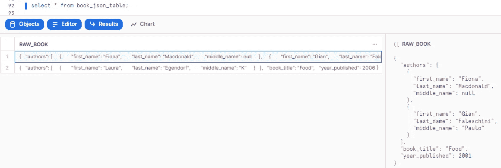
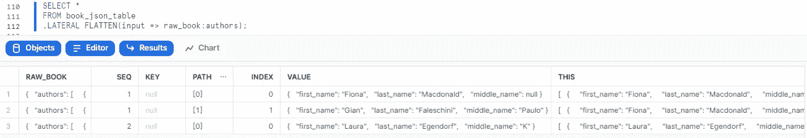
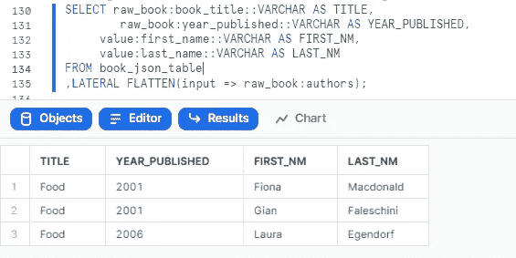

# 在雪花中展平 JSON 数据

> 原文：<https://blog.devgenius.io/flatten-json-data-in-snowflake-e42fd128d328?source=collection_archive---------1----------------------->


2022 年 12 月 11 日，安大略省皮克林市西顿远足径

半结构化数据(通常像 JSON 和 XML)可以在 Snowflake 中轻松处理。这里的“容易处理”是指数据中的“名称”和“值”对可以直接通过使用 SQL 语句来检索。snow flat table 函数将用于这样做，尤其是对于“嵌套”半结构。

所以我们有一个 JSON 示例文件“book.json”如下——文件简化自[雪花数据仓库工作坊](https://learn.snowflake.com/courses/course-v1:snowflake+ESS_DWW_101+2021/course/)。它在一个 JSON 数组中有两个 book 记录。每本书都有书名、出版年份和作者。第一本书有两个作者包含在一个数组中，而第二本书只有一个作者。

注意，作者位于嵌套在外部顶级数组中的数组中，因此他们将数据文件称为嵌套 JSON 文件。

```
[{
  "book_title":"Food",
  "year_published":2001,
  "authors": [
 {
     "first_name":"Fiona",
     "middle_name":null,
     "last_name":"Macdonald"
   },
  {
     "first_name":"Gian",
     "middle_name":"Paulo",
     "last_name":"Faleschini"
   }
 ]
 },
{
  "book_title":"Food",
  "year_published":2006,
  "authors": 
 [{
     "first_name":"Laura",
     "middle_name":"K",
     "last_name":"Egendorf"
   }
 ]
 }]
```

我们已经将它保存在笔记本电脑上，所以首先我们可以在雪花中创建一个内部命名阶段，并在笔记本电脑上使用 SnowSQL CLI 工具将文件上传到那里。

在雪花中创建内部命名阶段“xml_json_stage”

```
// Create Snowflake internal named stage
create or replace stage xml_json_stage;
list @xml_json_stage;
```

使用 SnowSQL 将文件“book.json”放入内部命名阶段“xml_json_stage”

```
C:\snowflake\badge1>snowsql -a ABC12345.us-east-1 -u fengliplatform
Password:
* SnowSQL * v1.2.24
Type SQL statements or !help
fengliplatform#(no warehouse)@(no database).(no schema)>put file://book.json @feng_database.feng_schema.xml_json_stage;
+-----------+--------------+-------------+-------------+--------------------+--------------------+----------+---------+
| source    | target       | source_size | target_size | source_compression | target_compression | status   | message |
|-----------+--------------+-------------+-------------+--------------------+--------------------+----------+---------|
| book.json | book.json.gz |         440 |         224 | NONE               | GZIP              | UPLOADED |         |
+-----------+--------------+-------------+-------------+--------------------+--------------------+----------+---------+
1 Row(s) produced. Time Elapsed: 1.204s
```

回到雪花，在工作表中运行下面的 SQL 来加载 JSON book 数据。

```
// Create table for JSON book data
create or replace table book_json_table 
(
  raw_book variant
);

// Create JSON file format telling Snowflake how to understand the data file
create or replace file format json_file_format
    type='json'
    strip_outer_array = true;

// Copy JSON data file to internal named stage
copy into book_json_table
    from @xml_json_stage
    files = ('book.json.gz')
    file_format=(format_name = 'json_file_format');

// See what we have in the table
select * from author_json_table;
```

正如所料，Snowflake 使用一个变量列将每个 book 记录作为对象保存——尽管它们不是字符串或文本。



雪花使用一个变量列来保存每个图书记录

我们如何检索有用的书名、出版年份和作者信息，并更好地组织它们以供进一步分析？

我们可以在“select”中使用“raw_book:book_title”、“raw_book:year_published”来获取书名和出版年份。我们可以使用“raw_book:authors”来获得 authors 数组，甚至可以使用“raw_book:authors[0]”。first_name "来获取第一作者的名字…但是对于“[0]”或“[1]”，您必须指定它不可编程。

所以对于 JSON 文件中的嵌套数据，我们将使用雪花展平函数。Flatten 函数检索数组中的每个元素，并将它们变成一行。所以它返回一个包含这些行的“表”结果。

“表格”结果中有哪些列？它们是 SEQ、键、路径、索引、THIS 和值。如果我们对嵌套数组“raw_book:authors”运行 flatten 函数，我们将看到…

```
SELECT * FROM book_json_table, LATERAL FLATTEN(input => raw_book:authors);
```



flatten 函数返回嵌套数据元素“raw_book:authors”

现在，我们只关心“值”列，这是另一个“变量”数据，我们可以使用正常的“:”来检索信息，如“值:名字”。

让我们运行另一个 SQL，如下所示

```
SELECT raw_book:book_title::VARCHAR AS TITLE, 
       raw_book:year_published::VARCHAR AS YEAR_PUBLISHED, 
     value:first_name::VARCHAR AS FIRST_NM, 
     value:last_name::VARCHAR AS LAST_NM
FROM book_json_table
,LATERAL FLATTEN(input => raw_book:authors);
```



从关系的角度看图书信息

你可能已经注意到，第一本书的标题和出版年份在作者的每一行都是重复的。这是展平功能所期望的。

最后，我们将创建一个雪花视图来进一步分析数据。对于半结构化数据，这是在表的顶部创建视图的最佳实践。

```
create or replace view book_view as
  SELECT raw_book:book_title::VARCHAR AS TITLE, 
         raw_book:year_published::VARCHAR AS YEAR_PUBLISHED, 
     value:first_name::VARCHAR AS FIRST_NM, 
     value:last_name::VARCHAR AS LAST_NM
  FROM book_json_table
  ,LATERAL FLATTEN(input => raw_book:authors);
```

快乐阅读！

[](https://medium.com/@fengliplatform/membership) [## 通过我的推荐链接-李冯加入媒体

### 写作帮助我们自己，分享帮助很多人。从我自己的学习笔记开始，没有要求完美的压力…

medium.com](https://medium.com/@fengliplatform/membership)