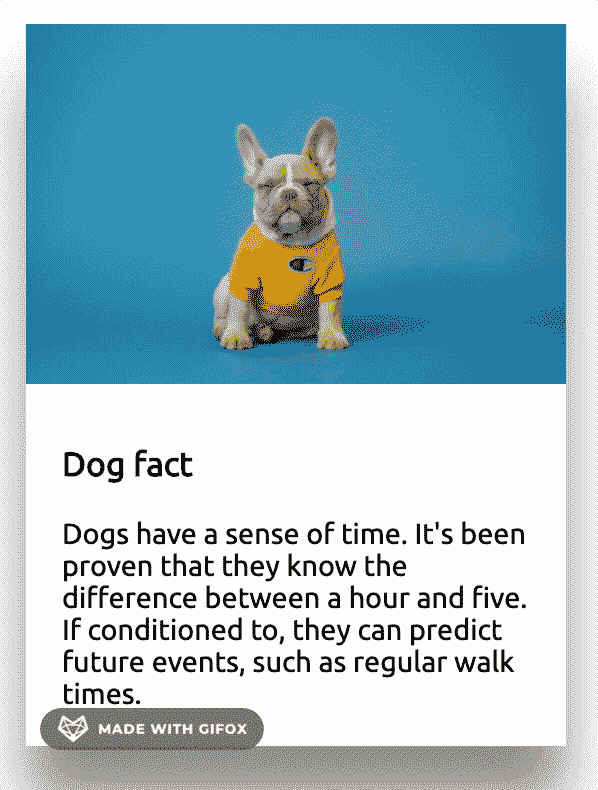
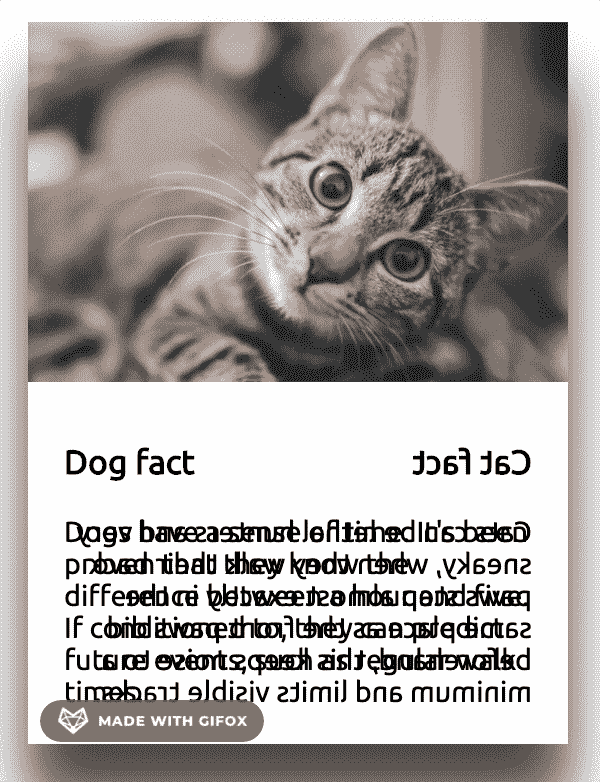
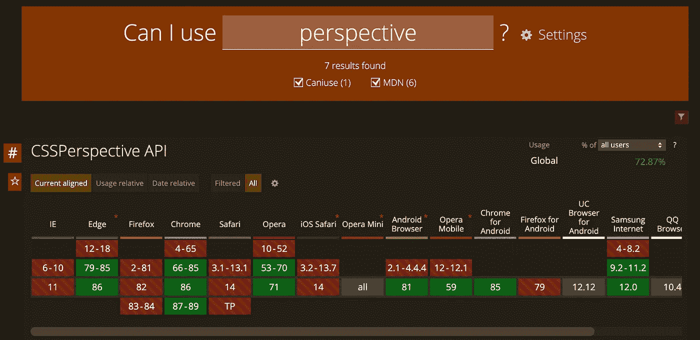
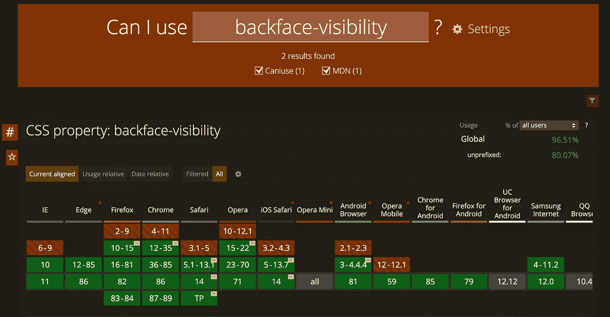

# 在悬停 CSS 上翻转卡片

> 原文：<https://blog.devgenius.io/flipping-card-on-hover-css-8b57043e1dcc?source=collection_archive---------0----------------------->

CSS **透视**和**背面可见性**在起作用


照片由[史蒂文·韦尔奇](https://unsplash.com/@stevewelch?utm_source=medium&utm_medium=referral)在 [Unsplash](https://unsplash.com?utm_source=medium&utm_medium=referral) 拍摄

在这篇文章中，我将向你展示如何翻转一张卡片，并在旋转时给它一个 3d 的外观。一些 CSS 术语在这里会派上用场，如透视和背面可见性，我将在文章中解释。让我们开始吧。

## 基本卡

这是我们将要使用的标记。我不会深入这种卡片风格的本质，因为这是非常基本的东西。

## 翻转卡片

翻转卡片就像对卡片应用一个**转换**属性一样简单。我们将在卡片悬停上实现这个效果。

```
.card:hover .card-content {
    transform: rotateY(180deg);
}
```

添加过渡以平滑效果:

```
.card-content {
   box-shadow: 0 2rem 2rem rgba(0, 0, 0, .5);
   **transition: all 2s;**
}
```

这是它在悬停时的行为方式:



卡片动画

它在旋转，但缺乏美感。我们希望它模拟一个真正的卡片翻转，并希望它弹出屏幕，给人一种 3D 的感觉。这就是透视 CSS 属性派上用场的地方。

> **perspective 属性用于为 3D 定位的元素提供一些透视效果。它定义了物体离用户有多远。**

> 注意:当定义元素的透视图属性时，是子元素获得透视图，而不是元素本身。

让我们为卡片类添加视角:

```
.card {
    **perspective: 1000px;**
    width: 300px;
}
```

此处，较高的值会导致 3D 效果不如较低的值强烈。你可以调整它的值，看看有什么不同。

# 将背面添加到卡片上

现在我们想在卡片旋转后展示一些别的东西。

我知道你们中的一些阅读这篇文章的人一定是猫迷，所以我想在卡片的背面加上一只猫。这是我们的标记现在的样子:

只是在卡片背面增加了一个包含卡特彼勒信息的内容。

目前整个卡片内容是垂直放置的，但是我们想要的是卡片的两边互相重叠。向 card-content 类添加一些定位可以解决这个问题:

```
.card{
    **postition:reative;**
}.card-content {
    box-shadow: 0 2rem 2rem rgba(0, 0, 0, .5);
    transition: all 2s;
    **position:absolute;
    top:0;
    left:0;
    width:100%;**
}
```

现在剩下的就是根据卡片是正面还是背面来旋转卡片的两面:

```
.card-back{
    transform:rotateY(180deg);//to rotate it towards right
}.card:hover .card-front {
    transform: rotateY(-180deg); //to rotate it towards left
}.card:hover .card-back {
    transform: rotateY(0);// show backside of card on hover
}
```

我们最终得到的并不完全是我们最初所期望的。即使旋转，也只能看到卡片的背面:



卡片动画

这就是我们可以在 CSS 中利用背面可见性属性的地方。

> **back face-visibility 属性定义当面向用户时，元素的背面是否应该可见。**

将它添加到 card-content 类解决了这个小问题:

```
.card-content {
    box-shadow: 0 2rem 2rem rgba(0, 0, 0, .5);
    transition: all 2s;
    position:absolute;
    top:0;
    left:0;
    width:100%;
    **backface-visibility: hidden;** }
```

## 关于所使用的 CSS 属性的说明

请注意浏览器是如何全面接受透视和背面可见性属性的。这里是[can use](https://caniuse.com/)参考:



https://caniuse.com/?search=perspective



【https://caniuse.com/?search=backface-visibility 