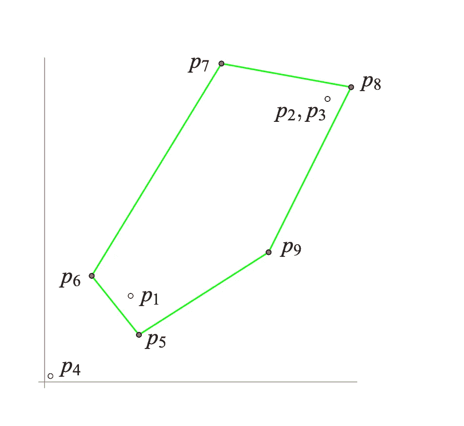
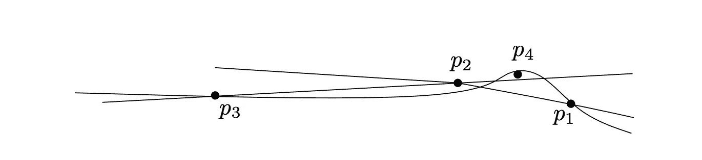

# 几何算法中的浮点舍入误差

> 原文：<https://blog.devgenius.io/floating-point-round-off-errors-in-geometric-algorithms-a8779662904b?source=collection_archive---------10----------------------->


吃菠菜，打造你的凸包——水手大力水手。

# 几何算法中的浮点精度

大多数几何算法是为精确的实数运算而设计的；用浮点运算替换它们可能会导致这些实现失败。不幸的是，没有关于几何算法中什么会出错以及为什么出错的文档。这篇文章的其余部分讨论了用浮点运算执行几何算法时会出现什么问题。

为了使解释简单，考虑给定点集`S`的凸包算法，该点集是可以包含`S`所有点的最小多边形；`S`的极值点是凸包多边形的顶点；凸包内部的所有点都被简单地丢弃了。

通常，由浮点实现计算的凸包可能会遗漏一些极值点，计算非凸多边形，或者算法可能会永远运行。

# 增量式平面凸包算法

凸包增量算法保持目前所见点的当前凸包(`CH`)。最初，在`S`中选择三个不共线的点形成一个凸包。然后，它会逐个考虑其余的点。当考虑一个点`r`时，首先确定`r`是否在当前凸包多边形之外。如果没有，`r`被丢弃。否则，通过形成从`r`到`CH`的切线来更新凸包。该算法以逆时针顺序将当前外壳保持为其极值点的循环列表`L = (v0, v1,. . .,vk−1)`，其中线段`(vi, vi+1)`是当前外壳的边缘。

# 单步失败

违反算法正确性的一个实例。考虑一个点的序列:`p1, p2, p3, . . .`，使得前三个点形成一个逆时针的三角形，并且一些后面的点的插入导致一个正确性属性的违反(因为浮点)。导致违规的示例总是涉及几乎或真正共线的点；明确地说，足够不共线的点不会引起任何问题。尽管这些示例看起来不现实，但它主要取决于容许舍入误差的要求，因为点集可能包含近似共线的点或真正共线的点，这些点通过转换为浮点表示法变得近似共线。

# 浮动方向的几何图形

平面上的三个点`p = (px, py)`、`q = (qx, qy)`、`r = (rx, ry)`位于同一条直线上或形成左转或右转。

三联体`(p, q, r)`的方向由下式定义:

```
orientation(p,q,r) = sign((qx − px)(ry − py)−(qy − py)(rx − px)).
```

然而，对于浮点运算，由于可能的舍入误差，`float_orient`的结果有三种可能与正确的方向不同:

*   舍入为零:将`+`或`−`误分类为`0`
*   扰动零点:将`0`误分类为`+`或`−`
*   符号倒置:将`+`误分类为`−`，反之亦然。

`float_orient`，换句话说，三相点分为左转、右转或共线。

# 失败 1:当前外壳之外的点看不到当前凸包的边缘

考虑一组点:

```
p1 = (7.3000000000000194, 7.3000000000000167) 
p2 = (24.000000000000068, 24.000000000000071) 
p3 = (24.00000000000005, 24.000000000000053) 
p4 = (0.50000000000001621, 0.5000000000)
p5 = (8, 4) 
p6 = (4, 9) 
p7 = (15, 27) 
p8 = (26, 25) 
p9 = (19, 11)
```

方向:

```
float_orient(p1, p2, p3) > 0 
float_orient(p1, p2, p4) > 0 
float_orient(p2, p3, p4) > 0 
float_orient(p3, p1, p4) > 0 (??)
```



图 1:计算机凸包

上图显示了计算出的凸包，其中一个明显极端的点被排除在凸包之外；`p1 ≈ (17, 17), p2 ≈ (24, 24) ≈ p3`

前四点几乎位于直线上:y = x，`float_orient`显示上述结果。如`(??)`所示，上次评估有误。几何上，这些评估意味着`p4`看不到三角形`(p1, p2, p3)`的边。然后，点`p5, . . . , p9`被正确识别为极值点，并被添加到船体。然而，该算法从未从考虑`p4`时产生的错误中恢复过来，并且计算结果与正确的船体相差很大。

# 失败 2:当前外壳内的一点看到当前外壳的边缘

取一个逆时针的三角形(最初)，选择三角形内的第四个点，但非常靠近其中一条边。存在符号反转的可能性。例如，考虑一组点:

```
p1 = (27.643564356435643, −21.881188118811881 ) 
p2 = (83.366336633663366, 15.544554455445542 ) 
p3 = ( 4.0, 4.0 ) 
p4 = (73.415841584158414, 8.8613861386138595)
```

方向:

```
float orient(p1, p2, p3) > 0 
float orient(p1, p2, p4) < 0 (??) 
float orient(p2, p3, p4) > 0 
float orient(p3, p1, p4) > 0
```

凸包被正确初始化为`(p1, p2, p3)`。点 p4 位于当前凸包内，但算法错误地认为`p4`可以看到边缘`(p1, p2)`，因此将凸包更改为`(p1, p4, p2, p3)`，一个略微非凸的多边形。

# 失败 3:当前外壳之外的点看到了凸包的所有边缘

考虑一组点:

```
p1 = ( 200.0, 49.200000000000003) 
p2 = ( 100.0, 49.600000000000001) 
p3 = (−233.33333333333334, 50.93333333333333 ) 
p4 = ( 166.66666666666669, 49.333333333333336)
```

方向:

```
float orient(p1, p2, p3) > 0 
float orient(p1, p2, p4) < 0 
float orient(p2, p3, p4) < 0 
float orient(p3, p1, p4) < 0 (??)
```



图 2:故障 3 的示意图:点 p4 看到三角形的所有边(p1，p2，p3)

前三个点形成一个逆时针方向的三角形，根据`float_orient`，算法认为`p4`可以看到三角形的所有边。

# 失败 4:当前外壳之外的点看到一组不连续的边

考虑一组点:

```
p1 = (0.50000000000001243, 0.50000000000000189) 
p2 = (0.50000000000001243, 0.50000000000000333) 
p3 = (24.00000000000005, 24.000000000000053) 
p4 = (24.000000000000068, 24.000000000000071) 
p5 = (17.300000000000001, 17.300000000000001)
```

方向:

```
float_orient(p1, p4, p5) < 0 (??) 
float_orient(p4, p3, p5) > 0 
float_orient(p3, p2, p5) < 0 
float_orient(p2, p1, p5) > 0
```

插入前三个点，然后插入第四个点`p4`，得到凸四边形`(p1, p4, p3, p2)`，这是正确的。最后一点，`p5`，只看到边缘`(p3, p2)`，其他三个都看不到。然而，`float_orient`使得`p5`也能看到边缘`(p1, p4)`。可见边和不可见边的子序列不连续。由于错误分类的边`(p1, p4)`首先出现，该算法在该边插入`p5`，不移除其他顶点，并返回一个具有自相交的多边形。

# 外卖

如上所述，算法可能会因为舍入误差而失败，以用浮点运算简单实现的凸包算法为例。

和往常一样，C++代码的参考，以及由于舍入误差而失败的凸算法的变体和如何防止它可以在这里找到:[https://github.com/addu390/rounding-errors](https://github.com/addu390/rounding-errors)

作为扩展，考虑使用精确浮点(`MP_Float`)来尝试 CGAL 库。

最后，帖子总结了[1]和[2]。这是我作为助教在开发 CSCI 6105 实验室指令时偶然发现的。

# 参考资料:

> [1]《凸包计算中的鲁棒性问题》，ww wisg . cs . uni-magdeburg . de .[http://ww wisg . cs . uni-magdeburg . de/ag/class room example/# kett ner 2008](http://wwwisg.cs.uni-magdeburg.de/ag/ClassroomExample/#Kettner2008)(2022 年 3 月 11 日访问)。
> 
> [2] L. Kettner，K. Mehlhorn，S. Pion，S. Schirra 和 C. Yap，“几何计算中鲁棒性问题的课堂示例”，《计算几何》，第 40 卷，第 1 期，第 61-78 页，2008 年 5 月，doi:10.1016/j . com geo . 2007 . 06 . 003
> 
> [3]《浮点指南—精确类型》，浮点 GUI . de .[https://floating-point-gui.de/formats/exact/](https://floating-point-gui.de/formats/exact/)(2022 年 3 月 11 日访问)。