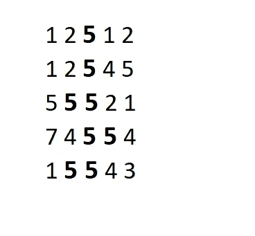
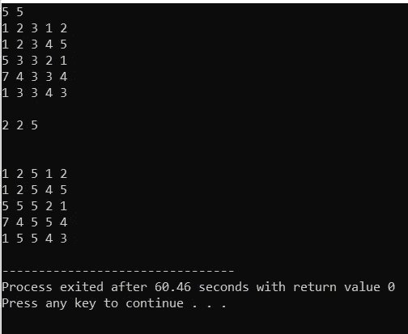

# 洪水填充算法

> 原文：<https://blog.devgenius.io/flood-fill-algorithm-f73817d6a707?source=collection_archive---------10----------------------->

Hello medium，

今天我要讨论一个非常精彩的算法“**洪水填充算法**”。它也被称为“**种子填充**”。给我们一个 2D 屏幕**数组[][]** ，其中每个**数组[i][j]** 代表给定屏幕像素的颜色，现在给我们任意像素 **(X，Y)** 的位置和一个颜色 **K** ，要求我们用给定颜色 **K** 替换给定像素的颜色以及与给定像素相邻的所有具有相同颜色的像素的颜色。

对于 ex:

我们有一个 5 * 5 大小的数组，代表一个像素屏幕

从 0 开始索引，在替换像素(2，2)及其所有相邻像素后，我们得到 x=2，y=2 和 k=5

**如何接近**:

我们可以使用广度优先搜索。首先，我们将替换给定像素的颜色，然后我们将递归地转到它的所有相邻像素，并检查它是否具有相同的颜色，如果它与目标像素具有相同的颜色，那么我们将用新的颜色替换它，并再次调用它的所有相邻像素。

**代码:**

这里，由于我们无法找到索引**小于** **零或大于等于 n 的像素(因为它不存在)**，所以我们的最佳情况是 i==0||j==0||i==n-1||j==n-1

最后输出上述例子…..

谢谢你…