# 流程图、伪代码和程序，帮助您开始使用 C

> 原文：<https://blog.devgenius.io/flowcharts-pseudocodes-and-programs-to-get-you-started-in-c-88c5582af662?source=collection_archive---------12----------------------->

想开始写 C 程序？读读这个。

照片由 [Fotis Fotopoulos](https://unsplash.com/@ffstop?utm_source=medium&utm_medium=referral) 在 [Unsplash](https://unsplash.com?utm_source=medium&utm_medium=referral) 上拍摄

如果你是从编程开始，那么学习 C 或 C++或 JAVA 是有益的。这些语言很难学，有时会令人沮丧，但最好通过学习 OG 语言(现代语言从这些语言发展而来)开始学习编码，我选择了 C，因为我在第一学期接触了 C。如果你已经选择了 C 开始，你不知道如何开始，继续阅读。

下面是 5 个 C 语言的基本程序以及流程图和伪代码。流程图基本上是一个问题解决方案的可视化表示。你有一个问题，你想出了一个解决方案。使用符号和箭头直观地表示逐步解决方案的是流程图。

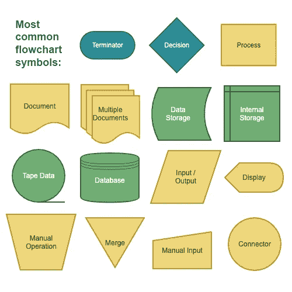

流程图中的符号

现在，什么是伪代码？伪代码，用更简单的话来说，基本上就是一个问题的粗略解决方案。它介于算法和实际代码之间。它不像我们在编写实际代码时那样关注细节。你不用分号，不用数据类型声明变量，不用大括号。基本上就是一个大概的轮廓/草图就可以知道程序背后的逻辑。

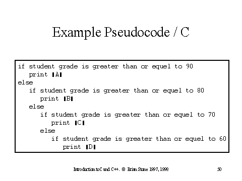

伪代码的简单示例

现在，让我们言归正传。下面是 5 个简单的 C 语言程序，它们是我作为社区教室提供的作业编写的，带有手绘流程图和伪代码，可以帮助你开始使用 C 语言。

1.  **取两个数字作为输入，打印两者之和**

**流程图:**

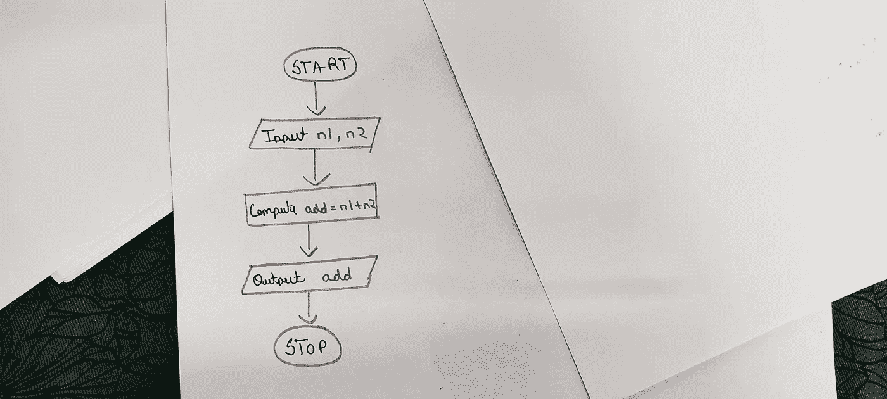

**伪代码:**

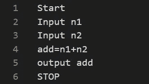

**程序:**

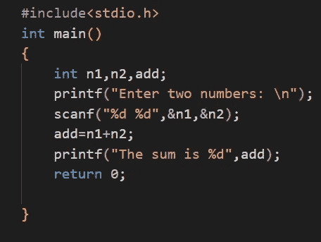

**2)输入年份，查找是否是闰年:**

**流程图:**

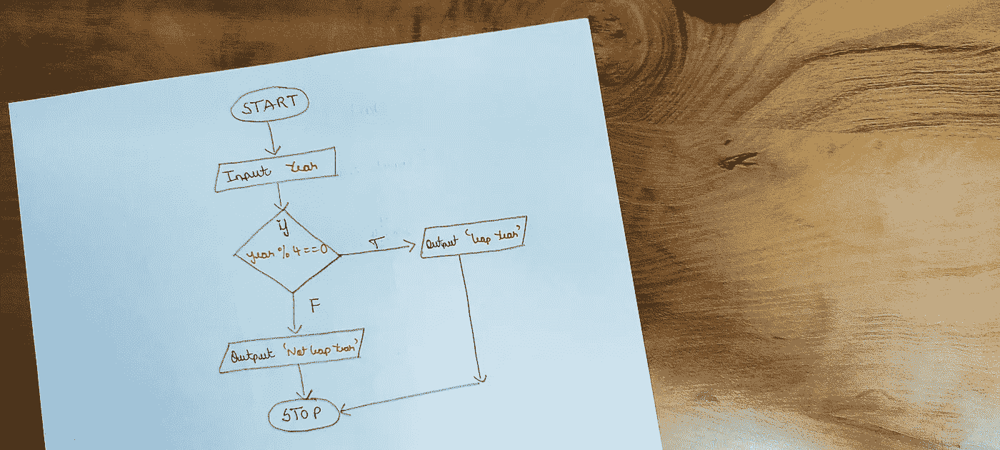

**伪代码:**

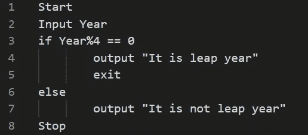

**程序:**

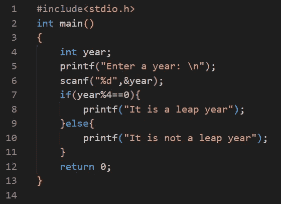

3)输入一个数字，打印出它的乘法表

**流程图:**

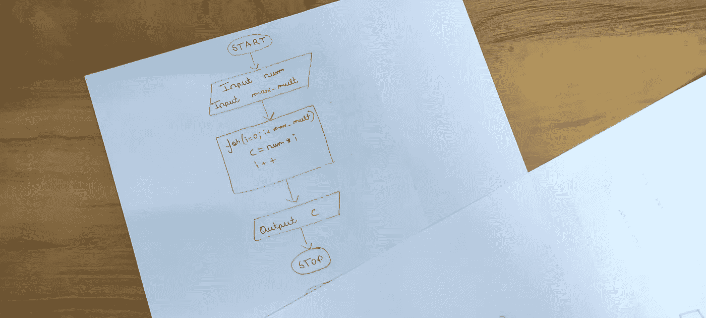

**伪代码:**

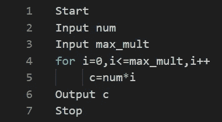

**程序:**

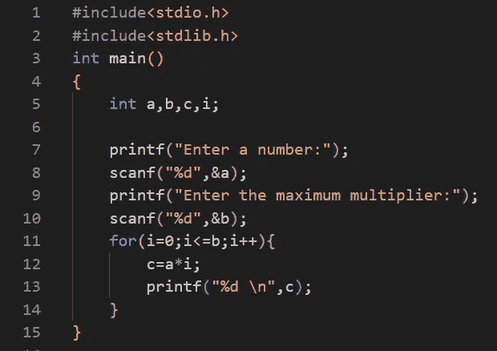

**4)取 2 个数作为输入，求它们的 HCF 和 LCM**

**流程图:**

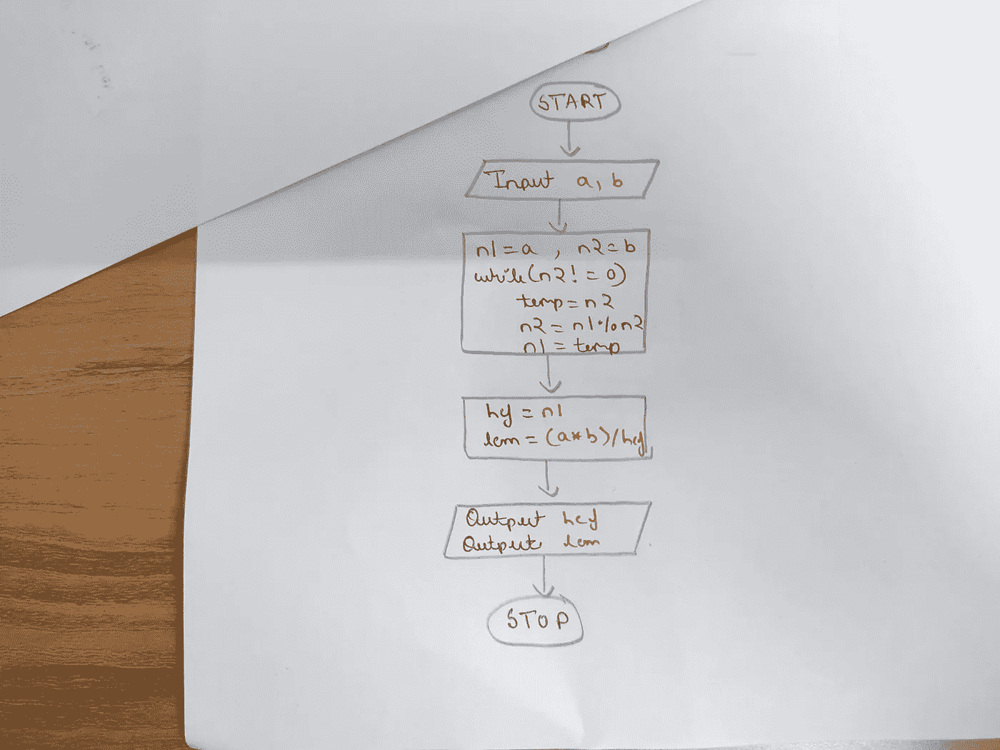

**伪代码:**

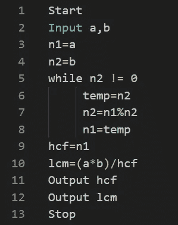

**程序:**

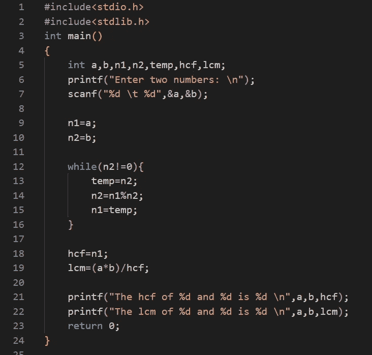

**5)继续输入数字，直到用户输入“x ”,然后打印所有数字的总和。**

**流程图:**

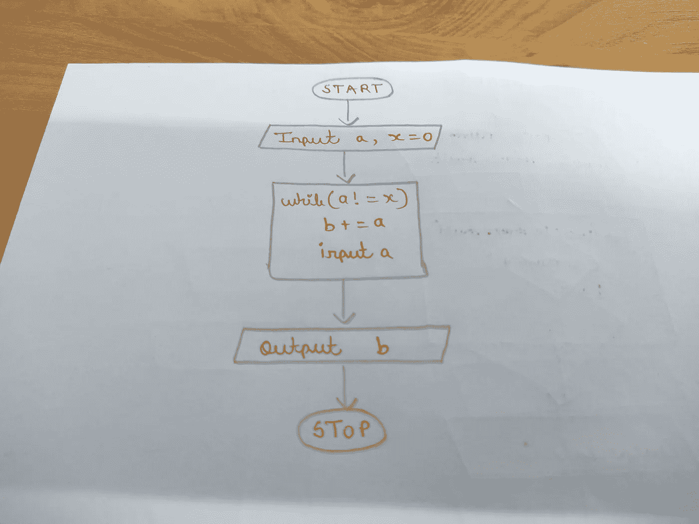

**伪代码:**

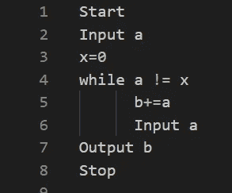

**程序:**

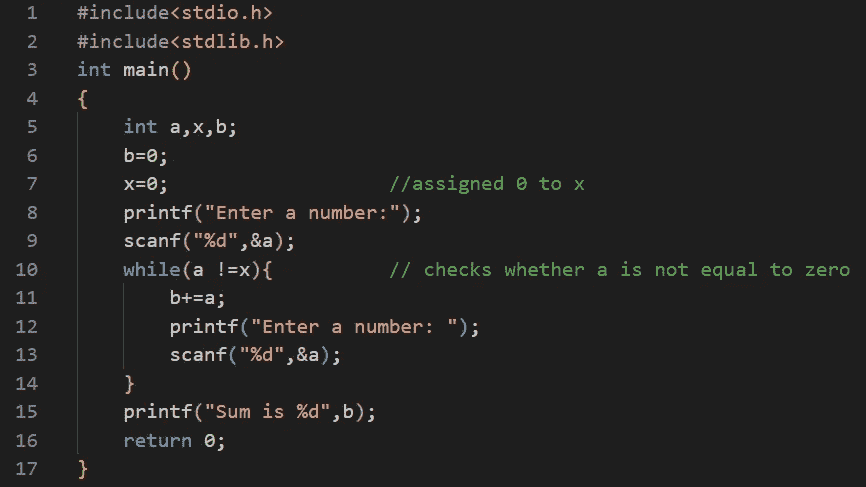

上面给出了所有带流程图和伪代码的 5 C 程序。当你练习这些程序时，要理解程序背后的逻辑。例如，在最后一个程序中，提问并总结当 a == x 时会发生什么。你可以通过编写自己的代码并自己找到它来做到这一点。测试，分析，迭代。如果你在上面的代码中发现任何错误或问题，请在评论中提出。乐意修改。祝你编码好运！