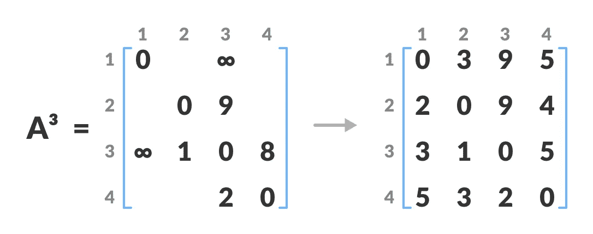

# 弗洛伊德·沃肖尔算法

> 原文：<https://blog.devgenius.io/floyd-warshall-algorithm-f004a01ae40e?source=collection_archive---------1----------------------->

## 最短路径算法


困惑选择从您的位置到目的地的最短路径？。那么，你应该知道这个算法。

*   Floyd–Warshall 算法用于查找图中所有顶点对之间的最短路径，其中图中的每条边都有一个正或负的权重。
*   使用该算法的最大优点是任意两个顶点之间的所有最短距离都可以在 O(V3)中计算，其中 V 是图中顶点的数目。
*   弗洛伊德-沃肖尔算法也被称为弗洛伊德算法、罗伊-弗洛伊德算法、罗伊-沃肖尔算法或 WFI 算法。
*   该算法遵循动态规划方法来寻找最短路径。

## 算法

对于具有 N 个顶点的图:

**步骤 1:** 初始化任意 2 个顶点之间的最短路径为无穷大。

**步骤 2:** 找出所有使用 0 个中间顶点的成对最短路径，然后找出使用 1 个中间顶点的最短路径，依此类推..直到使用所有 N 个顶点作为中间节点。

**第三步:**在前一步操作中，最小化任意两对之间的最短路径。

**步骤 4:** 对于任意 2 个顶点(I，j)，实际上应该使用前 K 个节点最小化该对之间的距离，因此最短路径将是:min(dist[i][k]+dist[k][j]，dist[i][j])。

dist[i][k]表示仅使用前 K 个顶点的最短路径，dist[k][j]表示对 K，j 之间的最短路径。因为最短路径将是从 I 到 K，然后从 K 到 j 的最短路径的串联。

```
for(int k = 1; k <= n; k++){
    for(int i = 1; i <= n; i++){
        for(int j = 1; j <= n; j++){
            dist[i][j] = min( dist[i][j], dist[i][k] + dist[k][j] );
        }
    }
}
```

## 例子

设给定的图形为:


按照下面的步骤找到所有顶点对之间的最短路径。

1.  创建一个维度为`n*n`的矩阵`A0`，其中 n 是顶点的数量。行和列的索引分别为 I 和 j。I 和 j 是图的顶点。

每个单元格 A[i][j]都填充了从`ith`顶点到`jth`顶点的距离。如果没有从`ith`顶点到`jth`顶点的路径，则该单元被保留为无穷大。


2.现在，使用矩阵`A0`创建一个矩阵`A1`。第一列和第一行中的元素保持不变。其余的单元格按以下方式填充。

设 k 是从源到目的地的最短路径中的冻结顶点。在这一步，k 是第一个顶点。`A[i][j]`填的是`(A[i][k] + A[k][j]) if (A[i][j] > A[i][k] + A[k][j])`。

也就是说，如果从源到目的地的直接距离大于通过顶点 k 的路径，那么用`A[i][k] + A[k][j]`填充该单元。

这一步，k 是顶点 1。我们通过这个顶点 k 计算从源顶点到目的顶点的距离。


例如:对于`A1[2, 4]`，从顶点 2 到 4 的直接距离是 4，从顶点 2 到 4 通过顶点(即从顶点 2 到 1 和从顶点 1 到 4)的距离之和是 7。从`4 < 7`开始，`A0[2, 4]`就充满了 4。

3.以类似的方式，使用`A3`创建`A2`。第二列和第二行中的元素保持不变。

在这个步骤中，k 是第二个顶点(即顶点 2)。其余步骤与**步骤 2** 相同。


4.类似地，`A3`和`A4`也被创建。



5.`A4`给出每对顶点之间的最短路径。

困惑选择最短路径，然后使用下面的代码来找到它。但是输入正确的距离。

## 时间复杂度

有三个循环。每个循环都有恒定的复杂性。因此，Floyd-Warshall 算法的时间复杂度为 **O(n3)** 。

## 空间复杂性

Floyd-Warshall 算法的空间复杂度为 **O(n2)** 。

[](https://twitter.com/Sridharan_tsd) [## 斯里达哈兰 T

### iOS 开发者实习生@ivymobility |无神论者| F1 粉丝

twitter.com](https://twitter.com/Sridharan_tsd)