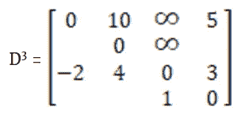
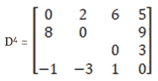

# Floyd-Warshall 全对最短路径矩阵乘法

> 原文：<https://blog.devgenius.io/floyd-warshall-all-pairs-shortest-path-matrix-multiplication-1ae24f3312e4?source=collection_archive---------5----------------------->

Floyd-Warshall 算法的目标是使用动态规划在一棵树中寻找最短路径。让我们从一个例子开始。

Floyd-Warshall 算法从收集初始权重并将其放入矩阵开始。由于有 4 个顶点，矩阵将有 4 行和 4 列。

从顶点 1 开始，该算法收集从 1 到其他 3 个顶点的初始权重。如果没有直接路径，它将为自己放置一个 0 和无穷大。从 1 到自身的边权重为 0。从 1 到 2 的边权重是 10。由于没有从 1 到 3 的直接路径，该算法将无穷大作为占位符。从 1 到 4 的边权重是 5。

第一行完成，接下来 Floyd-Warshall 算法将在顶点 2 上工作，这对应于第二行。从 2 到 1 没有直接的路径，所以放置无穷大。从 2 到自身的权重为 0。从 2 到 3 没有直接的路径，所以放置无穷大。最后，从 2 到 4 的边权重是 9。

接下来，Floyd-Warshall 算法将在对应于第三行的顶点 3 上工作。从 3 到 1 的边权重是-2。从 3 到 2 的边权重是 4。从 3 到自身的边权重为 0。最后，从 3 到 4 的边权重是无穷大，因为从 3 到 4 没有直接路径。

最后一行对应于最后一个顶点，即顶点 4。应用类似的原理。从 4 到 1 的权重是无穷大，因为从 4 到 1 没有直接路径。从 4 到 2 的边权重是-3。从 4 到 3 的边权重是 1，从 4 到自身的权重是 0。

现在，初始矩阵 D *0* 已经创建，Floyd-Warshall 算法将生成矩阵 D *1* 到 D *4* 。虽然详尽无遗，我的目标是为您提供这个过程的每一步。为了生成 D *1* ，算法将使用 D *0* 并查看是否有从 2 到 3 的更短方法，例如，从 2 到 1，然后从 1 到 3。由于算法正在构建 D *1* ，第一行和第一列被锁定，无法修改。观察对角线，它们都是 0，所以对角线不会改变，因为在所提供的图中不存在自循环。开始之前，D *1* 看起来会像下面的矩阵。

矩阵中的空白字段是 Floyd-Warshall 算法将关注的字段。

为了获得 D *1* 第 2 行第 3 列的值，执行以下操作:

*   (2，3)的值从 D *0* 中检索
*   将值 D *0* (2，3)与值 D *0* (2，1) + D *0* (1，3)的总和进行比较。**顶点 1 是这个图的中间顶点**，这意味着你将总是通过 1 来生成 D1。

*   D *0* (2，3) = D *0* (2，1) + D *0* (1，3): ∞ = ∞ + ∞
*   无穷保持在 D *1* (2，3)的位置

接下来，算法将集中于 D *1* (2，4)

由于 D *0* (2，4)小于 D *0* (2，1) + D *0* (1，4)，所以将 9 的值放入 D *0* (2，4)。

接下来，算法将关注 D *1* (3，2)。

由于 D *0* (3，2)小于 D *0* (3，1) + D *0* (1，2)，所以为 D *1* (3，2)保留 4。

接下来，算法重点是 D *1* (3，4)。

由于 D *0* (3，4) > D *0* (3，1) + D *0* (1，4)，字段 D *1* (3，4)更新为 3。

接下来，算法重点是 D *1* (4，2)。

由于 D *0* (4，2) < D *0* (4，1) + D *0* (1，2)，所以为 D *1* (4，2)保留-3。

最后，Floyd-Warshall 算法查看 D *1* (4，3)。

由于 D *0* (4，3) < D *0* (4，1) + D *0* (1，3)，所以为 D *1* (4，3)保留 1。

经过所有这些步骤，D *1* 终于完成。接下来，Floyd-Warshall 算法将创建 D *2* ，D *3* ，D *4* 。为了创建 D *2* ，算法以 D *1* 矩阵为起点，填入保证不变的数据。在这一步中保证不变的字段是对角线、第二行和第二列的值。

Floyd-Warshall 算法从通过 2 检查 D *2* (1，3)开始。

由于 D *1* (1，3) = D *1* (1，2) + D *1* (2，3)，∞为 D *1* (1，3)保留。

接下来，算法重点是 D *2* (1，4)。

由于 D *1* (1，4) < D *1* (1，2) + D *1* (2，4)，所以保留 5。

接下来，该算法关注 D2(3，1)。

由于 D *1* (3，1) < D *1* (3，2) + D *1* (2，1)，-2 被保留。

接下来，算法重点是 D *2* (3，4)。

由于 D *1* (3，4) < D *1* (3，2) + D *1* (2，4)，所以为 D *2* (3，4)保留 3。

接下来，Floyd-Warshall 算法通过遍历顶点 2 来关注 D *2* (4，1)。

由于 D *1* (4，1) = D *1* (4，2) + D *1* (2，1)，所以 D *1* 到 D *2* 没有变化。

最后，算法检查 D *2* (4，3)。

由于 D *1* (4，3) < D *1* (4，2) + D *1* (2，3)，所以保留 1。

Floyd-Warshall 算法完成 D *2* 矩阵；接下来是 T2 3 号 T3。为了创建 D *3* ，算法以 D *2* 矩阵为起点，填入保证不变的数据。在这一步中保证不变的字段是对角线、第三行和第三列的值。

Floyd-Warshall 算法从通过顶点 3 的**检查 D *3* (1，2)开始。**

由于 D *2* (1，2) < D *2* (1，3) + D *2* (3，1)，10 被保留。

接下来，算法重点是 D *3* (1，4)。

由于 D *2* (1，4) < D *2* (1，3) + D *2* (3，4)，所以保留 5。

接下来，算法重点是 D *3* (2，1)。

由于 D *2* (2，1) = D *2* (2，3) + D *2* (3，1)，所以没有变化。

接下来，算法重点是 D *3* (2，4)。

由于 D *2* (2，4) < D *2* (2，3) + D *2* (3，4)，所以保留 9。

接下来，算法的重点是 D *3* (4，1)。

由于 D *2* (4，1) > D *2* (4，3) + D *2* (3，1)，D *3* (4，1)更新为-1。

最后，算法检查 D *3* (4，2)。

由于 D *2* (4，2) < D *2* (4，3) + D *2* (3，2)，-3 被保留，算法完成 D *3* 矩阵的构造。

Floyd-Warshall 算法终于成功了。为了构造 D *4* ，算法以 D *3* 矩阵为起点，填入保证不变的数据。在这一步中保证不变的字段是对角线、第四行和第四列的值。

Floyd-Warshall 算法通过遍历顶点 4 来检查 D *4* (1，2) **开始。**

由于 D *3* (1，2) > D *3* (1，4) + D *3* (4，2)，D *4* (1，2)更新为新值 2。

接下来，算法重点是 D *4* (1，3)。

由于 D *3* (1，3) > D *3* (1，4) + D *3* (4，3)，D *4* (1，3)更新为新值 6。

接下来，算法重点是 D *4* (2，1)。

由于 D *3* (2，1) > D *3* (2，4) + D *3* (4，1)，D *4* (2，1)更新为新值 8。

接下来，算法重点是 D *4* (2，3)。

由于 D *3* (2，3) > D *3* (2，4) + D *3* (4，3)，D *4* (2，3)更新为新值 10。

接下来，算法重点是 D *4* (3，1)。

由于 D *3* (3，1) < D *3* (3，4) + D *3* (4，1)，-2 被保留。

最后，Floyd-Warshall 算法的重点是 D *4* (3，2)。

由于 D *3* (3，2) > D *3* (3，4) + D *3* (4，2)，D *4* (3，2)更新为新值 0，算法完成。

纵观整个过程，Floyd-Warshall 算法产生以下矩阵:

如果您通过将矩阵 D *4* 与树进行比较来检查矩阵 D*4*的值，您将看到从每个顶点到每个顶点的最短路径被找到。有些顶点可以一跳到达，有些要两跳，有些甚至要三跳。

*如果你喜欢你所读的，看看我的书，* [*算法说明*](https://www.amazon.com/Illustrative-Introduction-Algorithms-Dino-Cajic-ebook-dp-B07WG48NV7/dp/B07WG48NV7/ref=mt_kindle?_encoding=UTF8&me=&qid=1586643862) *。*

迪诺·卡希奇目前是 [LSBio(寿命生物科学公司)](https://www.lsbio.com/)、[绝对抗体](https://absoluteantibody.com/)、 [Kerafast](https://www.kerafast.com/) 、[珠穆朗玛生物科技](https://everestbiotech.com/)、[北欧 MUbio](https://www.nordicmubio.com/) 和 [Exalpha](https://www.exalpha.com/) 的 IT 负责人。他还担任我的自动系统的首席执行官。他有十多年的软件工程经验。他拥有计算机科学学士学位，辅修生物学。他的背景包括创建企业级电子商务应用程序、执行基于研究的软件开发，以及通过写作促进知识的传播。

你可以在 [LinkedIn](https://www.linkedin.com/in/dinocajic/) 上联系他，在 [Instagram](https://instagram.com/think.dino) 上关注他，或者[订阅他的媒体出版物](https://dinocajic.medium.com/subscribe)。

阅读 Dino Cajic(以及 Medium 上成千上万的其他作家)的每一个故事。你的会员费直接支持迪诺·卡吉克和你阅读的其他作家。你也可以在媒体上看到所有的故事。