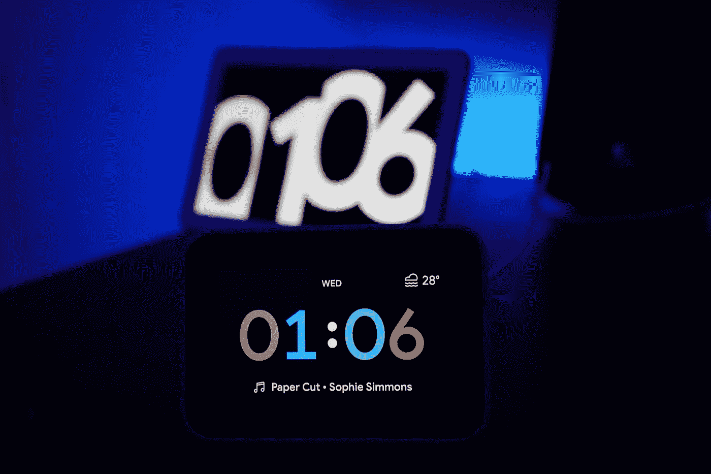

# 颤振和环境计算的未来

> 原文：<https://blog.devgenius.io/flutter-and-the-future-of-ambient-computing-15c1bfdf3029?source=collection_archive---------11----------------------->

亚辛·哈桑在 [Unsplash](https://unsplash.com?utm_source=medium&utm_medium=referral) 上的照片

环境计算是指以无缝的方式将计算机融入我们的环境，以至于我们根本不会意识到我们正在使用它们。

在过去的几十年里，我们与技术互动的方式发生了巨大的变化。从 20 世纪 90 年代末配备巨大 CRT 显示器的笨重电脑，到 21 世纪头十年的笔记本电脑，到过去十年的智能手机，以及最近的智能家居设备，如亚马逊 Alexa 或谷歌 home，我们已经走过了漫长的道路。我们用蹩脚的拨号上网登录电脑查看邮件或用 CD 听音乐的日子已经一去不复返了。今天，我们的联系比以往任何时候都更加紧密，屏幕(手机或笔记本电脑)已经成为我们日常互动中不可或缺的一部分。

随着硬件的这些进步，设计软件的重要问题来了，该软件提供高质量的用户体验(UX)和易于使用的用户界面(UI ),该用户界面可以在多种设备上无缝操作。自 2008 年以来，谷歌一直致力于通过 Android 项目为我们提供这种体验。拥有近 85%的市场份额，个人几乎不可能没有与 Android 设备互动，无论是智能手机还是平板电脑。

展望 2020 年，我们不仅有功能极其强大的智能手机，还有智能手表和智能眼镜等可穿戴技术。市面上有各种各样的产品，从 Fitbit，Apple Watch，Google Glass 等等。最重要的是，我们有不同的操作系统，如 Android、iOS、Windows、Mac 和 Linux。应用程序开发人员面临的巨大困境是开发在所有设备和操作系统上运行的应用程序。

Flutter 是一个跨平台的框架，用于为移动、网络和桌面平台开发应用程序。Flutter 于 2015 年推出，并于 2018 年底作为稳定版本发布，它是最终的 UI SDK 框架。

# 作为一名开发者，这对你意味着什么呢？

你必须为 Android、iOS、Web、Windows、Mac、Linux(很少)开发单独的应用程序的日子已经一去不复返了。使用 Flutter，您可以在为多个平台构建应用程序的同时维护单个代码库。

截至 2020 年 7 月，Flutter 在 Android 和 iOS 上运行稳定，在 Web 上测试，在 Mac 上测试，并支持 Linux 和 Windows。随着超过 [50 万开发者采用 Flutter](https://venturebeat.com/2020/04/22/google-500000-developers-flutter-release-process-versioning-changes/) ，这个框架才刚刚开始。

## 尝试 Flutter 的理由:

1.  你必须开发一个单一的代码库
    编写一个单一的代码库来支持多种设备和平台，有助于你更快地开发你的应用程序，这意味着更快的上市时间。这也意味着维护、支持和添加新特性更加容易，因为你不需要用不同的编程语言重写相同的东西。
2.  **你不需要每个平台都有开发人员** 这种观点因人而异，但对于较小的企业或初创公司来说，每个平台都有多个开发人员成本高昂，并且需要大量的后勤和沟通工作。
    有了 Flutter，你只需要一个熟悉 Dart(Flutter 使用的语言)和移动 app 开发的开发者或团队。这对初创公司来说是一个巨大的优势，因为他们可以降低成本，并拥有一支开发高质量应用的团队。
3.  **不费吹灰之力的卓越动画** Flutter 旨在以 120FPS 的速度渲染图形，这不仅令人印象深刻，而且对于开发游戏或图形密集型应用程序来说也是一大优势。有了各种各样的小工具，你可以在屏幕上实时绘制像素完美的图形，而不会丢帧。
4.  **丰富的插件** 有了 Flutter，一切都是 widget。这意味着应用程序的某些部分(即列表、网格、图像或网络工具等)可以开发为插件，以即插即用的方式在多个项目中使用。您可以在 [pub.dev](https://pub.dev/) 上找到各种各样的包，这可以节省您的开发时间，因为其他开发人员已经开发并共享了这些包。
5.  **您仍然可以编写特定于平台的代码** 如果您需要编写任何特定于平台的代码，例如 Android 版的 Java/Kotlin 和 iOS 版的 Swift，您可以轻松地将其集成到您的项目中，并使用[平台通道](https://flutter.dev/docs/development/platform-integration/platform-channels)调用这些方法。
6.  不断增长的开发者社区
    正如我上面提到的，Flutter 拥有超过 50 万的月活跃用户。它还拥有超过 100 万至少使用过一次 Flutter 的开发者，以及 Appstore 和 Playstore 上的数千款应用。随着社区的蓬勃发展，对 Flutter 的支持几乎总是可用的，并有助于您的发展。

总而言之，作为一名独立开发者或初创企业，你可以在多个平台和设备上构建漂亮而先进的应用，为用户提供无缝体验，无论他们是在移动设备上、网络上，甚至是在桌面上，而无需巨大的开销和多个开发者为单个平台服务。

附言

如果你想了解更多关于 Flutter 的知识，或者对移动或 web 应用教程感兴趣，请在回复中告诉我。我正试图通过在媒体上写作来做一些新的事情，并且很乐意与你分享我的知识。

编辑 1(2020 年 8 月 10 日):

如果你喜欢这篇文章，我已经写了一系列关于颤振的基础知识。你可以在这里查看:

1.  [适合初学者的颤振](https://medium.com/dev-genius/flutter-for-beginners-c2fae3d4d540)
2.  [微件在飘动](https://medium.com/dev-genius/widgets-in-flutter-a53e3c671f13)
3.  [导航&路由在扑](https://medium.com/dev-genius/navigation-routing-in-flutter-655f08183084)
4.  [颤振布局](https://medium.com/dev-genius/layouts-in-flutter-c65b0dc6b356)
5.  [Flutter 中的列表视图](https://medium.com/dev-genius/listviews-in-flutter-12bab3dccadc)