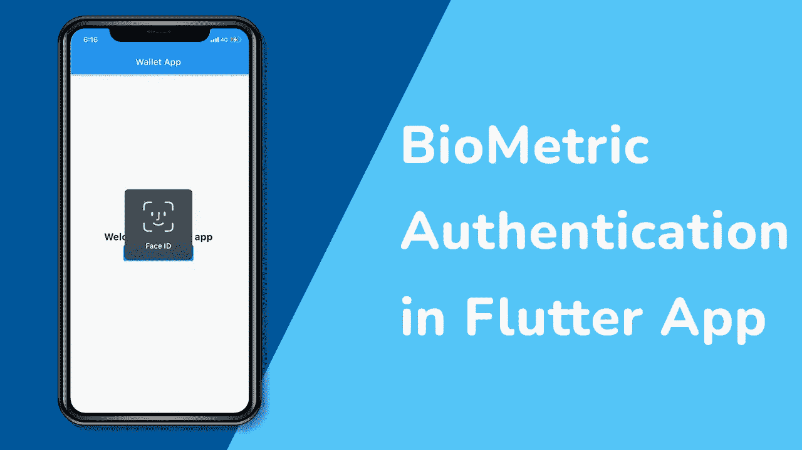
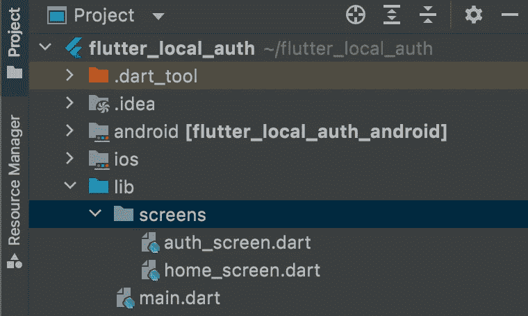
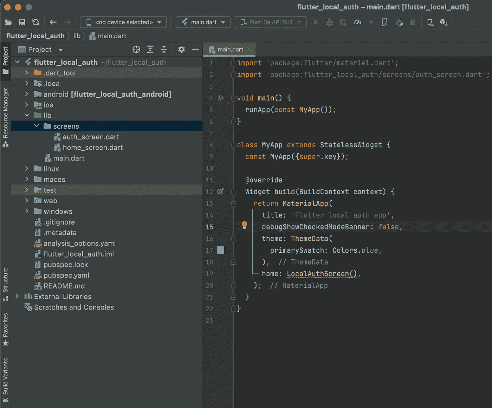
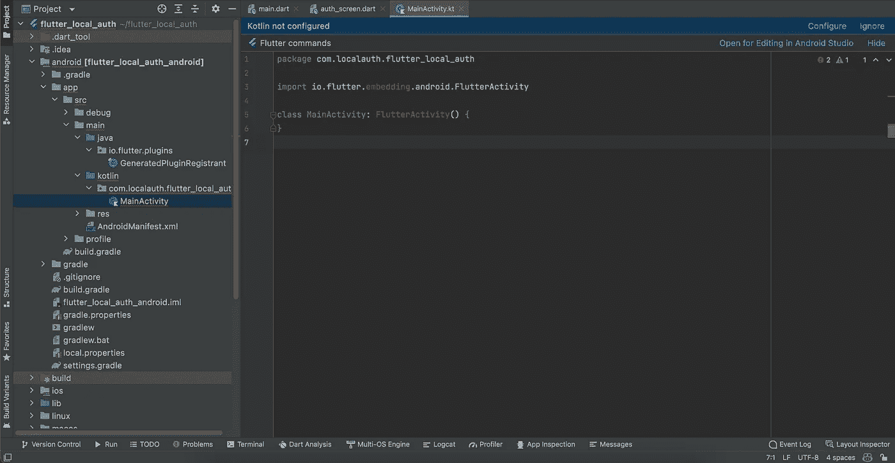
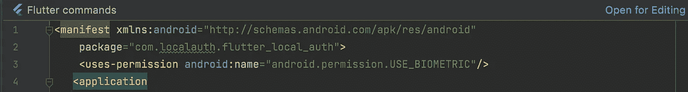
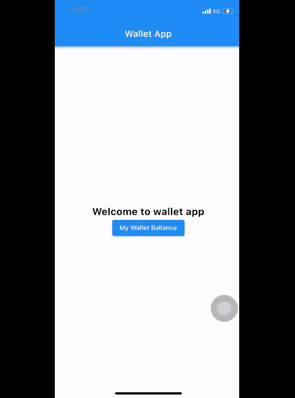

# 颤动生物认证

> 原文：<https://blog.devgenius.io/flutter-biometric-authentication-4a9209da1ecd?source=collection_archive---------0----------------------->

了解如何在您的 flutter 应用程序中添加指纹和面部认证

有时候，你需要在你的 flutter 应用中增加更多的安全性来保护一些数据或者禁用一些功能，除非用户使用像银行账户细节或者一些机密数据这样的双计量认证，这在 flutter 中是可能的



> 生物识别有很多种

*   生物计量学类型
*   生物计量学.指纹
*   生物计量学.弱
*   生物计量学。strong

# 目录

> 履行
> 
> 结论
> 
> GitHub 知识库

# 履行

首先创建一个 flutter 应用程序，然后在 pubsbec.yaml 文件中添加依赖项

```
dependencies:
  local_auth: ^2.1.2
```

这个 Flutter 插件提供了在本地设备上执行用户认证的方法。

在支持的设备上，这包括指纹或面部识别等生物认证，支持 ios、adnroid 和 windows

现在，在项目目录中的 lib 文件夹内，创建一个名为 screens 的文件夹或任何您想要的文件夹

在你的屏幕文件夹中创建两个 dart 文件**auth _ screen . dart home _ screen . dart**



打开 **auth_screen.dart** 文件，创建一个名为 **LocalAuthScreen** 的有状态 wdiget

```
import 'package:flutter/material.dart';
```

```
class LocalAuthScreen extends StatefulWidget {
  const LocalAuthScreen({Key? key}) : super(key: key); @override
  State<LocalAuthScreen> createState() => _LocalAuthScreenState();
}class _LocalAuthScreenState extends State<LocalAuthScreen> {
  @override
  Widget build(BuildContext context) {
    return Container();
  }
}
```

现在回到你的 **main.dart** 文件，像这样删除 flutter starter 类



并添加 LocalAuthScreen 类作为 home 属性，使应用程序在该屏幕上启动

> **现在我们需要为 adnroid 和 ios 添加 seme 配置，以便添加软件包特性**

# Android 配置

*   插件会在 SDK 16+上构建运行，但是在 SDK 23 (Android 6.0)之前`isDeviceSupported()`总是返回 false。

在你的项目文件夹中打开 android 文件夹> app > src > main > kot Lin > your package >**main activity . kt**

您的文件应该如下所示



将**的波动性替换为**的波动性

```
class MainActivity: FlutterFragmentActivity() {
      // ...
  }
```

然后转到 **AndroidManifest.xml**

在您的包行后添加此权限

```
<uses-permission android:name="android.permission.USE_BIOMETRIC"/>
```

现在，您的文件应该如下所示



这就是现在我们已经完成了 android 的配置

如果您仅在 macos 上运行，您可以遵循以下步骤

# IOS 配置

。简单地打开你的 **info.plist** 文件，粘贴这两行

```
<key>NSFaceIDUsageDescription</key>
<string>Why is my app authenticating using face id?</string>
```

返回到 **auth_scren.dart** 并导入包

```
import 'package:local_auth/local_auth.dart';
import 'package:local_auth_android/local_auth_android.dart';
import 'package:local_auth_ios/local_auth_ios.dart';
import 'package:local_auth/error_codes.dart' as auth_error;
```

如果我们想使用指纹认证，那么我们必须检查我们设备的能力，我们应该调用`canCheckBiometrics()`或`isDeviceSupport()`

在你的类状态中声明这个

```
final LocalAuthentication auth = LocalAuthentication();
```

然后创建一个函数来验证用户

```
Future<void> authinticate() async {
    try {
      final bool didAuthenticate = await auth.authenticate(
        localizedReason: 'Please authenticate to show account balance',
        options: const AuthenticationOptions(useErrorDialogs: false),
      );
    } on PlatformException catch (e) {
      if (e.code == auth_error.notEnrolled) {
        // Add handling of no hardware here.
      } else if (e.code == auth_error.lockedOut ||
          e.code == auth_error.permanentlyLockedOut) {
      } else {
        // ...
      }
    }
  }
```

现在我们需要给用户添加一些上下文来调用函数，所以用这些替换构建方法中的容器

```
@override
  Widget build(BuildContext context) {
    return Scaffold(
      appBar: AppBar(
        title: const Text('Wallet App'),
      ),
      body: Column(
        mainAxisAlignment: MainAxisAlignment.center,
        children: [
          const Text(
            'Welcome to wallet app',
            style: TextStyle(fontWeight: FontWeight.bold, fontSize: 22),
          ),
          Center(
            child: ElevatedButton(
              child: const Text('My Wallet Ballance'),
              onPressed: () => authinticate(),
            ),
          )
        ],
      ),
    );
  }
```

那么，接下来呢？转到 **home_screen.dart，**添加这些代码。该屏幕向用户显示他们成功认证后钱包的余额

```
import 'package:flutter/material.dart';
```

```
class HomeScreen extends StatelessWidget {
  const HomeScreen({Key? key}) : super(key: key); @override
  Widget build(BuildContext context) {
    return Scaffold(
      appBar: AppBar(
        title: const Text('Home Screen'),
      ),
      body: Center(
        child: Column(
          mainAxisAlignment: MainAxisAlignment.center,
          crossAxisAlignment: CrossAxisAlignment.center,
          children: [
            const Text(
              'Hello ! you authintecation was done',
              textAlign: TextAlign.center,
              style: TextStyle(fontWeight: FontWeight.bold, fontSize: 16),
            ),
            const SizedBox(
              height: 20,
            ),
            const Text(
              'you have 500.00 USD in your wallet ',
              textAlign: TextAlign.center,
            ),
          ],
        ),
      ),
    );
  }
}
```

再次返回 **auth_scren.dart** ，导入 **home_screen.dart**

您的整个文件现在应该是这样的

```
import 'package:flutter/material.dart';
import 'package:flutter/services.dart';
import 'package:flutter_local_auth/screens/home_screen.dart';
import 'package:local_auth/local_auth.dart';
import 'package:local_auth_android/local_auth_android.dart';
import 'package:local_auth_ios/local_auth_ios.dart';
import 'package:local_auth/error_codes.dart' as auth_error;
```

```
class LocalAuthScreen extends StatefulWidget {
  const LocalAuthScreen({Key? key}) : super(key: key); @override
  State<LocalAuthScreen> createState() => _LocalAuthScreenState();
}class _LocalAuthScreenState extends State<LocalAuthScreen> {
  final LocalAuthentication auth = LocalAuthentication();
  Future<void> authinticate() async {
    try {
      final bool didAuthenticate = await auth.authenticate(
        localizedReason: 'Please authenticate to show account balance',
        options: const AuthenticationOptions(useErrorDialogs: false),
      ); } on PlatformException catch (e) {
      if (e.code == auth_error.notEnrolled) {
        // Add handling of no hardware here.
      } else if (e.code == auth_error.lockedOut ||
          e.code == auth_error.permanentlyLockedOut) {
      } else {
        // ...
      }
    }
  } @override
  Widget build(BuildContext context) {
    return Scaffold(
      appBar: AppBar(
        title: const Text('Wallet App'),
      ),
      body: Column(
        mainAxisAlignment: MainAxisAlignment.center,
        children: [
          const Text(
            'Welcome to wallet app',
            style: TextStyle(fontWeight: FontWeight.bold, fontSize: 22),
          ),
          Center(
            child: ElevatedButton(
              child: const Text('My Wallet Ballance'),
              onPressed: () => authinticate(),
            ),
          )
        ],
      ),
    );
  }
}
```

> 现在，我们需要在用户认证完成后导航到主屏幕

在**认证**方法的 **try** 块之后添加这些

```
if (didAuthenticate == true) {
        Navigator.push(
            context, MaterialPageRoute(builder: (context) => HomeScreen()));
      }
```

> 认证完成后，这将简单地把用户带到主屏幕

您的整个屏幕现在应该看起来像这样

```
import 'package:flutter/material.dart';
import 'package:flutter/services.dart';
import 'package:flutter_local_auth/screens/home_screen.dart';
import 'package:local_auth/local_auth.dart';
import 'package:local_auth_android/local_auth_android.dart';
import 'package:local_auth_ios/local_auth_ios.dart';
import 'package:local_auth/error_codes.dart' as auth_error;
```

```
class LocalAuthScreen extends StatefulWidget {
  const LocalAuthScreen({Key? key}) : super(key: key); @override
  State<LocalAuthScreen> createState() => _LocalAuthScreenState();
}class _LocalAuthScreenState extends State<LocalAuthScreen> {
  final LocalAuthentication auth = LocalAuthentication();
  Future<void> authinticate() async {
    try {
      final bool didAuthenticate = await auth.authenticate(
        localizedReason: 'Please authenticate to show account balance',
        options: const AuthenticationOptions(useErrorDialogs: false),
      );
      if (didAuthenticate == true) {
        Navigator.push(
            context, MaterialPageRoute(builder: (context) => HomeScreen()));
      }
    } on PlatformException catch (e) {
      if (e.code == auth_error.notEnrolled) {
        // Add handling of no hardware here.
      } else if (e.code == auth_error.lockedOut ||
          e.code == auth_error.permanentlyLockedOut) {
      } else {
        // ...
      }
    }
  } @override
  Widget build(BuildContext context) {
    return Scaffold(
      appBar: AppBar(
        title: const Text('Wallet App'),
      ),
      body: Column(
        mainAxisAlignment: MainAxisAlignment.center,
        children: [
          const Text(
            'Welcome to wallet app',
            style: TextStyle(fontWeight: FontWeight.bold, fontSize: 22),
          ),
          Center(
            child: ElevatedButton(
              child: const Text('My Wallet Ballance'),
              onPressed: () => authinticate(),
            ),
          )
        ],
      ),
    );
  }
}
```

现在，运行应用程序的时间到了



# 结论

在本文中，我们学习了如何在任何颤振项目中实现这一点。在 local_auth 和的帮助下

❤感谢你阅读这篇文章❤

很高兴在评论中听到你的意见，如果我犯了错误，我真的很想听到

拍手声👏如果有帮助的话

# Github 链接:

[https://github.com/mohaberabi/flutter_biometric_auth](https://github.com/mohaberabi/flutter_biometric_auth)