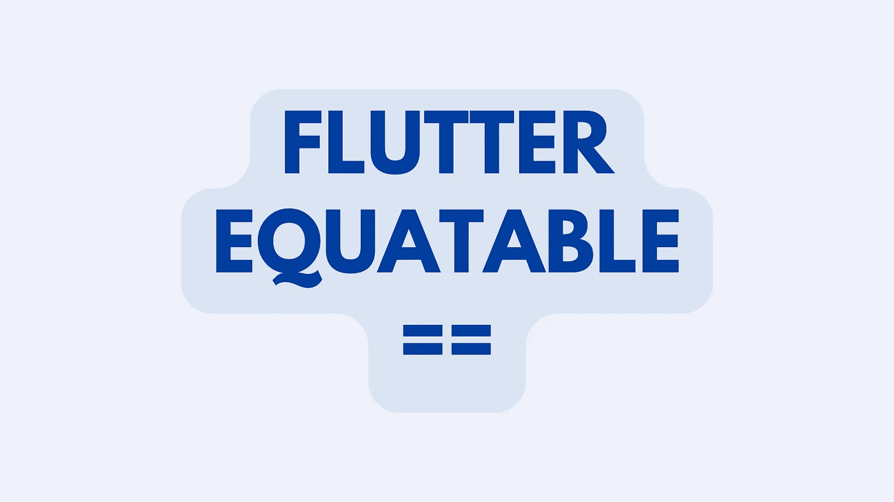
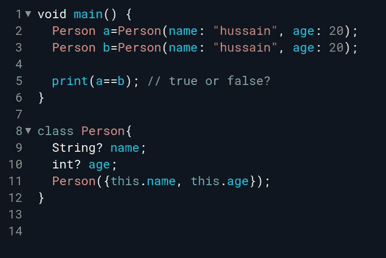
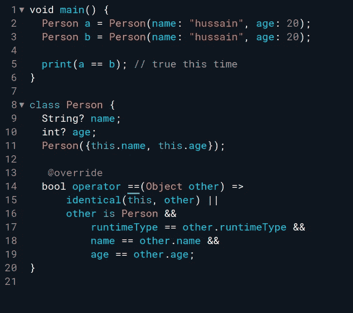
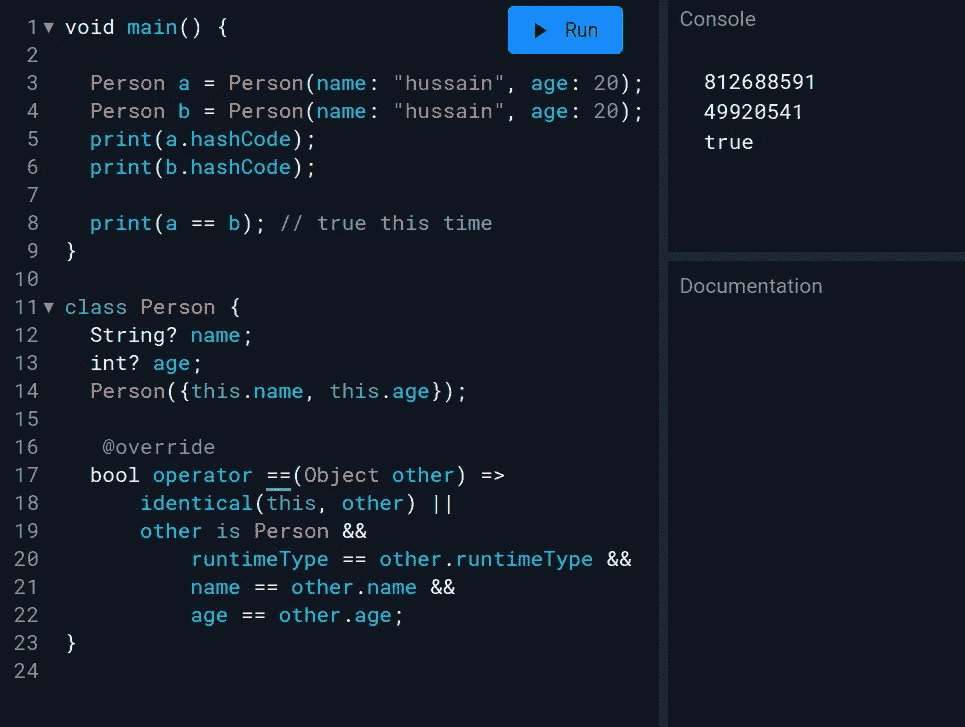
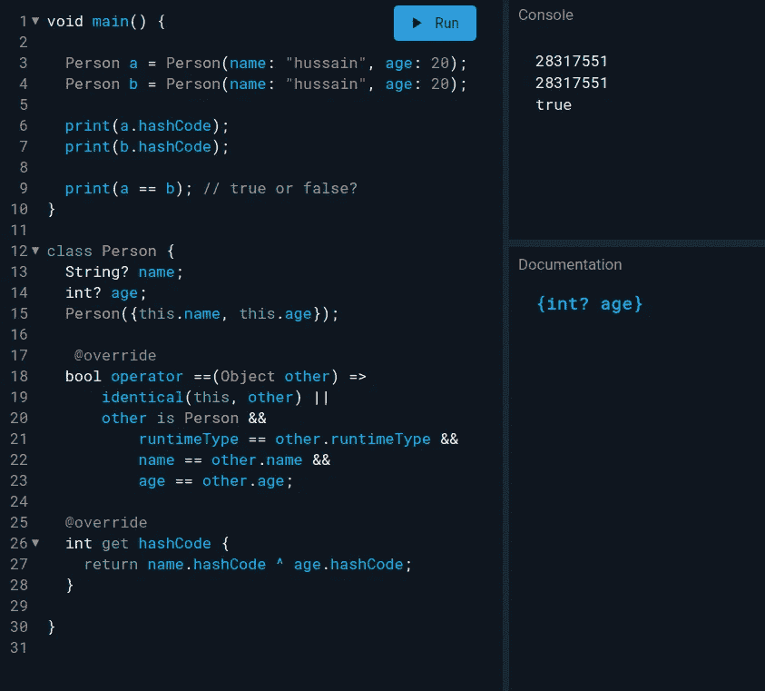

# 扑:什么是等价的？

> 原文：<https://blog.devgenius.io/flutter-equatable-f589a16b3744?source=collection_archive---------1----------------------->



封面设计

让我以问你一个问题开始这篇文章，下面的程序的输出会是什么？真的还是假的？



猜测产量？

输出是**假**，你可能会觉得奇怪，但让我告诉你怎么回事！


默认情况下， ***==*** 比较运算符比较对象，只有当它们是同一个对象(a==a)时才会返回 true。但是我们可以通过实现一个覆盖来覆盖这个行为。



覆盖实现

这次它返回 **true** ，因为我们已经更改了==操作符的实现，所以如果名称、年龄和运行时类型相同，它将返回 true。

我们还没有完成，因为这些对象的 **hashCodes** 仍然与输出中观察到的不一样。(哈希代码是代表对象状态的单个整数)



关注输出，以便更快地理解它

根据`*operator ==*`，对于彼此相等的对象，散列码必须相同。如果`*operator ==*`被覆盖，那么散列码也必须被改变以表示该状态，否则，该对象不能在基于散列的数据结构中使用，如默认的**集合和映射**实现。因此，我们需要覆盖 **hashCode** 实现，并加入我们的`==`实现变更。



关注输出，以便更快地理解它

好了，现在 **hashCodes** 也是一样的，它不会给 Map 或 Set 实现带来任何麻烦。

但是啊！光是告诉编译器如何比较两个对象就要做很多工作！如果我们在 Person 类中再增加一个`email`的成员变量会怎么样？很多样板代码，对吗？


这就是当[等同于](https://pub.dev/packages/equatable)进入故事的时候！它为您编写了所有的样板代码。

将 equatable 添加为依赖项:

```
dependencies:
  equatable: ^2.0.0
```

用**等价的**扩展你的类，在 props 里定义你的比较成员，像这样:

```
import 'package:equatable/equatable.dart';

class Person extends Equatable {
  const Person({this.name, this.age});

  final String name;
  final int age; @override
  List<Object> get props => [name, age];
}
```

仅此而已，它为您编写了所有的锅炉代码。您的代码保持可读，并且在向您的类中添加任何新的成员变量时，您不必惊慌。

感谢你的阅读，为它鼓掌或者请我喝杯咖啡！

[](https://www.buymeacoffee.com/hussainhabib)