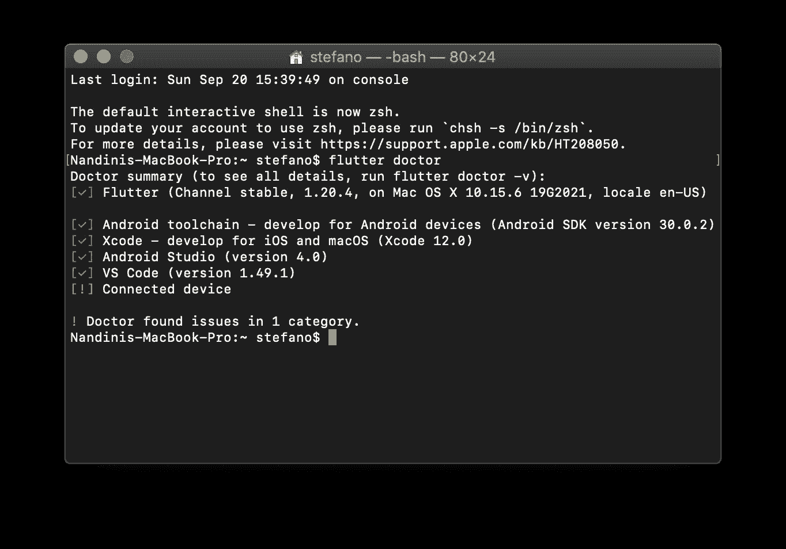
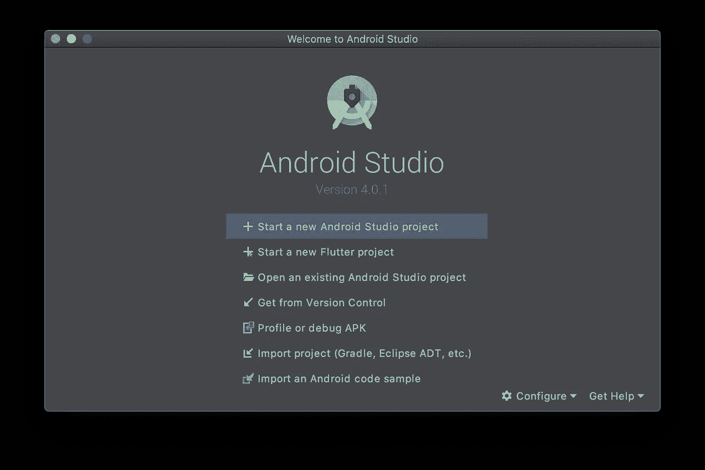
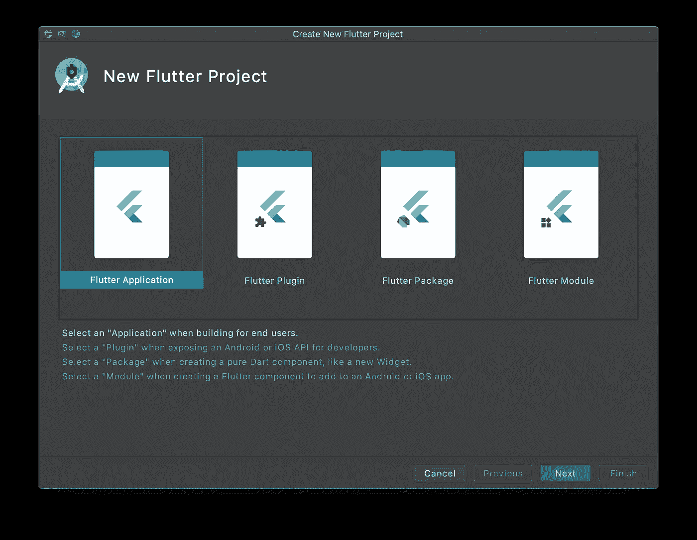
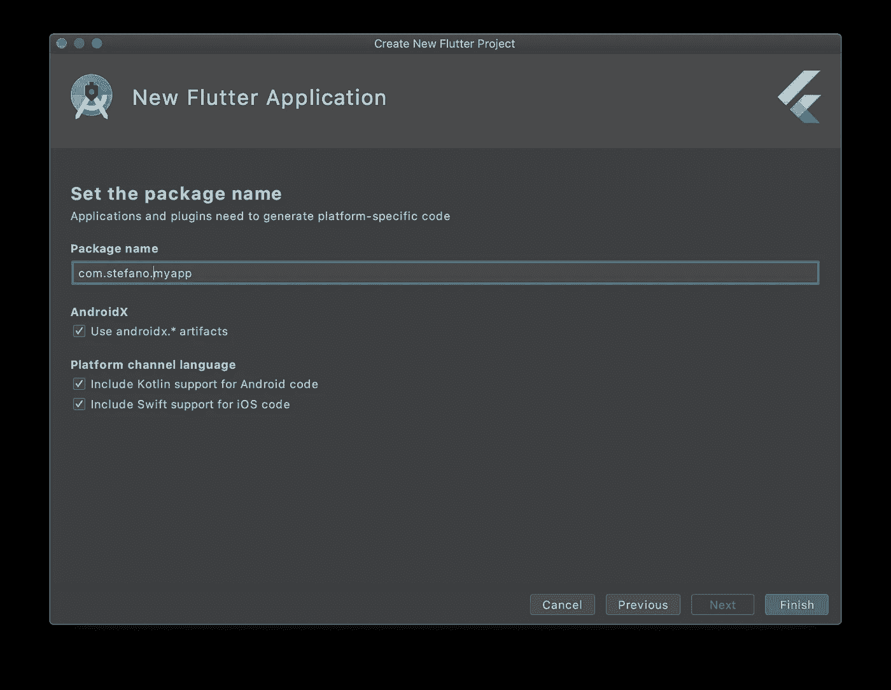
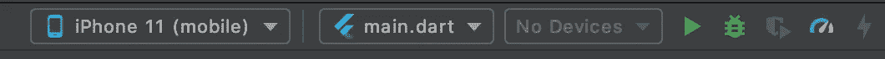
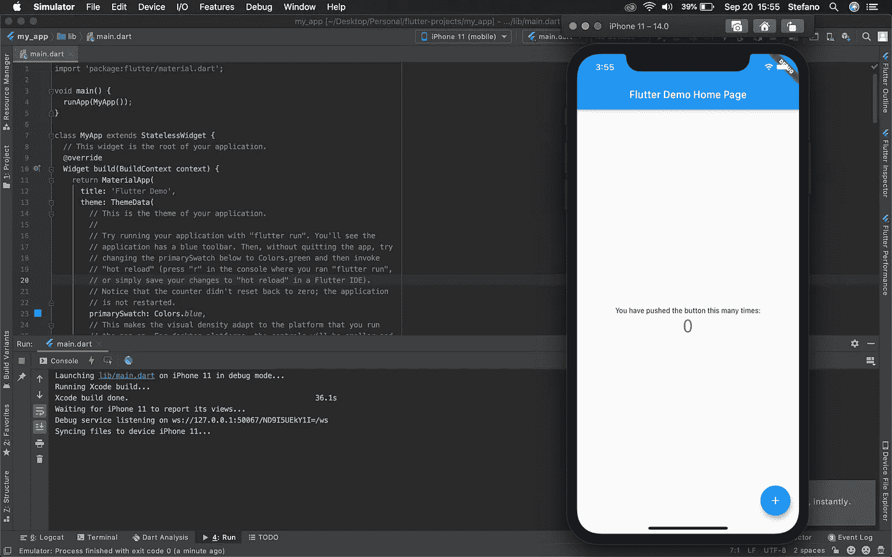
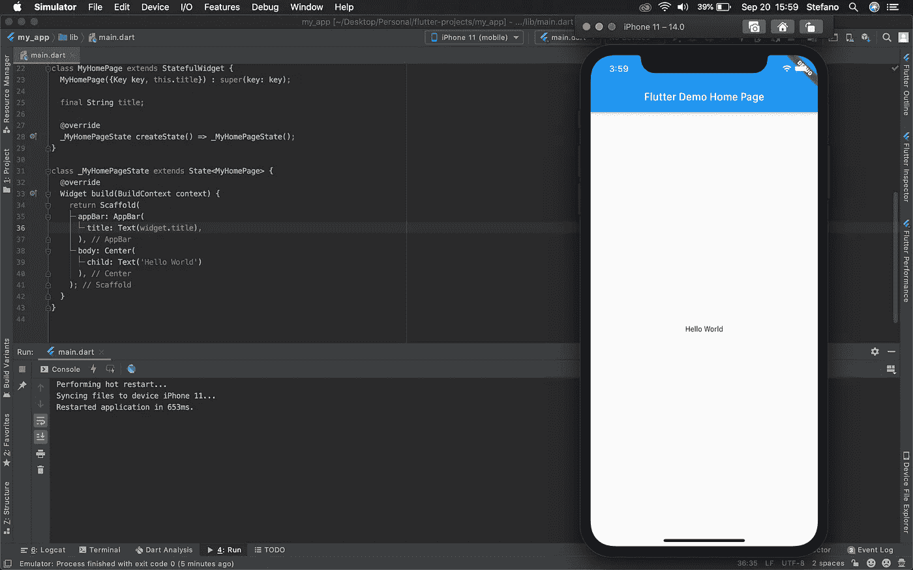

# 适合初学者的颤振

> 原文：<https://blog.devgenius.io/flutter-for-beginners-c2fae3d4d540?source=collection_archive---------3----------------------->

## 第 1 部分:创建项目


在 [Unsplash](https://unsplash.com?utm_source=medium&utm_medium=referral) 上[的照片](https://unsplash.com/@ffstop?utm_source=medium&utm_medium=referral)

> PS:这是我给初学者的扑系列的第一部分。如果你想看看剩下的部分，链接在文章的末尾。

Flutter 作为一个框架已经改变了我们制作应用的方式。凭借其一次编写、随处部署的简单原则，Flutter 使得跨平台移动应用程序开发过程不仅更易于开发，而且更易于维护。

首先，你需要设置[颤振 SDK](https://flutter.dev/docs/get-started/install) 。对于本教程，我将使用 Android Studio 的所有目的。让我们开始吧:

## **确保你有最新的 Flutter 版本**

您可以使用以下命令检查您使用的是否是最新版本:

`flutter doctor`



如果有可用的更新，输出将显示相同的内容。要进行更新，您需要运行一个简单的命令:

`flutter upgrade`

## **在 Android Studio 中创建一个项目**

1.  打开 Android Studio。如果您还没有安装 Flutter 插件，请转到配置>插件。搜索颤振并安装它。



Android Studio 上的欢迎屏幕

2.选择第一个选项“颤振应用”,并点击下一步。



3.设置您的包名。包名通常是逆序的域名。例如，如果你看看域名 hangouts.google.com。在应用程序中，你可以将包名设置为 com.google.com。

这将在 Java/Kotlin 中设置您的包名，并在 Android 中用作 applicationId，在 iOS 中用作包标识符。

完成后，点击“完成”,让 Android Studio 设置您的项目。



设置您的包名

## 运行您的第一个应用

如果你看看顶部的任务栏，你会看到一个运行你的应用程序的选项。您必须首先连接一个物理设备，或者运行一个 AVD 或 iOS 模拟器。你几乎可以选择任何移动设备，因为 Flutter 可以在上面运行。然而，设备越老，构建时间就越长，因为你的应用程序在上面运行也越慢。



一旦你设置好你选择的设备，点击“播放”按钮，你的应用程序就可以开始构建并在你的设备上运行了。如果一切正常，您应该会看到类似这样的内容。



这是默认的 Flutter 应用程序，由 Flutter 提供。你可以通过点击浮动的动作按钮来观察计数的增加。

## 清理时间

一旦您完成了对示例应用程序的探索，让我们继续清理不必要的代码，重新开始。

您可以用下面的代码片段替换 main.dart 文件的内容:

```
*import* 'package:flutter/material.dart';

*void* main() {
  runApp(MyApp());
}

*class* MyApp *extends* StatelessWidget {@override
  Widget build(BuildContext context) {
    *return* MaterialApp(
      title: 'Flutter Demo',
      theme: ThemeData(
        primarySwatch: Colors.*blue*,
        visualDensity: VisualDensity.*adaptivePlatformDensity*,
      ),
      home: MyHomePage(title: 'Flutter Demo Home Page'),
    );
  }
}

*class* MyHomePage *extends* StatefulWidget {
  MyHomePage({Key key, *this*.title}) : *super*(key: key);

  *final* String title;

  @override
  _MyHomePageState createState() => _MyHomePageState();
}

*class* _MyHomePageState *extends* State<MyHomePage> {
    @override
  Widget build(BuildContext context) {
    *return* Scaffold(
      appBar: AppBar(
        title: Text(widget.title),
      ),
      body: Center(
        child: Text('Hello World'),
      ),
    );
  }
}
```

一旦完成，保存你的代码，你应该看到应用程序自动重新加载。这是 Flutter 的功能之一，称为“热重装”，这意味着你不必每次做微小的改变都等待应用程序构建。应用程序中的代码会自动更新(所有繁重的工作都由 Flutter 在后台完成)。



## 包裹

我想我们要在这里休息一下。如题，这是一个系列的第一部分。在这篇文章中，我展示了如何创建一个 Flutter 项目，并设置我们的启动项目。在不久的将来，我会发表更多的文章，涵盖各种主题。一定要让我知道你想更好地理解什么主题！

PS。本文是系列文章的一部分。点击这里查看其他文章:

1.  [适合初学者的颤振](https://medium.com/dev-genius/flutter-for-beginners-c2fae3d4d540)
2.  [微件在飘动](https://medium.com/dev-genius/widgets-in-flutter-a53e3c671f13)
3.  [导航&路由在扑](https://medium.com/dev-genius/navigation-routing-in-flutter-655f08183084)
4.  [颤振布局](https://medium.com/dev-genius/layouts-in-flutter-c65b0dc6b356)
5.  [Flutter 中的列表视图](https://medium.com/dev-genius/listviews-in-flutter-12bab3dccadc)