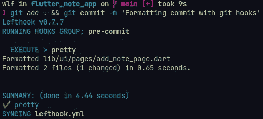
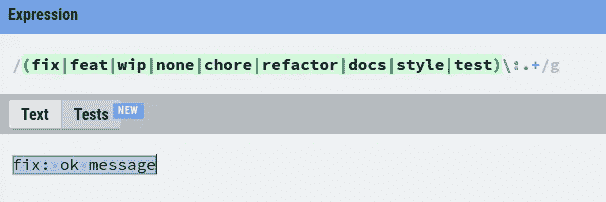
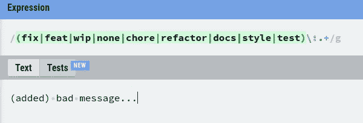
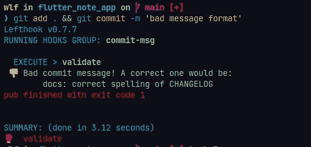
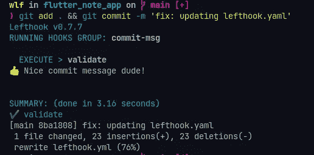
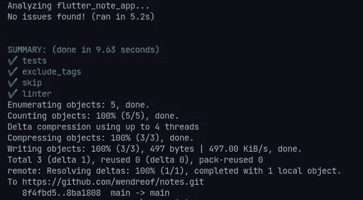

# 颤动+ Git 挂钩

> 原文：<https://blog.devgenius.io/flutter-git-hooks-19d8141176ac?source=collection_archive---------0----------------------->

**→** [**我的 GitHub 简介。**](http://github.com/wendreof) **→** [**我的 LinkedIn 简介**](https://www.linkedin.com/in/wendreof/) **。
→把** [**Ufo 主题**](https://marketplace.visualstudio.com/items?itemName=wendreof.ufo) **放到你的 VS 代码里。**

怎么了，戴夫！在今天的文章中，我将向你介绍(或者不介绍)一个 Git Hook 工具，也许会用一些“快速而强大的 Git hooks manager for any type of project:”left Hook 解决你的一些编码问题。

保持相同的代码格式、样式、提交消息模式等等，对一个人来说可能很容易，对另一个人来说可能很难，特别是那些在大型团队中工作的人。你的团队越大，就越难让每个人都保持一致。

我们同意有很多方法可以做到这一点，但是使用一个工具来帮助我们做这件事怎么样呢？如果只需几分钟就能完成呢？是啊，有可能。

部分:

*   *将 Lefthook 添加到项目中*
*   *预提交设置*
*   *提交消息设置*
*   *预推送设置*
*   *完整的剧本*
*   *目标*

让我们进入下一部分！

**#1 —将 Lefthook 添加到项目**

Lefthook 是一个快速而强大的 Git hooks 管理器，适用于任何类型的项目:

*   **快**。这是用围棋写的。可以并行运行命令。
*   **强大的**。通过配置中的几行代码，您可以在`pre-push`钩子上只检查已更改的文件。
*   **简单的**。它是一个独立的二进制文件，可以在任何环境下工作。

你可以在这里了解更多。我们可以用 npm/yarn、go、ruby、brew、snap 等来安装。[在此获取所有安装说明](https://github.com/evilmartians/lefthook/blob/master/docs/full_guide.md)。

如果你和我一样是 Linux 用户，建议你用 snap:

左钩卡扣安装

现在，在项目内部运行以下命令:

lefthook 安装命令

该命令将在根项目上生成 lefthook.yml，并附有一些示例，请删除所有内容。

**#2 —预提交设置**

让我们用预提交脚本启动我们的配置，这样，我们将格式化所有暂存的*。dart 文件。

预提交

对未格式化的文件执行一些提交操作会生成如下输出:

提交前输出

简单的柠檬榨汁机，对吗？耶！如果由于某种原因 format 命令失败，提交将不会完成。

**#3—提交消息设置**

对于这个例子，我们将定义一些提交消息模式，用正则表达式(Regex)验证它，并让用户知道提交的统计信息。

让我们假设我们的团队使用[常规提交](https://www.conventionalcommits.org/en/v1.0.0/)来添加人类和机器可读的含义来提交消息，因此一些 ok 消息将是这样的:**docs:CHANGELOG 的正确拼写。**

有了消息模式后，让我们创建一个正则表达式来验证:**(fix | feat | WIP | none | Jerry | refactor | docs | style | test)\:。+** 我总是使用[regexr.com](https://regexr.com/)进行正则表达式验证:

Ok 消息格式

错误的消息格式

现在，让我们在 Dart 端❤上创建验证类

在根项目中创建一个文件***git _ hooks/commit message . dart***并粘贴以下内容:

commitMessage.dart

如您所见，该脚本将让用户了解提交消息的统计信息。现在，让我们更新 lefthook.yaml:

提交消息

并使用无效的提交消息格式运行它:

错误的消息格式输出

现在它具有 ok 提交消息格式:

Ok 消息格式输出

**#4 —预推送设置**

在最后一个设置中，我们的脚本应该运行我们所有的测试和分析器:

预推

如你所见，我跳过了 v1.0.1 标签，只是为了举例，也忽略了合并和重定基础操作。

现在推送最后一次提交:

预推输出

**#4 —完整的脚本**

lefthook.yaml

**#5 —目标**
我们已经达到目标了！格式化整个代码(*。dart)，用无效的提交消息阻塞提交并让用户知道统计数据，在推送之前运行所有的测试，忽略一些标签，合并和重定基础。

我希望你喜欢它，下一篇文章再见！

请看看我关于 Flutter 的其他帖子:

 [## 使用 GitHub 操作更新 Play Store 的版本代码

### 怎么了，戴夫？今天的帖子我将帮助你解决一个最无聊的事情，同时提交一些新的…

medium.com](https://medium.com/@wendreof/updating-version-code-for-play-store-using-github-actions-d5ea0f07f6ff)  [## 如何在 Heroku & GitHub 页面上发布 Flutter Web 应用程序

### 你好，欢迎来到我的博客。今天的帖子是关于如何在 Heroku 和…上部署你的 Flutter Web 应用程序

medium.com](https://medium.com/@wendreof/how-publish-flutter-web-app-on-heroku-github-pages-f4df95bdd385)  [## 如何用 GitHub Actions 安全构建指定的 Flutter App

### 你好，欢迎来到我的博客。今天的帖子是关于在不损害…

medium.com](https://medium.com/@wendreof/how-to-safely-build-assigned-flutter-app-with-github-actions-8860b1b6eef6) 

感谢你阅读❤

所以不要为明天忧虑，因为明天自有明天的忧虑。每天都有足够多的麻烦。【马太福音 6:34】

错误或建议？用你的拍手留下评论吧！

**→** [**我的 GitHub 简介。**](http://github.com/wendreof) **→** [**我的 LinkedIn 个人资料**](https://www.linkedin.com/in/wendreof/) **。
→把** [**Ufo 主题**](https://marketplace.visualstudio.com/items?itemName=wendreof.ufo) **放到你的 VS 代码里。**